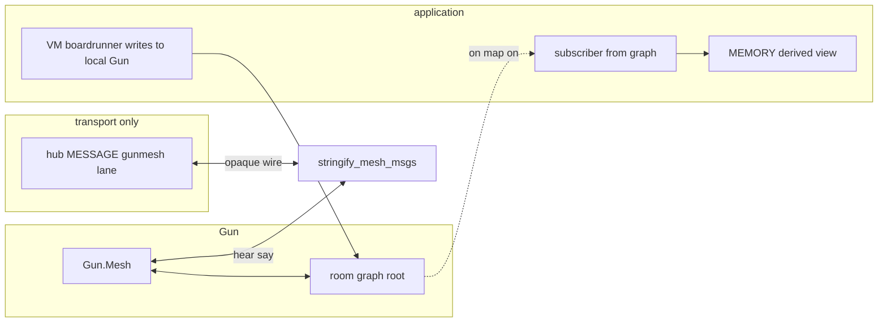

# Gun transport + Gun-driven deltas + MEMORY apply

## Architecture (roles)

| Layer | Responsibility |
|--------|----------------|
| **Hub / `gunsyncrelay` → `gunmesh:memory`** | **Transport only**: deliver serialized bytes peer-to-peer (worker ↔ peers). No versioning, dedup, or `GunsyncPayload` semantics in the message envelope beyond routing (`player`, optional room/session id). |
| **Gun `mesh`** | **Ownership of sync logic**: DAG messages, **`#`** / **`@`** IDs, **`put` graph merges**, replay, acknowledgements, duplicate suppression—as implemented in [`Gun.Mesh`](node_modules/gun/src/mesh.js) and [`gun/lib/wire.js`](node_modules/gun/lib/wire.js). |
| **`roomgun` (or renamed root)** | Single Gun graph root per isolation boundary (worker + room/session). Holds the replicated subtree that matters for MEMORY (exact path schema TBD in implementation). |
| **MEMORY subscriber** | On the **sim worker (and peers as needed)**: **derived view only** in the first shippable milestone — subscribe to **Gun.js graph events** and map into [`memoryreadroot`](zss/memory/session.ts) / books (preserve **`loaders`, `halt`, `simfreeze`**). **ENGINE does not treat MEMORY as independently authoritative for replicated state**: writes that must become shared truth go **through local Gun `.put`/chain** first; MEMORY reflects merged graph outcome. |



---

## Confirmed modeling (discussion)

**“Do we need an authoritative writer?”** — Not in the MEMORY sense we used before.

- **`boardrunner` and `vm` are writers on their shared local `roomgun`**, each emitting graph updates Gun understands (ticks, gunsync payloads replaced by graph ops, etc.).
- **Gun + `mesh`** reconcile multiple writers, dedup, and fan changes through **our hub wire adapter** (opaque transport).
- **There is no separate app-owned “version + JSON blob” authority** for replication once migrated; conflict and patch behavior live in **Gun’s merge path**, not in `GunsyncPayload.v`.

**First milestone — MEMORY role** — **Derived only on the sim worker**: the subscriber applies observed `replica` subtree into MEMORY so the rest of the engine keeps using today’s memory APIs. **Do not** maintain a parallel “write MEMORY then mirror to Gun” path for replicated fields in the steady state (migration bridge may temporarily dual-write).

---

## How we **provide** the network adapter to Gun

Gun integrates transports by registering a **`peer`** whose **`wire`** behaves like [`gun/lib/wire.js`](node_modules/gun/lib/wire.js) WebSockets:

```js
mesh.hi(peer = { wire, id: stablePeerId })
wire.on('message', (raw) => mesh.hear(raw, peer))
mesh.bye(peer) // on disconnect
```

**Our adapter**:

1. **Construct** `const gun = Gun({ peers: [], /* or axe:false if local-only */, ... })` and obtain **`gun.__.opt.mesh`** (`Gun.Mesh`); do not duplicate mesh unless required by multi-graph isolation.

2. **Create synthetic mesh peer(s)** keyed by **player id** (hub `message.player` / operator; not an anonymous `"hub"` unless no player yet):

   ```ts
   peer = {
     id: playerId,
     wire: {
       send(msg: string | object) {
         outbound_to_hub(serialize_if_needed(msg)) // MESSAGE.data only opaque wire
       },
       on: ...
     }
   }
   ```

   **Outbound**: `mesh` will call **`mesh.say(msg, peer)`** → eventual **`peer.wire.send`**. Serialize with the same convention Gun expects on the socket path (typically **string**: JSON-encoded DAM message batch or singleton as in `mesh.hear`).

   **Inbound**: when **`gunmesh:memory`** (or renamed **`gunmesh:wire`**) delivers:

   ```ts
   mesh.hear(inbound_raw, hubPeer)
   ```

   Same peer object MUST be reused so Gun’s bookkeeping (`bye`, heartbeat if any) stays consistent.

3. **No app-level `.put` for sync** inside [`roommirror.ts`](zss/feature/gunsync/roommirror.ts): remove the manual `{ v, source, at }` shape. If we need telemetry, use a **`separate`** path not mixed with replicated MEMORY graph.

4. **Optional multiplexing**: multiple joiners can each register a **distinct `mesh.hi` peer** whose **`id` is that client’s player id**; transport still forwards opaque bytes; **`mesh`** dedups/relays. Alternatively one peer per worker if all relay traffic is multiplexed by MESSAGE routing—spike which matches Gun’s expectations for `><` / peer lists.

---

## Hub & messages — **transport only**

- **Outgoing**: `gunsyncrelay` / MESSAGE `data` = **opaque** payload (recommended: **`string`** wire frame as Gun emits, or a tiny wrapper `{ lane: 'gun-wire', payload: string }` for future multi-lane multiplexing—not `GunsyncPayload` merge fields unless kept temporarily for dual-stack migration).
- **Incoming**: **`gunmeshsim`** receives bytes → **`mesh.hear`**. No **`gunsyncapplyfromwire`** on the ingress path unless that function is repurposed purely as **“apply already-resolved MEMORY snapshot from external source”** (see migration below).

---

## How we listen to Gun events and apply to MEMORY

**Goal**: Application does **not** diff full `GunsyncReplica` blobs for transport; Gun produces graph updates; our job is **observe** and **flush** into MEMORY.

---

## MEMORY ↔ Gun graph schema (fine-grained)

Anchored at **`roomRoot = roomgun.get('zss').get(<roomKey>)`** where `<roomKey>` is `gunsyncroomkey()` (`topic` fallback `session`). Replicated subtree aligns 1:1 with [`GunsyncReplica`](zss/feature/gunsync/replica.ts) fields (not the wire `GunsyncPayload` envelope).

| MEMORY / replica field | Gun path | Value shape | Subscriber note |
|-------------------------|----------|-------------|-----------------|
| `operator` | `roomRoot.get('replica').get('operator')` | string soul / leaf | scalar `.on` → `root.operator` |
| `topic` | `...get('topic')` | string | scalar |
| `session` | `...get('session')` | string | scalar |
| `software.main` | `...get('software').get('main')` | string | nested two-level |
| `software.temp` | `...get('software').get('temp')` | string | nested |
| `books[bookId]` | `...get('books').get(<bookId>)` where **`<bookId>` = `BOOK.id`** | **serialized `BOOK`** (prefer **JSON-parseable object** Gun can merge; if Gun merge fights deeply nested structures, use **`string` JSON** leaf with explicit parse in subscriber—spike to choose) | **`...get('books').map().on(...)`** per `bookId`; rebuild `Record<string, BOOK>` then call `memoryresetbooks(Object.values(books))` on debounced flush |

**Root node name**: use fixed key **`replica`** (not legacy `gunsync` metadata-only put) so observers have a single subtree for sync.

**Hydration / cold start**: subscriber runs **`roomRoot.get('replica').once(...)`** plus **`get('books').map().once`** (or equivalent) to construct first `GunsyncReplica` before switching to live `.on`.

**Writers (boardrunner + VM):** update the **`replica`** subtree via **local Gun chains** (not by mutating MEMORY for replicated fields in steady state). Gun/mesh propagates; migration bridge may temporarily translate old capture paths into graph puts.

**Empty-wipe guard**: if `replica` subtree reports **empty replica** (same predicate as `gunsyncreplicaisempty`) while local hub already has content (`gunsynclocalhashubcontent`), **do not** apply to MEMORY (mirror today’s [`gunsyncapplyfromwire`](zss/feature/gunsync/replica.ts) gate at subscriber layer).

---

### Observation surface

1. Bind listeners on **`roomRoot.get('replica')`** and children per table above (not a single opaque `memory` blob).

2. **Gun chain listeners** appropriate to schema:

   - **`.on((data, key) => ...)`** on nodes that represent MEMORY slices (documents, books, operator string, etc.).
   - Or **`.map().on`** for keyed collections aligned with **`books`**.
   - Optionally debounce/coalesce bursts with `requestAnimationFrame` / microtask scheduler so MEMORY writes aren’t synchronous per-character during large imports.

3. **Hook strategy** (`Gun.on('put'|'...')`): use only where necessary for centralized logging/security; chain `.on` is usually clearer per subtree.

### Apply semantics

1. Subscriber builds a **staging view** matching **`GunsyncReplica`** shape **from graph reads**, then applies with the same invariants as **`gunsyncapplyreplica`** (**preserve `loaders`, `halt`, `simfreeze`**, empty-replica guard at subscriber).

2. **Writers (`boardrunner` tick path, VM):** mutate the **`replica`** subtree on the **shared local `roomgun`**; **`mesh`** carries updates through the hub wire adapter; **MEMORY** converges **only** through the subscriber observing merged graph output (steady state: **no “write MEMORY first”** for replicated replica fields).

**Conflict policy:** Gun merge semantics dominate unless we add app constraints (e.g. immutability per `bookId`).

---

## Migration from current `GunsyncPayload`

1. **Phase 1**: Introduce **`hubPeer` + mesh.hear** path; temporarily **tunnel existing `GunsyncPayload.json`** inside a **named wire envelope** decoded only at receiver for MEMORY apply—in parallel with migrating graph model (optional bridge).

2. **Phase 2**: Move authority to Gun graph subtree; **`boardrunner`** path stops calling **`gunsyncpayloadfromreplica`** for replication; MEMORY subscriber subscribes to Gun; remove **`gunmeshmirrorreplica`** / stray `.put`.

3. **Phase 3**: Delete obsolete **`gunsyncapplyfromwire`** versioning if Gun/mesh supersede—or keep **`v`** strictly local for **anti-empty-wipe guards** keyed off graph metadata, not wire.

---

## Files likely touched (implementation)

| Area | Notes |
|------|--------|
| New `gunsync/hubgunwire.ts` (name TBD) | `mesh.hi`, `mesh.hear`, serialization contract with hub MESSAGE |
| [zss/device/api.ts](zss/device/api.ts) | Narrow `gunsyncrelay` payload type → opaque wire / adapter-friendly |
| [zss/feature/gunsync/orchestrate.ts](zss/feature/gunsync/orchestrate.ts) | Remove mirror `.put`; optional bridge from boardrunner writes into Gun graph instead of handcrafted payload relay |
| [zss/feature/gunsync/replica.ts](zss/feature/gunsync/replica.ts) | Shrink capture/apply to **subscriber utils** OR keep transitional apply |
| [zss/feature/gunsync/index.ts](zss/feature/gunsync/index.ts) | Export adapter init / peer registration |
| [zss/device/gunmeshsim.ts](zss/device/gunmeshsim.ts) | Route inbound to `mesh.hear` unconditionally |

---

## Risks / open decisions

1. **Message size**: mitigated by **per-book keys** under `replica/books/<bookId>`; large single-book payloads may still need internal chunking (later spike if observed on real books).

2. **Worker vs browser**: Gun instance lives in worker—ensure **exactly one mesh + peer** wired to main-thread relay semantics.

3. **Local echo / feedback**: subscriber flushes Gun→MEMORY may overlap transitional MEMORY→Gun bridges. Milestone 1 uses an **`applying_from_gun` dirty flag** around subscriber apply: while set, skip any bridge that would `.put` replicated subtrees back onto `roomgun`.

4. **Mesh peer identity**: synthetic `mesh.hi` peer **`id` should use player id** (hub `message.player`/operator) so frames correlate with “who”; fallbacks only if pre-login.

5. **Empty wipes**: recreate **`gunsynclocalhashubcontent` guard** at subscriber boundary when graph briefly reflects empty replica.

---

## Todos

- [x] Lock graph schema mapping MEMORY ↔ Gun paths (see **MEMORY ↔ Gun graph schema** above).
- [ ] Implement **`hubGunPeer`** (`mesh.hi` / inbound `mesh.hear` / `wire.send`).
- [ ] Rewrite **`gunmeshsim`** ingress to never parse `GunsyncPayload`; transport opaque only.
- [ ] Implement MEMORY **subscriber module** driven by **`roomgun`** `.on`/`.map` subscriptions.
- [ ] Implement **`applying_from_gun` guard** for subscriber vs migration bridge echo.
- [ ] Dual-stack migrate or cut over from **`boardrunner`** full JSON relay (`orchestrate`).
