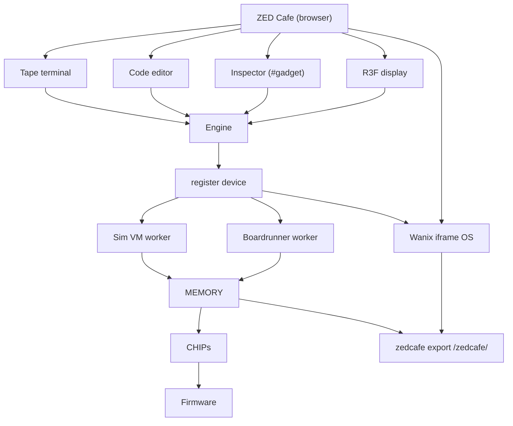
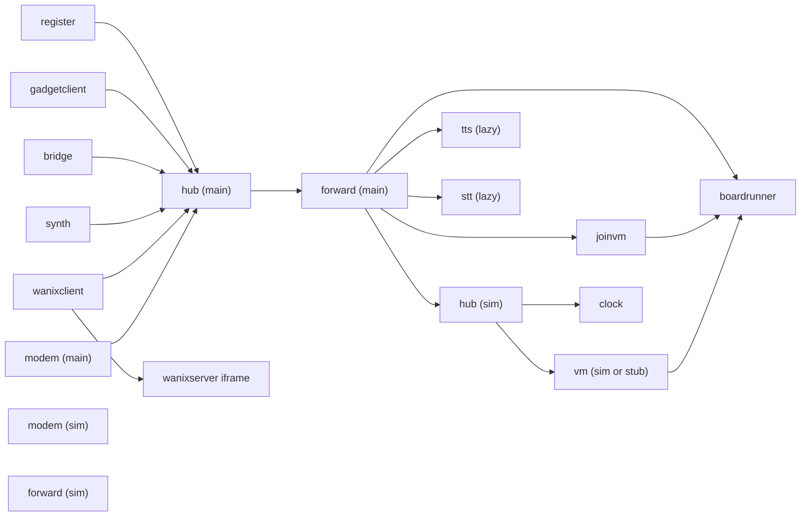
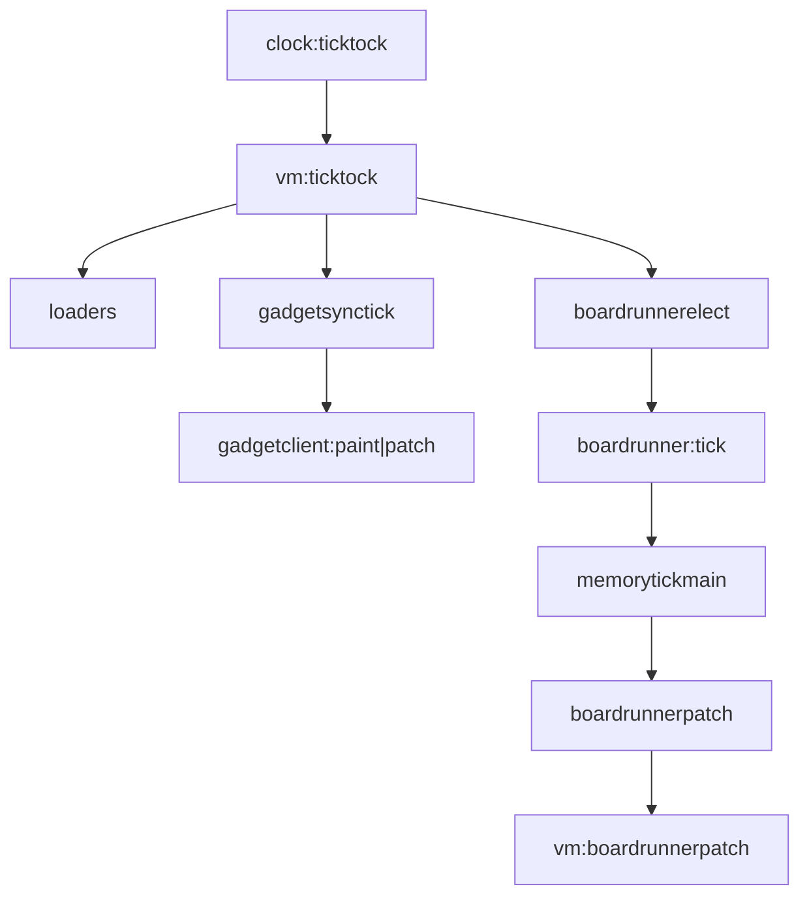
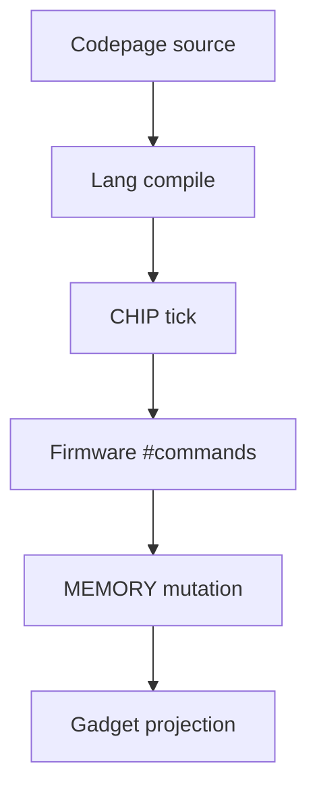

Interactive DAG replaced with Mermaid. Click through glossary terms or linked source paths in the captions below each diagram.

## Product stack

**Audience:** Both

Wanix is a **first-class** product surface: the primary integration for **complex data** outside the fantasy terminal UI. Live sim books export into a guest-visible `/zedcafe/` tree so WASI/gojs tools, Linux VM helpers, folder drops, and [zedsync](/wanix/zedsync) peers can read and write allowlisted world state. See [Wanix docs](/wanix).

| Node | Definition | Path |
|------|------------|------|
| **ZED Cafe (browser)** | The Vite/React SPA at zed.cafe. Users interact with the fantasy terminal UI here. | `cafe/index.tsx` |
| **Tape terminal** | Bottom terminal for # commands, history, autocomplete, and reference scrolls. | `zss/screens/tape/` |
| **Code editor** | Edit codepages (boards, objects, terrain, loaders) with syntax help from ROM. | `zss/screens/tape/` |
| **Inspector (#gadget)** | Built-in level editor: inspect elements, batch copy, remix, style brush. | `zss/memory/docs/inspection.md` |
| **R3F display** | Three.js orthographic renderer for tile layers, sprites, dither, and CRT effects. | `zss/gadget/display/` |
| **Wanix iframe OS** | First-class complex-data plane: browser OS (v86 Linux + WASI/gojs) in `/wanix.html`; parent CLI/UI, guest tools on `/zedcafe/`. | [`/wanix/integration`](/wanix/integration) |
| **Engine** | Bootstraps createplatform(), mounts the render loop and tape UI. | `zss/gadget/engine.tsx` |
| **register device** | Main-thread UI edge: storage, zustand stores, emits vm:* messages for user actions. | `zss/device/register.ts` |
| **Sim VM worker** | Authoritative game logic: owns MEMORY, runs ticktock, elects boardrunners. | `zss/device/vm.ts` |
| **Boardrunner worker** | Per-board chip simulation for the elected player on each active board. | `zss/device/boardrunner.ts` |
| **MEMORY** | Singleton authoritative world state: books, boards, elements, session, operator. | `zss/memory/session.ts` |
| **zedcafe export /zedcafe/** | Path-keyed JSON tree of live books for Wanix guests; import writeback into the sim worker. | [`/wanix/integration#zedcafe-export-the-core-loop`](/wanix/integration#zedcafe-export-the-core-loop) |
| **CHIPs** | Per-element script VMs that execute compiled codepage logic each tick. | `zss/chip.ts` |
| **Firmware** | #command vocabulary composed into CLI, LOADER, and RUNTIME drivers. | `zss/firmware/runner.ts` |

## Realms & workers

**Audience:** Dev

| Node | Definition | Path |
|------|------------|------|
| **register** | UI edge on main thread: terminal, editor, storage, vm calls, workstatus. | `zss/device/register.ts` |
| **gadgetclient** | Applies gadgetclient:paint/patch into zustand for rendering. | `zss/device/gadgetclient.ts` |
| **bridge** | PeerJS multiplayer, fetch, streams, chat connectors. | `zss/device/bridge.ts` |
| **synth** | Daisy WASM synth device: play, voices, FX; TTS playback routing on main thread. | `zss/device/synth.ts` |
| **wanixclient** | Parent control plane for Wanix: room, zedcafe export/import kicks, attach, zedsync. | `zss/device/wanixclient.ts` |
| **modem (main)** | Yjs collaborative editing sync and awareness on main thread. | `zss/device/modem.ts` |
| **hub (main)** | Fan-out message bus; every device receives every message. | `zss/hub.ts` |
| **forward (main)** | Bridges realms via postMessage; dedupes by message.id. | `zss/device/forward.ts` |
| **vm (sim or stub)** | Sim worker game device: ticktock, cli, books, boardrunner orchestration; joinvm replaces sim on /join/. | `zss/device/vm.ts` |
| **joinvm** | Join-mode stub VM on main thread (no clock/tick); replaces sim when /join/ URL; boardrunner still eager. | `zss/device/joinvm.ts` |
| **clock** | Emits ticktock and second messages to drive simulation timing. | `zss/device/clock.ts` |
| **modem (sim)** | Networking/sync message handling on sim worker side. | `zss/device/modem.ts` |
| **hub (sim)** | Separate hub instance in sim worker global scope. | `zss/hub.ts` |
| **forward (sim)** | Forwards messages between sim worker and main/other workers. | `zss/device/forward.ts` |
| **boardrunner** | Runs memorytickmain for elected board; jsonpipe boundary sync. | `zss/device/boardrunner.ts` |
| **tts (lazy)** | On-demand Piper, Supertonic, or Fish TTS inference; spawned on first tts:* message. | `zss/device/ttsworker.ts` |
| **stt (lazy)** | On-demand Moonshine speech-to-text; spawned on first stt:* message. | `zss/device/sttworker.ts` |
| **wanixserver iframe** | Isolated `/wanix.html` realm: namespace, VM/tasks, term pumps, zedcafe host FS (not co-loaded with React). | `cafe/wanix.ts` |

## Tick loop

**Audience:** Dev

| Node | Definition | Path |
|------|------------|------|
| **clock:ticktock** | Clock device fires ticktock at simulation frame rate. | `zss/device/clock.ts` |
| **vm:ticktock** | VM handler orchestrates one simulation frame. | `zss/device/vm/handlers/ticktock.ts` |
| **loaders** | Loader codepage execution each tick. | `zss/memory/runtime.ts` |
| **gadgetsynctick** | Projects per-player gadget layers; emits gadgetclient:paint/patch. | `zss/device/vm/gadgetsynctick.ts` |
| **gadgetclient:paint|patch** | Main thread replays jsonpipe sync into zustand render state. | `zss/device/gadgetclient.ts` |
| **boardrunnerelect** | Elects one player per active board as runner; enforces ack budget. | `zss/device/vm/boardrunnermanagement.ts` |
| **boardrunner:tick** | Worker receives tick with board id and boundary ids needed. | `zss/device/boardrunner/handlers/tick.ts` |
| **memorytickmain** | Runs all element CHIP ticks on the board for this frame. | `zss/memory/runtime.ts` |
| **boardrunnerpatch** | Worker pushes boundary diffs back to sim VM. | `zss/device/vm/handlers/boardrunnerpatch.ts` |
| **vm:boardrunnerpatch** | Sim applies patches to authoritative MEMORY boundaries. | `zss/device/vm/handlers/boardrunnerpatch.ts` |

## Script pipeline

**Audience:** Both

| Node | Definition | Path |
|------|------------|------|
| **Codepage source** | Board, object, terrain, or loader script text in a book page. | `zss/memory/types.ts` |
| **Lang compile** | Lexer → parser → visitor → transformer → new Function(api, code). | `zss/feature/lang/backend/typescript/generator.ts` |
| **CHIP tick** | Element VM runs compiled generator; get/set, messaging, wait. | `zss/chip.ts` |
| **Firmware #commands** | Runtime driver dispatches #go, #put, #play, etc. to memory/gadget APIs. | `zss/firmware/runner.ts` |
| **MEMORY mutation** | Board elements, flags, player state updated authoritatively in sim. | `zss/memory/` |
| **Gadget projection** | Next ticktock projects mutated memory into render layers for display. | `zss/device/vm/gadgetsynctick.ts` |

