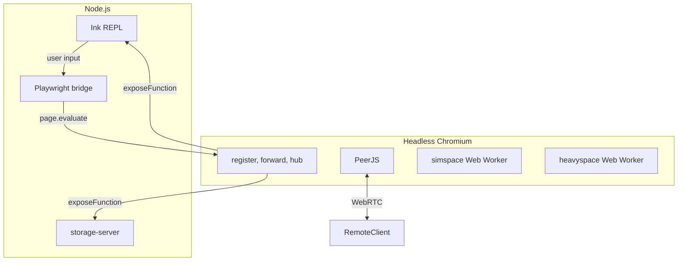

# Server Mode: Headless Browser Architecture

This document describes the server mode implementation using a headless browser for the ZSS runtime, with Node providing only the Ink REPL and file storage.

---

## Overview

The ZSS server runs with:

- **Node.js**: Ink REPL (terminal UI) and storage-server (file I/O)
- **Headless Chromium**: Full ZSS runtime (register, forward, netterminal, simspace, heavyspace as Web Workers)
- **Bridge**: Playwright connects Node and the headless page via `page.exposeFunction`

No WebRTC polyfills or Node forks. PeerJS runs natively in the headless browser.

---

## Architecture

### Abstractions

Only two abstractions cross the Node/browser boundary:

1. **Storage** — Browser calls `window.__nodeStorage*`; Node implements via `page.exposeFunction` (wraps storage-server).
2. **Ink REPL** — Browser calls `window.__nodeLog(line)` for output; Node calls `window.__onCliInput(line)` for user input.

---

## Entry Points

| Entry | Purpose |
|-------|---------|
| `server/main.tsx` | CLI server: Ink UI, launches Playwright, wires bridge |
| `server/bridge.ts` | Playwright bridge: exposes storage, log; loads cafe |
| `zss/feature/storage-bridge.ts` | Storage adapter for headless: delegates to `window.__nodeStorage*` |

---

## Build System

**Three pipelines:**

1. **Web (cafe)**: `yarn build` → `cafe/dist/`
2. **Headless**: `yarn build:headless` → `cafe/dist-headless/` (cafe with storage → storage-bridge)
3. **Server**: `yarn build:server` → `dist-server/server.js` (Node entry only)

### Scripts

- `yarn build` — web (cafe)
- `yarn build:headless` — cafe build with storage-bridge for headless server
- `yarn build:server` — Node server bundle
- `yarn server` — Run server (tsx); **requires `yarn build:headless` first**
- `yarn server:dist` — Run built `dist-server/server.js`

---

## Runtime Requirements

- **Chromium**: Playwright installs via `npx playwright install chromium`. Required for server.
- **TTY**: Ink REPL requires an interactive terminal.

---

## File Reference

| File | Role |
|------|------|
| `vite.config.ts` | Web build (cafe) |
| `vite.headless.config.ts` | Headless build (cafe + storage-bridge) |
| `vite.server.config.ts` | Server build (Node entry) |
| `server/main.tsx` | Server entry: Ink + bridge |
| `server/bridge.ts` | Playwright bridge, storage exposeFunction |
| `zss/feature/storage-bridge.ts` | Storage adapter for headless browser |
| `zss/feature/storage-server.ts` | Node file storage |

---

## Changelog

- **2025-03**: Headless browser architecture. Removed platform.ts, simspace.fork, heavyspace.fork, netterminal-server, peerjs-node-polyfill. Node = Ink + storage only. ZSS runtime in headless Chromium with Web Workers.
