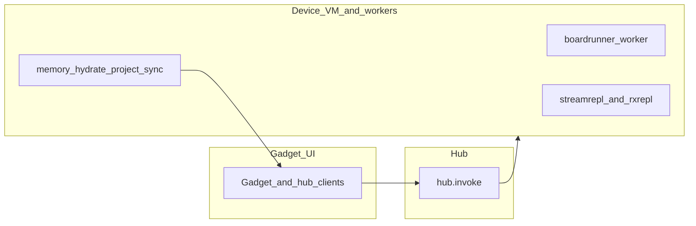

# Branch breakdown: `dev` vs `main`

This document inventories what would land on `main` if `dev` were merged, based on a three-dot diff (`main...dev`). It was generated with local `main` fast-forwarded to `origin/main`, and local `dev` fast-forwarded to `origin/dev`, on **2026-04-22**.

---

## Breaking / review carefully

- **Runtime dependencies**: `dev` adds `@jsonjoy.com/json-pack`, `rxdb@15`, and `rxjs@7`, plus devDependency `tslib`. `@twurple/auth` and `@twurple/chat` move from `^8.0.3` to `^8.1.3`. Expect a large `yarn.lock` churn and any policy review that applies to DB/replication stacks.
- **Hub tick delivery**: [`zss/hub.ts`](../zss/hub.ts) no longer batches delivery for tick-like targets through [`runtickbatched`](../zss/gadget/runtickbatched.ts); that helper file is **removed**. All hub deliveries run synchronously.
- **Message target parsing**: [`parsetarget`](../zss/device.ts) now splits on the **first** colon only; targets with colons in the path segment behave differently than on `main`.
- **Removed device server module**: [`zss/device/gadgetserver.ts`](../zss/device/gadgetserver.ts) is **deleted**. Replacement is the stream replication / provider stack (e.g. [`zss/device/streamreplserver.ts`](../zss/device/streamreplserver.ts), [`zss/device/gadgetmemoryprovider.ts`](../zss/device/gadgetmemoryprovider.ts)), wired from [`zss/simspace.ts`](../zss/simspace.ts).
- **VM input handler removed**: [`zss/device/vm/handlers/input.ts`](../zss/device/vm/handlers/input.ts) is **deleted**; `input` is no longer registered in [`zss/device/vm/handlers/registry.ts`](../zss/device/vm/handlers/registry.ts). Local-player gating moved toward [`lastinputtouch.ts`](../zss/device/vm/handlers/lastinputtouch.ts); `flags.inputqueue` handling for locals is owned by the **boardrunner** worker ([`zss/device/boardrunner.ts`](../zss/device/boardrunner.ts)) and related paths (see [`zss/device/__tests__/userinput.test.ts`](../zss/device/__tests__/userinput.test.ts)).
- **Memory: `boardoperations` removed**: [`zss/memory/boardoperations.ts`](../zss/memory/boardoperations.ts) is **deleted**. Book/board helpers are consolidated and extended in [`bookoperations.ts`](../zss/memory/bookoperations.ts) and other board modules (`boards`, `boardmovement`, `boardlifecycle`, `boardtransitions`, etc.).
- **Gadget compression helper removed**: [`zss/gadget/data/compress.ts`](../zss/gadget/data/compress.ts) and its test are **deleted**; call sites should not expect that API.
- **Screen UI**: [`zss/screens/screenui/component.tsx`](../zss/screens/screenui/component.tsx) is **deleted**; composition moves to [`framed.tsx`](../zss/screens/screenui/framed.tsx) and neighboring screenui modules.
- **Renamed gadget data files**: `zss/gadget/data/state.ts` → [`useequal.ts`](../zss/gadget/data/useequal.ts); `__tests__/state.test.ts` → [`zustandstores.test.ts`](../zss/gadget/data/__tests__/zustandstores.test.ts). Update imports and mental models accordingly.

---

## How this diff was captured

```bash
git fetch origin
git checkout main && git merge --ff-only origin/main
git checkout dev && git merge --ff-only origin/dev
git merge-base main dev
git diff main...dev --shortstat
git diff main...dev --name-status
```

| Ref | Commit | Subject (short) |
|-----|--------|-----------------|
| Merge-base | `641098ab79c44fb02955aee4649ece4a8cd7198f` | weave bugfix (#694) |
| `main` @ capture | `641098ab79c44fb02955aee4649ece4a8cd7198f` | (same as merge-base) |
| `dev` @ capture | `2af08837ac7e274eddc1b42c0c63a20004267e15` | ci: version bump to 1.3.17 |

- **Commits on `dev` not in `main`**: 143 (`git log main..dev --oneline`).
- **Scope note**: `git log` messages on this branch are often `ci: version bump`, `.`, or `sync work`. **The file list below is the source of truth** for what changes.

---

## Summary statistics

| Metric | Value |
|--------|------:|
| Files changed | 222 |
| Insertions / deletions | +11,949 / −1,823 |
| Added (A) | 66 |
| Modified (M) | 147 |
| Deleted (D) | 7 |
| Renamed (R) | 2 |

**Version**: [`package.json`](../package.json) on `main` is **1.2.8**; on `dev` at capture it is **1.3.17**.

**Rough file counts by area** (second path segment under `zss/`): `device` 83, `gadget` 36, `screens` 27, `memory` 26, `feature` 24, `firmware` 6, `perf` 6, plus top-level `zss` modules and repo-root files.

**Larger line deltas** (from scoped `git diff main...dev --stat`): `zss/device` ~+8.2k/−636; `zss/memory` ~+836/−200; `zss/gadget` net **reduction** (~+361/−596).

---

## Deleted files and replacements

| Removed on `dev` | Where the responsibility went (high level) |
|------------------|--------------------------------------------|
| `zss/device/gadgetserver.ts` | Stream replication + gadget memory provider path: [`streamreplserver.ts`](../zss/device/streamreplserver.ts), [`gadgetmemoryprovider.ts`](../zss/device/gadgetmemoryprovider.ts), `rxrepl*` modules; [`simspace.ts`](../zss/simspace.ts) imports the new devices. |
| `zss/device/vm/handlers/input.ts` | No `input` key in [`registry.ts`](../zss/device/vm/handlers/registry.ts). Local/flags gate in [`lastinputtouch.ts`](../zss/device/vm/handlers/lastinputtouch.ts). `flags.inputqueue` for local players: [`boardrunner.ts`](../zss/device/boardrunner.ts); see [`userinput.test.ts`](../zss/device/__tests__/userinput.test.ts). |
| `zss/gadget/data/compress.ts` (+ test) | Removed; no in-repo replacement—verify no external callers. |
| `zss/gadget/runtickbatched.ts` | Tick batching removed from [`hub.ts`](../zss/hub.ts); hub always calls `deliver()` directly. |
| `zss/memory/boardoperations.ts` | Logic folded into [`bookoperations.ts`](../zss/memory/bookoperations.ts) and other board modules (`boards`, `boardmovement`, `boardlifecycle`, …). |
| `zss/screens/screenui/component.tsx` | UI split into [`framed.tsx`](../zss/screens/screenui/framed.tsx), [`layoutstate.tsx`](../zss/screens/screenui/layoutstate.tsx), [`scrollprovider.tsx`](../zss/screens/screenui/scrollprovider.tsx), [`tickertext.tsx`](../zss/screens/screenui/tickertext.tsx). |

---

## Renames (import paths)

| Old (`main`) | New (`dev`) |
|--------------|-------------|
| `zss/gadget/data/state.ts` | `zss/gadget/data/useequal.ts` (R093) |
| `zss/gadget/data/__tests__/state.test.ts` | `zss/gadget/data/__tests__/zustandstores.test.ts` (R095) |

---

## Thematic categories (narrative)

### 1. Versioning, dependencies, developer workflow

- **Version** 1.2.8 → 1.3.17 (continuous `ci: version bump` commits).
- **New / upgraded deps**: `@jsonjoy.com/json-pack`, `rxdb@15`, `rxjs@7`, `tslib` (dev); Twurple patch minor bump.
- **Scripts**: `lint` uses ESLint and `tsc` caches; `lint:fresh` clears them. `dev` no longer runs `yarn clear` every time; `dev:fresh` keeps the old behavior.

### 2. Hub, device routing, tick delivery

- [`hub.ts`](../zss/hub.ts): synchronous delivery for all messages; `runtickbatched` removed.
- [`device.ts`](../zss/device.ts): `parsetarget` first-colon split.

### 3. Device: board runner, replication, VM memory sync

- **Docs**: [`device-architecture-by-worker.md`](../zss/device/docs/device-architecture-by-worker.md), [`host-vs-join-architecture.md`](../zss/device/docs/host-vs-join-architecture.md), [`workers-and-devices.md`](../zss/device/docs/workers-and-devices.md).
- **Board runner**: [`boardrunnerspace.ts`](../zss/boardrunnerspace.ts), [`boardrunner.ts`](../zss/device/boardrunner.ts), [`platform.ts`](../zss/platform.ts) worker wiring; VM handlers/tests (`playermovetoboard`, `acktick`, tick/boardrunner/election tests).
- **Replication**: `zss/device/rxrepl/*`, [`rxreplclient.ts`](../zss/device/rxreplclient.ts), [`rxreplserver.ts`](../zss/device/rxreplserver.ts), [`streamreplserver.ts`](../zss/device/streamreplserver.ts), [`netsim.ts`](../zss/device/netsim.ts).
- **VM memory pipeline**: [`memoryhydrate.ts`](../zss/device/vm/memoryhydrate.ts), [`memoryhydrateimpl.ts`](../zss/device/vm/memoryhydrateimpl.ts), [`memoryproject.ts`](../zss/device/vm/memoryproject.ts), [`memorysimsync.ts`](../zss/device/vm/memorysimsync.ts), [`memorywiremerge.ts`](../zss/device/vm/memorywiremerge.ts), [`memoryworkersync.ts`](../zss/device/vm/memoryworkersync.ts), with broad test coverage under `zss/device/vm/__tests__/`.
- **Handlers**: new [`peergone.ts`](../zss/device/vm/handlers/peergone.ts), [`playermovetoboard.ts`](../zss/device/vm/handlers/playermovetoboard.ts), [`acktick.ts`](../zss/device/vm/handlers/acktick.ts); updates across auth, tick, pilot, scroll, etc.

### 4. Memory

- New [`boardblocking.ts`](../zss/memory/boardblocking.ts), [`memorydirty.ts`](../zss/memory/memorydirty.ts); tests for flags-ready and gadget control layer.
- **`boardoperations` removed**; **`bookoperations`** and board graph modules carry the work.

### 5. Gadget / graphics

- Renamed equality/store test files; new [`usegadgetclientchanged.ts`](../zss/gadget/data/usegadgetclientchanged.ts).
- Graphics stacks touched: flat/fpv/iso/mode7 layers and related tiles/overlay/media.

### 6. Screens / UI shell

- Mostly small import/consistency edits across editor, inspector, tape, terminal, scroll; **screenui `component.tsx` removed** in favor of `framed` and siblings.

### 7. Feature / net / synth

- New [`netformat.ts`](../zss/feature/netformat.ts), [`netterminalstreamrowpeer.ts`](../zss/feature/netterminalstreamrowpeer.ts), tests and bench.
- [`synthtime.ts`](../zss/feature/synth/synthtime.ts); [`playnotation.ts`](../zss/feature/synth/playnotation.ts) updates.
- Parse pipeline and storage/fingerprint tweaks across several parsers.

### 8. Firmware / CLI

- [`multiplayer.ts`](../zss/firmware/cli/commands/multiplayer.ts) significantly slimmed; collateral edits to editor, input, permissions, [`runtime.ts`](../zss/firmware/runtime.ts), [`board.ts`](../zss/firmware/board.ts).

### 9. Performance

- New [`perfmonitortiles.tsx`](../zss/perf/perfmonitortiles.tsx), [`ivsbroadcaststats.ts`](../zss/perf/ivsbroadcaststats.ts), [`hud.tsx`](../zss/perf/hud.tsx), [`peerwire.ts`](../zss/perf/peerwire.ts), [`chatmessagestats.ts`](../zss/perf/chatmessagestats.ts); [`README.md`](../zss/perf/README.md) updated.

### 10. Tests & support

- Many new unit tests under `zss/device`, `zss/memory`, `zss/feature`, `zss/gadget`.
- [`jest.config.ts`](../jest.config.ts) and [`e2escrollbridge.ts`](../zss/testsupport/e2escrollbridge.ts) adjusted.

---

## Architecture sketch (high level)



---

## Appendix: full `git diff main...dev --name-status` (grouped)

Statuses: **A** added, **M** modified, **D** deleted, **R093/R095** rename similarity.

### Repository root & `cafe/`

- `M` — `.gitignore`
- `M` — `cafe/index.tsx`
- `M` — `jest.config.ts`
- `M` — `package.json`
- `M` — `yarn.lock`

### `zss/` (top-level `.ts` / `.tsx` modules)

- `A` — `zss/boardrunnerspace.ts`
- `M` — `zss/chip.ts`
- `M` — `zss/device.ts`
- `M` — `zss/heavyspace.ts`
- `M` — `zss/hub.ts`
- `M` — `zss/platform.ts`
- `M` — `zss/simspace.ts`

### `zss/device/`

- `M` — `zss/device/EXPORTED_FUNCTIONS.md`
- `A` — `zss/device/__tests__/gadgetclient.filter.test.ts`
- `M` — `zss/device/__tests__/gadgetsync.snapshot.test.ts`
- `A` — `zss/device/__tests__/jsonsyncdb.ordering.test.ts`
- `A` — `zss/device/__tests__/userinput.test.ts`
- `M` — `zss/device/api.ts`
- `A` — `zss/device/boardrunner.ts`
- `M` — `zss/device/bridge.ts`
- `M` — `zss/device/clock.ts`
- `A` — `zss/device/docs/device-architecture-by-worker.md`
- `M` — `zss/device/docs/devices-and-messaging.md`
- `A` — `zss/device/docs/host-vs-join-architecture.md`
- `M` — `zss/device/docs/message-flow.md`
- `A` — `zss/device/docs/workers-and-devices.md`
- `M` — `zss/device/forward.ts`
- `M` — `zss/device/gadgetclient.ts`
- `A` — `zss/device/gadgetmemoryprovider.ts`
- `D` — `zss/device/gadgetserver.ts`
- `M` — `zss/device/modem.ts`
- `A` — `zss/device/netsim.ts`
- `M` — `zss/device/register.ts`
- `A` — `zss/device/rxrepl/__tests__/replication.pipe.test.ts`
- `A` — `zss/device/rxrepl/__tests__/streamrepl.replication.jest.test.ts`
- `A` — `zss/device/rxrepl/collectionschemas.ts`
- `A` — `zss/device/rxrepl/partialscopes.ts`
- `A` — `zss/device/rxrepl/pullawait.ts`
- `A` — `zss/device/rxrepl/replication.ts`
- `A` — `zss/device/rxrepl/streamreplpushawait.ts`
- `A` — `zss/device/rxrepl/streamreplreplicationctx.ts`
- `A` — `zss/device/rxrepl/streamreplreplicationinit.ts`
- `A` — `zss/device/rxrepl/streamreplscopedreplication.ts`
- `A` — `zss/device/rxrepl/types.ts`
- `A` — `zss/device/rxreplclient.ts`
- `A` — `zss/device/rxreplserver.ts`
- `A` — `zss/device/streamreplserver.ts`
- `M` — `zss/device/synth.ts`
- `M` — `zss/device/vm.ts`
- `A` — `zss/device/vm/__tests__/memory.roundtrip.test.ts`
- `A` — `zss/device/vm/__tests__/memoryhydrate.test.ts`
- `A` — `zss/device/vm/__tests__/memoryhydrateprojectroundtrip.test.ts`
- `A` — `zss/device/vm/__tests__/memorysync.loginreplstreams.test.ts`
- `A` — `zss/device/vm/__tests__/memorysync.reverseproject.test.ts`
- `A` — `zss/device/vm/__tests__/memorysync.viewportgadgetadmit.test.ts`
- `A` — `zss/device/vm/__tests__/memoryworkersync.gadgetpush.test.ts`
- `A` — `zss/device/vm/__tests__/playermovetoboard.race.test.ts`
- `M` — `zss/device/vm/handlers/__tests__/bookmarkscroll.test.ts`
- `M` — `zss/device/vm/handlers/__tests__/books.simfreeze.test.ts`
- `A` — `zss/device/vm/handlers/__tests__/cli.test.ts`
- `M` — `zss/device/vm/handlers/__tests__/default.handlers.tier1.test.ts`
- `A` — `zss/device/vm/handlers/__tests__/peergone.test.ts`
- `A` — `zss/device/vm/handlers/__tests__/pilot.worker.test.ts`
- `A` — `zss/device/vm/handlers/__tests__/playermovetoboard.test.ts`
- `M` — `zss/device/vm/handlers/__tests__/scroll.refscroll.test.ts`
- `A` — `zss/device/vm/handlers/__tests__/second.test.ts`
- `A` — `zss/device/vm/handlers/__tests__/tick.boardrunner.test.ts`
- `A` — `zss/device/vm/handlers/__tests__/tick.electionowned.test.ts`
- `M` — `zss/device/vm/handlers/__tests__/tick.simfreeze.test.ts`
- `A` — `zss/device/vm/handlers/acktick.ts`
- `M` — `zss/device/vm/handlers/auth.ts`
- `M` — `zss/device/vm/handlers/bookmarkscroll.ts`
- `M` — `zss/device/vm/handlers/books.ts`
- `M` — `zss/device/vm/handlers/default.ts`
- `M` — `zss/device/vm/handlers/flush.ts`
- `M` — `zss/device/vm/handlers/fork.ts`
- `M` — `zss/device/vm/handlers/halt.ts`
- `D` — `zss/device/vm/handlers/input.ts`
- `M` — `zss/device/vm/handlers/lastinputtouch.ts`
- `M` — `zss/device/vm/handlers/loader.ts`
- `M` — `zss/device/vm/handlers/page.ts`
- `A` — `zss/device/vm/handlers/peergone.ts`
- `M` — `zss/device/vm/handlers/pilot.ts`
- `A` — `zss/device/vm/handlers/playermovetoboard.ts`
- `M` — `zss/device/vm/handlers/registry.ts`
- `M` — `zss/device/vm/handlers/scroll.ts`
- `M` — `zss/device/vm/handlers/second.ts`
- `M` — `zss/device/vm/handlers/tick.ts`
- `A` — `zss/device/vm/memoryhydrate.ts`
- `A` — `zss/device/vm/memoryhydrateimpl.ts`
- `A` — `zss/device/vm/memoryproject.ts`
- `A` — `zss/device/vm/memorysimsync.ts`
- `A` — `zss/device/vm/memorywiremerge.ts`
- `A` — `zss/device/vm/memoryworkersync.ts`
- `M` — `zss/device/vm/state.ts`

### `zss/feature/`

- `M` — `zss/feature/__tests__/bookmarks.test.ts`
- `A` — `zss/feature/__tests__/netformat.bench.ts`
- `A` — `zss/feature/__tests__/netformat.test.ts`
- `A` — `zss/feature/__tests__/netterminal.streamrowpeer.test.ts`
- `M` — `zss/feature/docs/format.md`
- `M` — `zss/feature/fingerprint.ts`
- `M` — `zss/feature/heavy/agentlifecycle.ts`
- `A` — `zss/feature/netformat.ts`
- `M` — `zss/feature/netterminal.ts`
- `A` — `zss/feature/netterminalstreamrowpeer.ts`
- `A` — `zss/feature/parse/__tests__/importgamebook.test.ts`
- `M` — `zss/feature/parse/__tests__/markdownscroll.test.ts`
- `M` — `zss/feature/parse/ansi.ts`
- `M` — `zss/feature/parse/ansilove/index.ts`
- `M` — `zss/feature/parse/chr.ts`
- `M` — `zss/feature/parse/midi.ts`
- `M` — `zss/feature/parse/petscii.ts`
- `M` — `zss/feature/parse/zzm.ts`
- `M` — `zss/feature/parse/zzt.ts`
- `M` — `zss/feature/parse/zztobj.ts`
- `M` — `zss/feature/storage.ts`
- `M` — `zss/feature/synth/index.ts`
- `M` — `zss/feature/synth/playnotation.ts`
- `A` — `zss/feature/synth/synthtime.ts`

### `zss/firmware/`

- `M` — `zss/firmware/board.ts`
- `M` — `zss/firmware/cli/commands/editor.ts`
- `M` — `zss/firmware/cli/commands/input.ts`
- `M` — `zss/firmware/cli/commands/multiplayer.ts`
- `M` — `zss/firmware/cli/commands/permissions.ts`
- `M` — `zss/firmware/runtime.ts`

### `zss/gadget/`

- `M` — `zss/gadget/EXPORTED_FUNCTIONS.md`
- `M` — `zss/gadget/capture/index.ts`
- `M` — `zss/gadget/data/__tests__/api.test.ts`
- `D` — `zss/gadget/data/__tests__/compress.test.ts`
- `M` — `zss/gadget/data/__tests__/scrollwritelines.test.ts`
- `R095` — `zss/gadget/data/__tests__/state.test.ts` → `zss/gadget/data/__tests__/zustandstores.test.ts`
- `M` — `zss/gadget/data/api.ts`
- `D` — `zss/gadget/data/compress.ts`
- `M` — `zss/gadget/data/scrollwritelines.ts`
- `R093` — `zss/gadget/data/state.ts` → `zss/gadget/data/useequal.ts`
- `A` — `zss/gadget/data/usegadgetclientchanged.ts`
- `M` — `zss/gadget/data/zustandstores.ts`
- `M` — `zss/gadget/device.ts`
- `M` — `zss/gadget/display/unicodeatlas.ts`
- `M` — `zss/gadget/display/unicodeoverlay.ts`
- `M` — `zss/gadget/docs/gadget-scrolls.md`
- `M` — `zss/gadget/engine.tsx`
- `M` — `zss/gadget/fx/crt.tsx`
- `M` — `zss/gadget/graphics/__tests__/exitpreviewresolve.test.ts`
- `M` — `zss/gadget/graphics/exitpreviewresolve.ts`
- `M` — `zss/gadget/graphics/flat.tsx`
- `M` — `zss/gadget/graphics/flatlayer.tsx`
- `M` — `zss/gadget/graphics/fpv.tsx`
- `M` — `zss/gadget/graphics/fpvlayer.tsx`
- `M` — `zss/gadget/graphics/iso.tsx`
- `M` — `zss/gadget/graphics/isolayer.tsx`
- `M` — `zss/gadget/graphics/medialayer.tsx`
- `M` — `zss/gadget/graphics/mode7.tsx`
- `M` — `zss/gadget/graphics/mode7layer.tsx`
- `M` — `zss/gadget/graphics/tiles.tsx`
- `M` — `zss/gadget/graphics/unicodeoverlay.tsx`
- `M` — `zss/gadget/media.ts`
- `D` — `zss/gadget/runtickbatched.ts`
- `M` — `zss/gadget/toast.tsx`
- `M` — `zss/gadget/userinput.tsx`
- `M` — `zss/gadget/usetiles.tsx`

### `zss/memory/`

- `M` — `zss/memory/EXPORTED_FUNCTIONS.md`
- `M` — `zss/memory/__tests__/boardcornerexits.test.ts`
- `M` — `zss/memory/__tests__/boardlighting.test.ts`
- `A` — `zss/memory/__tests__/memoryconverttogadgetcontrollayer.test.ts`
- `A` — `zss/memory/__tests__/playermanagement.flagsready.test.ts`
- `A` — `zss/memory/__tests__/runtime.memorytickobject.flagsready.test.ts`
- `M` — `zss/memory/__tests__/session.simfreeze.test.ts`
- `A` — `zss/memory/boardblocking.ts`
- `M` — `zss/memory/boardcornerexits.ts`
- `M` — `zss/memory/boardlifecycle.ts`
- `M` — `zss/memory/boardmovement.ts`
- `D` — `zss/memory/boardoperations.ts`
- `M` — `zss/memory/boards.ts`
- `M` — `zss/memory/boardtransitions.ts`
- `M` — `zss/memory/bookoperations.ts`
- `M` — `zss/memory/books.ts`
- `M` — `zss/memory/docs/runtime.md`
- `M` — `zss/memory/gamesend.ts`
- `M` — `zss/memory/inspection.ts`
- `A` — `zss/memory/memorydirty.ts`
- `M` — `zss/memory/playermanagement.ts`
- `M` — `zss/memory/rendering.ts`
- `M` — `zss/memory/runtime.ts`
- `M` — `zss/memory/session.ts`
- `M` — `zss/memory/types.ts`
- `M` — `zss/memory/utilities.ts`

### `zss/perf/`

- `M` — `zss/perf/README.md`
- `A` — `zss/perf/chatmessagestats.ts`
- `A` — `zss/perf/hud.tsx`
- `A` — `zss/perf/ivsbroadcaststats.ts`
- `A` — `zss/perf/peerwire.ts`
- `A` — `zss/perf/perfmonitortiles.tsx`

### `zss/rom/`

- `M` — `zss/rom/index.ts`

### `zss/screens/`

- `M` — `zss/screens/editor/component.tsx`
- `M` — `zss/screens/editor/editorframe.tsx`
- `M` — `zss/screens/editor/editorinput.tsx`
- `M` — `zss/screens/editor/editorinputhooks.ts`
- `M` — `zss/screens/editor/editorrows.tsx`
- `M` — `zss/screens/inspector/component.tsx`
- `M` — `zss/screens/inspector/pts.tsx`
- `M` — `zss/screens/inspector/select.tsx`
- `D` — `zss/screens/screenui/component.tsx`
- `M` — `zss/screens/screenui/framed.tsx`
- `M` — `zss/screens/screenui/layoutstate.tsx`
- `M` — `zss/screens/screenui/scrollprovider.tsx`
- `M` — `zss/screens/screenui/tickertext.tsx`
- `M` — `zss/screens/scroll/component.tsx`
- `M` — `zss/screens/scroll/marquee.tsx`
- `M` — `zss/screens/tape/autocomplete.ts`
- `M` — `zss/screens/tape/backplate.tsx`
- `M` — `zss/screens/tape/commandarghints.ts`
- `M` — `zss/screens/tape/component.tsx`
- `M` — `zss/screens/tape/layout.tsx`
- `M` — `zss/screens/tape/layouttiles.tsx`
- `M` — `zss/screens/terminal/component.tsx`
- `M` — `zss/screens/terminal/input.tsx`
- `M` — `zss/screens/terminal/item.tsx`
- `M` — `zss/screens/terminal/rows.tsx`
- `M` — `zss/screens/terminal/terminalinputhelpers.ts`
- `M` — `zss/screens/terminal/terminalinputhooks.ts`

### `zss/testsupport/`

- `M` — `zss/testsupport/e2escrollbridge.ts`

---

## Not included in this document

- **Uncommitted or untracked changes** in your working tree after the capture commands. When this file was written, `git status` on `dev` was clean relative to `origin/dev`.
- **Anything not represented in `git diff main...dev`**: e.g. future commits on either branch, or a different merge-base if `main` moves.
- **Line-by-line hunks**: use `git diff main...dev -- <path>` for implementation detail.

To refresh this report, re-run the commands in **How this diff was captured** and replace the appendix from `git diff main...dev --name-status`.
