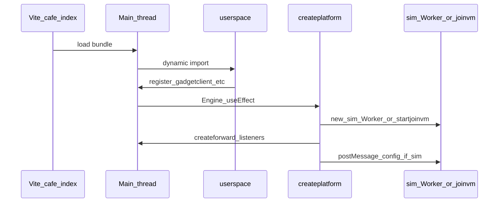
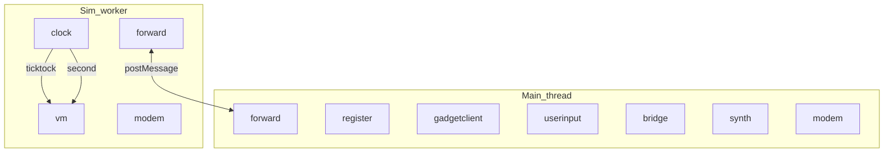
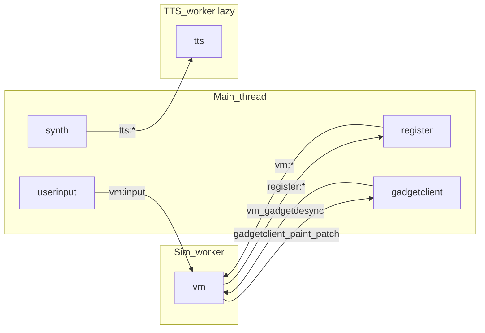

How **devices** talk to each other in ZSS: **main thread**, **simulation worker**, and on-demand **TTS/STT workers**, each with its own **`hub`**, plus **`forward`** bridging over `postMessage`, and the `SOFTWARE` emit surface.

**Context:** [zss/ARCHITECTURE.md](../../ARCHITECTURE.md) (full stack: cafe → Engine → platform → workers).

## Contents

- [Rules of the road](#rules-of-the-road)
- [What creates each thread or worker](#what-creates-each-thread-or-worker)
- [Where each device lives](#where-each-device-lives)
- [Diagram: hubs and forward bridges](#diagram-hubs-and-forward-bridges)
- [Diagram: logical request paths (compact)](#diagram-logical-request-paths-compact)
- [Directed graph (full handler edges)](#directed-graph-who-handles-which-target)
- [Client → worker forwarding (reference)](#client--worker-forwarding-reference)
- [Unified routing: workers, PEER, and blocked traffic](#unified-routing-workers-peer-and-blocked-traffic)
- [Discovering message targets](#discovering-message-targets)

## Rules of the road

1. **`hub.invoke(message)`** delivers every message to **every** connected device; each device ignores or handles based on [routing rules](message-flow.mdx#routing-rules-devicehandle) ([`createdevice`](../../device.ts) in `zss/device.ts`).
2. **Topics** — e.g. `ticktock`, `second`, `ready`, `log` — match broadcast-style targets so multiple devices can observe the same clock or log line.
3. **Directed** targets use `deviceName:path` (e.g. `vm:cli` → the `vm` device sees `target === 'cli'`).
4. **Multiple hubs** — The browser runs **main-thread** code plus **Web Workers** (see [what creates each realm](#what-creates-each-thread-or-worker)). Each realm has its **own** `hub` singleton; `postMessage` + **`forward`** sync selected traffic ([`forward.ts`](../forward.ts), [`platform.ts`](../../platform.ts)).
5. **`SOFTWARE`** ([`session.ts`](../session.ts)) — A minimal `createdevice('SOFTWARE')` used as a **convenient `emit` sender** (session id from first `ready`). UI and chip code often call `SOFTWARE.emit(...)` so messages enter the **caller's** hub with the right session.
6. **`MESSAGE`** ([`api.ts`](../api.ts)) — Shape: `session`, `player`, `id`, `sender`, `target`, `data`. **`reply(to, subtarget)`** / **`replynext`** emit a new message whose `target` is **`to.sender:subtarget`**, so the original sender's device handles `subtarget` as `message.target` after routing.
7. **POD emit surface vs patch encoding** — [`api.ts`](../api.ts) is the **worker-safe** set of `device.emit(...)` helpers. **Jsonpipe patch wire encoding** lives in [`patchapi.ts`](../patchapi.ts) (`gadgetclientpatch`); call sites that emit patches import `patchapi` explicitly.
8. **`message.id` deduplication** — [`createforward`](../forward.ts) records each `message.id` in a `syncids` set so the same message is not applied repeatedly when it crosses hubs.
9. **`registerplayer` vs `register`** — [`registerplayer.ts`](../registerplayer.ts) holds the current player id string only (worker-safe). [`register.ts`](../register.ts) is the thin main-thread device entry; handlers live under [`register/handlers/`](../register/handlers/registry.ts).

See also: [message-flow.mdx](message-flow.mdx) (ASCII + mermaid, boot sequence, flow table).

---

## What creates each thread or worker

ZSS does not spawn OS threads; it uses the **browser main thread** and **dedicated Web Workers**. Each worker is its own JavaScript **realm** with a separate global `hub`.

### Main thread

| Piece | Role |
|--------|------|
| **Entry** | Vite loads [`cafe/index.tsx`](../../../cafe/index.tsx) as the SPA shell (normal UI) or runs **`bootheadless`** when [`isclimode()`](../../feature/detect.ts). |
| **Main-hub devices** | `import('zss/userspace')` registers **`register`**, **`gadgetclient`**, **`modem`**, **`bridge`**, **`synth`** ([`userspace.ts`](../../userspace.ts)). |
| **Worker construction** | [`createplatform(isstub, climode)`](../../platform.ts) runs **only here**. Normal host starts **simspace**; `/join/` starts [`startjoinvm`](../joinvm.ts) on main (no sim worker). **ttsspace** / **sttspace** start on demand. |
| **Who calls `createplatform`** | [`zss/gadget/engine.tsx`](../../gadget/engine.tsx) — `useEffect` on mount. [`cafe/index.tsx`](../../../cafe/index.tsx) — `bootheadless()`. |
| **Teardown** | [`haltplatform()`](../../platform.ts) disconnects joinvm (if any), terminates sim and any TTS/STT workers, removes listeners. |

### Simulation worker (`simspace`) vs join VM (`joinvm`)

| Piece | Role |
|--------|------|
| **Instantiation** | [`platform.ts`](../../platform.ts): if `isstub`, `joinvmdevice = startjoinvm(session)` on the main hub; else `platform = new simspace()`. |
| **`isstub`** | **`isjoin()`** ([`feature/url.ts`](../../feature/url.ts)): URL contains **`/join/`** → joinvm on main; otherwise full **sim** worker. |
| **Boot** | **simspace** imports `clock`, `modem`, `forward`, and (via `started`) the real **`vm`**. Each `ticktock` runs `memorytickloaders`, `memorytickmain`, gadget layer rebuild, `gadgetsynctick`, and optional memoryfs. **joinvm** only acks `vm:operator` so register can bridge; host owns the real sim. |

### Order of operations (typical browser UI)

---

## Where each device lives

| Device | Hub / realm | Subscribes (topics) | Role |
|--------|----------------|---------------------|------|
| `forward` | main + each worker | `all` | Copies messages across `postMessage`; dedupes by `message.id` |
| `clock` | sim worker only | — | Emits `ticktock`, `second` |
| `vm` | sim worker | `ticktock`, `second` | Authoritative MEMORY; `handleticktock` runs loaders + `memorytickmain` + gadget projection |
| `vm` (join) | **main** hub when `/join/` | — | Thin stand-in from [`startjoinvm`](../joinvm.ts) |
| `modem` | **both** hubs | `second` | Sync / presence (per-realm instance) |
| `register` | main | `ready`, `second`, `log`, `chat`, `toast` | UI edge: storage, tape, VM calls |
| `gadgetclient` | main | — | Applies `gadgetclient:paint` / `patch` to zustand |
| `userinput` | main | — | Keyboard/gamepad → `vm:input` / `register:*` (side effect of UI mount) |
| `bridge` | main | — | `bridge:*` multiplayer / fetch / streams |
| `synth` | main | — | `synth:*` audio |
| `tts` / `stt` | lazy worker hubs | — | On-demand inference via main `forward` |
| `SOFTWARE` | whichever hub loaded it | — | Session holder + `emit` helper |

---

## Diagram: hubs and forward bridges

**What crosses sim ↔ main** — `vm:*`, `modem:*`, `gadgetclient:*` paint/patch (sim → main), and `desync` / `sync` / `joinack` paths per [`shouldforwardclienttoserver`](../forward.ts) / [`shouldforwardservertoclient`](../forward.ts).

**Main ↔ tts/stt** — `tts:*` / `stt:*` when workers are started on demand.

---

## Diagram: logical request paths (compact)

---

## Directed graph (who handles which `target`)

See [message-flow.mdx](message-flow.mdx) for the full flow table. Primary edges:

- **clock** → **vm** (`ticktock`, `second`)
- **register** / **userinput** → **vm** (`vm:*`, including `vm:input`)
- **vm** → **gadgetclient** (`gadgetclient:paint`, `gadgetclient:patch`)
- **gadgetclient** → **vm** (`vm:gadgetdesync` reply)
- **synth** → **tts** worker (`tts:info`, `tts:request`)

Chip `send` uses `chipmessage` → `SOFTWARE.emit` on the sim hub (same realm as `memorytickmain`).

---

## Client → worker forwarding (reference)

[`shouldforwardclienttoserver`](../forward.ts): `vm:*`, `chip:*`, `modem:*`, plus path suffixes `sync`, `desync`, `joinack`.

[`shouldforwardservertoclient`](../forward.ts): broadcast topics (`log`, `chat`, `ready`, `toast`, `second`, `ticktock`) and targets `tts`, `stt`, `synth` (except peer-blocked `synth:tts` / `synth:ttsqueue` — joins play `synth:audiobytes` instead), `modem`, `bridge` (except peer-blocked `bridge:mediapanel` / `bridge:queuepanel` — queue state lives on the listening host), `register`, `gadgetclient`, `perfreport`, `netterminal`, plus ack path suffixes.

TTS/STT workers are reached via main `postMessage` when [`platform.ts`](../../platform.ts) routes matching targets.

---

## Unified routing: workers, PEER, and blocked traffic

Authoritative allow-lists live in [`forward.ts`](../forward.ts). Peer networking ([`netterminal.ts`](../../feature/netterminal.ts)) wraps **`createforward`** and applies stricter compound filters for PeerJS wire traffic.

[`createforward`](../forward.ts) skips local hub delivery of inbound **`ticktock`** messages to avoid clock fan-out loops.

---

## Discovering message targets

- **Tables** — [message-flow.mdx § Main message flows](message-flow.mdx#main-message-flows)
- **API helpers** — [`device/api.ts`](../api.ts); patch emit in [`device/patchapi.ts`](../patchapi.ts)
- **Handlers** — [`vm/handlers/registry.ts`](../vm/handlers/registry.ts)
- **Tests** — [`ops/tests/unit/device/device.test.ts`](../../../ops/tests/unit/device/device.test.ts); [`ops/tests/unit/device/forward.peer.test.ts`](../../../ops/tests/unit/device/forward.peer.test.ts)

**Maintenance** — When you change cross-realm routing, update [`forward.ts`](../forward.ts) `shouldforward*` helpers and keep this doc in sync.
