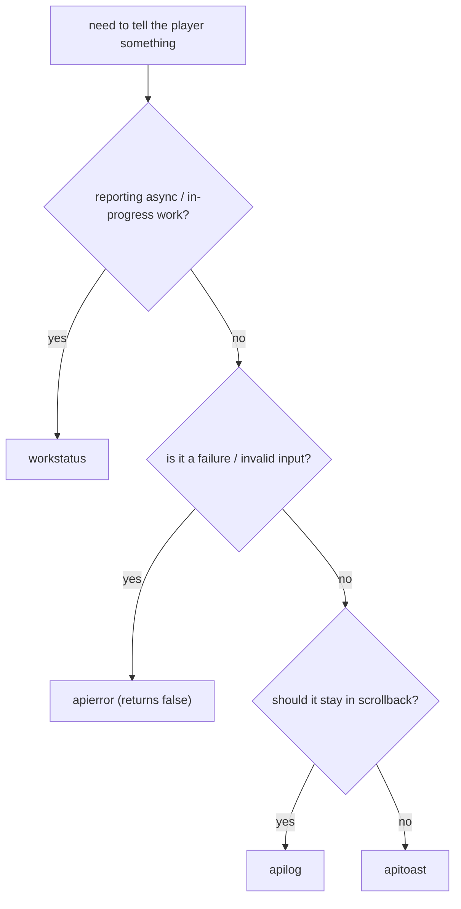

Analysis-only report. No code was changed. Scope: `zss/` and `cafe/`.

Covers the four user-facing feedback helpers defined in
[api.ts](../api.ts): `apilog`, `apierror`, `apitoast`, `workstatus`.

Goal: make usage consistent and use-case aware along three axes:

1. Channel selection (right helper for the situation)
2. Message string style (lowercase, ASCII, proper-noun handling)
3. `apierror` `kind` label conventions

---

## 1. Channel semantics + decision matrix

Definitions (from [api.ts](../api.ts)):

- `apilog(device, player, ...message)` -> emits `log`. Persistent tape/terminal
  scrollback. Returns `true`.
- `apierror(device, player, kind, ...message)` -> emits `log` prefixed
  `$red<kind>$blue>>`. Persistent scrollback. Returns `false`.
- `apitoast(device, player, toast)` -> emits `toast`. Transient popup;
  auto-dismiss, hold scales with length (min 3s, max 14s). Returns `void`.
- `workstatus(device, player, status)` -> emits `workstatus`. Spinner badge in
  the top-right; auto-clears 2s after the last update. Returns `void`.

Lifecycle owner: [tape.ts](../register/handlers/tape.ts) (`handlelog`,
`handletoast`, `handleworkstatus`) and the badge renderer
[workstatus.tsx](../../gadget/workstatus.tsx).

| Helper | Persistence | Intended content | Return contract | Notes |
|---|---|---|---|---|
| `apilog` | durable scrollback | info, confirmations, CLI command output | `true` | default channel; safe to keep history |
| `apierror` | durable scrollback | failures / invalid input the user should be able to scroll back to | `false` | used as an early-return value in CLI/word handlers; prefixes `$red&lt;kind&gt;$blue>>` |
| `apitoast` | transient (3-14s) | short success/confirmation ("copied!", "bookmarked"), quick non-fatal notices | `void` | ephemeral; not for content the user may need to re-read |
| `workstatus` | transient (2s auto-clear) | in-progress/async work labels ("parse zzt", "tts load") | `void` | never needs an explicit clear; keep labels &lt;= ~18 chars (badge truncates at `BADGE_W - 2`) |

### Decision guide

---

## 2. Consistency rules to enforce (the standard)

### 2.1 Channel selection

- Failures and invalid input -> `apierror`. Do **not** route errors through
  `apitoast`/`apilog` with a hand-rolled `$red...` prefix.
- Transient success/confirmation -> `apitoast`.
- Long or async progress -> `workstatus`.
- Durable info + CLI command results -> `apilog`.
- Avoid duplicate dual emits (`apilog` + `apitoast` for the same event) unless
  the durable record and the transient toast are intentionally both wanted;
  prefer one channel per event.

### 2.2 Message string style

- Sentence content lowercase; no trailing period.
- ASCII only (see [ascii-user-strings.mdc](../../../.cursor/rules/ascii-user-strings.mdc));
  use `$26`/`$27`/`$24`/`$25` for arrows, `...` for ellipsis, `-`/`--` for
  dashes.
- `$color` tokens (`$red`, `$green`, `$cyan`, `$white`, ...) are allowed.
- Preserve legitimate proper nouns / acronyms as-is: `ZZT`, `Super ZZT`, `MIDI`,
  `PETSCII`, `PNG`, `JPEG`, `JSON`, `MP3`, `URL`, `RSS`, `IVS`, `TTS`.
- Lowercase status words that are **not** proper nouns: `FAILED` -> `failed`,
  `OK` -> `ok`, `Cache Storage` -> `cache storage`.

### 2.3 `apierror` `kind` conventions

- `kind` is a short, stable, lowercase source/domain label -- ideally the
  emitting module or subsystem (`bridge`, `netterminal`, `wanix`, `format`,
  `build`, `storage`, `permissions`, `video`).
- One word preferred. Where sub-scoping helps, use a colon (`login:title`), not
  a space.
- `kind` must **not** contain runtime data. `readsession ${key}` and
  `writesession ${key} <- ${value}` put data in the label -- move the data into
  the message and use a stable kind (`session`).
- Do not use spaces inside `kind` (`tts config`, `tts decode`, `fish tts` ->
  `tts`).

---

## 3. Call-site inventory

Verdict legend: **OK** = conforms; **CHANNEL** = wrong helper for the case;
**STYLE** = message casing/ASCII issue; **KIND** = non-canonical `apierror`
kind; **BUG** = argument-order defect.

### 3.1 `firmware/cli/commands/`

| File | Sites | Channel(s) | Verdict | Notes |
|---|---|---|---|---|
| [multiplayer.ts](../../firmware/cli/commands/multiplayer.ts) | 15 err / 7 log | `apierror`/`apilog` | mostly OK | kinds `multiplayer`, `bridge`, `broadcast` are canonical; messages lowercase. |
| [permissions.ts](../../firmware/cli/commands/permissions.ts) | 9 err | `apierror` | OK | kinds `access`, `permissions`, `ban`. |
| [wanix.ts](../../firmware/cli/commands/wanix.ts) | 10 err / 9 log | `apierror`/`apilog` | OK | kind `wanix`. |
| [books.ts](../../firmware/cli/commands/books.ts) | 2 err / 2 log | `apierror`/`apilog` | **BUG** | `books.ts:200` calls `apierror(SOFTWARE, 'pageopen', \`page ${page} not found\`, elementfocus)` -- `player`, `kind`, `message` are shifted; player token is passed as the trailing message and the real message is passed as `kind`. |
| [send.ts](../../firmware/cli/commands/send.ts) | 1 toast | `apitoast` | OK | uses `READ_CONTEXT.elementfocus`. |
| [znsmenu.ts](../../firmware/cli/commands/znsmenu.ts) | 1 toast / 1 log | `apitoast`/`apilog` | OK | `imported $green<name> from zns [code] <key>`. |

### 3.2 `device/wanixclient/` (the largest channel-mismatch cluster)

| File | Sites | Verdict | Notes |
|---|---|---|---|
| [handlers/bindfsa.ts](../wanixclient/handlers/bindfsa.ts) | line 29 `apilog`, 30 `apitoast`, 35 `apilog`, 40 `apitoast` | **CHANNEL** + **STYLE** | Failure path logs via `apilog` + `apitoast` instead of `apierror`. `FAILED`/`OK` should be lowercase. Also a dual log+toast emit. |
| [handlers/dropdone.ts](../wanixclient/handlers/dropdone.ts) | line 21 `apilog` | **CHANNEL** | `wanix drop failed: ...` should be `apierror` kind `wanix`. |
| [handlers/binddrop.ts](../wanixclient/handlers/binddrop.ts) | line 20 `apilog` | **CHANNEL** | `wanix binddrop failed: ...` should be `apierror`. |
| [handlers/attachsession.ts](../wanixclient/handlers/attachsession.ts) | line 13 `apilog` | **CHANNEL** | logs `result.errormsg` via `apilog`; is an error. |
| [wanixroom.ts](../wanixclient/wanixroom.ts) | line 111 `apilog` (`... apply failed`), 405 `apilog` (`spawntask FAILED`) | **CHANNEL** + **STYLE** | failures via `apilog`; `FAILED` casing. |
| [wanixzedcafe.ts](../wanixclient/wanixzedcafe.ts) | lines 284, 745, 824, 971 `apilog` | **CHANNEL** | `invalid tree`, `invalid delta`, `import apply failed` are error conditions logged via `apilog`. Uses non-ASCII `—` (em dash) -> replace with `-`. |
| [wanixfsadrop.ts](../wanixclient/wanixfsadrop.ts) / [wanixfsadropitems.ts](../wanixclient/wanixfsadropitems.ts) | `apierror` kind `wanix` | OK | correct channel + kind. |
| [handlers/importresult.ts](../wanixclient/handlers/importresult.ts), [handlers/exportstate.ts](../wanixclient/handlers/exportstate.ts) | `apierror` kind `wanix` | OK | |
| [wanixzedsync.ts](../wanixclient/wanixzedsync.ts), [wanixactivateexport.ts](../wanixclient/wanixactivateexport.ts), [wanixtermhandlers.ts](../wanixclient/wanixtermhandlers.ts) | `apilog` | OK (info) | progress/info logging. |

Note the non-ASCII em dash `—` in [wanixzedcafe.ts](../wanixclient/wanixzedcafe.ts)
messages violates [ascii-user-strings.mdc](../../../.cursor/rules/ascii-user-strings.mdc).

### 3.3 `device/register/handlers/` and helpers

| File | Sites | Verdict | Notes |
|---|---|---|---|
| [files.ts](../register/handlers/files.ts) | line 14 `apitoast('$redclipboard not available')`, 30 `apitoast('$red${msg}')`, 61 `apierror` kind `downloadjsonfile` | **CHANNEL** + **KIND** | clipboard errors use `apitoast` with hand-rolled `$red` -> should be `apierror`. `downloadjsonfile` kind is a function name, not a domain (`crash` or `download`). `copied!` toast (line 23) is correct. |
| [files.ts](../register/handlers/files.ts) | line 49 `workstatus('export json')`, 100 `workstatus('export png')` | OK | progress labels. |
| [memory.ts](../register/handlers/memory.ts) | 3 `workstatus('publishing ${key}')`, 1 `apierror` kind `publish` | OK | |
| [bootstrap.ts](../register/helpers/bootstrap.ts) | `apierror` kind `help`/`content`, `workstatus('cli help')` | OK | |
| [sessionstorage.ts](../register/sessionstorage.ts) | line 11, 30 `apierror` | **KIND** | kind is `readsession ${key}` / `writesession ${key} <- ${value}` -- dynamic data in the label; use stable `session` and move detail into the message. |
| [tape.ts](../register/handlers/tape.ts) | receiver | n/a | defines hold timers; documents that `workstatus` auto-clears at 2s. |

### 3.4 `device/vm/handlers/`

| File | Sites | Verdict | Notes |
|---|---|---|---|
| [scroll.ts](../vm/handlers/scroll.ts) | 6 `apitoast` (`gadget scroll: ...`) | **CHANNEL (borderline)** | validation failures shown as transient toast. Acceptable as quick notices, but for parity with other invalid-input paths consider `apierror` kind `scroll` so users can scroll back. Flag for a decision. |
| [page.ts](../vm/handlers/page.ts) | 1 `apitoast` (`wrote $green@... to main book`) | OK | success confirmation. |
| [publish.ts](../vm/handlers/publish.ts) | 1 `apierror` kind `publish` | OK | |
| [books.ts](../vm/handlers/books.ts) | 1 `workstatus('load books')` | OK | |
| [halt.ts](../vm/handlers/halt.ts) | 1 `apilog` (`#dev mode is $green on/$red off`) | OK | status toggle info (matched by the error-scan on `$red` but is not an error). |
| [auth.ts](../vm/handlers/auth.ts) | 1 `apilog` (`$greenon`/`$redoff`) | OK | toggle status, not an error. |
| [doot.ts](../vm/handlers/doot.ts), [operator.ts](../vm/handlers/operator.ts), [loader.ts](../vm/handlers/loader.ts) | `apilog` | OK | info. |

### 3.5 `feature/parse/`

| File | Sites | Verdict | Notes |
|---|---|---|---|
| [file.ts](../../feature/parse/file.ts) | ~23 `apierror` (mostly kind `crash`), 1 kind `wanix`, 2 kind `parsewebfile` | mostly OK; **KIND** | `crash` is the established catch-all kind (consistent). `parsewebfile` is a function-name kind -> prefer `parse`. |
| [zzt.ts](../../feature/parse/zzt.ts) | many `apitoast`, 3 `workstatus` (`parse brd/zzt/szt`) | OK | `Super ZZT` proper noun retained; `imported zzt file into <book> book` lowercase ok. |
| [image.ts](../../feature/parse/image.ts) | `apitoast` + 2 `apierror` kind `parsewebfile` | **KIND** | same `parsewebfile` kind note. Messages lowercase ok. |
| [midi.ts](../../feature/parse/midi.ts) | 7 `apitoast`, 1 `workstatus('parse midi')` | **STYLE (check)** | `MIDI` proper noun OK; verify `MIDI too large; truncated for import` -- semicolon and content otherwise ok. |
| [petscii.ts](../../feature/parse/petscii.ts) | `apitoast` | OK | `PETSCII` proper noun retained. |
| [zzm.ts](../../feature/parse/zzm.ts), [zztobj.ts](../../feature/parse/zztobj.ts), [chr.ts](../../feature/parse/chr.ts), [parsetxt.ts](../../feature/parse/parsetxt.ts), [patchworkimport.ts](../../feature/parse/patchworkimport.ts), [zztelementlibrary.ts](../../feature/parse/zztelementlibrary.ts) | `apitoast` | OK | import confirmations/notices. |

### 3.6 `feature/tts/`

| File | Sites | Verdict | Notes |
|---|---|---|---|
| [client.ts](../../feature/tts/client.ts) | `apierror` kinds `tts config`, `tts decode` | **KIND** | spaces in kind -> use `tts`. |
| [ttsfish.ts](../../feature/tts/ttsfish.ts) | `apierror` kind `fish tts` | **KIND** | space in kind -> `tts`. |
| [pipertts.ts](../../feature/tts/pipertts.ts) | `apierror` kind `piper` | OK-ish | kind ok; message `unexpected phonemes format:` trailing colon before object arg (acceptable pattern). |
| [modelcache.ts](../../feature/tts/modelcache.ts) | 2 `apierror` kind `modelcache` | **STYLE** | messages `Cache Storage unavailable:` / `cache.put failed:` -- lowercase `Cache Storage`. |
| [inference.ts](../../feature/tts/inference.ts) | 8 `workstatus` (`tts load/work/read/done`) | OK | progress labels. |

### 3.7 `feature/synth/`, `feature/`, `memory/`, `screens/`, `device/*`, `cafe/`

| File | Sites | Verdict | Notes |
|---|---|---|---|
| [storage.ts](../../feature/storage.ts) | `apierror` kinds `crash`/`storage`, 2 `workstatus`, 2 `apilog` | OK | `#share not supported in server mode` lowercase ok. |
| [format.ts](../../feature/format.ts) | 4 `apierror` kind `format` | OK | |
| [netterminal.ts](../../feature/netterminal.ts) | 11 `apierror` kind `netterminal`, 7 `apilog`, 1 `workstatus('peer dial')` | OK | consistent kind + lowercase. |
| [bridge.ts](../bridge.ts) | 16 `apierror` (kinds `bridge`, `video`) | OK | canonical domain kinds; messages lowercase. |
| [os.ts](../../os.ts) | 4 `apierror` kind `build` | OK | |
| [chip.ts](../../chip.ts) | `apierror` kinds `slow`, `crash` | OK | |
| [doasync.ts](../doasync.ts) | `apierror` kind `crash` | OK | shared catch wrapper -- source of many `crash` errors. |
| [synth.ts](../synth.ts) | `apierror` kind `audio`, 1 `workstatus('audio init')` | OK | |
| [ttsworker.ts](../ttsworker.ts) | `apierror` kind `crash` | OK | |
| [reader.ts](../../words/reader.ts) | `apierror` kind `reader` | OK | |
| [playermanagement.ts](../../memory/playermanagement.ts) | `apierror` kinds `login`, `login:main`, `login:title`, `login:player` | OK | colon sub-scoping matches the standard. |
| [inspection.ts](../../memory/inspection.ts) / [inspectionbatch.ts](../../memory/inspectionbatch.ts) / [inspectionremix.ts](../../memory/inspectionremix.ts) | `apierror` kind `inspect`, `apitoast` | OK | `failed to remix` lowercase ok. |
| [permissions.ts](../../memory/permissions.ts) | 2 `apierror` kind `permissions` | OK | |
| [terminal/input.tsx](../../screens/terminal/input.tsx) | `apierror` kind `terminalinput`, `apitoast` | **KIND (minor)** | `terminalinput` is a file/function-name kind; consider `terminal`. |
| [editor/editorinput.tsx](../../screens/editor/editorinput.tsx) | 3 `apierror` kind `clipboard`, 2 `apitoast` | OK | |
| [daisyengine.ts](../../feature/synth/backend/daisy/daisyengine.ts) | `apierror` kind `daisy` | OK | |
| [daisyrecordhandler.ts](../../feature/synth/backend/daisy/daisyrecordhandler.ts) | `apierror` kind `record` | OK | |
| [coopcoep.ts](../../feature/synth/backend/wasm/coopcoep.ts) | `apierror` kind `wasm` | OK | |
| [mp3.ts](../../feature/synth/mp3.ts) | 2 `workstatus` (`mp3 encode`, `mp3 <pct>%`) | OK | `MP3`/`mp3` -- message uses lowercase `mp3`; fine. |
| [url.ts](../../feature/url.ts) | 1 `workstatus('zzt fetch')` | OK | |
| [runbookmark.ts](../runbookmark.ts) | `apitoast` (`navigating to $green<href>`), `workstatus('pasting bookmark')` | OK | |
| [bookmarks.ts](../../feature/bookmarks.ts) | 2 `apitoast` (`pin not found`, `bookmark run ...`) | OK-ish | `pin not found` is a soft error shown transiently; acceptable but note if scrollback is preferred. |
| [bookmark/*.ts](../register/handlers/bookmark/) (`contentsave`, `urlsave`, `delete`, `codepagesave`, `clisave`) | `apitoast` | OK | confirmations (`bookmarked $green...`, `bookmark removed`, `nothing to bookmark`). |
| [element.ts](../../firmware/element.ts), [runtime.ts](../../firmware/runtime.ts), [loader.ts](../../firmware/loader.ts) | `apitoast` (`READ_CONTEXT.elementfocus`) | OK | element-focused notices. |
| [boardrunner/handlers/idle.ts](../boardrunner/handlers/idle.ts), [tick.ts](../boardrunner/handlers/tick.ts) | `workstatus('idle ...'/'run ...')` | OK | progress. |
| [boardrunner/handlers/linkdead.ts](../boardrunner/handlers/linkdead.ts) | `apilog` | OK | |
| [cafeapp.tsx](../../../cafe/cafeapp.tsx) | 1 `apierror` kind `wanix` | OK | only cafe/ call site. |

---

## 4. Findings summary

### F1 -- Argument-order bug (highest priority)

[books.ts:200](../../firmware/cli/commands/books.ts) passes
`apierror(SOFTWARE, 'pageopen', 'page <page> not found', elementfocus)`. The
signature is `(device, player, kind, ...message)`, so:

- `player` = `'pageopen'` (wrong target -- log is routed to a bogus player id)
- `kind` = `'page <page> not found'` (the message is used as the red kind prefix)
- `message` = `READ_CONTEXT.elementfocus` (the player token is printed as the body)

Correct form: `apierror(SOFTWARE, READ_CONTEXT.elementfocus, 'pageopen', \`page ${page} not found\`)`.

### F2 -- Errors sent through the wrong channel (channel-mismatch cluster)

Failure conditions currently emitted via `apilog` or `apitoast` (+ manual `$red`)
that should be `apierror`:

- [files.ts](../register/handlers/files.ts) lines 14, 30 -- `apitoast('$red...')` for clipboard failures.
- [bindfsa.ts](../wanixclient/handlers/bindfsa.ts) lines 29/30 -- `apilog` + `apitoast` for mount failure.
- [dropdone.ts](../wanixclient/handlers/dropdone.ts) line 21, [binddrop.ts](../wanixclient/handlers/binddrop.ts) line 20, [attachsession.ts](../wanixclient/handlers/attachsession.ts) line 13.
- [wanixroom.ts](../wanixclient/wanixroom.ts) lines 111/405.
- [wanixzedcafe.ts](../wanixclient/wanixzedcafe.ts) lines 284/745/824/971.

All are the `wanix`/`wanixclient` surface plus clipboard; standardize on
`apierror` (kind `wanix`) and drop the hand-rolled `$red` prefixes.

### F3 -- `apierror` `kind` non-canonical

- Spaces in kind: `tts config`, `tts decode` ([client.ts](../../feature/tts/client.ts)), `fish tts` ([ttsfish.ts](../../feature/tts/ttsfish.ts)) -> `tts`.
- Data in kind: `readsession ${key}`, `writesession ${key} <- ${value}` ([sessionstorage.ts](../register/sessionstorage.ts)) -> stable kind `session`, move data to message.
- Function-name kinds: `parsewebfile` ([file.ts](../../feature/parse/file.ts), [image.ts](../../feature/parse/image.ts)) -> `parse`; `downloadjsonfile` ([files.ts](../register/handlers/files.ts)) -> `download`/`crash`; `terminalinput` ([input.tsx](../../screens/terminal/input.tsx)) -> `terminal`.
- `crash` is intentionally kept as the shared catch-all kind (used by [doasync.ts](../doasync.ts) and ~20 `file.ts` catches) -- keep.

### F4 -- Message style (casing / ASCII)

- Non-proper-noun uppercase: `FAILED`/`OK` in [bindfsa.ts](../wanixclient/handlers/bindfsa.ts) and `FAILED` in [wanixroom.ts](../wanixclient/wanixroom.ts) -> lowercase; `Cache Storage` in [modelcache.ts](../../feature/tts/modelcache.ts) -> lowercase.
- Non-ASCII: em dash `—` in [wanixzedcafe.ts](../wanixclient/wanixzedcafe.ts) messages -> replace with `-` per [ascii-user-strings.mdc](../../../.cursor/rules/ascii-user-strings.mdc).
- Preserve: `ZZT`, `Super ZZT`, `MIDI`, `PETSCII`, `PNG`, `JSON`, `MP3`, `URL`, `RSS`, `IVS`, `TTS` (correct as-is).

### F5 -- `apitoast` for validation errors (needs a decision)

[scroll.ts](../vm/handlers/scroll.ts) (6 sites) reports invalid-payload
validation via transient `apitoast`. This is a deliberate design choice
(quick, non-persistent). Recommend either (a) keep as toast and document that
gadget-scroll validation is intentionally transient, or (b) switch to
`apierror` kind `scroll` for scrollback parity with other invalid-input paths.
Flagged for the user to choose; not auto-classified as a defect.

### F6 -- `workstatus` is consistent

All 24 `workstatus` call sites are transient progress labels and correctly rely
on the 2s auto-clear in [tape.ts](../register/handlers/tape.ts). No explicit
clears exist and none are needed. Only guidance: keep labels short (badge
truncates at `BADGE_W - 2` = 18 chars); `publishing ${key}` and `run ${board}`
can exceed that and will be truncated with `...`.

---

## 5. Prioritized remediation checklist (for a future edit pass)

Grouped by risk; no edits performed in this task.

1. **Bug** -- fix `apierror` arg order in [books.ts:200](../../firmware/cli/commands/books.ts).
2. **Channel** -- convert the F2 wanix/clipboard failure emits to `apierror`
   (kind `wanix`), removing hand-rolled `$red` prefixes and the duplicate
   log+toast in [bindfsa.ts](../wanixclient/handlers/bindfsa.ts).
3. **Kind** -- normalize F3 kinds (`tts`, `session`, `parse`, `download`,
   `terminal`); move session data out of the kind label.
4. **Style** -- lowercase F4 non-proper-noun words; replace the em dash in
   [wanixzedcafe.ts](../wanixclient/wanixzedcafe.ts) with `-`.
5. **Decision** -- resolve F5 (gadget-scroll validation: keep toast vs. move to
   `apierror`).
6. **Docs** -- once the above land, update [EXPORTED_FUNCTIONS.md](../EXPORTED_FUNCTIONS.md)
   with the channel decision guide and the canonical `kind` list.
