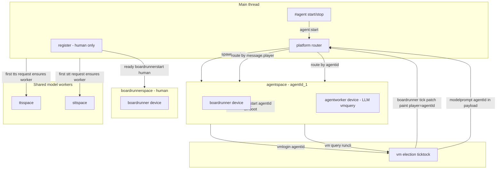

# Fix agent integration

**Status:** partial — **ttsspace** and **sttspace** on-demand workers implemented; **agentspace** and heavy retirement still open

## End state (completion criterion)

**There is no heavy worker.** When this plan is fully executed, [`createplatform`](../zss/platform.ts) must not spawn [`heavyspace`](../zss/heavyspace.ts). The monolithic heavy realm is gone.

### Final worker topology

| Worker | When started | Role |
|--------|--------------|------|
| **sim** / stub | `createplatform` | Game VM, election, gadget sync |
| **boardrunnerspace** | `createplatform` | Human operator boardrunner only |
| **agentspace** | `#agent start` / roster restore | One per running agent (boardrunner + LLM + lifecycle) |
| **ttsspace** | **On demand** — first `tts:info` / `tts:request` | Piper / Supertonic inference |
| **sttspace** | **On demand** — first mic / `stt:*` session | Moonshine ONNX STT (transformers.js) |
| ~~**heavyspace**~~ | never | **Deleted** |

**`createplatform` boot list:** sim + boardrunnerspace only. No heavy, no tts, no stt, no agents until requested.

Shared feature code under [`zss/feature/heavy/`](../zss/feature/heavy/) (models, prompts, `vmquery`, etc.) **stays** — it is library code imported by `agentworker`, not a worker itself.

### Decisions (confirmed)

| Topic | Choice |
|-------|--------|
| **LLM memory** | Each agentspace loads its own model on first prompt (RAM scales with agent count) |
| **Wire names** | Rename now: `agent:*`, `tts:*`, `stt:*` — no `heavy:*` aliases left |
| **TTS/STT lifecycle** | Stay alive for the session; terminate only on `sessionreset` / `haltplatform` |
| **Boardrunner election** | Keep current random pick among eligible players (no human preference) |
| **Shipping** | One effort — agentspace + retire heavy + on-demand tts/stt together |

---

## Diagnosis

Agent integration fails because responsibilities are split across three places that don't line up:

| Concern | Today | Problem |
|---------|-------|---------|
| Agent LLM + lifecycle | [`heavy.ts`](../zss/device/heavy.ts) + dynamic `agent_*` devices | Serial FIFO with TTS; logic disconnected from board execution |
| Board ticking | Single [`boardrunnerspace`](../zss/boardrunnerspace.ts) bound to **human** id on [`register:ready`](../zss/device/register.ts) | Agent elected as runner gets ticks addressed to agent id, but human worker filter rejects them ([`filter.ts`](../zss/device/boardrunner/filter.ts)) |
| Keepalive | [`register`](../zss/device/register.ts) `agentdootids` + `vmdoot` | Works, but orthogonal to boardrunner — doot alive but agent can't move |

Agent `#userinput` → [`boardrunner:input`](../zss/device/boardrunner/handlers/input.ts) hits the **human** worker; `playersonassignedboard` is only set after a successful tick on **that** worker ([`tick.ts`](../zss/device/boardrunner/handlers/tick.ts)). Off-board agents are dead on arrival.

---

## Target architecture

**One agent worker per agent.** Each worker is self-contained: boardrunner device + agent device (LLM, `vm:query`, doot). Starting an agent spawns a worker; stopping terminates it. No agent logic on any heavy hub — because heavy no longer exists.



### On-demand model workers (TTS + STT)

Same lazy pattern as agentspace, but **singleton** per type (not one per player):

- **`ensurettsworker()`** in [`platform.ts`](../zss/platform.ts) — spawn `ttsspace` on first TTS message; reuse thereafter
- **`ensuresttworker()`** — spawn `sttspace` on first STT session (terminal mic button)
- Rename emits: `tts:info` / `tts:request` ([`feature/tts.ts`](../zss/feature/tts.ts)); `stt:*` for mic ([`terminal/input.tsx`](../zss/screens/terminal/input.tsx))
- Platform routes to the worker only after `ensure*`; first message may queue until worker `ready`
- **`second` / `ready`** broadcast to tts/stt workers **only if spawned** (skip when undefined)
- **No idle teardown** — workers live until session end

### Worker contents

Each **agentspace** worker mirrors [`boardrunnerspace.ts`](../zss/boardrunnerspace.ts) but adds the agent layer:

```
agentspace.ts (per agent instance)
├── device/modem
├── device/boardrunner    (existing — unchanged handlers)
├── device/agentworker    (absorbs heavy.ts agent + LLM paths)
└── perf/perfreport
```

On worker init (`agentid`, `agentname`, `requestplayer`):

1. `boardrunnerstart(SOFTWARE, agentid)`
2. `vmlogin(SOFTWARE, agentid, { user, agent: 1 })`
3. Agentworker ready for prompts; **LLM model lazy-loads on first `agent:modelprompt`** (per-worker copy)

On worker teardown:

1. `vmpilotclear`, model stop
2. `vmlogout`
3. `worker.terminate()`

### What stays where

| Component | Location |
|-----------|----------|
| Human boardrunner | [`boardrunnerspace`](../zss/boardrunnerspace.ts), `register:ready` |
| Per-agent runtime | `agentspace` worker per agent |
| TTS | `zss/ttsspace.ts` (planned) — lazy start via `ensurettsworker()` |
| STT | `zss/sttspace.ts` (planned) — lazy start via `ensuresttworker()` |
| LLM presets | Applied per agentworker; `#agent model` broadcasts preset to all running agent workers |
| Roster persistence | IDB via register/main; restore spawns workers |
| Human doot | `register` `second` → `vmdoot(human)` |
| Agent doot | Each agentspace handles `second` → `vmdoot(agentid)` |

### Platform routing ([`platform.ts`](../zss/platform.ts))

`agentworkers: Map<string, Worker>` keyed by agent player id. **No `heavy` worker variable or listener.**

| Message | Route |
|---------|-------|
| `boardrunner:*` + `chip:*`, `message.player` = agent id | That agentspace worker |
| Same, `message.player` = human id | Human boardrunnerspace |
| `agent:modelprompt` | Route by agentid in payload → that agentspace |
| `agent:queryresult` | Agent worker matching `message.player` |
| `agent:pilotnotify` | Route by `data.agentid` |
| `agent:start` / `agent:stop` / `agent:restore` / `agent:llmpreset` | Platform coordinator or direct worker spawn |
| `tts:info` / `tts:request` | `ensurettsworker()` → ttsspace |
| `stt:*` | `ensuresttworker()` → sttspace |
| `second`, `ready` | Human boardrunnerspace + all agentspace workers + tts/stt **if running** |

**Election unchanged** — [`boardrunnerelect`](../zss/device/vm/boardrunnermanagement.ts) keeps random pick; agents with agentspace workers can be elected fairly.

Replace [`shouldforwardclienttoheavy`](../zss/device/forward.ts) with `shouldforwardtoagent` / `shouldforwardtotts` / `shouldforwardtostt`. Remove all `heavy` forward paths.

### Message rename map (`heavy:*` → new targets)

| Old | New |
|-----|-----|
| `heavy:modelprompt` | `agent:modelprompt` |
| `heavy:modelstop` | `agent:modelstop` |
| `heavy:queryresult` | `agent:queryresult` |
| `heavy:pilotnotify` | `agent:pilotnotify` |
| `heavy:agentstart` | `agent:start` |
| `heavy:agentstop` | `agent:stop` |
| `heavy:agentlist` | `agent:list` |
| `heavy:restoreagents` | `agent:restore` |
| `heavy:llmpreset` | `agent:llmpreset` |
| `heavy:syncuserdisplay` | `agent:syncuserdisplay` |
| `heavy:pullvarresult` | `register:pullvarresult` (main thread) |
| `heavy:ttsinfo` | `tts:info` |
| `heavy:ttsrequest` | `tts:request` |

---

## Implementation plan

**Single delivery** — Phases A–D ship together in one effort (no interim heavy-backed agent path).

### Phase A — Per-agent worker (primary fix)

**Goal:** `#agent start` spawns one agentspace worker; that worker runs boards and LLM for that agent.

1. **New files**
   - `zss/agentspace.ts` (planned)
   - `zss/device/agentworker.ts` (planned) — absorb from [`heavy.ts`](../zss/device/heavy.ts): `modelprompt`, `modelstop`, `pilotnotify`, `queryresult`, `llmpreset`, `executeclicommands`, per-worker job queue
   - Slim main-thread coordinator for roster list UI + IDB persist (from [`agentlifecycle.ts`](../zss/feature/heavy/agentlifecycle.ts))

2. **[`zss/platform.ts`](../zss/platform.ts)**
   - `startagentworker` / `stopagentworker` / `stopallagentworkers`
   - Route inbound messages by agent id
   - Human boardrunnerspace unchanged
   - **Do not add new dependencies on heavy worker** — agent paths skip heavy entirely

3. **CLI / API** ([`firmware/cli/commands/agent.ts`](../zss/firmware/cli/commands/agent.ts), [`api.ts`](../zss/device/api.ts))
   - Rename all `heavy:*` helpers to `agent:*` / `tts:*` per rename map above
   - `agent:start` → `platform.startagentworker`; `agent:stop` / `agent:restore` → platform
   - Delete [`feature/heavy/agent.ts`](../zss/feature/heavy/agent.ts) `createagent` device pattern

4. **[`zss/device/register.ts`](../zss/device/register.ts)**
   - Remove `agentdootids` / `register:agentdooton/off`
   - `acklogin` restore → `agent:restore` via platform spawns workers
   - `agent:llmpreset` on login → broadcast to all running agentspace workers

5. **Tests** — `platform.agentworker.test.ts`

### Phase B — Retire heavy worker (required, not optional)

**Goal:** Zero references to heavyspace in the running app.

1. **On-demand workers** (TTS + STT done; agentspace still planned)
   - `zss/ttsspace.ts` + `zss/device/ttsworker.ts` — **implemented**; TTS handlers moved from [`heavy.ts`](../zss/device/heavy.ts)
   - `zss/sttspace.ts` + `zss/device/sttworker.ts` — **implemented**
   - [`platform.ts`](../zss/platform.ts): `ensurettsworker()` / `ensuresttworker()` — lazy spawn on first message, not from `createplatform`

2. **Delete**
   - [`zss/heavyspace.ts`](../zss/heavyspace.ts)
   - [`zss/device/heavy.ts`](../zss/device/heavy.ts)
   - [`shouldforwardclienttoheavy`](../zss/device/forward.ts) / [`shouldforwardheavytoclient`](../zss/device/forward.ts) — replace with tts/stt/agent routing
   - `let heavy` and all `heavy.postMessage` / `heavymessages` listener in [`platform.ts`](../zss/platform.ts)

3. **Update call sites** (grep `heavy:`, `heavyspace`, `shouldforwardclienttoheavy`)
   - [`feature/tts.ts`](../zss/feature/tts.ts) → `tts:info` / `tts:request`
   - [`loader.ts`](../zss/device/vm/handlers/loader.ts), [`pilot.ts`](../zss/device/vm/handlers/pilot.ts), [`query.ts`](../zss/device/vm/handlers/query.ts) → `agent:*` targets
   - [`feature/storagepull.ts`](../zss/feature/storagepull.ts) → `register:pullvarresult`
   - [`cafe/sys/data.ts`](../cafe/sys/data.ts), forward tests, all docs

4. **Verify completion**
   - `createplatform` eagerly starts: **sim + boardrunner only**
   - ttsspace / sttspace / agentspace appear only after first use
   - No `import heavyspace` anywhere in build graph

### Phase C — Correctness inside agentworker

1. **`pilotnotify`** — feedback into prompt history or short reprompt
2. **Pilot input** — [`pilot.ts`](../zss/device/vm/handlers/pilot.ts) → `boardrunner:input`
3. **`promptlogging` / `lastinputtime`** — wire or remove from [`loader.ts`](../zss/device/vm/handlers/loader.ts)

### Phase D — Docs

- [`devices-and-messaging.md`](../zss/device/docs/devices-and-messaging.md): remove heavy worker section; document agentspace + tts + stt topology
- [`message-flow.md`](../zss/device/docs/message-flow.md), [`feature/docs/heavy.md`](../zss/feature/docs/heavy.md) → rename/reframe as agent feature modules (not a worker)
- [`zss/ARCHITECTURE.md`](../zss/ARCHITECTURE.md) if it references heavyspace

---

## What changes for the user

| Action | Before | After |
|--------|--------|-------|
| `#agent start foo` | `agent_*` on heavy | Spawns agentspace worker |
| `#agent stop id` | Ghost player | Logout + terminate worker |
| Agent on another board | Broken | Agent worker runs ticks |
| TTS | Blocks agent LLM in heavy FIFO | Independent ttsspace worker |
| Platform boot | sim + heavy + boardrunner | sim + boardrunner only |
| First TTS / mic STT | heavy FIFO | Lazy ttsspace / sttspace spawn |
| `#agent start` | — | Lazy agentspace spawn (per agent) |

---

## Risks

- **LLM memory per agent worker** — each agentspace loads its own Transformers.js session; document practical agent count guidance
- **TTS/STT model load** — first request pays spawn + model load cost; show `workstatus` while worker boots
- **Worker memory** — each agentspace holds jsonpipe boardrunner memory + LLM weights
- **Random election** — human and agent on same board may compete; both need matching workers to ack ticks
- **Chip routing** — `chip:*` by `message.player` to correct agentspace
- **Rename blast radius** — `heavy:*` grep must be zero before merge
