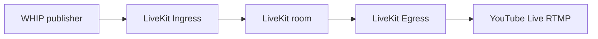

# LiveKit Ingress (WHIP) → YouTube Live

This note explains how **[LiveKit Ingress](https://github.com/livekit/ingress)** fits into a path from a **WHIP** publisher to **YouTube Live**, and what you must add beyond Ingress alone.

## What each piece does

| Piece | Role |
|--------|------|
| **WHIP publisher** | Camera app, OBS (WHIP), or custom client that sends WebRTC to Ingress over WHIP. |
| **[Ingress](https://github.com/livekit/ingress)** | Receives WHIP (or RTMP), transcodes as needed, and **joins a LiveKit room** as a participant publishing audio/video. |
| **LiveKit room** | Real-time SFU; holds the media after Ingress has published it. |
| **YouTube Live** | Expects **RTMP** ingest (`rtmp://…` + stream key), not WHIP. |
| **[LiveKit Egress](https://github.com/livekit/egress)** | Takes room or track composite output and **streams or records** to RTMP, file, HLS, etc. |

**Ingress does not push to YouTube.** For “WHIP into LiveKit, then out to YouTube,” you run **Ingress (WHIP in)** and **Egress (RTMP out)** against the same LiveKit deployment. See [Egress overview](https://docs.livekit.io/home/egress/overview/) and [outputs / streaming](https://docs.livekit.io/home/egress/outputs/).



## Prerequisites

- **LiveKit server** with **Redis** (same Redis for server, Ingress, and Egress in typical setups).
- **Ingress** reachable on a public hostname/IP for WHIP (and UDP for WebRTC where required); the [Ingress README](https://github.com/livekit/ingress/blob/main/README.md) recommends **host networking** for Docker when using WHIP.
- **Egress** service configured for your LiveKit project (LiveKit Cloud includes egress; self-hosted needs a running egress worker).
- **YouTube**: [Create a live stream](https://support.google.com/youtube/answer/2474026) and copy the **stream key**; RTMP URL is usually of the form `rtmp://a.rtmp.youtube.com/live2/` plus the key (YouTube’s UI shows the exact URL).

## 1. Configure LiveKit server for Ingress

On **livekit-server**, set `ingress` base URLs so `CreateIngress` can hand publishers a full WHIP URL (stream key is appended by the server). From the [Ingress README](https://github.com/livekit/ingress/blob/main/README.md):

```yaml
ingress:
  rtmp_base_url: rtmp://ingress.example.com/x
  whip_base_url: https://ingress.example.com/w
```

- Point these at your Ingress load balancer or instance (TLS on `whip_base_url` if you terminate HTTPS there).
- Open firewall ports Ingress uses (defaults: **1935** RTMP, **8080** WHIP in the sample config; WHIP/WebRTC may need **UDP** as well—follow Ingress and your cloud provider’s WebRTC guidance).

## 2. Run the Ingress service

Configure Ingress with the **same** `api_key`, `api_secret`, `ws_url`, and **Redis** as your LiveKit server (see [Ingress config](https://github.com/livekit/ingress/blob/main/README.md#config)).

Example skeleton:

```yaml
log_level: info
api_key: <LIVEKIT_API_KEY>
api_secret: <LIVEKIT_API_SECRET>
ws_url: wss://livekit.example.com
redis:
  address: redis.example.com:6379
```

Docker (illustrative; adjust for Linux vs macOS host addresses):

```bash
docker run --rm \
  -e INGRESS_CONFIG_BODY="$(cat config.yaml)" \
  -p 1935:1935 \
  -p 8080:8080 \
  --network host \
  livekit/ingress
```

On macOS with native GStreamer, the Ingress README notes setting `DYLD_LIBRARY_PATH` when using Homebrew builds.

## 3. Create a WHIP Ingress (room + publisher identity)

Use a **server SDK** or **[livekit-cli](https://github.com/livekit/livekit-cli)** `create-ingress` with `input_type` **1** for WHIP (0 = RTMP). Example request shape from the Ingress README:

```json
{
  "input_type": 1,
  "name": "youtube-bridge-whip",
  "room_name": "live-youtube",
  "participant_identity": "ingress-whip-1",
  "participant_name": "WHIP camera"
}
```

After creation, **list-ingress** (or the API) returns the **WHIP endpoint URL** your encoder should use. Paste that into a WHIP-capable publisher and start streaming; the Ingress participant should appear in the room.

## 4. Stream the room to YouTube (Egress)

Start an egress that sends **RTMP** to YouTube’s ingest URL. Exact API fields depend on your SDK version; conceptually you need a **room composite** (or track composite) egress with a **stream output** whose URL is:

`rtmp://a.rtmp.youtube.com/live2/<YOUR_STREAM_KEY>`

Treat the stream key as a **secret** (do not commit it; use env vars or a secrets manager).

Consult current docs for the request shape:

- [Egress API](https://docs.livekit.io/home/egress/api/)
- [Outputs / streaming options](https://docs.livekit.io/home/egress/outputs/)

## 5. Operational checklist

- **Latency:** WHIP → room → RTMP adds multiple hops; YouTube adds more. Expect multi-second end-to-end delay versus a direct OBS → YouTube RTMP setup.
- **Codec / quality:** Ingress transcodes for WebRTC compatibility; egress encodes again for RTMP. Bitrate and resolution should match YouTube’s [recommended encoder settings](https://support.google.com/youtube/answer/2853702).
- **If you only need YouTube:** Publishing **directly** from OBS or hardware encoders to YouTube RTMP is simpler and avoids LiveKit entirely.
- **If you need LiveKit + YouTube:** WHIP → **Ingress** → room → **Egress** → YouTube RTMP is the standard split.

## References

- [livekit/ingress](https://github.com/livekit/ingress) — WHIP/RTMP ingest into rooms.
- [livekit/egress](https://github.com/livekit/egress) — Room/track output including RTMP to YouTube.
- [LiveKit docs](https://docs.livekit.io) — Server, cloud, and API details.
- [ZSS in-app web broadcast → LiveKit](./web-broadcast-livekit.md) — migrating from Amazon IVS / Twitch-style ingest to LiveKit in the terminal broadcast flow.
