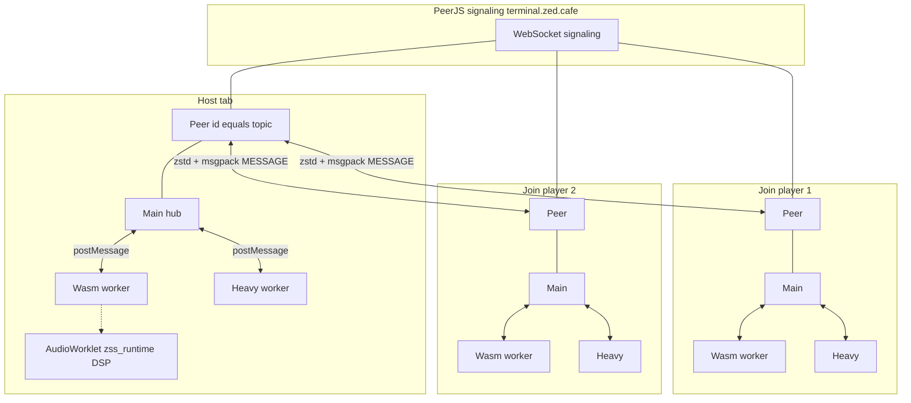
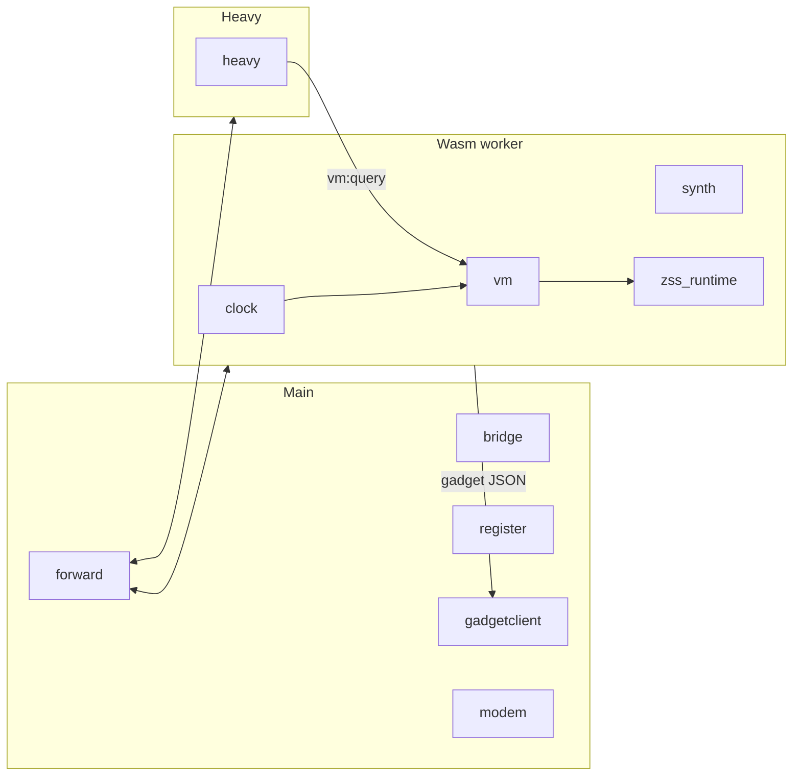
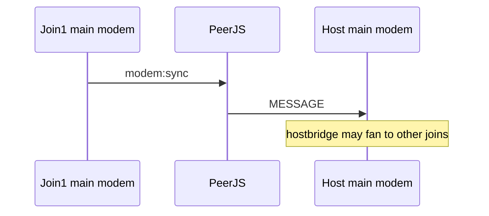
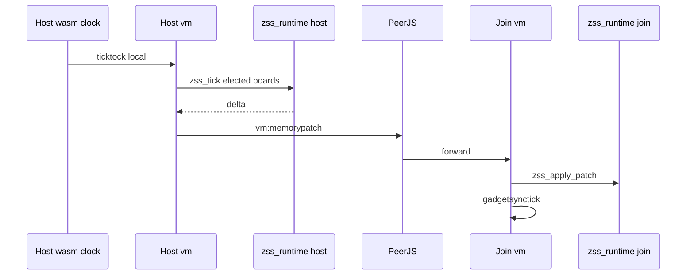
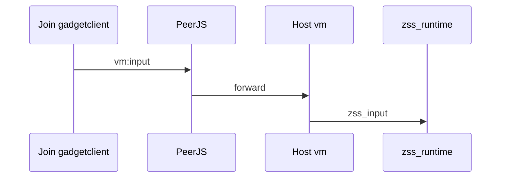
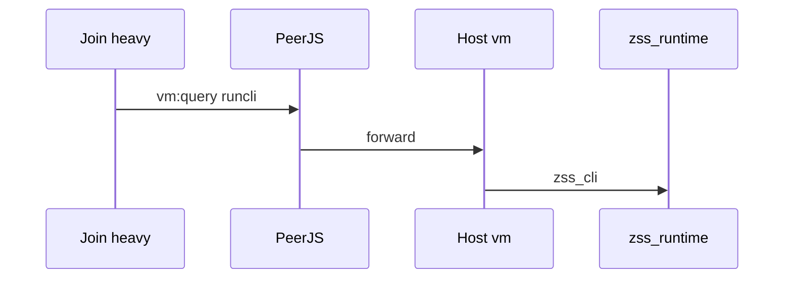

# Multiplayer, workers, PeerJS, and WASM runtime

**Status:** design / planning (target architecture). Describes **host + two join players** with devices per tab, messages over **PeerJS**, and how **`zss_runtime.wasm`** fits in.

**Parent plan:** [wasm-sim-port.md](wasm-sim-port.md)

**Code today:** [`zss/feature/netterminal.ts`](../zss/feature/netterminal.ts), [`zss/device/forward.ts`](../zss/device/forward.ts), [`zss/feature/peerzstdwire.ts`](../zss/feature/peerzstdwire.ts)

---

## Overview

- **Three browser tabs** = three **independent** runtimes (each: main + wasm worker + heavy worker + AudioWorklet).
- **Not** one shared WASM heap — each tab loads its own `zss_runtime.wasm`.
- **PeerJS** on the **main thread** links tabs (star: host peer id = **topic**, joins connect via `DataConnection`).
- **Host MAIN book game memory is authoritative**; joins apply **`vm:memorypatch`** from host (no legacy `boardrunnerpatch` on the wire).
- **`ticktock` never crosses PeerJS** — each tab clocks locally at 80ms.

---

## PeerJS topology (host + 2 joins)

### Session setup

| Role | API | Behavior |
|------|-----|----------|
| **Host** | `netterminalhost()` | Peer id becomes `subscribetopic`; `vmtopic(SOFTWARE, player, subscribetopic)` on host **vm** |
| **Join** | `netterminaljoin(hostPeerId)` | `peer.connect(hostPeerId)`; on open → `vmsearch` (login) |
| **Wire** | `encodepeerwire` / `decodepeerwire` | `MESSAGE` → msgpack → zstd → `Uint8Array` |

Signaling server: `terminal.zed.cafe:443` (see `peerserveroptions()` in `netterminal.ts`).

---

## Devices per player (target)

Each tab has **three hubs** ([`hub.ts`](../zss/hub.ts) per realm). WASM is **not** a hub device — [`wasm-bridge`](../zss/sim/wasm-bridge.ts) (planned) loads **`zss_runtime.wasm`**.

| Realm | TS hub devices | WASM / audio |
|-------|----------------|--------------|
| **Main** | `forward`, `register`, `bridge` (PeerJS), `gadgetclient`, `modem` (Yjs) | — |
| **Wasm worker** | `forward`, `clock`, `modem`, `vm` (shell), `synth` (coordinator) | `zss_runtime`: `zss_tick`, `zss_compile`, memory, VM, firmware |
| **Heavy worker** | `forward`, `heavy` | Transformers / ONNX / Vosk (not inside `zss_runtime`) |
| **AudioWorklet** | — | Same wasm bytes, `_zss_process` only |

### Intra-tab routing ([`platform.ts`](../zss/platform.ts) target)

- Main `forward` ↔ wasm worker `forward` ↔ heavy worker `forward`
- **No** boardrunner worker (retired)
- Peer messages arrive on **main** hub → `forward` routes to wasm / heavy per `shouldforward*`

---

## PeerJS bridges

[`handledataconnection`](../zss/feature/netterminal.ts) installs:

| Role | Filter | Sends when |
|------|--------|------------|
| **Host** | `shouldforwardonpeerserver` + `shouldforwardservertoclient` | Host hub → join DataConnection |
| **Join** | `shouldforwardonpeerclient` + (`shouldforwardclienttoserver` or wasm routing) | Join hub → host DataConnection |

Incoming `data`: decompress → `MESSAGE` → `topicbridge.forward` → local main hub.

### Never on PeerJS

| Direction | Blocked |
|-----------|---------|
| Host → peer | `ready`, `ticktock` |
| Join → peer | `ready`, `second`, `ticktock` |

---

## Message catalog (target wire names)

Payload: `{ session, player, id, sender, target, data }`.

### Join → Host

| Target | Purpose | Host routes to |
|--------|---------|----------------|
| `vm:*` | Input, CLI, login, admin, … | Wasm **vm** |
| `chip:*` | Chip messages | Wasm worker |
| `modem:sync` | Yjs CRDT update (hex) | Main + wasm **modem** |
| `modem:joinack`, `joinack` | Initial collaborative doc | Main **modem** |
| `desync` | Memory resync | Wasm **vm** |
| `vm:memorypatch`, `vm:input`, … | Game ops | Host wasm **vm** (authoritative) |

On connect: **`vmsearch`**.

### Host → Join

| Target | Purpose | Join routes to |
|--------|---------|----------------|
| `log`, `chat`, `toast` | UI | Main / terminal |
| `gadgetclient:*` | Render layers | Main **gadgetclient** |
| **`vm:memorypatch`** | jsonpipe ops from host sim | Join wasm → `zss_apply_patch` |
| **`vm:memorypaint`** | Full resync | Join wasm **vm** |
| `modem:joinack`, `joinack`, `modem:sync`, `modem:awareness` | Yjs + presence | Main **modem** |

**Renamed from today:** `vm:boardrunnerpatch` → **`vm:memorypatch`**, `vm:boardrunnerpaint` → **`vm:memorypaint`**. **No legacy aliases.**

Filters today (pre-rename): [`shouldforwardonpeerserver`](../zss/device/forward.ts), [`shouldforwardonpeerclient`](../zss/device/forward.ts), [`shouldforwardservertoclient`](../zss/device/forward.ts), [`shouldforwardclienttoserver`](../zss/device/forward.ts).

---

## Sequence diagrams

### A. Collaborative editor (Yjs / modem) — all peers

### B. Game memory (host authoritative)

Join runs **local** `zss_tick` only for boards **this tab is elected** to run; otherwise patch-only.

### C. Join input → host sim

### D. Join heavy agent → host CLI

---

## WASM integration (3 tabs)

| Concern | Behavior |
|---------|----------|
| Instances | 3× `zss_runtime.wasm`, isolated memory |
| Authority | **Host** MAIN book; joins via **`vm:memorypatch`** |
| Ticks | Local `ticktock` only; not on peer wire |
| Election | TS [`boardrunnermanagement`](../zss/device/vm/boardrunnermanagement.ts) on **vm** — which tab may execute elected boards |
| Compiler | Per-tab wasm **`zss_compile`** (C++ re2c pipeline) |
| Synth | Per-tab AudioWorklet + wasm **synth** coordinator |

---

## Today vs target (workers)

| | Today | Target |
|---|-------|--------|
| Workers | sim + boardrunner + heavy | wasm + heavy |
| Board tick | boardrunner worker `memorytickmain` | `zss_tick` in wasm worker |
| Peer patch name | `vm:boardrunnerpatch` | **`vm:memorypatch`** |
| Host authority | De facto via host runner + patches | **Explicit** host `zss_runtime` |

---

## Code anchors

| Concern | File |
|---------|------|
| Peer host/join | `zss/feature/netterminal.ts` |
| Forward filters | `zss/device/forward.ts` |
| Wire codec | `zss/feature/peerzstdwire.ts` |
| Multiplayer CLI | `zss/firmware/cli/commands/multiplayer.ts` → **bridge** |
| Election | `zss/device/vm/boardrunnermanagement.ts` |
| Memory patches (today) | `zss/device/vm/boardrunnermemorysync.ts` |
| Worker wiring | `zss/platform.ts` |
| Net terminal docs | `zss/feature/docs/netterminal.md` |

---

## Testing (planned)

- **Playwright:** 3 browser contexts (host + 2 joins), optional slow CI job
- **Unit:** mock PeerJS; test `vm:memorypatch` apply on join wasm
- **Golden:** host tick → patch bytes → join state JSON
