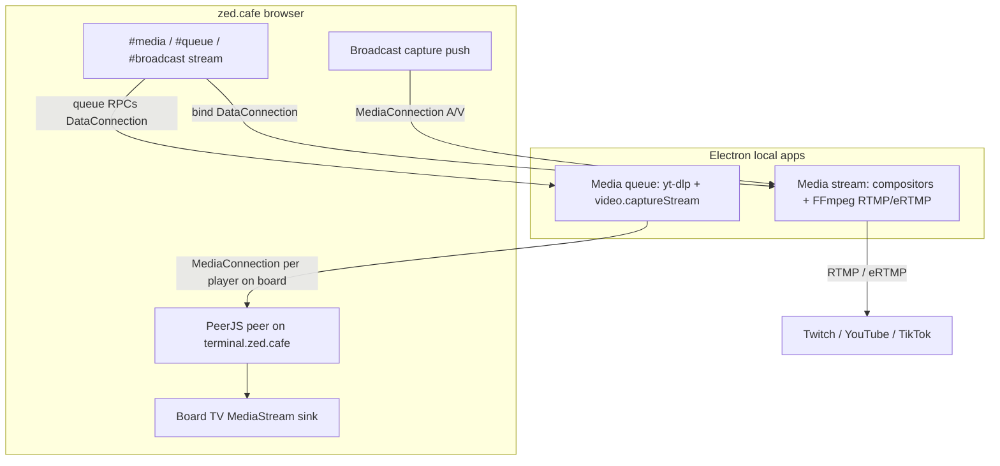

**Purpose:** Ship cafe's **media-queue** and **media-stream** helpers as local **Electron** desktop apps. Cafe stays a website; helpers ship as local binaries on GitHub Releases.

**Status:** Electron is the desktop stack for both helpers. Media-queue + cafe `#media` / `#queue` / board TV live under [`ops/media-queue/`](../media-queue/README.md). Media-stream multi-destination broadcast lives under [`ops/media-stream/`](../media-stream/README.md) and [`zss/feature/mediastream/`](../../zss/feature/mediastream/docs/README.md).

## Product shape

| Helper | Job | Cafe side |
|--------|-----|-----------|
| **Media queue** (Electron) | yt-dlp download + local playback; answers player `MediaConnection`s | `#media` queue list; `#queue` admin menu; **board TV** sink |
| **Media stream** (Electron) | Twitch eRTMP + YouTube/TikTok RTMP; Dual Format crop; live/VOD buses | `#broadcast stream <peerid>`; `#broadcast stop`; capture push on Start |

The helpers ship as Electron apps on GitHub Releases (`v*` tags).



## Why Electron

- **Chromium** provides `HTMLVideoElement.captureStream()` for media-queue WebRTC (WKWebView on Tauri macOS does not).
- Playback path: download MP4 → `<video>.play()` → `video.captureStream()` → PeerJS.

## Media-queue helper

1. Register a Peer on `terminal.zed.cafe` (same PeerServer as [`netterminal.ts`](../../zss/feature/netterminal.ts)).
2. Cafe `#media <url>` and `#queue` admin commands are RPCs over a **DataConnection** (control plane). The helper owns the FIFO and per-player limit in `userData/queue.json`. `#queue <peerid>` bind writes the helper peer id onto the bound board as a synced gadget MEDIA layer (`text/mediaqueue-helper`). After a signaling drop, cafe re-dials the helper data connection and player `MediaConnection`s; the helper does not stop playback when the control plane closes.
3. On queue advance **in the helper**, it runs **yt-dlp** into a local cache file, plays it in Chromium, and publishes **`video.captureStream()`** to each player tab that calls the helper via **`MediaConnection`** (host admin and joins use the same path).
4. Leaving the bound board tears down the player call and board TV sink (video + speaker audio).

## Build / dev

```bash
yarn task run mediaqueue:build:desktop
yarn task run mediaqueue:dev
yarn task run mediastream:build:desktop
yarn task run mediastream:dev
```

Installers land under `ops/media-queue/dist/` and `ops/media-stream/dist/` (electron-builder).

## Explicitly out

| Approach | Why out |
|----------|---------|
| WHEP / tape overlay / Chromium sidecar | Wrong UX for board TV; PeerJS is the cafe clique |
| Cloudflare Worker / yt-dlp | Cannot run PeerJS media in a Worker |
| Cafe itself as a desktop app | Product stays https://zed.cafe |
| Canvas re-capture on macOS | Replaced by Electron `video.captureStream()` |

## Related

- Media queue: [`ops/media-queue/`](../media-queue/README.md)
- Media stream: [`ops/media-stream/`](../media-stream/README.md)
- PeerJS baseline: [`zss/feature/docs/netterminal.md`](../../zss/feature/docs/netterminal.md)
- Windows signing: [`desktop-signing.md`](desktop-signing.md)
