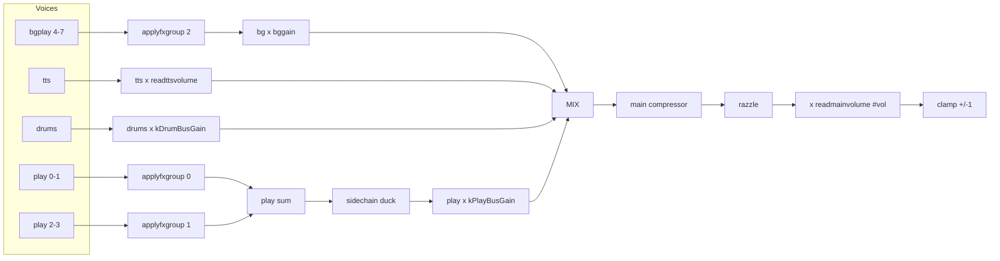

Canonical inventory for the active WASM/Daisy synth. For routing narrative see
[audiochain.md](audiochain.md); for FX bus law see [parallel-fx-bus.md](parallel-fx-bus.md).

## Signal chain



**Naming trap:** `#vol` / `playvolume` is the **post-chain master fader** (`readmainvolume()`),
not a trim on the play bus into the mix. Play stem level is fixed at `kPlayBusGain`.

## User faders (SAB `zss_main`, 0-100)

Defined in [`wasmmainsab.ts`](../backend/wasm/wasmmainsab.ts). Mute floor: raw `<= 0.001` -> gain `0`.

| Control | SAB slot | Default | dB law | Linear @ default | Notes |
|---------|----------|---------|--------|------------------|-------|
| `#vol` / playvolume | PLAY (0) | **50** | `20*log10(vol*0.25) + kMainFaderOffsetDb` | ~**0.22** @ offset -35 | Master after razzle |
| `#bgvol` / bgplayvolume | BGPLAY (1) | **50** | `20*log10(vol) - 35` | ~**0.89** | bgplay stem |
| `#ttsvol` / ttsvolume | TTS (2) | **100** | same as bg | ~**1.78** | TTS sample level |
| Voice `vol` | voice cfg | **0 dB** | `dbtoamp(vol_db)` | **1.0** | Per-voice via `#synthN` |

CLI: [`zss/firmware/audio.ts`](../../../firmware/audio.ts) (`#vol`, `#bgvol`, `#ttsvol`).

## Master / bus constants (`zss_config.h`)

Parity-tuned values -- change only with `yarn task run ops:daisy:*:calibrate` or intentional re-tune.

| Constant | Value | Controls |
|----------|-------|----------|
| `kMainFaderOffsetDb` | **-35** | Added to play fader dB law |
| `kPlayBusGain` | **0.238** | Fixed play stem into mix |
| `kDrumBusGain` | **2.440** | Drum stem (calibrate: `ops:daisy:play-drum-balance:calibrate`) |
| `kVoiceOutGain` | **1.0** | Post-FX voice output |
| `kScMakeupDb` | **24** | Sidechain makeup |
| `kScMix` | **0.75** | Duck depth (idle play boost ~12x with makeup) |
| `kScAttackSec` / `kScReleaseSec` | 0.005 / 0.06 | Sidechain timing |
| SC key trims | bg/tts **-12 dB**, drums **-28 dB** | Key bus only (`zss_main.cpp`) |
| `kMainCompThresholdDb` | **-28** | Main compressor |
| `kMainCompRatio` | **4** | |
| `kMainCompKneeDb` | **30** | |
| `kMainCompMix` | **0.55** | Parallel GR |
| `kMainCompAttackSec` / `kMainCompReleaseSec` | 0.003 / 0.15 | |
| `kRazzleVibratoWet` | **0.02** | Post-comp bed |
| `kRazzleChorusWet` | **0.3** | |
| `kRazzleHissGain` | **0.001** | |

SAB bypass slots: COMP_BYPASS (3), SC_BYPASS (4) for offline A/B.

## FX return bus (multi-FX)

Bus law (`zss_fx.cpp` `applyfxgroup`):

```text
out = dry + compress( (Sigma send_i * contribution_i) * kFxReturnWetTrim )
```

| Knob | Value | File | Notes |
|------|-------|------|-------|
| `#fx on` vibrato, autofilter | send preset **50** (~0.89 linear) | `wasmfxstate.ts` | Tone archive match |
| `#fx on` echo, reverb, fc, distort, autowah | send preset **18** (~0.32 linear) | same | Tone archive match |
| `#fx 0-100` | `10^((20*log10(v)-35)/20)` | same | Player send |
| `kFxReturnWetTrim` | **1.4** | `zss_config.h` | After wet sum |
| `kReverbPostGain` | **1.5** | `zss_config.h` | `tanh(wet * gain)` |
| FX return comp | **-24 dB / 4:1 / knee 6** | `zss_config.h` | On wet only |
| Distortion drive | **dry x 3** | `zss_fx.cpp` | Into Overdrive |
| Echo feedback default | **0.666** (clamp 0-0.95) | `wasmfxstate.ts` | |
| Reverb decay default | **2.5** | same | |

**Multi-FX loudness:** FX are parallel sends on **full dry**. Each enabled send adds wet energy; dry is never attenuated. Stacking echo+reverb+distort raises peak/RMS until return comp and main comp catch it.

## Per-voice / drum trims (`zss_config.h`)

| Constant | Value | Voice / use |
|----------|-------|-------------|
| `kSineVoiceGain` | 1.42 | Sine |
| `kAlgoOpGain` | ~0.316 (-10 dB) | Algo ops |
| `kAlgoOutGain` | 0.18 | Algo out |
| `kNoiseVoiceGain` | 21 | Noise (with `kNoiseBaseExpr` 0.19) |
| `kLfsrVoiceBoost` | 2.5 | Non-soft chip |
| `kStringMachineGain` / `kStringPluckGain` | 0.42 / 0.38 | String |
| `kWindVoiceGain` | 0.38 | Wind |
| `kPianoVoiceGain` | 0.34 | Piano |
| `kTimpaniVoiceGain` | 0.42 | Timpani |
| `kBowedVoiceGain` / `kGuitarVoiceGain` | 0.36 | Bowed / guitar |
| `kOrganVoiceGain` | 0.32 | Organ |
| `kDrumTickTrim` / `kDrumTweetTrim` | 1.35 / 1.25 | Hi-hat family |
| `kDrumGains[12]` | 0.24-0.42 | Per drum digit |

Default per-voice volume dB: **0** (`wasmvoicecfgsab.ts` `DEFAULT_WASM_VOICE_VOLUME_DB`).

## Web Audio shell

| Stage | Gain | File |
|-------|------|------|
| Worklet -> destination | unity | `daisyengine.ts` |
| Broadcast tap | `GainNode = 1` | same |
| TTS into worklet | `GainNode = 1` | level in WASM `readttsvolume` |

## What to tweak when

| Symptom | First knobs | Calibrate task |
|---------|-------------|----------------|
| Too loud at boot | `kMainFaderOffsetDb`, `WASM_DEFAULT_PLAY_VOLUME` | -- |
| Multi-FX pile-up | `#fx on` presets, `kFxReturnWetTrim` | `ops:daisy:level-stability:test:fxmatrix` |
| Play vs drums balance | `kPlayBusGain`, `kDrumBusGain` | `ops:daisy:play-drum-balance:calibrate` |
| Idle play too hot | `kScMakeupDb`, `kScMix` | `ops:daisy:sidechain:parity:calibrate` |
| Player quick trim | `#vol`, `#bgvol`, `#ttsvol`, `#fx N` | -- |

## Legacy / not live Daisy

[`wasmlevels.ts`](../backend/wasm/wasmlevels.ts) exports Tone-parity constants (`WASM_PLAY_BUS_GAIN`, `WASM_DRUM_BUS_GAIN`, etc.) for archived Maxi/Tone math -- **not** the live Daisy bus gains in `zss_config.h`.
