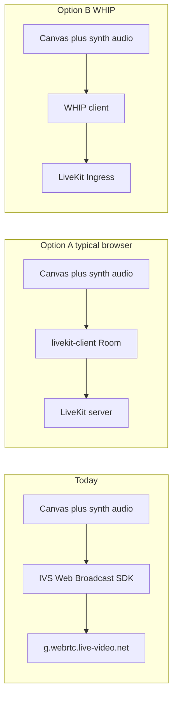

# Web broadcast → LiveKit migration (ZSS)

How the in-app **stream broadcast** works today, why you cannot aim it at LiveKit by changing a URL alone, and what to change for a LiveKit-based path.

## Current behavior

The terminal **`#broadcast`** command (operator-only, via bridge permissions) starts and stops a browser-side stream built from:

- **Video:** the page’s main **`canvas`** element.
- **Audio:** [`synthbroadcastdestination()`](../zss/feature/synth/audiochain.ts) (Tone/Web Audio routed into a `MediaStreamDestination`).

Implementation lives in [`zss/device/bridge.ts`](../zss/device/bridge.ts) on messages `bridge:streamstart` / `bridge:streamstop`. The client is **[Amazon IVS Web Broadcast](https://www.npmjs.com/package/amazon-ivs-web-broadcast)** (`amazon-ivs-web-broadcast`). After attaching sources, it calls:

```ts
startBroadcast(streamKey, 'https://g.webrtc.live-video.net:4443')
```

That host is **Amazon IVS WebRTC ingest** (the same ecosystem Twitch uses for that ingest path). It is **not** a generic WHIP URL you can repoint.

The firmware surfaces a **single string** today:

- [`bridgestreamstart` / `bridgestreamstop`](../zss/device/api.ts) emit `bridge:streamstart` with the ingest authorization / **stream key** string.
- [`zss/firmware/cli/commands/multiplayer.ts`](../zss/firmware/cli/commands/multiplayer.ts) wires `#broadcast [streamkey]` to those APIs.

## Why a URL swap is not enough

The IVS SDK performs **IVS-specific** signaling and session setup with `g.webrtc.live-video.net`. LiveKit expects either:

1. **Room join** — WebRTC to your LiveKit server using an **access token** (typical browser path: [`livekit-client`](https://github.com/livekit/client-sdk-js)), or  
2. **WHIP** — An HTTP offer/answer exchange against a URL returned by LiveKit **`CreateIngress`** when using [LiveKit Ingress](https://github.com/livekit/ingress).

Neither is “drop in the same second argument as IVS `startBroadcast`.”

## Two viable LiveKit directions



### Option A: Publish as a room participant (`livekit-client`)

Connect to `wss://…` with a **JWT access token** that grants `canPublish` (and room join). Publish:

- **Video** from the canvas (e.g. `canvas.captureStream()` or APIs your version of `livekit-client` supports for custom video).
- **Audio** from the `MediaStream` produced by the existing broadcast destination node.

**Ingress is not required** for this path in the browser—the browser is a normal LiveKit client. You still need a **token minting** story (small backend, LiveKit CLI for manual ops, or cloud project patterns). Do not embed API secrets in the client.

### Option B: WHIP → Ingress

Your backend calls **`CreateIngress`** with `input_type` WHIP; LiveKit returns a **WHIP endpoint URL**. The browser replaces the IVS SDK with a **WHIP client** that exchanges SDP with that URL. Media still comes from the same canvas + synth audio sources, but encoding/signaling goes through WHIP instead of IVS.

This aligns with server-side Ingress setup and with multi-hop flows such as [LiveKit Ingress WHIP → YouTube Live](./livekit-ingress-whip-youtube-live.md) (room → egress → RTMP).

## CLI and API shape (when you implement)

Today: **`streamkey: string`** only.

LiveKit will usually need more structured input, for example:

| Approach | What the operator or app must supply |
|----------|--------------------------------------|
| Room publish | LiveKit **WebSocket URL** + **access token** (short-lived JWT); optional room name if not embedded in the token. |
| WHIP / Ingress | **WHIP URL** from `CreateIngress` (often created per session on the server); possibly no separate “stream key” in the IVS sense. |

Consider extending `bridgestreamstart` to accept an object (while keeping a legacy string path for IVS if you support both), or reading defaults from environment / build-time config for the LiveKit URL with secrets only on the server.

## Files to touch (implementation checklist)

| Area | File | Notes |
|------|------|--------|
| Broadcast runtime | [`zss/device/bridge.ts`](../zss/device/bridge.ts) | Replace or branch off IVS; rename or generalize `broadcastivsconnection` and status text (`ivs=` → neutral connection state). |
| Dependencies | [`package.json`](../package.json) | Add `livekit-client` (Option A) and/or a WHIP helper for Option B; remove `amazon-ivs-web-broadcast` if IVS is fully dropped. |
| Public bridge API | [`zss/device/api.ts`](../zss/device/api.ts) | Extend `bridgestreamstart` payload if you pass token + URL or WHIP URL. |
| CLI | [`zss/firmware/cli/commands/multiplayer.ts`](../zss/firmware/cli/commands/multiplayer.ts) | `#broadcast` argument parsing for the new shape. |
| Docs after behavior exists | [`zss/firmware/docs/commands.md`](../zss/firmware/docs/commands.md), [`zss/device/EXPORTED_FUNCTIONS.md`](../zss/device/EXPORTED_FUNCTIONS.md) | Describe `#broadcast` / `bridgestreamstart` for LiveKit. |

## Security

- Treat **IVS stream keys**, **LiveKit tokens**, and **WHIP URLs** as secrets: short-lived tokens, server-side minting, never commit keys into the repo or shell history where avoidable.
- **CORS and TLS:** Browser publishing requires a **secure context** for real media APIs; production LiveKit is typically `wss://` with valid certificates.

## Related docs

- [LiveKit Ingress (WHIP) → YouTube Live](./livekit-ingress-whip-youtube-live.md) — Ingress, egress, and YouTube RTMP.
- [livekit/ingress](https://github.com/livekit/ingress) — WHIP/RTMP ingest into rooms.
- [LiveKit client SDK (JS)](https://github.com/livekit/client-sdk-js) — Browser room connection and track publish.
- [LiveKit docs](https://docs.livekit.io) — Tokens, server configuration, and APIs.
