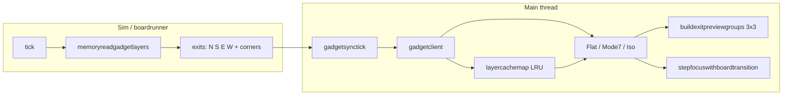
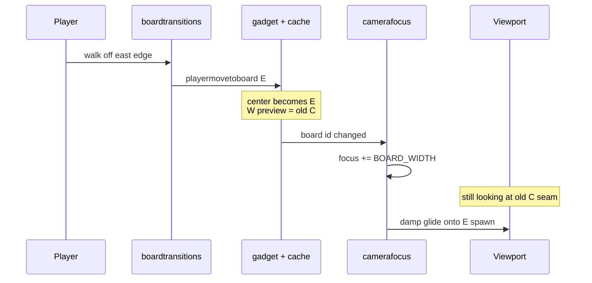
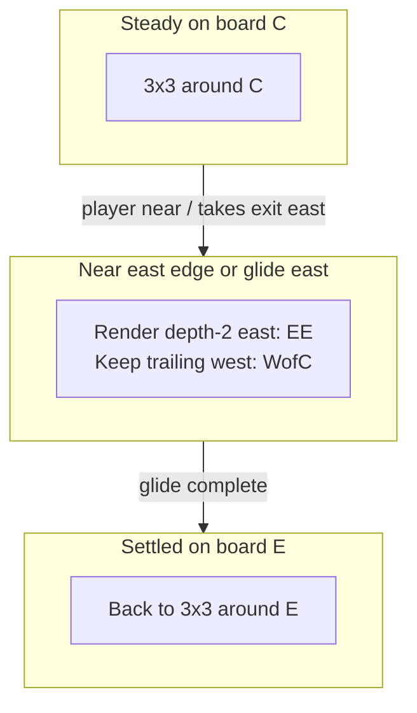
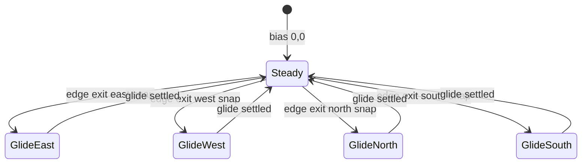

# Design: directional board-grid pan

**Status:** planned (not implemented)  
**Goal:** Extend the existing 3×3 exit-preview grid with one extra column or row in the travel direction during edge-exit camera glides, so the pan never hits void. Build on `buildexitpreviewgroups` + `stepfocuswithboardtransition` — no new camera system.

**Default:** Keep today’s edge-exit glide. During (and just before) a cardinal board change, render **one extra board in the travel direction** (depth-2) so the camera frustum always has tiles under it. Do **not** always render a full 5×5.

## Implementation checklist

- [ ] Add cardinal depth-2 exit id resolution and plumb onto `MEMORY_GADGET_LAYERS` / `GADGET_STATE`
- [ ] Track travel `GridBias` in camerafocus for the edge-glide lifetime (set on `shouldsnap`, clear when settled)
- [ ] Extend `buildexitpreviewgroups` to place ±2 board offsets when bias is non-zero
- [ ] Pass bias from flat/mode7/iso into the preview builder
- [ ] Unit tests for depth-2 positions, bias set/clear, and exit id walk

## What you have today

Boards are **not** co-simulated. The client draws a **3×3 visual window**: live current board at origin + up to 8 exit previews from `layercachemap` (or fog).



Layout (centers = board origins in draw space):

```text
        NW          N          NE
     (-W,-H)     (0,-H)     (+W,-H)

        W           C           E
     (-W, 0)      (0,0)      (+W, 0)

        SW          S          SE
     (-W,+H)     (0,+H)     (+W,+H)
```

Exit walk today ([`boardcornerexits.ts`](../../zss/memory/boardcornerexits.ts) + [`rendering.ts`](../../zss/memory/rendering.ts)):

- Cardinals: `board.exitnorth|south|west|east`
- Diagonals: two-step walk (`N→E` vs `E→N`); disputed → `CORNER_EXIT_DISPUTED`
- **No depth-2** (east-of-east, etc.) — that is the gap for a long glide

Camera already glides on edge hops ([`camerafocus.ts`](../../zss/gadget/graphics/camerafocus.ts)): on board id change, if focus delta is one edge wrap, offset `focus` by ±`BOARD_WIDTH`/`HEIGHT` and bump `focussmooth` to `FOCUS_GLIDE_RATE`.



## Why an "extra side" helps

Yes — **direction-biased overscan**, not a permanent bigger grid.

When you exit **C → E**, the coordinate origin snaps so **E is center** and **C is west**. Mid-glide the viewport straddles C and E. If zoom/frustum sees past E’s far edge, today’s 3×3 only has E’s immediate east — often enough — but the **failure mode** is:

1. **Approach / long glide / zoomed out:** you need **EE** (east-of-east) before or as you commit east.
2. **After snap:** old far-west of C (`W` of C) drops out of the new 3×3; a slow glide that still shows that side hits void unless you keep a **trailing** depth-2 board behind.

```text
Travel EAST — extend one column ahead (and keep one behind)

Before (3x3 on C):          During glide (biased window):
  NW  N  NE                   WofC  C   E   EE
   W  C   E                   ...  ... ... ...
  SW  S  SE

Only the travel axis gains depth-2; perpendicular stays ±1.
```



## Concrete approach

### 1. Resolve depth-2 exit ids (sim → gadget)

Extend the exit payload produced in [`memoryreadgadgetlayers`](../../zss/memory/rendering.ts) (or a small sibling next to [`boardcornerexits.ts`](../../zss/memory/boardcornerexits.ts)) with **axis depth-2** ids only when useful:

| Field (example) | Meaning |
|---|---|
| `exiteast2` | `exiteast` board’s `exiteast` |
| `exitwest2` | west-of-west |
| `exitnorth2` / `exitsouth2` | same for N/S |

Corners at depth-2 (ENE, ESE, …) only if the frustum actually needs them for your zoom levels; start with **cardinal depth-2 only** to stay lazy.

Ship these on `MEMORY_GADGET_LAYERS` / `GADGET_STATE` the same way as today’s eight exits (keep naming `lowercaseoneword` segments).

### 2. Directional preview builder (client)

Evolve [`buildexitpreviewgroups`](../../zss/gadget/graphics/exitpreviewgroups.ts) (or a thin wrapper) to accept a **bias**:

```typescript
type GridBias = { dx: -1 | 0 | 1; dy: -1 | 0 | 1 }
```

- `bias = {0,0}` → today’s 3×3
- `bias = {1,0}` (going east) → also place `exiteast2` at `(+2 * BOARD_WIDTH * drawwidth, 0)` and optionally keep west-of-west at `-2W` while bias is active
- Same for N/S

Call sites: [`flat.tsx`](../../zss/gadget/graphics/flat.tsx), [`mode7.tsx`](../../zss/gadget/graphics/mode7.tsx), [`iso.tsx`](../../zss/gadget/graphics/iso.tsx) (FPV still out of scope unless you later wire the same helper).

### 3. When to set bias (camera owner)

Own this next to [`stepfocuswithboardtransition`](../../zss/gadget/graphics/camerafocus.ts) — do **not** add a second camera system:

1. On edge-exit snap (`shouldsnap === true`): set bias from `sign(dx)` / `sign(dy)`.
2. Clear bias when `|focus - tfocus|` is small / `focussmooth` back near `FOCUS_ANIM_RATE` (glide settled).
3. Optional later: set bias when player is within N cells of an edge **before** exit (anticipatory pan). Not required for the first cut — edge-snap + depth-2 already removes mid-glide void.



### 4. Cache continuity

Previews still come from [`layercachemap`](../../zss/gadget/data/zustandstores.ts). Depth-2 only helps if EE was visited (or you accept fog via [`resolveexitpreview`](../../zss/gadget/graphics/exitpreviewresolve.ts)). First cut: **same fog rules** as neighbors — no live neighbor sim, no fallback fake boards.

Warming: when bias turns on, looking up `exiteast2` in cache is enough; if missing, fog placeholder (existing path).

### 5. What not to do

- No new notify/sync layer for “multi-board live render”
- No always-on 5×5 (cost + empty fog noise)
- No change to [`boardtransitions.ts`](../../zss/memory/boardtransitions.ts) / playermove ownership — only **what** is drawn beside the live board and **how far** focus glides
- Do not use dynamic imports or fallbacks to paper over missing exit ids — resolve depth-2 from the same exit fields as depth-1

## Primary files

| File | Change |
|---|---|
| [`zss/memory/boardcornerexits.ts`](../../zss/memory/boardcornerexits.ts) or new leaf `boarddepth2exits.ts` | Resolve cardinal depth-2 ids |
| [`zss/memory/rendering.ts`](../../zss/memory/rendering.ts) + gadget types | Plumb `exit*2` onto gadget layers |
| [`zss/gadget/graphics/exitpreviewgroups.ts`](../../zss/gadget/graphics/exitpreviewgroups.ts) | Place depth-2 groups when biased |
| [`zss/gadget/graphics/camerafocus.ts`](../../zss/gadget/graphics/camerafocus.ts) | Expose/set travel bias for the glide lifetime |
| `flat.tsx` / `mode7.tsx` / `iso.tsx` | Pass bias into preview builder |
| Unit test next to existing boundary/camera evidence tests | Bias on snap; depth-2 position math; bias clear after settle |

## Visual mental model (east exit)

```text
Frame A — on C, nearing east edge (steady 3x3)
[ W ][ C* ][ E ]

Frame B — snap: center becomes E, focus offset +W, bias=+east
        camera still sees C|E seam
[ C ][ E* ][ EE ]   ← EE is the "extra side"

Frame C — mid glide (camera moving toward E spawn)
[ C ][ E* ][ EE ]   ← frustum always filled

Frame D — settled; bias cleared
[ C ][ E* ][ EE→ now just E's normal east slot ]
```

## Success criteria

- Cardinal edge exit: camera glides without void beyond the destination far edge at mid/far zoom
- Steady play: still a 3×3 (no permanent 5×5 cost)
- Diagonal previews unchanged unless you later add depth-2 diagonals
- `#goto` / non-edge moves remain non-gliding (existing `shouldsnap` false) unless a follow-up teaches bias from an explicit transition hint
