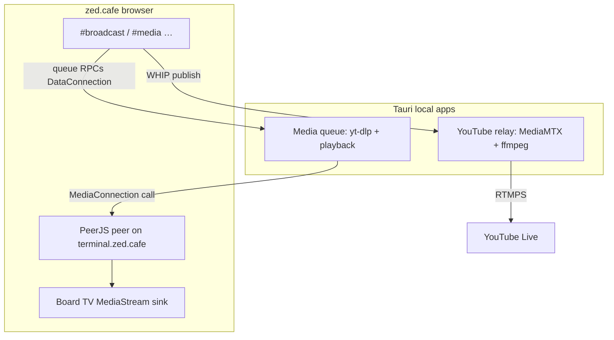

**Purpose:** Ship cafe's **local desktop helpers** on **[Tauri v2](https://v2.tauri.app/)**, not Electron. One stack covers (1) the existing **YouTube WHIP→RTMPS relay** and (2) the **media-queue helper** that PeerJS-calls cafe. Cafe stays a website; helpers stay local binaries on GitHub Releases.

**Status:** Tauri v2 is the desktop stack for both helpers. Media-queue Tauri app + cafe `#media` CLI menu / board TV receive path live under [`ops/media-queue/`](../media-queue/README.md) and [`zss/feature/mediaqueue/`](../../zss/feature/mediaqueue/docs/README.md). Inbound media uses **PeerJS `MediaConnection`**, not WHEP.

## Product shape

| Helper | Job | Cafe side |
|--------|-----|-----------|
| **YouTube relay** (Tauri) | Accept WHIP from cafe, push RTMPS to YouTube; hold stream key + bearer | `#broadcast whip youtube <bearer>` |
| **Media queue** (Tauri) | yt-dlp download + local playback, `peer.call(cafePeerId, stream)` | `#media` CLI menu; Peer answers; **board TV** sink -- **no tape overlay** |

Both ship as Tauri apps (same Releases channel as headless / current relay). Prefer **shared Tauri crate / packaging conventions** under `ops/` so tray, TLS trust, and `tauri build` stay one path -- not a second Electron family.

## Why Tauri for both

- The YouTube relay never needed Chromium; Electron was only tray + settings + process spawn. Tauri does that with a smaller shell; MediaMTX/ffmpeg remain the heavy bits either way.
- The media-queue helper is a small control UI + PeerJS + subprocess download. Tauri for **both** keeps one desktop toolchain (Rust + webview UI).
- Media queue uses **local yt-dlp + ffmpeg + deno** (bundled binaries, same vendor pattern as the relay) and `HTMLVideoElement.captureStream()` for WebRTC -- no ScreenCaptureKit or headed browser capture. YouTube needs deno plus `--remote-components ejs:github` for challenge solving.

## YouTube relay migration (Electron → Tauri)

**Keep unchanged (product contract):**

- WHIP URL `https://127.0.0.1:8889/cafe/whip`
- Local bearer auth
- MediaMTX + ffmpeg vendor binaries (`yarn fetch-binaries` / existing script)
- Cafe CLI `#broadcast whip youtube <bearer>`
- Same GitHub Release asset naming spirit (macOS dmg, Windows installer)

**Replace:**

| Electron today | Tauri target |
|----------------|--------------|
| `src/main.cjs` tray + IPC | Rust `tauri::Builder`, system tray, `invoke` commands |
| `preload.cjs` | Tauri `invoke` / events from the settings UI |
| `src/renderer/*` | Same ZNS/EGA HTML/CSS/JS as the webview frontend (`ui/`) |
| `electron-builder` via `relay:build:desktop*` | `tauri build` wired through the **same** task ids (in-place; no new CI jobs) |

Scaffold lives under [`ops/youtube-rtmp-relay/src-tauri/`](../youtube-rtmp-relay/src-tauri/README.md).

## Media-queue helper (Tauri)

1. Register a Peer on `terminal.zed.cafe` (same PeerServer as [`netterminal.ts`](../../zss/feature/netterminal.ts)).
2. Cafe `#media` subcommands mutate a host-owned FIFO queue and push updates over a **DataConnection** (control plane). Do **not** put video on the game `DataConnection`.
3. On `mediaqueue:goto`, the helper runs **yt-dlp** into a local cache file, plays it, and `peer.call(cafePeerId, stream)` via canvas capture. When playback ends (or fails), cafe removes the front item and advances automatically.
4. Cafe: operator Peer answers; **board mates** receive a room fan-out `MediaConnection` and attach the same **board TV** surface.

## Cafe work (separate from helper packaging)

- `#media` terminal menu lists queue state (with submitter) and command hints.
- `#media <peerid>` (admin) binds the helper to the operator's **current board**.
- Players with `speaker` may `#media add` after bind; admins with `bridge` may `skip`, `clear`, `stop`, and `limit`.
- **Board = room:** host fans the helper `MediaStream` out to every other player on that **bound board** over clique PeerJS `MediaConnection`s (`source: 'room'`).
- Board-region video sink (`VideoTexture` via `BoardTvSink` / `useMedia.screen`) on host and joins.

## Explicitly out

| Approach | Why out |
|----------|---------|
| WHEP / tape overlay / Chromium sidecar | Wrong UX for board TV; PeerJS is the cafe clique |
| Cloudflare Worker / yt-dlp | Cannot run PeerJS media in a Worker |
| Cafe itself as a Tauri app | Product stays https://zed.cafe |
| New citty tasks / new GHA workflows | Extend `relay:build*` / existing release path only |

## Implementation order

1. **Design** (this doc) + Tauri scaffold for YouTube relay.
2. **YouTube relay → Tauri** until `relay:build:desktop` produces Tauri installers; remove Electron.
3. **Cafe Peer `call` + board TV sink** -- [`receive.ts`](../../zss/feature/mediaqueue/receive.ts) + [`boardtvsink.tsx`](../../zss/gadget/boardtvsink.tsx).
4. **Media-queue Tauri app** -- [`ops/media-queue/`](../media-queue/README.md) (yt-dlp download + PeerJS call).
5. Shared packaging polish (icons, signing, one Releases checklist). Windows SignPath OSS: [`desktop-signing.md`](desktop-signing.md).

## Related

- Current Electron relay + Tauri scaffold: [`ops/youtube-rtmp-relay/`](../youtube-rtmp-relay/README.md)
- PeerJS baseline: [`zss/feature/docs/netterminal.md`](../../zss/feature/docs/netterminal.md)
- Outbound broadcast: [`zss/feature/broadcast/README.md`](../../zss/feature/broadcast/README.md)
