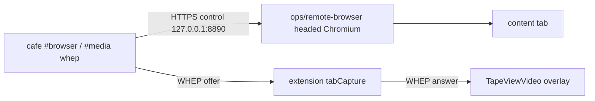

**Purpose:** Run a **headed Chromium** that cafe can **navigate** and **watch in-session** over WebRTC (WHEP). This is a **media input** into zed.cafe, not `#broadcast` out to YouTube, Twitch, or IVS.

**Related today**

| Topic | Location |
|-------|----------|
| WHEP player + overlay | [`zss/feature/broadcast/wheptransport.ts`](../../zss/feature/broadcast/wheptransport.ts), [`zss/gadget/viewvideo.tsx`](../../zss/gadget/viewvideo.tsx) |
| CLI | `#media whep`, `#browser` in [`zss/firmware/cli/commands/media.ts`](../../zss/firmware/cli/commands/media.ts) |
| Sidecar | [`ops/remote-browser/`](../remote-browser/README.md) |
| Outbound broadcast (different direction) | [`zss/feature/broadcast/README.md`](../../zss/feature/broadcast/README.md) |

## Why not a Cloudflare Worker

Workers are V8 isolates: no headed Chromium, no tab capture, no Python/`yt-dlp`. Video into cafe from a real browser has to run where a display and Chrome exist (this machine, or a VM with `DISPLAY`).

## Flow

1. Operator starts `ops/remote-browser` (`yarn start` in that folder). It launches headed Chromium with a tab-capture extension and an HTTPS WHEP endpoint on `https://127.0.0.1:8890/whep`.
2. Cafe (`#media whep browser <bearer>` or `#browser watch`) is a **WHEP client**: recvonly `RTCPeerConnection`, POST SDP, attach tracks to an `HTMLVideoElement`.
3. That video is a **tape overlay** (`TapeViewVideo`), same family as VIEWIT images. Cancel or `#media stop` tears down the peer connection.
4. `#browser goto` / `click` / `type` / `back` are control HTTP to the sidecar. They do not go to YouTube Live or Twitch ingest.

Any other WHEP URL works with `#media whep <url> <bearer>` (local MediaMTX, LiveKit egress, etc.). The `browser` alias is only the local sidecar.

## Ports

| Port | Process |
|------|---------|
| `8889` | YouTube RTMP relay WHIP **ingest** (cafe publishes out) |
| `8890` | Remote browser WHEP **egress** (cafe plays in) |

Do not mix these. `#broadcast whip youtube` is outbound. `#media whep browser` is inbound.
