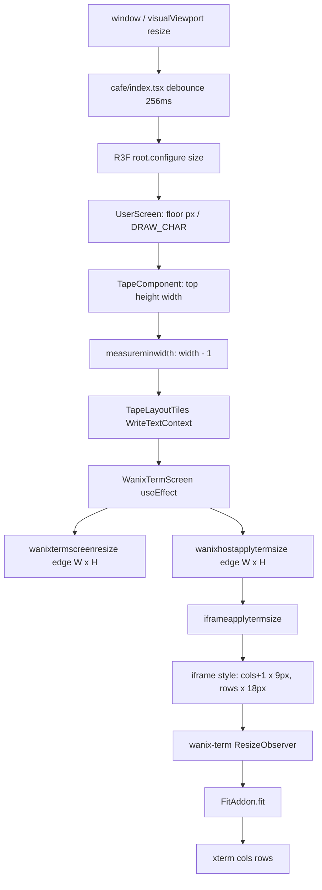
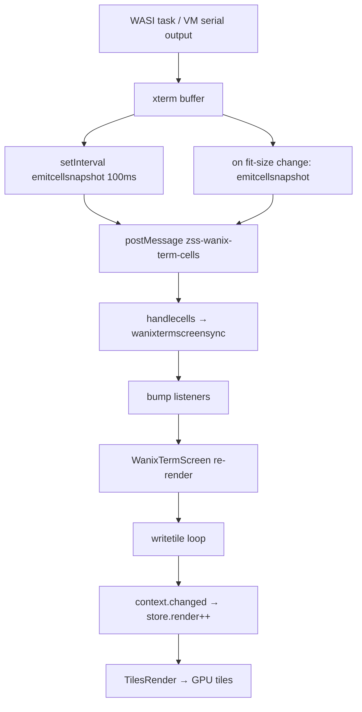

# Wanix terminal sizing

How zed.cafe sizes the hidden wanix `<wanix-term>` iframe and mirrors its xterm buffer onto the visible terminal tile.

## Architecture overview

Sizing is **one-way host → guest**. The visible ZSS tile knows its character grid; the host pixel-sizes a hidden iframe to match. Upstream `<wanix-term>` (wanix CDN) uses xterm **FitAddon** + **ResizeObserver** to derive cols/rows from that pixel box. Content flows **child → parent** via a **100ms cell snapshot poll** — not via serial replay or winsize propagation.

**Do not add:** `winch` file writes, `stty cols/rows`, explicit `term.resize()`, or guest-side size messages back to the host. See [`.cursor/skills/wanix-term-sizing/SKILL.md`](../../.cursor/skills/wanix-term-sizing/SKILL.md).

## Two independent paths

### Size path (host → guest)



### Content path (guest → tile GPU)



Cell read uses the **visible xterm viewport** (`buffer.active.baseY + y`), not absolute buffer line 0. After scrollback fills, line 0 is stale history; the live prompt and cursor sit at `baseY + cursorY`.

## Key modules

| Module | Role |
|--------|------|
| [`cafe/index.tsx`](../../cafe/index.tsx) | Window resize debounce (256ms), R3F viewport |
| [`zss/gadget/userscreen.tsx`](../../zss/gadget/userscreen.tsx) | Viewport px → screen `cols`/`rows` |
| [`zss/screens/tape/measure.ts`](../../zss/screens/tape/measure.ts) | Terminal width = `screensize.cols - 1` |
| [`zss/screens/terminal/wanixscreen.tsx`](../../zss/screens/terminal/wanixscreen.tsx) | Resize entry point; mirrors cells to tile store |
| [`zss/feature/wanix/wanixtermiframehost.ts`](../../zss/feature/wanix/wanixtermiframehost.ts) | Parent iframe pixel math, cell message handler |
| [`zss/feature/wanix/wanixtermprobe.ts`](../../zss/feature/wanix/wanixtermprobe.ts) | Child iframe: 100ms poll, fit-size push, probe RPC |
| [`zss/feature/wanix/wanixtermscreen.ts`](../../zss/feature/wanix/wanixtermscreen.ts) | Main-thread cell mirror buffer |
| [`zss/feature/wanix/wanixtermcells.ts`](../../zss/feature/wanix/wanixtermcells.ts) | Read xterm buffer → snapshot; digest for dedup |
| Upstream `wanix-term` CE | FitAddon + ResizeObserver (not in this repo) |

## Timing stack

| Delay | Where | Effect |
|-------|-------|--------|
| **256ms** | `cafe/index.tsx` `debounce(applyconfig, 256)` | Screen grid updates after window resize settles |
| **0ms** | `WanixTermScreen` `useEffect` on `edge` change | Tile buffer reset + iframe px applied synchronously |
| **async** | wanix-term `ResizeObserver` → FitAddon | xterm cols/rows catch up after iframe style change |
| **100ms** | `installwanixtermprobeembed` `setInterval(emitcellsnapshot, 100)` | Regular cell push when digest changes |
| **immediate** | `logxtermfitsizeifchanged` on fit change | Extra push when xterm grid dimensions change |
| **rAF** | `applyiframepixels` → `synccellsfromchild` | Parent pull after host resize (when attached) |
| **250ms** | `onlayouttick` | Re-applies probe layout CSS; logs fit size |

Worst-case visible lag before fixes: 256ms debounce + async FitAddon + up to 100ms poll + missing `context.changed()` (tile GPU never repainted until next resize).

## Dimension math

### Screen grid (visible tile coordinate system)

```
DRAW_CHAR_WIDTH  = CHAR_WIDTH  * 2 = 8  * 2 = 16 px
DRAW_CHAR_HEIGHT = CHAR_HEIGHT * 2 = 14 * 2 = 28 px

screen_cols = floor(viewport_width  / 16)
screen_rows = floor(viewport_height / 28)
```

### Terminal tile (attached wanix mode)

```
terminal_cols = max(BOARD_WIDTH + 1, screen_cols - 1)   // measureminwidth
terminal_rows = screen_rows                               // full height in attached mode
content_rows  = terminal_rows - 1                         // above hint strip
hint_row      = terminal_rows - 1                         // tile-only detach hint
```

The tile has **H rows total**: rows `0..H-2` are terminal content, row `H-1` is the hint strip (`cmd+\ detach`). xterm/iframe is sized to **H-1 content rows** only — the hint does not exist in xterm.

```
wanixtermscreenresize(edge.width, edge.height)            // tile buffer H rows
wanixhostapplytermsize(edge.width, edge.height - 1)       // iframe/xterm H-1 rows
```

The `- 1` col reserves space for the tape frame border.

### Hidden iframe (xterm host)

Constants in [`wanixtermiframehost.ts`](../../zss/feature/wanix/wanixtermiframehost.ts):

```
WANIX_CHAR_WIDTH  = 9 px
WANIX_CHAR_HEIGHT = 18 px

iframe_width_px  = (terminal_cols + 1) * 9    // +1 col for xterm scrollbar
iframe_height_px = terminal_rows * 18
```

### Worked example

Viewport 1280×720 px, attached terminal, no touch UI inset:

```
screen_cols = floor(1280 / 16) = 80
screen_rows = floor(720 / 28)  = 25
terminal_cols = max(27, 80 - 1) = 79
terminal_rows = 25

iframe_width  = (79 + 1) * 9 = 720 px
iframe_height = (25 - 1) * 18 = 432 px   // content rows only (H-1)
```

xterm FitAddon computes cols/rows from the content-area pixel box. The host does not read xterm dimensions back — it trusts the content row count (`edge.height - 1`).

## Intentional off-by-one (not bugs)

| Location | Behavior |
|----------|----------|
| `measureminwidth` | Terminal 1 col narrower than `screensize.cols` |
| `applyiframepixels` | `(cols + 1) * 9` px width for scrollbar column |
| `readxtermcellsfromterm` | Reads full `term.rows` viewport via `getLine(baseY + y)` |
| `wanixtermscreensync` | Mirrors at most `screen.height - 1` content rows; clamps cursor |
| `wanixtermscreenshowdetachhint` | Bottom tile row reserved for `meta+\ detach` hint (tile only, not xterm) |

## Cell constants vs tile constants

| Layer | Cell width | Cell height |
|-------|-----------|-------------|
| ZSS tile (R3F) | 16 px | 28 px |
| Wanix iframe (xterm) | 9 px | 18 px |

These are independent. The iframe is sized so FitAddon produces a grid that matches the tile character count, not so pixel dimensions match.

## Debug checklist

1. **Reveal hidden iframe overlay**
   - `window.ZSS_WANIX_SHOW = true` or `localStorage.setItem('zss-wanix-show', '1')`
   - Reload; iframe appears top-right at 60% opacity

2. **Console tags** (when show mode on)
   - `[wanix] iframe-pixel-size` — parent applied iframe px
   - `[wanix] xterm-fit-size` — child detected xterm cols/rows change

3. **Verify tile GPU updates**
   - React devtools: `TilesRender` should re-render when `store.render` increments
   - `WanixTermScreen` must call `context.changed()` after `writetile` loop

4. **Verify cell bridge**
   - Network tab not relevant; use `[wanix] xterm-fit-size` + tile content
   - Attach task (`termbridge.wat`) or VM; type or run output; tile should update without resizing

5. **E2E sizing**
   - `.cursor/skills/wanix-vm-iframe-host/scripts/validate-wanix-vm.mjs`

## Known failure modes (fixed)

### Content only updates on window resize

**Symptom:** Guest output visible in hidden iframe (with show mode) but tile frozen until browser resize.

**Cause:** `wanixtermscreensync` updated the mirror buffer and triggered `WanixTermScreen` re-render, but `writetile` mutated store arrays in place without calling `context.changed()`. `TilesRender` subscribes to `store.render`, not array contents.

**Fix:** `context.changed()` after the writetile loop in `wanixscreen.tsx`.

### Grid one resize behind

**Symptom:** After resize, terminal content wraps at previous width/height.

**Cause:** iframe resizes synchronously; xterm FitAddon refits asynchronously. Poll and layout tick did not push cells immediately on fit change. Combined with missing `context.changed()`, lag appeared as two resize cycles behind.

**Fix:** `emitcellsnapshot()` when fit cols/rows change in `wanixtermprobe.ts`; `synccellsfromchild` via rAF after `applyiframepixels` when attached.

## Related docs

- [`.cursor/skills/wanix-term-sizing/SKILL.md`](../../.cursor/skills/wanix-term-sizing/SKILL.md) — agent quick reference
- [`.cursor/rules/wanix-term-bridge.mdc`](../../.cursor/rules/wanix-term-bridge.mdc) — term I/O routing
- [`ops/fixtures/wanix/README.md`](../fixtures/wanix/README.md) — fixtures and harness pages
