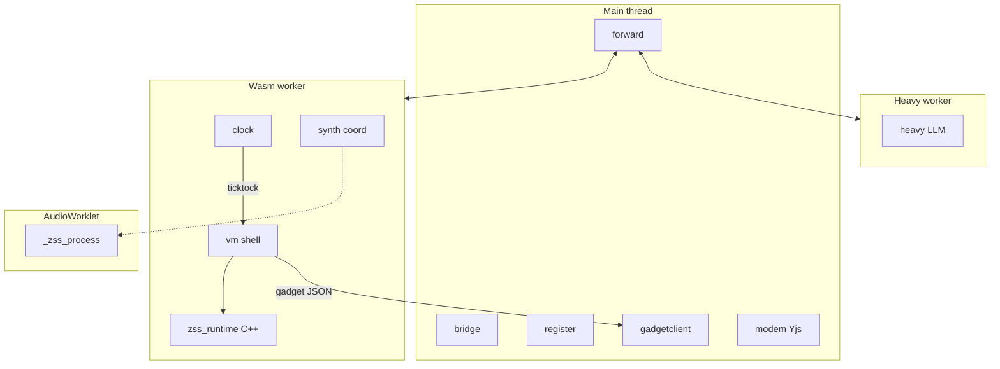

# WASM C++ port: game sim and execution

**Status:** partial — **lang WASM** (compile + per-script run) and **Daisy synth WASM** are shipped; **full sim `zss_runtime.wasm`** remains design/planning.

**Related:**

- [Multiplayer, workers, PeerJS, and WASM](multiplayer-wasm-architecture.md)
- [ZSS architecture (current)](../../zss/ARCHITECTURE.md)
- [Lang pipeline (today)](../../zss/feature/lang/docs/architecture.md)

---

## Summary

| Area | Today | Target |
|------|-------|--------|
| Script execution | Chevrotain → JS string → `new Function('api', code)` **or** lang WASM (`ZSS_WASM_SCRIPT`) | ZSS **bytecode** + C++ interpreter in **`zss_runtime.wasm`** |
| Sim / memory / firmware | TypeScript in sim + boardrunner workers | **`zss_runtime.wasm`** (C++) in one **wasm worker** |
| Synth DSP | `zss_daisy.wasm` in AudioWorklet | Same **runtime** binary; `_zss_process` on AudioWorklet |
| Workers per tab | main + sim + boardrunner + heavy | main + **wasm** + **heavy** |
| UI / PeerJS / editor shell | TypeScript on main | Stays TypeScript |

Enable with **`ZSS_WASM_SIM=true`** per page load during migration. Default **on** only after Phase 7 (full parity + perf).

---

## Goals

- **Bytecode VM** replaces `new Function` and CHIP JS control flow (CSP-safe, deterministic).
- **Full sim core in WASM:** memory, tick loop, loaders, pilot, firmware, CHIP/OS.
- **One wasm worker** per tab: sim + **synth coordinator**; **heavy worker** stays separate for LLM/TTS.
- **Retire** boardrunner worker and stub worker; **keep** election/ack TS on `vm` for multiplayer semantics.
- **No scope deferrals:** RUNTIME + CLI + LOADER firmware at 100% before flipping the default flag.

---

## Locked decisions

| Topic | Decision |
|-------|----------|
| State bridge to UI | v1 **JSON** snapshot/delta; no typed linear-memory views until post-parity |
| CLI | Port **CLI driver to C++ early** (Phase 2) |
| Workers | **wasm** (sim + synth coord) + **heavy**; no boardrunner worker |
| Heavy | **Separate worker** (RAM + 80ms tick isolation) |
| WASM threading | v1 **sequential** ticks; pthreads optional later; COOP/COEP already required for synth SAB |
| Parity CI | Record **golden fixtures once** from TS; WASM-only compare (no standing dual-run CI) |
| Artifacts | Commit **`zss_runtime.wasm`** + glue under `cafe/public/wasm/runtime/` |
| Migration | `ZSS_WASM_SIM` env flag per page load only |
| Lang | Port parser/compiler to **C++** (`zss_compile`); TS pipeline is **parity oracle** until green |
| C++ parser | **re2c** lexer + hand-written **recursive descent** |
| Editor | Tape → wasm worker **`zss_compile` RPC** for diagnostics |
| WASM binary | **Single linked** `zss_runtime` (sim + Daisy) from the start |
| Multiplayer memory | **Host tab authoritative** for MAIN book; joins via **`vm:memorypatch`** |
| Peer message names | **Rename** to `vm:memorypatch` / `vm:memorypaint` — **no legacy** `boardrunner:*` on wire |
| Golden fixtures | Start **minimal synthetic** board/scripts |
| Default flag | **Phase 7** only |
| CI | Native C++ + Node wasm + browser smokes + optional Playwright **3-tab** multiplayer |
| Docs | This file + [multiplayer-wasm-architecture.md](multiplayer-wasm-architecture.md) |

---

## What moves (code map)

| Layer | Key paths | Port? |
|-------|-----------|-------|
| Tick orchestration | `zss/device/vm/handlers/ticktock.ts`, `pilot.ts` | **Yes** → `zss_tick` |
| Board tick | `zss/memory/runtime.ts`, `boardtick.ts` | **Yes** |
| World model | `zss/memory/types.ts`, `boards.ts`, `boardmovement.ts`, `boundaries.ts`, … | **Yes** |
| Lang | `zss/feature/lang/*` | Bytecode IR; TS emitter bootstrap; **C++ `zss_compile`** target |
| CHIP / OS | `zss/chip.ts`, `zss/os.ts` | **Yes** |
| Firmware | `zss/firmware/*` (~150 `#` commands) | **Yes** (all drivers) |
| Boardrunner worker | `zss/boardrunnerspace.ts`, `device/boardrunner/*` | **Retire**; logic in `zss_tick` |
| UI / hub | `cafe/`, `zss/gadget/`, `zss/screens/`, `forward`, `bridge` | **Stay TS** |

There is **no bytecode today**; the port introduces a new IR. See [lang architecture](../../zss/feature/lang/docs/architecture.md) for the current JS pipeline.

---

## Target repository layout

```
zss/sim/native/
  lang/                   # re2c lexer, RD parser, bytecode emitter
  synth/                  # Daisy wrapper (from feature/synth/backend/daisy/native)
  sim/                    # memory, chip, vm, firmware
  build-runtime.sh        # emcc → cafe/public/wasm/runtime/zss_runtime.{js,wasm}
zss/sim/
  wasm-bridge.ts          # load runtime; FFI for vm + synth
  hostevents.ts           # browser CLI host event IDs (planned)
cafe/public/wasm/runtime/ # committed artifacts (yarn app:build:runtime)
zss/wasmspace.ts          # wasm worker entry (replaces simspace + boardrunnerspace)
```

**package.json (planned):** `build:runtime`, `test:sim:native`, `test:sim:wasm`, `test:sim:browser`, `regen:sim-parity-fixtures`.

---

## Bytecode VM

### Opcode categories

1. Stack / literals
2. CHIP control (labels, yield, halt, flags, messages, cycle gating)
3. Control flow (`#if`, `#while`, `#repeat`, `#foreach`, break/continue)
4. Expression ops (today’s `api.isEq`, `api.opPlus`, …)
5. Host calls (`#command` → firmware dispatch index + args)

### Compiler phases

| Phase | Work |
|-------|------|
| **1a** | Bytecode spec in `zss/feature/lang/docs/bytecode.md`; TS emitter; tests vs `pipeline.test.ts` |
| **1b** | C++ re2c + RD + emitter; export `zss_compile`; match TS on fixtures |
| **Runtime** | Wasm worker compiles game scripts; Tape uses **compile RPC** to wasm worker |

---

## FFI surface (`zss_runtime`)

| Export | Role |
|--------|------|
| `zss_init(heap_bytes)` | Session, books, main book |
| `zss_tick(timestamp, board_ids[])` | Loaders, pilot, **elected boards only** on this tab |
| `zss_tick_board(...)` | Per-board pass (internal or exported) |
| `zss_input`, `zss_cli`, `zss_message` | Input, CLI, `#send` |
| `zss_get_memory_json` / `zss_apply_patch` | Gadget, saves, peer patches |
| `zss_compile(name, source)` | C++ lang pipeline |
| `zss_process`, … | Daisy DSP (AudioWorklet) |

v1 memory bridge: **JSON only** (gadget sync, peer patches).

Browser-only CLI: C++ emits **host event** → wasm `forward` → main (`bridge` / `register`).

---

## Workers (per browser tab)



- **Retire:** `simspace`, `boardrunnerspace`, `stubspace`.
- **Keep:** `boardrunnermanagement.ts` on **vm** for election/ack (peer/tab semantics).
- **Non-elected boards:** no local `zss_tick_board`; updates via peer **`vm:memorypatch`** only.

See [multiplayer-wasm-architecture.md](multiplayer-wasm-architecture.md) for host + 2 joins.

---

## WASM threading

Browsers support WASM threads with **SharedArrayBuffer** + **COOP/COEP** (already used for Daisy). Emscripten `-pthread` adds a worker pool.

**v1:** one wasm worker, **sequential** board ticks inside one `zss_runtime` instance. Pthreads only if profiling requires it and ordering is specified.

**Heavy** is not merged into the wasm worker (event-loop contention, OOM, failure isolation).

---

## Phased implementation

### Phase 0 — Tooling (1–2 weeks)

- `wasmspace.ts` + minimal `zss_runtime.wasm`: `zss_init`, empty `zss_tick`
- `build-runtime.sh` (sim-only first)
- Docs stub → filled (this file + multiplayer doc)
- Native + Node wasm test harness

### Phase 0b — Daisy link

- Link Daisy into `zss_runtime`; AudioWorklet + synth coord

### Phase 1a — Bytecode + TS emitter (2–3 weeks)

- IR + emitter + minimal synthetic golden fixtures
- `ZSS_WASM_SIM` in `cafe/.env.local`

### Phase 1b — C++ lang (4–8 weeks, parallel)

- `zss/sim/native/lang/`; `zss_compile`; Tape compile RPC

### Phase 2 — CHIP + RUNTIME + CLI firmware (4–5 weeks)

### Phase 3 — Memory + `memorytickmain` (4–6 weeks)

### Phase 4 — Full `zss_tick` (2–3 weeks)

- Loaders, pilot, election list; thin `handleticktock` + `gadgetsynctick`

### Phase 5 — Wasm worker integration (2–3 weeks)

- `platform.ts`: wasm + heavy only
- Rename peer targets: `vm:memorypatch`, `vm:memorypaint`
- Synth device on wasm worker

### Phase 6 — 100% firmware (4–8 weeks)

### Phase 7 — Decommission TS sim + default flag (2–4 weeks)

- Remove TS `memorytickmain`, chip, os, firmware tick path
- Default `ZSS_WASM_SIM=true`; bench 80ms tick budget

### E2E (ongoing)

- Playwright **3-context** host + 2 joins (optional slow CI job)

---

## Parity and testing

| Tier | Purpose |
|------|---------|
| Native C++ | Lang, VM step, firmware units |
| Node wasm | Bytecode + tick golden fixtures |
| Browser / wasm worker | Smoke |
| Playwright 3-tab | Multiplayer optional CI |

Golden pattern: mirror [`wasmparity.test.ts`](../tests/unit/feature/synth/backend/wasm/wasmparity.test.ts) — record once from TS, compare in WASM.

---

## Rough estimate

~**6–9 months** (one engineer, familiar with codebase), including C++ lang port.

---

## Milestone PR sequence

1. `zss/sim/native` skeleton + `build:runtime` + hello `zss_init` from wasm worker
2. Bytecode spec + TS emitter + minimal synthetic fixtures
3. C++ `zss_compile` matches TS bytecode corpus
4. C++ VM runs `#idle` / `#go` on empty board
5. `zss_tick` golden parity on synthetic board
6. Single wasm worker + synth coord; boardrunner worker removed; peer rename
7. 100% firmware + default `ZSS_WASM_SIM`

---

## Risks

| Risk | Mitigation |
|------|------------|
| Large port scope | Phased firmware checklist from tests |
| Dynamic `any` in firmware | Tagged `WordValue` in C++ |
| JSON gadget bandwidth | Optimize post–Phase 7 |
| Runtime binary size | Monitor bytes; `-msimd128` |
| Host/join drift | `vm:memorypatch` golden + 3-tab Playwright |

---

## TypeScript end state

**Keep:** cafe, gadget, screens, forward, hub, gadgetclient, bridge, register, heavy, jsonpipe (peers/saves), feature/heavy.

**Wasm worker shell:** clock, modem, vm, synth coordinator.

**Remove from tick path:** memory tick implementations, chip, os, firmware handlers, boardrunner worker.

**Lang:** TS `compileast` remains parity oracle only; production editor uses **`zss_compile` RPC**.
