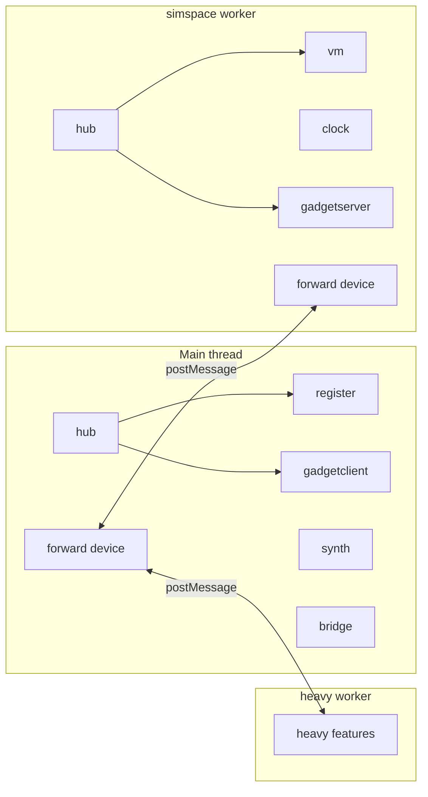

# ZSS architecture deep dive

## What it is

From the [root README](../README.md): a **ZZT-inspired, web-based fantasy terminal**—a creative-coding / game environment where boards, elements, and scripts feel like a retro terminal world. The repo is a **TypeScript monolith**: UI in [`cafe/`](../cafe/), engine in [`zss/`](.), CLI in [`src/`](../src/).

---

## Repository layout

| Area | Role |
|------|------|
| [`cafe/`](../cafe/) | Vite root ([`vite.config.ts`](../vite.config.ts)); React + R3F Canvas; aliases `zss` and `cafe` |
| `zss/` | Engine: devices, VM, memory, firmware, lang, gadget rendering, features |
| [`src/commands/run.ts`](../src/commands/run.ts) + [`src/lib/app.tsx`](../src/lib/app.tsx) | oclif `zss` CLI: Playwright-hosted app + Ink terminal; static serve or Vite dev |

---

## Codebase map (domain boundaries)

Paths are under `zss/` unless noted.

```
cafe/           Application layer — React app entry, bootup
zss/screens/    High-level UI — Tape, Terminal, Panel, Editor, Inspector
zss/gadget/     Display, graphics, gadget data/state, user input device
zss/memory/     Domain logic — boards, elements, books, inspection
zss/words/      Domain types — COLOR, NAME, STAT_TYPE, parsers
zss/device/     Infrastructure — API, session, VM, forward, register, clock, …
zss/firmware/   Command vocabulary — CLI, loader, runtime, board, element, …
zss/feature/    Feature modules — ROM, parse, heavy (AI), synth, storage, …
zss/mapping/    Pure utilities — array, string, number, 2d, types, guid, …
zss/lang/       Script compiler pipeline (lexer → AST → JS for chips)
```

### Layer dependencies

- **cafe** and **zss/screens** depend on gadget, memory, device
- **gadget** depends on memory, words, mapping
- **memory** depends on words, mapping
- **words** depends on mapping
- **feature** modules depend on device, memory, gadget as needed
- **mapping** has no internal zss dependencies (pure utilities)

### Key modules

| Module | Purpose |
|--------|---------|
| `zss/words/` | Domain enums (COLOR, COLLISION, STAT_TYPE), parsers (color, dir, kind), textformat |
| `zss/mapping/` | Pure helpers: array, string, number, 2d, types, value, guid, anim, tick, qr, func |
| `zss/memory/` | Board/element operations, inspection, books, codepage |
| `zss/gadget/` | Rendering engine, state, display, graphics components |

---

## Runtime: main thread vs workers

Boot flow:

1. [`cafe/index.tsx`](../cafe/index.tsx) loads [`zss/userspace.ts`](userspace.ts) (side-effect imports of main-thread devices), then renders [`cafe/app.tsx`](../cafe/app.tsx) → [`zss/gadget/engine.tsx`](gadget/engine.tsx).
2. `Engine` calls [`createplatform()`](platform.ts): `sessionreset` on [`SOFTWARE`](device/session.ts), spawns **heavyspace** (LLM/TTS-heavy work) and **simspace** or **stubspace** (simulation).

[`zss/simspace.ts`](simspace.ts) runs **inside the worker**: imports clock, gadgetserver, modem, wires `createforward` so messages that must reach the browser UI are `postMessage`’d out, then calls `started()` from [`zss/device/vm.ts`](device/vm.ts).

[`zss/userspace.ts`](userspace.ts) registers **main-thread** devices: `gadgetclient`, `modem`, `bridge`, `register`, `synth`.

**Important detail:** each realm (main window vs worker) has its **own** [`hub`](hub.ts) instance (separate JS globals). [`zss/device/forward.ts`](device/forward.ts) bridges realms: a `forward` device subscribes to topic `all`, dedupes by `message.id`, and either invokes the local `hub` or `postMessage`s to the parent/worker per `shouldforward*` helpers in that file.



CLI / headless mode ([`cafe/index.tsx`](../cafe/index.tsx) `bootheadless`) skips Canvas and calls `createplatform(..., true)` so Playwright drives the same stack without WebGL.

---

## The hub: message-passing backbone

[`zss/hub.ts`](hub.ts): a **fan-out bus**. `hub.emit` builds a [`MESSAGE`](device/api.ts) and `hub.invoke` calls `device.handle` on **every** connected device.

[`zss/device.ts`](device.ts) `createdevice`:

- **`emit(player, target, data)`** → goes through hub with session + sender id.
- **Routing:** `parsetarget` splits `target` on `:` (e.g. `vm:operator` → device `vm`, path `operator`).
- Devices match if: subscribed **topic** equals the message target (e.g. `ticktock`, `tock`, `second`), **or** message is addressed to device id / name / `all`.
- **`reply` / `replynext`:** convenience for responses along `sender:subtarget`.

Authoritative diagrams: [`zss/device/docs/message-flow.md`](device/docs/message-flow.md) (mermaid + ASCII) and [`zss/device/docs/devices-and-messaging.md`](device/docs/devices-and-messaging.md) (all devices, three realms, forwarding).

---

## VM and handlers (game / OS logic)

[`zss/device/vm.ts`](device/vm.ts) creates the `vm` device (topics `ticktock`, `second`). Each message is dispatched via [`zss/device/vm/handlers/registry.ts`](device/vm/handlers/registry.ts) by `message.target` (e.g. `operator`, `cli`, `input`, `loader`, `books`, `ticktock`, …). Shared mutable VM state lives in [`zss/device/vm/state.ts`](device/vm/state.ts).

The **`register`** device ([`zss/device/register.ts`](device/register.ts)) is the **UI-facing edge**: storage, session, tape/terminal/editor zustand stores, and it **emits** `vm:*` calls (via [`zss/device/api.ts`](device/api.ts)) so user actions become VM work.

---

## Memory: world model

Documented in [`zss/memory/docs/README.md`](memory/docs/README.md):

- **MEMORY** singleton: books, software slots, loaders, session, operator, etc.
- **BOOK** → **CODE_PAGE** (board / object / terrain / charset / palette / loader)
- **BOARD**: 60×25-style grid, elements, named lookup
- **BOARD_ELEMENT**: kind, position, char, color, code, collision, …

Memory APIs are consumed by the chip runtime, firmware (`send`, movement, etc.), and the gadget pipeline (rendering conversion in `memory/rendering.ts` and related modules).

---

## Lang → chip → firmware (behavior)

**Lang** ([`zss/lang/docs/README.md`](lang/docs/README.md)): lexer → Chevrotain parser → visitor (CST→AST) → transformer → `new Function('api', code)`. Entry: `compile()` in [`zss/lang/generator.ts`](lang/generator.ts).

**Chip** ([`zss/chip.ts`](chip.ts)): per-element **VM** with `get`/`set`, `tick`, generator execution, messaging, and integration with **firmware** via [`zss/firmware/runner.ts`](firmware/runner.ts).

**Firmware** ([`zss/firmware/docs/README.md`](firmware/docs/README.md)): `createfirmware()` registers `#commands`, optional `get`/`set` hooks, `everytick`/`aftertick`. **Drivers** compose firmware for three contexts:

| Driver | Purpose |
|--------|---------|
| `CLI` | Terminal / software commands |
| `LOADER` | Importing external content |
| `RUNTIME` | Codepage execution on boards |

Shared stdlib: `audio`, `board`, `network`, `transform`, `element`. Example runtime commands in [`zss/firmware/runtime.ts`](firmware/runtime.ts) (`send`, `text`, `hyperlink`, `help`, …) bridge script to **gadget** APIs and **memory** (`memorysendtoelements`, etc.).

---

## Gadget: simulation state → pixels

Rough pipeline:

1. **`gadgetserver`** (worker, on `tock`): diff memory → **paint** or **patch** messages to **`gadgetclient`**.
2. **`gadgetclient`** (main): updates **zustand** state in [`zss/gadget/data/state.ts`](gadget/data/state.ts) (`useGadgetClient`, tape/editor/inspector stores).
3. **`Engine`** / [`zss/screens/`](screens/) / [`zss/gadget/display/`](gadget/display/): R3F orthographic scene, tiles/sprites, CRT-style effects, tape UI.

So: **memory is authoritative**; gadget state is a **projection** for rendering and UI.

---

## Features and integrations

Scattered under [`zss/feature/`](feature/): storage (idb), TTS/STT, URL/multiplayer hooks, parsing, etc. [`zss/device/heavy.ts`](device/heavy.ts) and the **heavyspace** worker isolate expensive browser APIs (e.g. transformers, ONNX) from the sim loop.

**`modem`**: networking / sync-related message handling (present on both sides as imported modules—routing distinguishes behavior).

**`bridge`**: external-world actions (fetch, streams, chat bridges); see [`zss/device/docs/message-flow.md`](device/docs/message-flow.md).

---

## CLI packaging

[`package.json`](../package.json): `zss` binary via oclif; `build:cli` compiles `src/` and runs `oclif manifest`. The CLI serves `cafe/dist` or talks to the Vite dev server and injects Node hooks (`__nodeStorageReadPlayer`, `__onCliInput`) for headless operation ([`cafe/index.tsx`](../cafe/index.tsx)).

**Production Linux tarball:** `yarn build:cli:linux` runs a **production** Vite build (`NODE_ENV=production`), compiles the CLI, installs Playwright’s headless shell for the pack target, then `oclif pack tarballs` (which runs `npm pack` and bundles production `node_modules`).

**Embedding static content in the shipped CLI:** oclif’s pack step uses **`npm pack`**, which only includes paths listed under [`package.json` `files`](../package.json) (plus a few npm defaults). The built cafe UI must be listed there as **`cafe/dist`** (output of `yarn build`). Add other paths the same way if the CLI must ship extra assets; keep large or secret paths out of `files` so they are not published in the tarball.

---

## Mental model (one paragraph)

**ZSS** keeps **game and engine state in memory**, runs **script as compiled code on chips** with **firmware** defining the command vocabulary, and uses a **session-scoped message hub** so the **VM (worker)** and **React UI (main)** stay loosely coupled: UI sends `vm:*` messages, VM mutates memory and drives **gadgetserver** updates, and the **gadgetclient** store feeds the Three.js terminal aesthetic.
