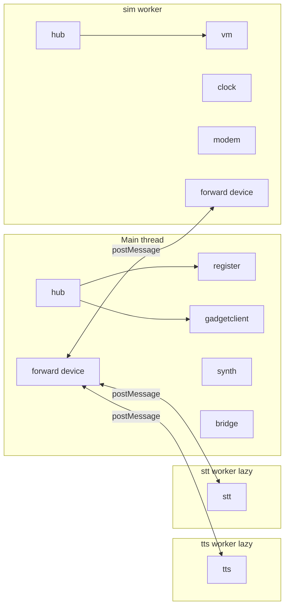

# ZSS architecture deep dive

## What it is

From the [root README](../README.md): a **ZZT-inspired, web-based fantasy terminal**—a creative-coding / game environment where boards, elements, and scripts feel like a retro terminal world. The repo is a **TypeScript monolith**: UI in [`cafe/`](../cafe/), engine in [`zss/`](.), headless CLI in [`headless/`](../headless/).

**Shipped today:** **Daisy synth WASM** in the AudioWorklet; chip scripts compile via the **TypeScript lang backend**. See [`zss/feature/lang/`](feature/lang/) and [`zss/feature/synth/`](feature/synth/).

---

## Repository layout

| Area | Role |
|------|------|
| [`cafe/`](../cafe/) | Vite root ([`vite.config.ts`](../vite.config.ts)); React + R3F Canvas; aliases `zss` and `cafe` |
| `zss/` | Engine: devices, VM, memory, firmware, lang, gadget rendering, features |
| [`headless/src/commands/run.ts`](../headless/src/commands/run.ts) + [`headless/src/lib/app.tsx`](../headless/src/lib/app.tsx) | oclif `zss` CLI: Playwright-hosted app + Ink terminal; static serve or Vite dev |

---

## Codebase map (domain boundaries)

Paths are under `zss/` unless noted.

```
cafe/           Application layer — React app entry, bootup
zss/screens/    High-level UI — Tape, Terminal, Panel, Editor, Inspector
zss/gadget/     Display, graphics, gadget data/state, user input device
zss/memory/     Domain logic — boards, elements, books, inspection
zss/words/      Domain types — COLOR, NAME, STAT_TYPE, parsers
zss/device/     Infrastructure — API, session, VM, forward, register, clock, …
zss/firmware/   Command vocabulary — CLI, loader, runtime, board, element, …
zss/feature/    Feature modules — ROM, parse, tts, stt, synth, storage, …
zss/mapping/    Pure utilities — array, string, number, 2d, types, guid, …
zss/feature/lang/       Script compiler (TS backend + native parity target)
```

### Layer dependencies

- **cafe** and **zss/screens** depend on gadget, memory, device
- **gadget** depends on memory, words, mapping
- **memory** depends on words, mapping
- **words** depends on mapping
- **feature** modules depend on device, memory, gadget as needed
- **mapping** has no internal zss dependencies (pure utilities)

### Key modules

| Module | Purpose |
|--------|---------|
| `zss/words/` | Domain enums (COLOR, COLLISION, STAT_TYPE), parsers (color, dir, kind), textformat |
| `zss/mapping/` | Pure helpers: array, string, number, 2d, types, value, guid, anim, tick, qr, func |
| `zss/memory/` | Board/element operations, inspection, books, codepage |
| `zss/gadget/` | Rendering engine, state, display, graphics components |

---

## Runtime: main thread vs workers

Boot flow:

1. [`cafe/index.tsx`](../cafe/index.tsx) loads [`zss/userspace.ts`](userspace.ts) (side-effect imports of main-thread devices), then renders [`cafe/app.tsx`](../cafe/cafeapp.tsx) → [`zss/gadget/engine.tsx`](gadget/engine.tsx).
2. `Engine` calls [`createplatform()`](platform.ts): `sessionreset` on [`SOFTWARE`](device/session.ts), spawns either **simspace** (authoritative VM worker) or **joinvm** on the main thread for `/join/` tabs ([`device/joinvm.ts`](device/joinvm.ts)). **ttsspace** / **sttspace** workers start on demand for TTS/STT.

[`zss/simspace.ts`](simspace.ts) runs **inside the sim worker**: imports `clock` and `modem`, wires `createforward` so messages that must reach the browser UI are `postMessage`’d out, then calls `started()` from [`zss/device/vm.ts`](device/vm.ts) which dispatches per-tick handlers (including [`memorytickmain`](memory/runtime.ts) for active boards and the per-player gadget projection in [`gadgetsynctick`](device/vm/gadgetsynctick.ts)).

[`zss/userspace.ts`](userspace.ts) registers **main-thread** devices: `gadgetclient`, `modem`, `bridge`, `register`, `synth`.

**Important detail:** each realm (main window vs each worker) has its **own** [`hub`](hub.ts) instance (separate JS globals). [`zss/device/forward.ts`](device/forward.ts) bridges realms: a `forward` device subscribes to topic `all`, dedupes by `message.id`, and either invokes the local `hub` or `postMessage`s to the parent/worker per `shouldforward*` helpers in that file. [`zss/platform.ts`](platform.ts) wires sim ↔ main and on-demand tts/stt ↔ main.


```mermaid
flowchart LR
  subgraph main [Main thread]
    Register[register]
    GadgetClient[gadgetclient]
    Synth[synth]
    Bridge[bridge]
    HubMain[hub]
    ForwardMain[forward device]
  end
  subgraph sim [sim worker]
    VM[vm]
    Clock[clock]
    Modem[modem]
    HubSim[hub]
    ForwardSim[forward device]
  end
  subgraph tts [tts worker lazy]
    TTSDev[tts]
  end
  subgraph stt [stt worker lazy]
    STTDev[stt]
  end
  ForwardMain <-->|postMessage| ForwardSim
  ForwardMain <-->|postMessage| TTSDev
  ForwardMain <-->|postMessage| STTDev
  HubMain --> Register
  HubMain --> GadgetClient
  HubSim --> VM
```

CLI / headless mode ([`cafe/index.tsx`](../cafe/index.tsx) `bootheadless`) skips Canvas and calls `createplatform(..., true)` so Playwright drives the same stack without WebGL.

---

## The hub: message-passing backbone

[`zss/hub.ts`](hub.ts): a **fan-out bus**. `hub.emit` builds a [`MESSAGE`](device/api.ts) and `hub.invoke` calls `device.handle` on **every** connected device.

[`zss/device.ts`](device.ts) `createdevice`:

- **`emit(player, target, data)`** → goes through hub with session + sender id.
- **Routing:** `parsetarget` splits `target` on `:` (e.g. `vm:operator` → device `vm`, path `operator`).
- Devices match if: subscribed **topic** equals the message target (e.g. `ticktock`, `tock`, `second`), **or** message is addressed to device id / name / `all`.
- **`reply` / `replynext`:** convenience for responses along `sender:subtarget`.

Authoritative diagrams: [`zss/device/docs/message-flow.mdx`](device/docs/message-flow.mdx) (mermaid + ASCII) and [`zss/device/docs/devices-and-messaging.mdx`](device/docs/devices-and-messaging.mdx) (all devices, realms, forwarding).

---

## VM and handlers (game / OS logic)

[`zss/device/vm.ts`](device/vm.ts) creates the `vm` device (topics `ticktock`, `second`). Each message is dispatched via [`zss/device/vm/handlers/registry.ts`](device/vm/handlers/registry.ts) by `message.target` (e.g. `operator`, `cli`, `input`, `loader`, `books`, `ticktock`, …). Shared mutable VM state lives in [`zss/device/vm/state.ts`](device/vm/state.ts).

Each [`ticktock`](device/vm/handlers/ticktock.ts) the sim VM:

1. Runs [`memorytickloaders`](memory/runtime.ts).
2. Calls [`memorytickmain`](memory/runtime.ts) for every board with active players.
3. Rebuilds per-board gadget layer caches, then projects per-player gadget state via [`gadgetsynctick`](device/vm/gadgetsynctick.ts).
4. Runs [`memoryfs`](feature/memoryfs/) disk projection checks when attached.

Input from the UI arrives as [`vminput`](device/api.ts) → `vm:input`. Cross-board moves use [`memorymoveplayertoboard`](memory/playermanagement.ts) directly on the sim (firmware `#goto`, edge exits) or via thin [`vmplayermovetoboard`](device/api.ts) for main-thread callers.

The **`register`** device ([`zss/device/register.ts`](device/register.ts)) is the **UI-facing edge**: storage, session, tape/terminal/editor zustand stores, and it **emits** `vm:*` calls (via [`zss/device/api.ts`](device/api.ts)) so user actions become VM work.

---

## Memory: world model

Documented in [`zss/memory/docs/README.md`](memory/docs/README.md):

- **MEMORY** singleton: books, software slots, loaders, session, operator, etc.
- **BOOK** → **CODE_PAGE** (board / object / terrain / charset / palette / loader)
- **BOARD**: 60×25-style grid, elements, named lookup
- **BOARD_ELEMENT**: kind, position, char, color, code, collision, …

Memory APIs are consumed by the chip runtime, firmware (`send`, movement, etc.), and the gadget pipeline (rendering conversion in `memory/rendering.ts` and related modules).

---

## Lang → chip → firmware (behavior)

**Lang** ([`zss/feature/lang/docs/README.md`](feature/lang/docs/README.md)): lexer → Chevrotain parser → visitor (CST→AST) → transformer → `new Function('api', code)`. Entry: `compile()` via [`zss/feature/lang`](feature/lang/langcompileclient.ts).

**Chip** ([`zss/chip.ts`](chip.ts)): per-element **VM** with `get`/`set`, `tick`, generator execution, messaging, and integration with **firmware** via [`zss/firmware/runner.ts`](firmware/runner.ts).

**Firmware** ([`zss/firmware/docs/README.md`](firmware/docs/README.md)): `createfirmware()` registers `#commands`, optional `get`/`set` hooks, `everytick`/`aftertick`. **Drivers** compose firmware for three contexts:

| Driver | Purpose |
|--------|---------|
| `CLI` | Terminal / software commands |
| `LOADER` | Importing external content |
| `RUNTIME` | Codepage execution on boards |

Shared stdlib: `audio`, `board`, `network`, `transform`, `element`. Example runtime commands in [`zss/firmware/runtime.ts`](firmware/runtime.ts) (`send`, `text`, `hyperlink`, `help`, …) bridge script to **gadget** APIs and **memory** (`memorysendtoelements`, etc.).

Board transforms (`#snapshot`, `#revert`, `#build`, `#goto`) call feature modules directly on the sim — [`boardsnapshot`](feature/docs/boardsnapshot.md), [`boardbuild`](feature/boardbuild.ts), and [`memorymoveplayertoboard`](memory/playermanagement.ts).

---

## Gadget: simulation state → pixels

Rough pipeline:

1. **`gadgetsynctick`** (sim worker, called from the VM `ticktock` handler in [`device/vm/handlers/ticktock.ts`](device/vm/handlers/ticktock.ts)): for every active player, projects the cached per-board gadget layers ([`memoryreadbookgadgetlayersforboard`](memory/gadgetlayersflags.ts)) plus the live control layer into the player's gadget state, then emits **`gadgetclient:patch`** (or **`gadgetclient:paint`** when the player asks for a desync) via [`device/api.ts`](device/api.ts).
2. **`gadgetclient`** (main, [`device/gadgetclient.ts`](device/gadgetclient.ts)): replays the jsonpipe paint/patch into the **zustand** store in [`zss/gadget/data/zustandstores.ts`](gadget/data/zustandstores.ts) (`useGadgetClient`, tape/editor/inspector stores). Bad patches reply `gadgetdesync` to the sim VM.
3. **`Engine`** / [`zss/screens/`](screens/) / [`zss/gadget/display/`](gadget/display/): R3F orthographic scene, tiles/sprites, CRT-style effects, tape UI.

Note that the previous `gadgetserver` device has been removed: the same paint/patch messages are now produced **inside the VM tick** (no separate device or `tock` topic). Chip simulation runs in the sim worker via `memorytickmain` — there is no separate boardrunner worker.

**Tape editor / terminal input:** [`zss/screens/tape/autocomplete.ts`](screens/tape/autocomplete.ts) computes `#` command and word-list suggestions from lexer tokens and firmware word tables; [`zss/screens/tape/commandarghints.ts`](screens/tape/commandarghints.ts) loads optional long-form help from ROM keys `editor:commands:<name>` (Markdown with YAML `hint:` or legacy `desc;…` lines), cached per command. [`zss/screens/tape/autocompleteui.ts`](screens/tape/autocompleteui.ts) shares suggestion-apply and terminal hint placement. See [`zss/screens/tape/README.md`](screens/tape/README.md).

So: **memory is authoritative**; gadget state is a **projection** for rendering and UI.

---

## Features and integrations

Scattered under [`zss/feature/`](feature/): storage (idb), TTS/STT, URL/multiplayer hooks, parsing, etc. **ttsspace** and **sttspace** workers isolate ONNX / WebGPU inference from the sim loop.

**`modem`**: networking / sync-related message handling (present on both sides as imported modules—routing distinguishes behavior).

**`bridge`**: external-world actions (fetch, streams, chat bridges); see [`zss/device/docs/message-flow.mdx`](device/docs/message-flow.mdx).

**jsonpipe** syncs gadget projection and optional memoryfs disk export — not a separate board sim worker.

---

## CLI packaging

[`package.json`](../package.json): `zss` binary via oclif; `headless:build` compiles `headless/` and runs `oclif manifest`. The CLI serves `cafe/dist` or talks to the Vite dev server and injects Node hooks (`__nodeStorageReadPlayer`, `__onCliInput`) for headless operation ([`cafe/index.tsx`](../cafe/index.tsx)).

**Production Linux tarball:** `yarn task run headless:build:linux` runs a **production** Vite build (`NODE_ENV=production`), compiles the CLI, installs Playwright’s headless shell for the pack target, then `oclif pack tarballs` (which runs `npm pack` and bundles production `node_modules`).

**Embedding static content in the shipped CLI:** oclif’s pack step uses **`npm pack`**, which only includes paths listed under [`package.json` `files`](../package.json) (plus a few npm defaults). The built cafe UI must be listed there as **`cafe/dist`** (output of `yarn task run cafe:build`). Add other paths the CLI must ship extra assets; keep large or secret paths out of `files` so they are not published in the tarball.

---

## Mental model (one paragraph)

**ZSS** keeps **game and engine state in memory**, runs **script as compiled code on chips** with **firmware** defining the command vocabulary, and uses a **session-scoped message hub** so the **VM (sim worker)**, on-demand **TTS/STT workers**, and the **React UI (main)** stay loosely coupled: UI sends `vm:*` messages (including `vm:input` from userinput), the sim VM mutates memory and runs [`memorytickmain`](memory/runtime.ts) each tick, projects per-player gadget state into **`gadgetclient:patch`** messages, and the **gadgetclient** store feeds the Three.js terminal aesthetic. Join tabs (`/join/`) use a thin **joinvm** stub on main instead of a local sim worker; the host owns authoritative memory.
