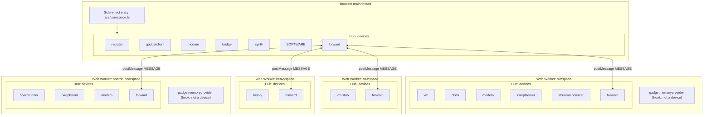
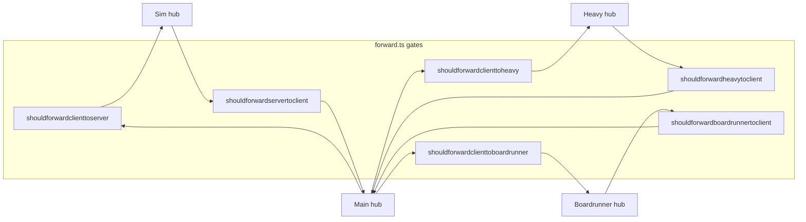

# Device architecture by worker

Each **JavaScript realm** (browser main thread or a Web Worker bundle) loads its own `hub` from `zss/hub.ts`. Devices are created with `createdevice` in `zss/device.ts` and only see messages delivered on **that** realm’s hub, except where `postMessage` bridges copy `MESSAGE` payloads between realms (see `zss/platform.ts` and `zss/device/forward.ts`).

**Entry points**

| Realm | Boot file | Registers devices |
|--------|------------|---------------------|
| Main | `zss/userspace.ts` | `register`, `gadgetclient`, `modem`, `bridge`, `synth` |
| Main | `zss/platform.ts` → `createforward` | `forward` (dedupe + `postMessage` routing) |
| Main | first import of `zss/device/session.ts` | `SOFTWARE` |
| Sim worker | `zss/simspace.ts` | `vm`, `clock`, `modem`, `rxreplserver`, `streamreplserver`, `forward` |
| Sim worker | side imports from `simspace.ts` | `gadgetmemoryprovider` (**not** a device — hooks gadget state into memory) |
| Stub worker | `zss/stubspace.ts` | stub `vm` (`zss/device/stub.ts`), `forward` |
| Heavy worker | `zss/heavyspace.ts` | `heavy`, `forward` |
| Boardrunner worker | `zss/boardrunnerspace.ts` | `boardrunner`, `rxreplclient`, `modem`, `forward` |
| Boardrunner worker | side import | `gadgetmemoryprovider` (**not** a device) |

`user:input` and related **`user:*`** targets are handled by the **`boardrunner`** device via **topic** subscription (`topics` includes `'user'`), not by a separate `createdevice('user')`.

---

## Diagram: devices grouped by worker (each subgraph = one hub)

---

## Diagram: cross-realm forwarding (which worker receives which traffic)

Main-thread `forward` applies the predicates in `zss/device/forward.ts` and `zss/platform.ts` before calling `Worker.postMessage`. Worker `forward` instances call `postMessage(message)` back to main when the corresponding `shouldforward*toclient` returns true.

**Typical target families** (each payload is a full `MESSAGE`; exact allow lists are in `forward.ts`):

| Direction | Examples |
|-----------|-----------|
| Main → Sim | `vm:*`, `modem:*`, `rxreplserver:*`, and paths such as `sync`, `desync`, `joinack`, `acktick` on qualified targets |
| Main → Heavy | `heavy:*`, `second`, `ready`, `acklook`, … |
| Main → Boardrunner | `user:*`, `boardrunner:*`, `rxreplclient:*`, `second`, `ready`, … |
| Sim / Heavy / Boardrunner → Main | Anything their worker `forward` lets through (e.g. `register:*`, `rxreplclient:*`, `vm:*` for UI, `synth:*`, stream rows, …) |

Peer-to-peer (`zss/feature/netterminal.ts`) wraps the same `MESSAGE` type in CBOR on a PeerJS `DataConnection`; host/join bridges reuse the same `shouldforward*` predicates with an extra `shouldnotforwardonpeer` filter.

---

## Related docs

- [workers-and-devices.md](./workers-and-devices.md) — table form of the same grouping
- [devices-and-messaging.md](./devices-and-messaging.md) — hub rules, `reply`, dedupe
- [forward.ts](../forward.ts) — authoritative allow lists
