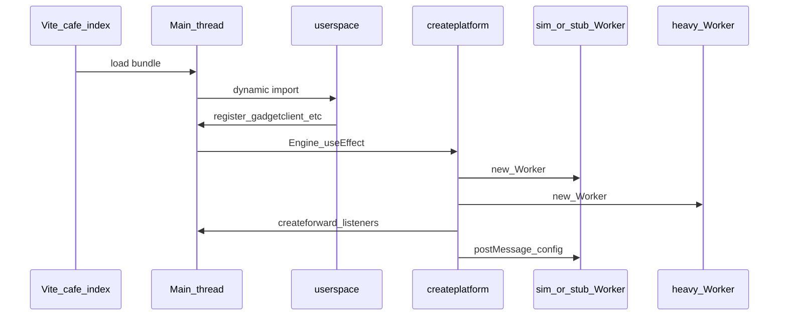
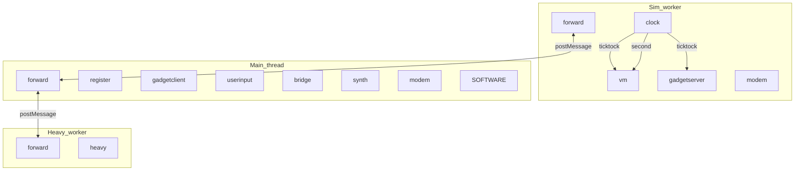
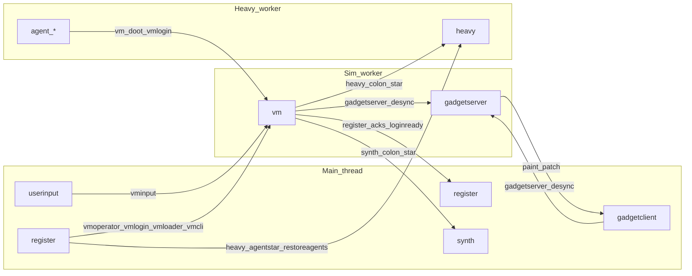
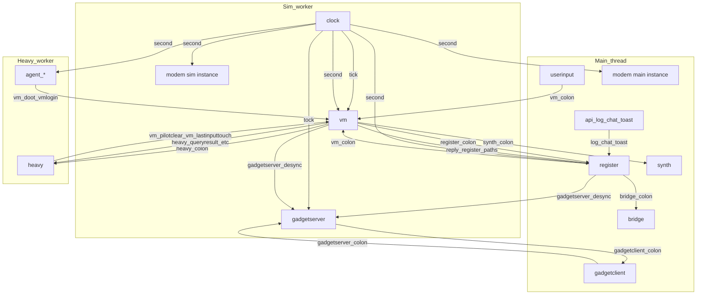

# Devices and messaging

How **devices** talk to each other in ZSS: **three JavaScript realms** (main thread, simulation worker, heavy worker), each with its own **`hub`**, plus **`forward`** bridging over `postMessage`, and the `SOFTWARE` emit surface.

**Context:** [zss/ARCHITECTURE.md](../../ARCHITECTURE.md) (full stack: cafe → Engine → platform → workers).

## Contents

- [Rules of the road](#rules-of-the-road)
- [What creates each thread or worker](#what-creates-each-thread-or-worker)
- [Where each device lives](#where-each-device-lives)
- [Diagram: three hubs and forward bridges](#diagram-three-hubs-and-forward-bridges)
- [Diagram: logical request paths (compact)](#diagram-logical-request-paths-compact)
- [Directed graph (full handler edges)](#directed-graph-who-handles-which-target)
- [Client → worker forwarding (reference)](#client--worker-forwarding-reference)
- [Discovering message targets](#discovering-message-targets)
- [Related: MIDI → `#play` import](../../feature/parse/docs/midi-import.md) (file loader → `parsemidi`, diagrams)

## Rules of the road

1. **`hub.invoke(message)`** delivers every message to **every** connected device; each device ignores or handles based on [routing rules](message-flow.md#routing-rules-devicehandle) (`device.ts` `createdevice`).
2. **Topics** — e.g. `ticktock`, `tock`, `second`, `ready`, `log` — match broadcast-style targets so multiple devices can observe the same clock or log line.
3. **Directed** targets use `deviceName:path` (e.g. `vm:cli` → the `vm` device sees `target === 'cli'`).
4. **Multiple hubs** — The browser runs **main-thread** code plus **Web Workers** (see [what creates each realm](#what-creates-each-thread-or-worker)). Each realm has its **own** `hub` singleton; `postMessage` + **`forward`** sync selected traffic ([`forward.ts`](../forward.ts), [`platform.ts`](../../platform.ts)).
5. **`SOFTWARE`** ([`session.ts`](../session.ts)) — A minimal `createdevice('SOFTWARE')` used as a **convenient `emit` sender** (session id from first `ready`). UI and chip code often call `SOFTWARE.emit(...)` so messages enter the **caller’s** hub with the right session.
6. **`MESSAGE`** ([`api.ts`](../api.ts)) — Shape: `session`, `player`, `id`, `sender`, `target`, `data`. **`reply(to, subtarget)`** / **`replynext`** emit a new message whose `target` is **`to.sender:subtarget`**, so the original sender’s device handles `subtarget` as `message.target` after routing.
7. **`message.id` deduplication** — [`createforward`](../forward.ts) records each `message.id` in a `syncids` set so the same message is not applied repeatedly when it crosses hubs (avoids ping-pong loops).

See also: [message-flow.md](message-flow.md) (ASCII + first mermaid, boot sequence, flow table).

---

## What creates each thread or worker

ZSS does not spawn OS threads; it uses the **browser main thread** and **dedicated Web Workers**. Each worker is its own JavaScript **realm** with a separate global `hub`.

### Main thread

| Piece | Role |
|--------|------|
| **Entry** | Vite loads [`cafe/index.tsx`](../../cafe/index.tsx) as the SPA shell (normal UI) or runs the **`bootheadless`** path when [`isclimode()`](../../feature/detect.ts) (Playwright / CLI-driven session, no Canvas). |
| **Main-hub devices** | `import('zss/userspace')` runs side effects that register **`register`**, **`gadgetclient`**, **`modem`**, **`bridge`**, **`synth`** ([`userspace.ts`](../../userspace.ts)). |
| **Worker construction** | [`createplatform(isstub, climode)`](../../platform.ts) runs **only here**. It calls `new simspace()` / `new stubspace()` and `new heavyspace()` (see below), installs `message` listeners, and wraps [`createforward`](../forward.ts) so the main hub and workers exchange `MESSAGE`s. |
| **Who calls `createplatform`** | [`zss/gadget/engine.tsx`](../../gadget/engine.tsx) — `useEffect` on mount (browser UI, passes `isjoin()` and `isclimode()`). [`cafe/index.tsx`](../../cafe/index.tsx) — `bootheadless()` after `userspace` (CLI). |
| **Teardown** | [`haltplatform()`](../../platform.ts) terminates both workers, removes listeners, and disconnects the main-thread forward device (Engine `useEffect` cleanup). |

### Simulation worker (`simspace` or `stubspace`)

| Piece | Role |
|--------|------|
| **Instantiation** | [`platform.ts`](../../platform.ts): `platform = isstub ? new stubspace() : new simspace()`. |
| **`isstub` (1st arg to `createplatform`)** | **`isjoin()`** ([`feature/url.ts`](../../feature/url.ts)): if the page URL contains **`/join/`**, the **stub** worker is used; otherwise the full **sim** worker. |
| **Bundler** | Vite worker entry: `./simspace??worker` or `./stubspace??worker` → [`simspace.ts`](../../simspace.ts) / [`stubspace.ts`](../../stubspace.ts). |
| **Boot inside worker** | **simspace** imports `clock`, `gadgetserver`, `modem`, [`forward`](../forward.ts), and (via `started`) the real **`vm`**. **stubspace** imports only **`stub`** + `forward` (minimal `vm`-named device). Both assign `onmessage` → `forward(event.data)` into the **worker-local** hub. |
| **Post-start config** | Main sends `platform.postMessage({ target: 'config', data: climode })`. **simspace** handles it and calls [`setclimode`](../../feature/detect.ts) with the 2nd arg to `createplatform`. **stubspace** does not special-case `config` (message is forwarded into the stub hub). |

### Heavy worker (`heavyspace`)

| Piece | Role |
|--------|------|
| **Instantiation** | [`platform.ts`](../../platform.ts): `heavy = new heavyspace()` whenever `createplatform` runs—**always**, in addition to sim or stub. |
| **Bundler** | `./heavyspace??worker` → [`heavyspace.ts`](../../heavyspace.ts). |
| **Boot inside worker** | Imports [`device/heavy`](../heavy.ts) (creates the **`heavy`** device on **this** hub only), then `createforward` + `onmessage` to post results back toward the main thread per [`shouldforwardheavytoclient`](../forward.ts). |

### Order of operations (typical browser UI)

CLI **`bootheadless`** ([`cafe/index.tsx`](../../cafe/index.tsx)) skips Canvas but still runs **`userspace`** then **`createplatform`** the same way; only the **`Engine` `useEffect`** trigger is replaced.

---

## Where each device lives

| Device | Hub / realm | Subscribes (topics) | Role |
|--------|----------------|---------------------|------|
| `forward` | main + worker (each `createforward` instance) | `all` | Copies messages across `postMessage`; dedupes by `message.id` |
| `clock` | sim worker only | — | Emits `ticktock`, `second` |
| `vm` | sim worker (real sim) | `ticktock`, `second` | Game VM, handlers under `vm/handlers/` |
| `stub` (`name` **`vm`**) | stub worker only | — | Minimal stand-in for `vm` when using stubspace ([`stub.ts`](../stub.ts)) |
| `gadgetserver` | sim worker | `tock`, `ticktock` | Builds gadget diff → `gadgetclient:paint` / `patch` |
| `modem` | **both** hubs (imported in sim + userspace) | `second` | Sync / presence (per-realm instance) |
| `register` | main | `ready`, `second`, `log`, `chat`, `toast` | UI edge: storage, tape, VM calls via `api` |
| `gadgetclient` | main | — | Applies paint/patch to zustand |
| `userinput` | main | — | Keyboard/gamepad → `vm:*` / `register:*`. Device is **not** loaded from [`userspace.ts`](../../userspace.ts); it is created as a **side effect** of importing [`userinput.tsx`](../../gadget/userinput.tsx) when the UI mounts (e.g. [`Engine`](../../gadget/engine.tsx) → `UserFocus`, tape/terminal/editor imports). |
| `bridge` | main | — | `bridge:*` multiplayer / fetch / streams |
| `synth` | main | — | `synth:*` audio |
| `heavy` | **heavy worker** hub ([`heavyspace.ts`](../../heavyspace.ts)) | — | TTS / LLM, **`heavy:agent*`** lifecycle ([`heavy.ts`](../heavy.ts), [`agentlifecycle.ts`](../../feature/heavy/agentlifecycle.ts)); reached via main `forward` → `postMessage` |
| `agent_<pid>` | **heavy worker** (per agent) | `second` | Keepalive → `vm:doot` ([`agent.ts`](../../feature/heavy/agent.ts)); roster persisted in IDB `storage` as `agents_roster` via `register:store` |
| `SOFTWARE` | whichever hub loaded it | — | Session holder + `emit` helper |
| **Ephemeral** `createdevice` | varies | — | e.g. one-off TTS in [`feature/tts.ts`](../../feature/tts.ts) |

**stubspace** ([`stubspace.ts`](../../stubspace.ts)) only boots **stub** + **forward** (no clock / gadgetserver / modem imports there). **simspace** ([`simspace.ts`](../../simspace.ts)) boots clock, gadgetserver, modem, vm, and forward.

> **Join / stub mode** — When the URL matches [`isjoin()`](../../feature/url.ts) (`/join/`), **`stubspace`** runs instead of **`simspace`**: there is **no** `clock`, **`gadgetserver`**, or sim **`modem`**. The threaded diagrams below are **sim-first**; in stub mode rely on this table and [what creates each thread or worker](#what-creates-each-thread-or-worker).

---

## Diagram: three hubs and forward bridges

Solid arrows = **same hub** (`hub.invoke`). Each JavaScript realm has its own `hub` and a **`forward`** device from [`createforward`](../forward.ts); [`platform.ts`](../../platform.ts) wires **sim worker ↔ main** and **main ↔ heavy worker** with `postMessage`.

Mermaid subgraph labels use **`Sim_worker`**, **`Main_thread`**, **`Heavy_worker`** consistently across diagrams in this doc.

**What crosses which bridge**

- **Sim ↔ main** — `vm:*`, `modem:*`, `gadgetserver:*` (and related `desync` / `sync` / `joinack` paths) per [`shouldforwardclienttoserver`](../forward.ts) / [`shouldforwardservertoclient`](../forward.ts). **Gadget paint/patch** is `gadgetclient:*` from worker → main UI; **desync** from client → worker.
- **Main ↔ heavy** — `heavy:*`, `second`, `ready`, and related ack paths per [`shouldforwardclienttoheavy`](../forward.ts) and server→client rules.

**`vm:*`, `register:*`, `synth:*`** — Many entrypoints are listed in [`api.ts`](../api.ts).

---

## Diagram: logical request paths (compact)

**Role:** small **mental-model** graph (major flows only). For **full** emitter/handler detail, **`second`** splits, and **`modem`** sim vs main, see [Directed graph (full handler edges)](#directed-graph-who-handles-which-target).

**Subgraphs = JavaScript realm.** Arrows that **cross** a boundary imply **`forward` + `postMessage`** (or main↔heavy), except where both endpoints sit in one realm.

---

## Directed graph (who handles which `target`)

The hub still delivers every message to every device; this section is the **intended routing**: an edge **Emitter → Handler** labeled **`prefix`** means traffic is usually emitted from the **emitter side** (or its firmware/chips) with `message.target` equal to **`prefix`** or **`prefix:…`** (first path segment names the handler device). **Subgraphs below are browser threads / workers**; an arrow that **crosses** a subgraph border uses **`forward`** + `postMessage` (same rules as [topology](#diagram-three-hubs-and-forward-bridges)).

**Role:** **full** graph including **`second`** fan-out and two **`modem`** instances. For a smaller picture, see [Diagram: logical request paths (compact)](#diagram-logical-request-paths-compact).

### Mermaid: primary handler edges (by thread)

**Readout**

- **Sim worker** — `clock`, `vm`, `gadgetserver`, one **`modem`** instance ([`simspace.ts`](../../simspace.ts)).
- **Main thread** — `register`, `gadgetclient`, `userinput`, `bridge`, `synth`, second **`modem`** instance ([`userspace.ts`](../../userspace.ts)), and `api`-driven emits (**`apihelpers`**); chips/UI often use **`SOFTWARE`** on whichever hub loaded them (sim for game logic).
- **Heavy worker** — `heavy` plus dynamic **`agent_*`** devices ([`heavyspace.ts`](../../heavyspace.ts), [`feature/heavy/agent.ts`](../../feature/heavy/agent.ts)).
- **`second`** — `clock` runs on sim; **`register`**, **main `modem`**, and **`heavy`/`agent_*`** receive **`second`** after **sim → main** forward (and main → heavy where applicable), same tick as sim-local `vm` / `modemSim`.

Notes:

- **`reply_register_paths`** — `vm.reply` / `vm.replynext` send to `register:ackoperator`, `register:acklogin`, `register:ackzsswords`, `register:acklook`, etc. (see [`vm/handlers/`](../vm/handlers/)).
- **`agent_*`** — Dynamic [`agent_${pid}`](../../feature/heavy/agent.ts) on the **heavy worker** hub; `second` (forwarded to heavy) drives `vm:doot`. Roster is stored under **`agents_roster`** in IDB (`storagewritevar`); **`register`** triggers **`heavy:restoreagents`** after successful **`acklogin`**. Agent **`vm:login`** merges book flags on the sim (including **`agent: 1`**); chat routing in [`loader.ts`](../vm/handlers/loader.ts) uses board **player** elements whose book flags mark them as agents (`flags.agent === 1`), not a separate sim roster. For each candidate line, the sim sends **`heavy:modelprompt`** with the message text, agent id/name, **nearest-agent** reference (id + display name), and related fields. On [`heavy`](../heavy.ts), **`heavy:modelprompt`**, **`heavy:llmpreset`**, **`heavy:ttsinfo`**, and **`heavy:ttsrequest`** share one **single serial FIFO** ([`heavyjobqueue.ts`](../../feature/heavy/heavyjobqueue.ts) `enqueueheavyjob`): the worker runs at most one such job at a time. For **`heavy:modelprompt`**, it runs the small **classifier** first; only if intent is not `none` does it await the full **agent LLM** (`modelgenerate` / `runagentprompt`) for that item before starting the next queued item.
- **`apihelpers`** — [`api.ts`](../api.ts) `apilog` → `log`, `apichat` → `chat`, `apitoast` → `toast` (**`register`** subscribes to those topics). Call sites can be sim or main; **`emit`** always hits the **caller's** hub first.
- **`ready`** — [`vm`](../vm.ts) or [`stub`](../stub.ts) (device name `vm`) emits via [`platformready`](../api.ts); all devices may capture session on first `ready` (not shown as edges to every node).
- **`SOFTWARE.emit`** from chips / UI uses targets like `{chipId}:message`; routing is per-device id, not the `vm` node (see [`chip.ts`](../../chip.ts), [`gamesend.ts`](../../memory/gamesend.ts)).

### Table: `target` prefix → handler device + thread

| First segment of `target` | Handler device | Handler thread | Mostly emitted from (typical) | Emitter thread |
|---------------------------|----------------|----------------|-------------------------------|----------------|
| `tick` | `vm` | Sim worker | `clock` | Sim worker |
| `tock` | `gadgetserver` | Sim worker | `clock` | Sim worker |
| `second` | `vm` | Sim worker | `clock` | Sim worker |
| `second` | `modem` | Sim **or** main (two instances) | `clock` | Sim → forward → main |
| `second` | `register` | Main thread | `clock` (forwarded) | Sim → main |
| `second` | `heavy`, `agent_*` | Heavy worker | `clock` / main forward | Sim / main → heavy |
| `ready` | all devices | per hub | `vm` / stub, [`platformready`](../api.ts) | Sim (or stub worker) |
| `sessionreset` | all devices | per hub | [`sessionreset`](../api.ts) | usually main (`SOFTWARE`) |
| `vm` | `vm` | Sim worker | `register`, `userinput`, `api`, `heavy` (`vm:pilotclear`, `vm:lastinputtouch`), `SOFTWARE` | Main / sim / heavy → sim |
| `register` | `register` | Main thread | `vm` (replies), `userinput`, `api` | Sim → main / main |
| `gadgetserver` | `gadgetserver` | Sim worker | `gadgetclient`, `register`, `api` | Main → sim |
| `gadgetclient` | `gadgetclient` | Main thread | `gadgetserver`, `api` | Sim → main / main |
| `heavy` | `heavy` | Heavy worker | `vm`, `api`, [`query`](../vm/handlers/query.ts), [`pilot`](../vm/handlers/pilot.ts), **`heavy:modelprompt`** (serial: classify then optional full prompt), **`heavy:agent*`** / `heavy:restoreagents`, **`heavy:queryresult`** (sim → heavy, VM query replies) | Sim / main → heavy |
| `synth` | `synth` | Main thread | `api` / firmware | Sim → main / main |
| `bridge` | `bridge` | Main thread | `api` | Main |
| `log` | `register` (topic) | Main thread | `api` `apilog`, firmware | any hub → often main |
| `chat` | `register` (topic) | Main thread | `api` `apichat` | any hub → often main |
| `toast` | `register` (topic) | Main thread | `api` `apitoast` | any hub → often main |
| `{chipId}` | matching device id | **same hub as that chip** | `SOFTWARE.emit` from [`gamesend`](../../memory/gamesend.ts) / [`chip`](../../chip.ts) | Sim (typical) |

**Topic vs directed for `register`:** `log`, `chat`, and `toast` use targets with **no** `:` — they match **`register`’s subscribed topics**, not `register:something` directed paths. Other `register:*` messages (e.g. `register:terminal:open`) are directed; see [Rules of the road](#rules-of-the-road) and [`device.ts`](../device.ts) `parsetarget`.

Nested paths (`register:terminal:open`, `gadgetclient:paint`) still belong to the device named in the **first** segment; `register`’s handler sees the remainder as `message.target` after routing ([`device.ts`](../../device.ts) `parsetarget`).

### Machine-readable source

Stable names for **`vm:*`**, **`register:*`**, **`synth:*`**, **`bridge:*`**, **`heavy:*`**, **`gadgetclient:*`**, **`gadgetserver:*`** are the string literals passed to `device.emit` in [`device/api.ts`](../api.ts). `vm` subtargets are dispatched in [`vm/handlers/registry.ts`](../vm/handlers/registry.ts).

---

## Client → worker forwarding (reference)

[`shouldforwardclienttoserver`](../forward.ts) routes these **target prefixes** from the main thread toward the sim worker (not exhaustive for every subpath):

- `vm:*`
- `modem:*`
- `gadgetserver:*`
- plus paths ending with `sync`, `desync`, `joinack` on composite targets

**Heavy** and **second** / **ready** follow [`shouldforwardclienttoheavy`](../forward.ts). Tick/tock are generally **not** forwarded to heavy.

---

## Discovering message targets

- **Tables** — [message-flow.md § Main message flows](message-flow.md#main-message-flows)
- **API helpers** — [`device/api.ts`](../api.ts) (`vmcli`, `gadgetclientpaint`, `heavyttsrequest`, …)
- **Handlers** — [`vm/handlers/registry.ts`](../vm/handlers/registry.ts) maps `vm` subtargets to implementations
- **Tests** — [`device/__tests__/device.test.ts`](../__tests__/device.test.ts) (`createdevice`, session, topics)

**Maintenance** — When you change cross-realm routing, update [`forward.ts`](../forward.ts) `shouldforward*` helpers and keep this doc (and optionally [message-flow.md](message-flow.md)) in sync.
