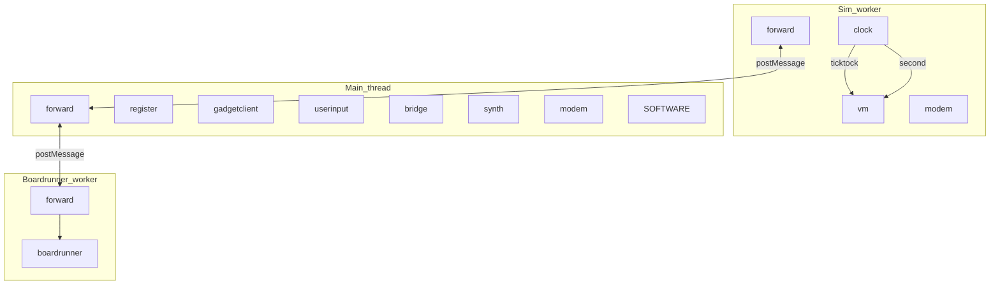
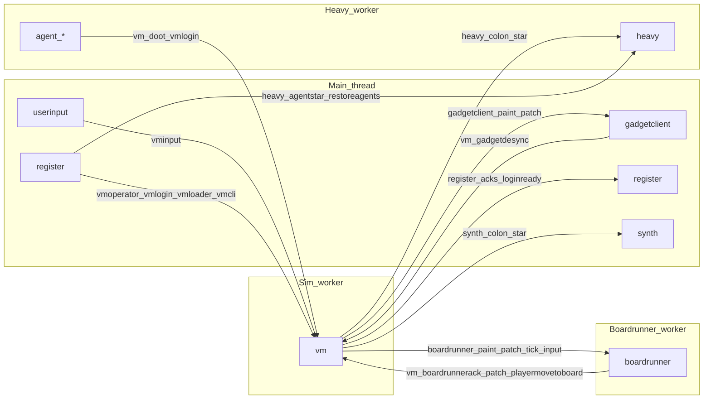
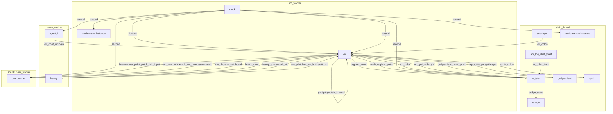
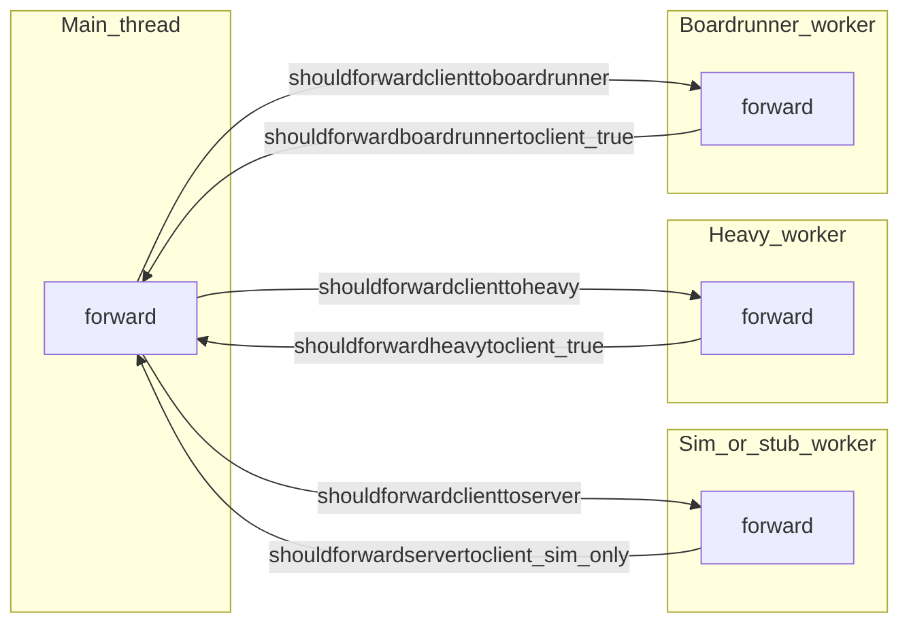
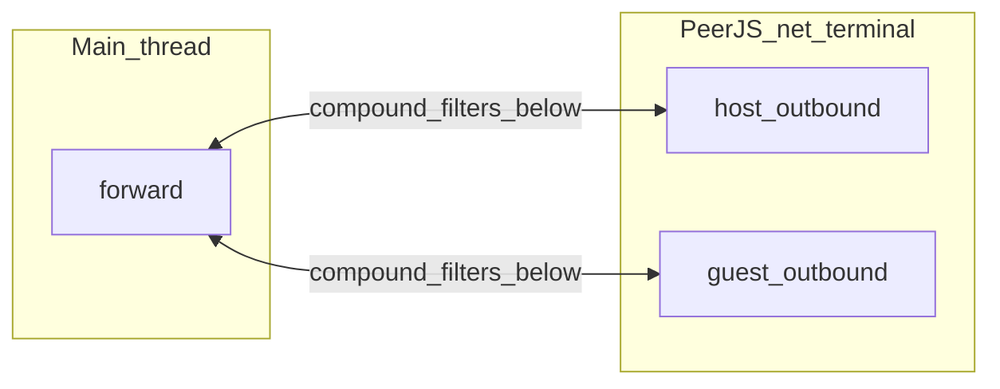

# Devices and messaging

How **devices** talk to each other in ZSS: **main thread**, **simulation worker**, **boardrunner worker**, and on-demand **TTS/STT workers**, each with its own **`hub`**, plus **`forward`** bridging over `postMessage`, and the `SOFTWARE` emit surface.

**Context:** [zss/ARCHITECTURE.md](../../ARCHITECTURE.md) (full stack: cafe → Engine → platform → workers).

## Contents

- [Rules of the road](#rules-of-the-road)
- [What creates each thread or worker](#what-creates-each-thread-or-worker)
- [Where each device lives](#where-each-device-lives)
- [Diagram: hubs and forward bridges](#diagram-hubs-and-forward-bridges)
- [Diagram: logical request paths (compact)](#diagram-logical-request-paths-compact)
- [Directed graph (full handler edges)](#directed-graph-who-handles-which-target)
- [Client → worker forwarding (reference)](#client--worker-forwarding-reference)
- [Unified routing: workers, PEER, and blocked traffic](#unified-routing-workers-peer-and-blocked-traffic)
- [Discovering message targets](#discovering-message-targets)
- [Related: MIDI → `#play` import](../../feature/parse/docs/midi-import.md) (file loader → `parsemidi`, diagrams)

## Rules of the road

1. **`hub.invoke(message)`** delivers every message to **every** connected device; each device ignores or handles based on [routing rules](message-flow.md#routing-rules-devicehandle) ([`createdevice`](../../device.ts) in `zss/device.ts`).
2. **Topics** — e.g. `ticktock`, `tock`, `second`, `ready`, `log` — match broadcast-style targets so multiple devices can observe the same clock or log line.
3. **Directed** targets use `deviceName:path` (e.g. `vm:cli` → the `vm` device sees `target === 'cli'`).
4. **Multiple hubs** — The browser runs **main-thread** code plus **Web Workers** (see [what creates each realm](#what-creates-each-thread-or-worker)). Each realm has its **own** `hub` singleton; `postMessage` + **`forward`** sync selected traffic ([`forward.ts`](../forward.ts), [`platform.ts`](../../platform.ts)).
5. **`SOFTWARE`** ([`session.ts`](../session.ts)) — A minimal `createdevice('SOFTWARE')` used as a **convenient `emit` sender** (session id from first `ready`). UI and chip code often call `SOFTWARE.emit(...)` so messages enter the **caller’s** hub with the right session.
6. **`MESSAGE`** ([`api.ts`](../api.ts)) — Shape: `session`, `player`, `id`, `sender`, `target`, `data`. **`reply(to, subtarget)`** / **`replynext`** emit a new message whose `target` is **`to.sender:subtarget`**, so the original sender’s device handles `subtarget` as `message.target` after routing.
7. **POD emit surface vs patch encoding** — [`api.ts`](../api.ts) is the **worker-safe** set of `device.emit(...)` helpers: runtime imports are limited to [`messagetypes.ts`](../messagetypes.ts) and [`mapping/types`](../../mapping/types.ts); domain signatures use **`import type` only**. **Jsonpipe patch wire encoding** (`encodepatchwire`) lives in [`patchapi.ts`](../patchapi.ts) (`boardrunnerpatch`, `gadgetclientpatch`, `vmboardrunnerpatch`); call sites that emit patches import `patchapi` explicitly. ESLint enforces the import boundary on `api.ts`.
8. **`message.id` deduplication** — [`createforward`](../forward.ts) records each `message.id` in a `syncids` set so the same message is not applied repeatedly when it crosses hubs (avoids ping-pong loops).
9. **`registerplayer` vs `register`** — [`registerplayer.ts`](../registerplayer.ts) holds the current player id string only (worker-safe). [`register.ts`](../register.ts) is the thin main-thread device entry; handlers live under [`register/handlers/`](../register/handlers/registry.ts) (storage, UI, bookmarks). Workers and device modules that only need `registerreadplayer()` must import `registerplayer`, not `register`.

See also: [message-flow.md](message-flow.md) (ASCII + first mermaid, boot sequence, flow table).

> **Obsolete references:** Later sections may still mention **`heavyspace`**, **`#agent`**, or **`heavy:*`** from before agent removal. Current inference workers are **ttsspace** / **sttspace** only.

---

## What creates each thread or worker

ZSS does not spawn OS threads; it uses the **browser main thread** and **dedicated Web Workers**. Each worker is its own JavaScript **realm** with a separate global `hub`.

### Main thread

| Piece | Role |
|--------|------|
| **Entry** | Vite loads [`cafe/index.tsx`](../../../cafe/index.tsx) as the SPA shell (normal UI) or runs the **`bootheadless`** path when [`isclimode()`](../../feature/detect.ts) (Playwright / CLI-driven session, no Canvas). |
| **Main-hub devices** | `import('zss/userspace')` runs side effects that register **`register`**, **`gadgetclient`**, **`modem`**, **`bridge`**, **`synth`** ([`userspace.ts`](../../userspace.ts)). |
| **Worker construction** | [`createplatform(isstub, climode)`](../../platform.ts) runs **only here**. It calls `new simspace()` / `new stubspace()` and `new boardrunnerspace()` (see below), installs `message` listeners, and wraps [`createforward`](../forward.ts) so the main hub and workers exchange `MESSAGE`s. **ttsspace** / **sttspace** start on demand via `ensurettsworker()` / `ensuresttworker()`. |
| **Who calls `createplatform`** | [`zss/gadget/engine.tsx`](../../gadget/engine.tsx) — `useEffect` on mount (browser UI, passes `isjoin()` and `isclimode()`). [`cafe/index.tsx`](../../../cafe/index.tsx) — `bootheadless()` after `userspace` (CLI). |
| **Teardown** | [`haltplatform()`](../../platform.ts) terminates sim/stub, boardrunner, and any TTS/STT workers, removes listeners, and disconnects the main-thread forward device (Engine `useEffect` cleanup). |

### Simulation worker (`simspace` or `stubspace`)

| Piece | Role |
|--------|------|
| **Instantiation** | [`platform.ts`](../../platform.ts): `platform = isstub ? new stubspace() : new simspace()`. |
| **`isstub` (1st arg to `createplatform`)** | **`isjoin()`** ([`feature/url.ts`](../../feature/url.ts)): if the page URL contains **`/join/`**, the **stub** worker is used; otherwise the full **sim** worker. |
| **Bundler** | Vite worker entry: `./simspace??worker` or `./stubspace??worker` → [`simspace.ts`](../../simspace.ts) / [`stubspace.ts`](../../stubspace.ts). |
| **Boot inside worker** | **simspace** imports `clock`, `modem`, [`forward`](../forward.ts), and (via `started`) the real **`vm`** — the VM tick is what produces gadget paint/patch through [`gadgetsynctick`](../vm/gadgetsynctick.ts) (no separate `gadgetserver` device). **stubspace** imports only **`stub`** + `forward` (minimal `vm`-named device). Both assign `onmessage` → `forward(event.data)` into the **worker-local** hub. |
| **Post-start config** | Main sends `platform.postMessage({ target: 'config', data: climode })`. **simspace** handles it and calls [`setclimode`](../../feature/detect.ts) with the 2nd arg to `createplatform`. **stubspace** does not special-case `config` (message is forwarded into the stub hub). |

### Boardrunner worker (`boardrunnerspace`)

| Piece | Role |
|--------|------|
| **Instantiation** | [`platform.ts`](../../platform.ts): `boardrunner = new boardrunnerspace()` whenever `createplatform` runs—**always**, alongside sim or stub. |
| **Bundler** | `./boardrunnerspace??worker` → [`boardrunnerspace.ts`](../../boardrunnerspace.ts). |
| **Boot inside worker** | Imports [`device/boardrunner`](../boardrunner.ts) (creates the **`boardrunner`** device on **this** hub only; handlers in [`boardrunner/`](../boardrunner/handlers/)), then `createforward` + `onmessage` per [`shouldforwardboardrunnertoclient`](../forward.ts). The boardrunner device receives **memory + boundary jsonpipe** snapshots/patches (`boardrunner:paint` / `boardrunner:patch`), runs [`memorytickmain`](../../memory/runtime.ts) for whichever board it is currently elected on, and emits boundary patches back to the sim VM as `vm:boardrunnerack` / `vm:boardrunnerpatch`. |

### Order of operations (typical browser UI)

CLI **`bootheadless`** ([`cafe/index.tsx`](../../../cafe/index.tsx)) skips Canvas but still runs **`userspace`** then **`createplatform`** the same way; only the **`Engine` `useEffect`** trigger is replaced.

---

## Where each device lives

| Device | Hub / realm | Subscribes (topics) | Role |
|--------|----------------|---------------------|------|
| `forward` | main + each worker (one `createforward` instance per realm) | `all` | Copies messages across `postMessage`; dedupes by `message.id` |
| `clock` | sim worker only | — | Emits `ticktock`, `second` |
| `vm` | sim worker (real sim) | `ticktock`, `second` | Game VM. Handlers in [`vm/handlers/`](../vm/handlers/) (registry: [`registry.ts`](../vm/handlers/registry.ts)). On every `ticktock` it runs the player gadget projection ([`gadgetsynctick`](../vm/gadgetsynctick.ts)), elects/evicts boardrunners, jsonpipe-syncs memory + boundaries to the boardrunner worker ([`boardrunnermemorysync`](../vm/boardrunnermemorysync.ts), [`boardrunnerboundarysync`](../vm/boardrunnerboundarysync.ts)), and emits `boardrunner:tick` to each runner. |
| `stub` (`name` **`vm`**) | stub worker only | — | Minimal stand-in for `vm` when using stubspace ([`stub.ts`](../stub.ts)) |
| `modem` | **both** hubs (imported in sim + userspace) | `second` | Sync / presence (per-realm instance) |
| `register` | main | `ready`, `second`, `log`, `chat`, `toast` | UI edge: storage, tape, VM calls via `api`; on `acklogin` triggers a `vm:gadgetdesync` so the worker repaints. |
| `gadgetclient` | main | — | Applies `gadgetclient:paint` / `patch` (jsonpipe) to zustand state ([`gadget/data/state.ts`](../../gadget/data/state.ts)); replies `desync` on bad patches |
| `userinput` | main | — | Keyboard/gamepad → `vm:*` / `register:*`. Device is **not** loaded from [`userspace.ts`](../../userspace.ts); it is created as a **side effect** of importing [`userinput.tsx`](../../gadget/userinput.tsx) when the UI mounts (e.g. [`Engine`](../../gadget/engine.tsx) → `UserFocus`, tape/terminal/editor imports). |
| `bridge` | main | — | `bridge:*` multiplayer / fetch / streams |
| `synth` | main | — | `synth:*` audio |
| `tts` / `stt` | **tts** / **stt** worker hubs ([`ttsspace.ts`](../../ttsspace.ts), [`sttspace.ts`](../../sttspace.ts)) | — | On-demand ONNX inference; reached via main `forward` → `postMessage` |
| `boardrunner` | **boardrunner worker** hub ([`boardrunnerspace.ts`](../../boardrunnerspace.ts)) | `vm` | Real per-board sim ([`boardrunner.ts`](../boardrunner.ts), [`boardrunner/`](../boardrunner/)); receives `boardrunner:paint` / `patch` (memory + per-boundary jsonpipe), `boardrunner:tick` (board id + timestamp + boundary list), and `boardrunner:input`; runs [`memorytickmain`](../../memory/runtime.ts) for the assigned board and emits boundary patches back as `vm:boardrunnerack` / `vm:boardrunnerpatch`. Also subscribes to topic `vm` so chip / scroll / sidebar messages (`vm:CHIP:LABEL`) reach `memorymessagechip` on the worker that actually runs the chips. Forwarded by [`shouldforwardclienttoboardrunner`](../forward.ts). |
| `SOFTWARE` | whichever hub loaded it | — | Session holder + `emit` helper |
| **Ephemeral** `createdevice` | varies | — | e.g. one-off TTS in [`feature/tts.ts`](../../feature/tts.ts) |

**stubspace** ([`stubspace.ts`](../../stubspace.ts)) only boots **stub** + **forward** (no clock / modem imports there). **simspace** ([`simspace.ts`](../../simspace.ts)) boots clock, modem, vm, and forward — gadget paint/patch is produced by the VM tick directly (no `gadgetserver` device any more).

> **Join / stub mode** — When the URL matches [`isjoin()`](../../feature/url.ts) (`/join/`), **`stubspace`** runs instead of **`simspace`**: there is **no** `clock` or sim **`modem`**, and the stub `vm` has no real handlers. The threaded diagrams below are **sim-first**; in stub mode rely on this table and [what creates each thread or worker](#what-creates-each-thread-or-worker).

---

## Diagram: hubs and forward bridges

Solid arrows = **same hub** (`hub.invoke`). Each JavaScript realm has its own `hub` and a **`forward`** device from [`createforward`](../forward.ts); [`platform.ts`](../../platform.ts) wires **sim worker ↔ main**, **main ↔ boardrunner worker**, and **main ↔ tts/stt workers** (on demand) with `postMessage`.

Mermaid subgraph labels use **`Sim_worker`**, **`Main_thread`**, **`Boardrunner_worker`** consistently across diagrams in this doc.

**What crosses which bridge**

- **Sim ↔ main** — `vm:*`, `modem:*`, `gadgetclient:*` paint/patch (sim → main), and `desync` / `sync` / `joinack` paths per [`shouldforwardclienttoserver`](../forward.ts) / [`shouldforwardservertoclient`](../forward.ts).
- **Main ↔ boardrunner** — `boardrunner:*`, `vm:*`, `second`, `ready` per [`shouldforwardclienttoboardrunner`](../forward.ts). `vm:*` is forwarded so scroll / sidebar / chip-routed messages reach the chip OS on the boardrunner (which subscribes to topic `vm` and hands them to [`memorymessagechip`](../../memory/runtime.ts)) — they continue to reach the sim VM as well.
- **Main ↔ tts/stt** — `tts:*` / `stt:*` when workers are started on demand.
- **Boardrunner ↔ sim** — Both directions are routed via main: [`platform.ts`](../../platform.ts) inspects each cross-realm message and, if it matches the destination's `shouldforward*` predicate, also `postMessage`s it to that worker. So a boardrunner-emitted `vm:boardrunnerpatch` reaches the sim VM without ever entering main's hub.

**`vm:*`, `register:*`, `synth:*`** — Many entrypoints are listed in [`api.ts`](../api.ts).

---

## Diagram: logical request paths (compact)

**Role:** small **mental-model** graph (major flows only). For **full** emitter/handler detail, **`second`** splits, and **`modem`** sim vs main, see [Directed graph (full handler edges)](#directed-graph-who-handles-which-target).

**Subgraphs = JavaScript realm.** Arrows that **cross** a boundary imply **`forward` + `postMessage`** (or main↔heavy), except where both endpoints sit in one realm.

---

## Directed graph (who handles which `target`)

The hub still delivers every message to every device; this section is the **intended routing**: an edge **Emitter → Handler** labeled **`prefix`** means traffic is usually emitted from the **emitter side** (or its firmware/chips) with `message.target` equal to **`prefix`** or **`prefix:…`** (first path segment names the handler device). **Subgraphs below are browser threads / workers**; an arrow that **crosses** a subgraph border uses **`forward`** + `postMessage` (same rules as [topology](#diagram-hubs-and-forward-bridges)).

**Role:** **full** graph including **`second`** fan-out and two **`modem`** instances. For a smaller picture, see [Diagram: logical request paths (compact)](#diagram-logical-request-paths-compact).

### Mermaid: primary handler edges (by thread)

**Readout**

- **Sim worker** — `clock`, `vm`, one **`modem`** instance ([`simspace.ts`](../../simspace.ts)). Gadget paint/patch is produced **inside** the VM tick by [`gadgetsynctick`](../vm/gadgetsynctick.ts) and emitted as `gadgetclient:paint` / `gadgetclient:patch`; there is no separate `gadgetserver` device any more.
- **Main thread** — `register`, `gadgetclient`, `userinput`, `bridge`, `synth`, second **`modem`** instance ([`userspace.ts`](../../userspace.ts)), and `api`-driven emits (**`apihelpers`**); chips/UI often use **`SOFTWARE`** on whichever hub loaded them (sim for game logic).
- **Heavy worker** — `heavy` hub ([`heavyspace.ts`](../../heavyspace.ts), [`agentlifecycle.ts`](../../feature/heavy/agentlifecycle.ts)). LLM and per-tab agent copilot sessions; TTS moved to **ttsspace**.
- **TTS worker** — `tts` device ([`ttsspace.ts`](../../ttsspace.ts), [`ttsworker.ts`](../ttsworker.ts)); lazy spawn via `ensurettsworker()` on first `tts:info` / `tts:request`.
- **STT worker** — `stt` device ([`sttspace.ts`](../../sttspace.ts), [`sttworker.ts`](../sttworker.ts)); lazy spawn via `ensuresttworker()` on first `stt:*`.
- **Boardrunner worker** — `boardrunner` device ([`boardrunnerspace.ts`](../../boardrunnerspace.ts), [`boardrunner.ts`](../boardrunner.ts), [`boardrunner/handlers/`](../boardrunner/handlers/)). The sim VM elects one player per active board to be its runner each tick ([`boardrunnermanagement.ts`](../vm/boardrunnermanagement.ts)). The runner receives memory + per-boundary jsonpipe paint/patch plus `boardrunner:tick`, runs [`memorytickmain`](../../memory/runtime.ts) for that board, and replies with `vm:boardrunnerack` and one `vm:boardrunnerpatch` per dirty boundary.
- **`second`** — `clock` runs on sim; **`register`**, **main `modem`**, **`heavy`**, and **`boardrunner`** receive **`second`** after **sim → main** forward (and main → heavy / boardrunner where applicable), same tick as sim-local `vm` / `modemSim`.

Notes:

- **`reply_register_paths`** — `vm.reply` / `vm.replynext` send to `register:ackoperator`, `register:acklogin`, `register:ackzsswords`, `register:acklook`, etc. (see [`vm/handlers/`](../vm/handlers/)).
- **Agent copilot** — One LLM session per tab keyed to the **register player** ([`agentlifecycle.ts`](../../feature/heavy/agentlifecycle.ts)). No `vm:login`, no board element, no per-agent boardrunner. Roster `{ name }` is stored under **`agents_roster`** in IDB; **`register`** triggers **`heavy:restoreagents`** after **`acklogin`**. Board chat on a board where the **operator** is present routes **`heavy:modelprompt`** to that player when a session is active ([`loader.ts`](../vm/handlers/loader.ts)). CLI actions use **`vm:cli`** as the register player; board reads use **`vm:query`** `boardstate`. On [`heavy`](../heavy.ts), **`heavy:modelprompt`** and **`heavy:llmpreset`** share one **single serial FIFO** ([`heavyjobqueue.ts`](../../feature/heavy/heavyjobqueue.ts) `enqueueheavyjob`). TTS (`tts:info` / `tts:request`) runs in **ttsspace** independently via [`ttsworker.ts`](../ttsworker.ts). For **`heavy:modelprompt`**, it runs the small **classifier** first; only if intent is not `none` does it await the full **agent LLM** (`modelgenerate` / `runagentprompt`) for that item before starting the next queued item.
- **`apihelpers`** — [`api.ts`](../api.ts) `apilog` → `log`, `apichat` → `chat`, `apitoast` → `toast` (**`register`** subscribes to those topics). Call sites can be sim or main; **`emit`** always hits the **caller's** hub first.
- **`ready`** — [`vm`](../vm.ts) or [`stub`](../stub.ts) (device name `vm`) emits via [`platformready`](../api.ts); all devices may capture session on first `ready` (not shown as edges to every node).
- **`SOFTWARE.emit`** from chips / UI uses targets like `{chipId}:message`; routing is per-device id, not the `vm` node (see [`chip.ts`](../../chip.ts), [`gamesend.ts`](../../memory/gamesend.ts)).

### Table: `target` prefix → handler device + thread

| First segment of `target` | Handler device | Handler thread | Mostly emitted from (typical) | Emitter thread |
|---------------------------|----------------|----------------|-------------------------------|----------------|
| `ticktock` | `vm` | Sim worker | `clock` | Sim worker |
| `second` | `vm` | Sim worker | `clock` | Sim worker |
| `second` | `modem` | Sim **or** main (two instances) | `clock` | Sim → forward → main |
| `second` | `register` | Main thread | `clock` (forwarded) | Sim → main |
| `second` | `heavy` | Heavy worker | `clock` / main forward | Sim / main → heavy |
| `second` | `boardrunner` | Boardrunner worker | `clock` / main forward | Sim / main → boardrunner |
| `boardrunner` | `boardrunner` | Boardrunner worker | `vm` (`boardrunner:paint`, `boardrunner:patch`, `boardrunner:tick`, `boardrunner:idle`, `boardrunner:thud`, `boardrunner:start`), `userinput` (`boardrunner:input`) | Sim / main → boardrunner |
| `ready` | all devices | per hub | `vm` / stub, [`platformready`](../api.ts) | Sim (or stub worker) |
| `sessionreset` | all devices | per hub | [`sessionreset`](../api.ts) | usually main (`SOFTWARE`) |
| `vm` | `vm` | Sim worker | `register`, `userinput`, `api`, `heavy` (`vm:pilotclear`, `vm:lastinputtouch`), `boardrunner` (`vm:boardrunnerack`, `vm:boardrunnerpatch`, `vm:playermovetoboard`), `gadgetclient` (`vm:gadgetdesync` reply), `SOFTWARE` | Main / sim / heavy / boardrunner → sim |
| `register` | `register` | Main thread | `vm` (replies), `userinput`, `api` | Sim → main / main |
| `gadgetclient` | `gadgetclient` | Main thread | `vm` ([`gadgetsynctick`](../vm/gadgetsynctick.ts) → `gadgetclient:paint` / `gadgetclient:patch`), `api` | Sim → main / main |
| `heavy` | `heavy` | Heavy worker | `vm`, `api`, [`query`](../vm/handlers/query.ts), [`pilot`](../vm/handlers/pilot.ts), **`heavy:modelprompt`** (serial: classify then optional full prompt), **`heavy:agent*`** / `heavy:restoreagents`, **`heavy:queryresult`** (sim → heavy, VM query replies) | Sim / main → heavy |
| `tts` | `tts` | TTS worker (lazy) | `synth` / [`feature/tts.ts`](../../feature/tts.ts) via **`tts:info`**, **`tts:request`** | Main → ttsspace |
| `stt` | `stt` | STT worker (lazy) | terminal mic / [`sttclient.ts`](../../feature/stt/sttclient.ts) via **`stt:*`** | Main → sttspace |
| `synth` | `synth` | Main thread | `api` / firmware | Sim → main / main |
| `bridge` | `bridge` | Main thread | `api` | Main |
| `log` | `register` (topic) | Main thread | `api` `apilog`, firmware | any hub → often main |
| `chat` | `register` (topic) | Main thread | `api` `apichat` | any hub → often main |
| `toast` | `register` (topic) | Main thread | `api` `apitoast` | any hub → often main |
| `{chipId}` | matching device id | **same hub as that chip** | `SOFTWARE.emit` from [`gamesend`](../../memory/gamesend.ts) / [`chip`](../../chip.ts) | Sim / boardrunner (typical) |

**Topic vs directed for `register`:** `log`, `chat`, and `toast` use targets with **no** `:` — they match **`register`’s subscribed topics**, not `register:something` directed paths. Other `register:*` messages (e.g. `register:terminal:open`) are directed; see [Rules of the road](#rules-of-the-road) and [`device.ts`](../../device.ts) `parsetarget`.

Nested paths (`register:terminal:open`, `gadgetclient:paint`) still belong to the device named in the **first** segment; `register`’s handler sees the remainder as `message.target` after routing ([`device.ts`](../../device.ts) `parsetarget`).

### Machine-readable source

Stable names for **`vm:*`**, **`register:*`**, **`synth:*`**, **`bridge:*`**, **`heavy:*`**, **`gadgetclient:*`**, **`boardrunner:*`** are the string literals passed to `device.emit` in [`device/api.ts`](../api.ts). `vm` subtargets are dispatched in [`vm/handlers/registry.ts`](../vm/handlers/registry.ts).

---

## Client → worker forwarding (reference)

[`shouldforwardclienttoserver`](../forward.ts) routes these **target prefixes** from the main thread toward the sim worker (not exhaustive for every subpath):

- `vm:*`
- `modem:*`
- plus the path suffixes `sync`, `desync`, `joinack` on composite targets

**Server → client** ([`shouldforwardservertoclient`](../forward.ts)) covers `vm`, `heavy`, `boardrunner`, `synth`, `modem`, `bridge`, `register`, `gadgetclient`, plus topics `log`, `chat`, `ticktock`, `ready`, `toast`, `second`, and the composite path suffixes `sync`, `heavy`, `joinack`, `acklook`, `acklogin`, `ackoperator`, `ackzsswords`, `gadgetclient`.

**Heavy** and **second** / **ready** follow [`shouldforwardclienttoheavy`](../forward.ts). `ticktock` is **not** forwarded to heavy.

**Boardrunner** follows [`shouldforwardclienttoboardrunner`](../forward.ts) (`boardrunner:*`, `second`, `ready`; not `ticktock`; `vm:*` is **not** included—the commented `case 'vm'` in that helper would route chip-style traffic if re-enabled). [`platform.ts`](../../platform.ts) additionally re-applies the `shouldforwardclienttoserver` / `shouldforwardclienttoheavy` / `shouldforwardclienttoboardrunner` predicates to messages **received from** the heavy and boardrunner workers, so worker → worker traffic (e.g. boardrunner → sim VM) is relayed through main without entering main's hub.

---

## Unified routing: workers, PEER, and blocked traffic

Authoritative allow-lists live in [`forward.ts`](../forward.ts). For each **directed** edge below, **blocked** means every other `message.target` does not get `postMessage` on that edge (some paths log `server blocked` / `client blocked` for PeerJS).

[`createforward`](../forward.ts) also skips **`ticktock`** when invoking the **local** hub from an inbound worker payload (`message.target !== 'ticktock'` in `forward()`), so high-frequency clock ticks do not fan out through cross-realm delivery even when other predicates pass.

### Diagram: devices by realm

Each subgraph is one JavaScript **realm** (one `hub`). **`forward`** exists in each realm and bridges over `postMessage`. **`SOFTWARE`** may exist on multiple hubs depending on imports; it is shown under main where [`userspace`](../../userspace.ts) runs. **`userinput`** is created when UI imports [`userinput.tsx`](../../gadget/userinput.tsx), not from `userspace` alone.

```mermaid
flowchart TB
  subgraph Main_thread [Main_thread]
    direction TB
    Fm[forward]
    Reg[register]
    GC[gadgetclient]
    MdM[modem]
    Brg[bridge]
    Syn[synth]
    UI[userinput]
    SW[SOFTWARE]
    EpMain[ephemeral_createdevice]
  end
  subgraph Sim_worker [Sim_worker]
    direction TB
    Fs[forward]
    Clk[clock_sim_only]
    VM[vm_or_stub]
    MdW[modem_sim_only]
  end
  subgraph Heavy_worker [Heavy_worker]
    direction TB
    Fh[forward]
    Hy[heavy]
    Ag[agent_pid]
  end
  subgraph Boardrunner_worker [Boardrunner_worker]
    direction TB
    Fb[forward]
    Brd[boardrunner]
  end
```

**Realm notes**

- **Sim vs stub** — Only one platform worker runs per session (`createplatform` chooses [`simspace`](../../simspace.ts) or [`stubspace`](../../stubspace.ts)). **simspace** boots **`clock`**, sim **`modem`**, and **`vm`**. **stubspace** boots **`stub`** (device name **`vm`**) and **`forward`** only—no **`clock`** or sim **`modem`**. Labels **`clock_sim_only`** / **`modem_sim_only`** apply only when **`simspace`** is active.
- **Heavy** — Agent copilot sessions live on the **`heavy`** hub ([`agentlifecycle.ts`](../../feature/heavy/agentlifecycle.ts)); no separate agent devices.

### Diagram: `postMessage` bridges and predicates

Solid arrows are **`postMessage`** between workers and the main thread. [`platform.ts`](../../platform.ts) installs listeners on **heavy**, **boardrunner**, and **sim/stub**; each listener **fan-outs** using the listed predicates (a single inbound message may satisfy multiple and hit multiple workers). Worker → worker routes **relay through main** and never enter main’s hub.

**Stub vs sim outbound** — **[`stubspace`](../../stubspace.ts)** posts **every** message from the worker hub to main (`postMessage(message)` with no `shouldforwardservertoclient`). **[`simspace`](../../simspace.ts)** only posts when [`shouldforwardservertoclient`](../forward.ts) returns true. The edge label **`shouldforwardservertoclient_sim_only`** applies only when the platform worker is **simspace**; replace mentally with **all targets** when **stubspace** is active.

**Inbound on main** — When main’s `createforward` receives a message from any worker, it may forward to **other** workers using **`shouldforwardclienttoserver`**, **`shouldforwardclienttoheavy`**, and **`shouldforwardclienttoboardrunner`** together ([`platform.ts`](../../platform.ts)), enabling paths such as boardrunner → sim **`vm:*`** without the message being handled on the main hub first.

### Diagram: PeerJS net-terminal overlay

Peer networking ([`netterminal.ts`](../../feature/netterminal.ts)) is **not** a separate hub; it wraps **`createforward`** and sends compressed payloads over PeerJS **`DataConnection`**. Traffic must pass **both** the Peer-specific predicate **and** the same worker-bridge predicate used for local forwarding—so the wire is **stricter** than sim ↔ main alone.

| Direction | Send when (all must be true) |
|-----------|-------------------------------|
| Host → remote peer | [`shouldforwardonpeerserver`](../forward.ts)(`message`) **∧** [`shouldforwardservertoclient`](../forward.ts)(`message`) |
| Join client → remote peer | [`shouldforwardonpeerclient`](../forward.ts)(`message`) **∧** [`shouldforwardclienttoserver`](../forward.ts)(`message`) |

Decoded payloads from the peer are merged into the local hub through the same **`createforward`** path as other cross-realm traffic.

### Forward vs blocked (tables)

Predicates use [`parsetarget`](../../device.ts): first `:` segment is **`route.target`**, remainder is **`route.path`** (may contain further `:`).

#### Main → sim/stub (`shouldforwardclienttoserver`)

| Allowed | Details |
|---------|---------|
| `route.target` | **`vm`**, **`modem`** |
| `route.path` exactly | **`sync`**, **`desync`**, **`joinack`** (works for any first segment, e.g. composite targets whose remainder matches) |

**Blocked:** all other targets on this edge (e.g. bare **`log`**, **`register:*`**, **`heavy:*`**, **`bridge:*`**, **`gadgetclient:*`** unless carried via matching composite paths above).

#### Sim → main (`shouldforwardservertoclient`) — **simspace only**

| Allowed | Details |
|---------|---------|
| Whole-target | **`log`**, **`chat`**, **`ready`**, **`toast`**, **`second`**, **`ticktock`** |
| `route.target` | **`heavy`**, **`synth`**, **`modem`**, **`bridge`**, **`register`**, **`boardrunner`**, **`gadgetclient`** |
| `route.path` | **`sync`**, **`heavy`**, **`joinack`**, **`acklook`**, **`acklogin`**, **`ackoperator`**, **`ackzsswords`**, **`boardrunner`**, **`gadgetclient`** |

**Blocked:** everything else (silent `return false`; no console log).

#### Main → heavy (`shouldforwardclienttoheavy`)

| Allowed | Details |
|---------|---------|
| Whole-target | **`second`**, **`ready`** (**`ticktock`** explicitly false) |
| `route.target` | **`heavy`** |
| `route.path` | **`acklook`** |

**Blocked:** **`ticktock`** and all other targets.

#### Main → boardrunner (`shouldforwardclienttoboardrunner`)

| Allowed | Details |
|---------|---------|
| Whole-target | **`second`**, **`ready`** (**`ticktock`** explicitly false) |
| `route.target` | **`boardrunner`** |

**Blocked:** **`ticktock`**, **`vm:*`**, and all other targets.

#### Heavy → main (`shouldforwardheavytoclient`)

Always **`true`** — no per-target filter at postMessage; further routing to sim/boardrunner uses main’s outbound predicates when the message arrives.

#### Boardrunner → main (`shouldforwardboardrunnertoclient`)

Always **`true`** — same pattern as heavy → main.

#### Peer host outbound (`shouldforwardonpeerserver`)

| Allowed | Details |
|---------|---------|
| Whole-target | **`log`**, **`chat`**, **`toast`**, **`second`** |
| `route.target` | **`synth`**, **`modem`**, **`register`**, **`boardrunner`**, **`gadgetclient`** |
| `route.path` | **`sync`**, **`desync`**, **`joinack`**, **`acklook`**, **`acklogin`**, **`ackzsswords`** |

**Blocked:** everything else → logs **`server blocked`** with `message.target`.

#### Peer join outbound (`shouldforwardonpeerclient`)

| Allowed | Details |
|---------|---------|
| Whole-target | **`log`**, **`chat`**, **`toast`** |
| `route.target` | **`vm`**, **`modem`** |
| `route.path` | **`sync`**, **`desync`**, **`joinack`**, **`acklook`**, **`acklogin`**, **`ackzsswords`** |

**Blocked:** everything else → logs **`client blocked`** with `message.target`.

### Peer vs local sim ↔ main (narrower on the wire)

Examples of targets allowed **sim → main** by [`shouldforwardservertoclient`](../forward.ts) but **not** by [`shouldforwardonpeerserver`](../forward.ts) alone for host send (host also requires `shouldforwardservertoclient`, but this table highlights Peer-specific gaps):

| Target pattern | `shouldforwardservertoclient` | `shouldforwardonpeerserver` |
|----------------|------------------------------|----------------------------|
| **`ready`**, **`ticktock`** | yes | no |
| **`heavy:*`** | yes (`route.target`) | no |
| **`bridge:*`** | yes (`route.target`) | no |

Join-side Peer outbound already intersects with **`shouldforwardclienttoserver`**, which only allows **`vm`**, **`modem`**, and paths **`sync`** / **`desync`** / **`joinack`**—so many main-thread emits never qualify for guest → peer send.

---

## Discovering message targets

- **Tables** — [message-flow.md § Main message flows](message-flow.md#main-message-flows)
- **API helpers** — [`device/api.ts`](../api.ts) (`vmcli`, `gadgetclientpaint`, `ttsrequest`, …); patch emit helpers in [`device/patchapi.ts`](../patchapi.ts)
- **Handlers** — [`vm/handlers/registry.ts`](../vm/handlers/registry.ts) maps `vm` subtargets to implementations
- **Tests** — [`device/__tests__/device.test.ts`](../__tests__/device.test.ts) (`createdevice`, session, topics); [`device/__tests__/forward.boardrunner.test.ts`](../__tests__/forward.boardrunner.test.ts) (`shouldforwardclienttoboardrunner`)

**Maintenance** — When you change cross-realm routing, update [`forward.ts`](../forward.ts) `shouldforward*` helpers and keep this doc (and optionally [message-flow.md](message-flow.md)) in sync.
