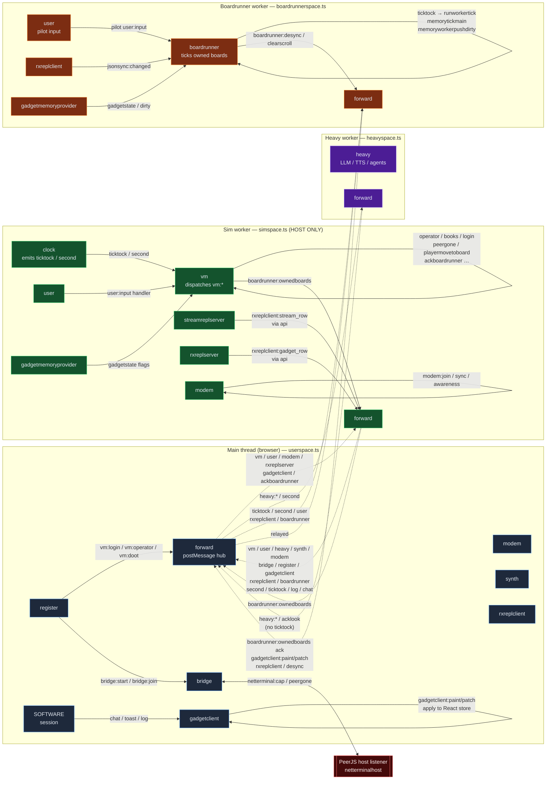
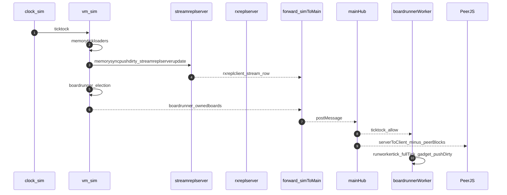
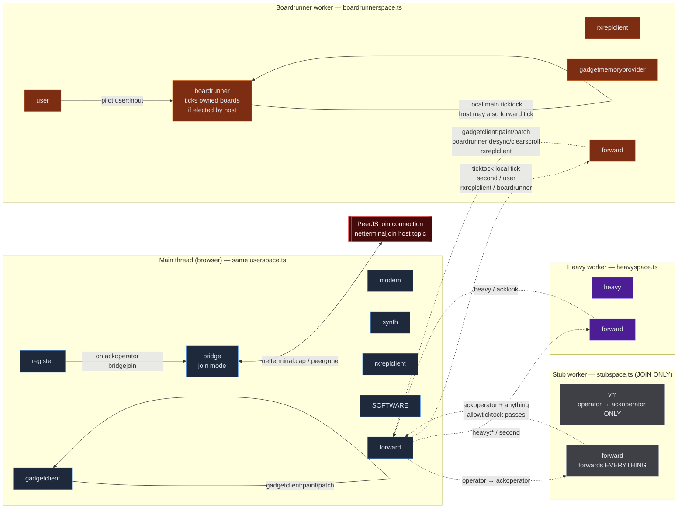
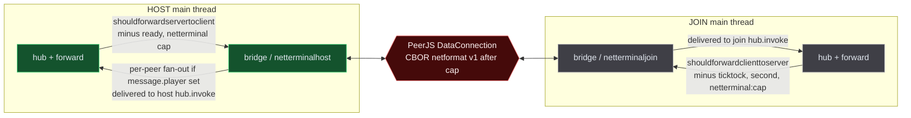

# Host vs Join device and message architecture

A detailed view of every device in ZSS, which thread/worker it lives in, and every edge of the message graph — split into **host state** (the player running the multiplayer session) and **join state** (a player connecting via `/join/…` URL), including which messages cross the **PeerJS** wire.

**Context:** see also [devices-and-messaging.md](./devices-and-messaging.md), [message-flow.md](./message-flow.md), [../../ARCHITECTURE.md](../../ARCHITECTURE.md), and [../../feature/docs/netterminal.md](../../feature/docs/netterminal.md).

## Contents

- [Legend](#legend)
- [1. Device catalog](#1-device-catalog)
- [2. Where each device runs (host vs join)](#2-where-each-device-runs-host-vs-join)
- [3. Host state diagram](#3-host-state-diagram)
- [4. Join state diagram](#4-join-state-diagram)
- [5. PeerJS wire between host and join](#5-peerjs-wire-between-host-and-join)
- [6. Forwarding policies (the source of truth)](#6-forwarding-policies-the-source-of-truth)
- [7. Notable host-vs-join deltas](#7-notable-host-vs-join-deltas)
- [8. Code reference index](#8-code-reference-index)

---

## Legend

- **Solid arrow** — in-process hub dispatch (same thread/worker), `hub.invoke(message)`.
- **Dashed arrow** — `postMessage` bridge between main thread and a worker, gated by `forward.ts` policies.
- **Bold red arrow** — PeerJS `DataConnection` across the network (host main thread ↔ remote join peer main thread).
- Boxes are labeled with the device's **routing name** (the `name` arg in `createdevice(name, topics?, handler)`); groups are colored by worker/realm.
- A single browser always has **four realms** at most: `main`, `platform` (sim *or* stub), `heavy`, `boardrunner`. PeerJS only exists on main.

---

## 1. Device catalog

Every device is created with `createdevice(name, topics?, handler, session?)` (see [`zss/device.ts`](../../device.ts) 36–107). Each device has:

- a **routing name** (stable, used in `target = 'name:path'`)
- an opaque **session id** from `createsid()` used as `message.sender` for direct replies

### Main thread (browser hub)

Loaded via side-effect imports in [`zss/userspace.ts`](../../userspace.ts) (UI) plus [`zss/platform.ts`](../../platform.ts) (for the main-side `forward`).

| Routing name | File | Role |
|---|---|---|
| `register` | [`zss/device/register.ts`](../register.ts) 286–303 | UI / bootstrap: storage, bookmarks, terminal/editor, `vm:*` calls, login flow, `second` → `vm:doot` keepalive, multiplayer branch (`bridgejoin` vs `loadmem`) on `ackoperator` (342–349). |
| `gadgetclient` | [`zss/device/gadgetclient.ts`](../gadgetclient.ts) 9–81 | Applies `paint` / `patch` to React gadget state; on patch failure emits `boardrunner:desync` (69–70). |
| `bridge` | [`zss/device/bridge.ts`](../bridge.ts) 192–575 | PeerJS session UX: host/join/tab, join URL, network `fetch` → `vmloader`, chat connectors, IVS broadcast. |
| `modem` | [`zss/device/modem.ts`](../modem.ts) 423–488 | Yjs doc + awareness sync; handles `join` / `joinack` / `sync` / `modem:awareness`. |
| `synth` | [`zss/device/synth.ts`](../synth.ts) 141+ | Web Audio / Tone; volume, TTS routing, `audioenabled` → `vmloader`. |
| `rxreplclient` | [`zss/device/rxreplclient.ts`](../rxreplclient.ts) | Client rxrepl: `gadget_row`, `stream_row` (full memory / `board:*` docs + rev), `push_ack`; persists stream mirror in [`jsonsyncdb.ts`](../jsonsyncdb.ts); emits local `jsonsync:changed` when a stream document updates ([`api.ts`](../api.ts) `jsonsyncchanged`). |
| `SOFTWARE` | [`zss/device/session.ts`](../session.ts) 4 | Session singleton used as a convenient `DEVICELIKE` emit target. |
| `forward` | [`zss/platform.ts`](../../platform.ts) 37–47 (`createdevice('forward', ['all'], …)`) | Bridges `postMessage` ↔ main hub ([`zss/device/forward.ts`](../forward.ts) 31–36). |

### Sim worker (`simspace`) — host only

Loaded in [`zss/simspace.ts`](../../simspace.ts); `createplatform(false, …)` selects this worker ([`zss/platform.ts`](../../platform.ts) 32–33, [`zss/gadget/engine.tsx`](../../gadget/engine.tsx) 37–38).

| Routing name | File | Role |
|---|---|---|
| `vm` | [`zss/device/vm.ts`](../vm.ts) 8–18 | Dispatches `message.target` through `vmhandlers` / default ([`zss/device/vm/handlers/registry.ts`](../vm/handlers/registry.ts)). |
| `clock` | [`zss/device/clock.ts`](../clock.ts) 4–43 | Emits `ticktock` (frame) and `second` (1 Hz) with `player ''` (24–31). |
| `streamreplserver` | [`zss/device/streamreplserver.ts`](../streamreplserver.ts) | Authoritative **`memory`** / **`board:*`** stream documents + monotonic **rev**; admits / drops players; fans out **`rxreplclient:stream_row`** after updates. Called from [`memorysync.ts`](../vm/memorysync.ts). |
| `rxreplserver` | [`zss/device/rxreplserver.ts`](../rxreplserver.ts) | Handles **`rxreplserver:push_batch`**: merges accepted rows into canonical MEMORY via `memorysyncreverseproject` (`memory`, `board:*`, `flags:*`, `gadget:*`), then `streamreplpublishfrommemory` (bump rev, fan out). Gadget rows may also fan out as `rxreplclient:gadget_row`. |
| `user` | [`zss/device/user.ts`](../user.ts) 10–20 | Server-side `user:input` only (`handleuserinput`). |
| `modem` (worker copy) | [`zss/device/modem.ts`](../modem.ts) | Second instance of the Yjs protocol in the sim worker. |
| `gadgetmemoryprovider` | [`zss/device/gadgetmemoryprovider.ts`](../gadgetmemoryprovider.ts) | Backs `gadgetstate()` from `mainbook.flags[GADGETSTORE]` on sim. |
| `forward` | [`zss/simspace.ts`](../../simspace.ts) 14–17 | Forwards `shouldforwardservertoclient` to parent `postMessage`. |

### Stub worker (`stubspace`) — join only

Loaded in [`zss/stubspace.ts`](../../stubspace.ts); `createplatform(true, …)` selects this worker when [`isjoin()`](../../feature/url.ts) 19–21 (URL contains `/join/`).

| Routing name | File | Role |
|---|---|---|
| `vm` | [`zss/device/stub.ts`](../stub.ts) 9–26 | Minimal VM: only `operator` → `ackoperator` (16–22). **No** `clock`, **`streamreplserver`**, **`rxreplserver`**, `user`, or full game VM. |
| `forward` | [`zss/stubspace.ts`](../../stubspace.ts) 6–8 | Forwards **all** messages to parent `postMessage` (no `shouldforwardservertoclient` filter). |

### Heavy worker (`heavyspace`)

Loaded in [`zss/heavyspace.ts`](../../heavyspace.ts); [`zss/device/heavy.ts`](../heavy.ts) 302–444.

| Routing name | Role |
|---|---|
| `heavy` | LLM / TTS / agent jobs: `ttsinfo`, `ttsrequest`, `modelprompt`, `modelstop`, `llmpreset`, `queryresult`, `pullvarresult`, `agentstart/stop/list/name`, `syncuserdisplay`, `restoreagents`. |
| `forward` | Forwards `shouldforwardheavytoclient` to parent ([`heavyspace.ts`](../../heavyspace.ts) 6–8). |

### Boardrunner worker (`boardrunnerspace`)

Loaded in [`zss/boardrunnerspace.ts`](../../boardrunnerspace.ts); core device [`zss/device/boardrunner.ts`](../boardrunner.ts) 138–268.

| Routing name | File | Role |
|---|---|---|
| `boardrunner` | [`zss/device/boardrunner.ts`](../boardrunner.ts) | Authoritative tick for **owned** boards: per-stream **`memory:changed` / `board:*:changed` / `flags:*:changed`** (from RxDB persist hook) → hydrate; `ticktock` → `runworkertick` (pilot + `memorytickmain` + gadget sync + `memoryworkerpushdirty`); `ownedboards`; `desync`; `clearscroll`. |
| `user` | [`zss/device/boardrunneruser.ts`](../boardrunneruser.ts) 39–58 | Worker `user:input`, `user:pilotstart/stop/clear`. |
| `rxreplclient` | [`zss/boardrunnerspace.ts`](../../boardrunnerspace.ts) | Same **`rxreplclient`** as main (side-effect import). |
| `gadgetmemoryprovider` | [`zss/boardrunnerspace.ts`](../../boardrunnerspace.ts) 8 | Worker gadget store + dirty marking ([`boardrunner.ts`](../boardrunner.ts) 34–57). |
| `forward` | [`zss/boardrunnerspace.ts`](../../boardrunnerspace.ts) 11–21 | `allowticktock: true` so `ticktock` is not dropped at worker boundary ([`forward.ts`](../forward.ts) 17–26). |

#### Worker `streamid:changed` → boardrunner hydrate (no wrong-tab “player bleed”)

1. Sim (or host path) delivers **`rxreplclient:stream_row`** to the **main** hub; [`shouldforwardclienttoboardrunner`](../forward.ts) forwards the same `MESSAGE` into the **boardrunner worker** ([`platform.ts`](../../platform.ts)).
2. Worker [`rxreplclient`](../rxreplclient.ts) applies the row into `streamreplclientstreammap`. Each `Map.set` triggers [`streamreplpersistclientstream`](../jsonsyncdb.ts) → RxDB upsert → **`streamsyncchanged(rxreplclientdevice, payload)`** ([`api.ts`](../api.ts) `streamsyncchanged`).
3. `streamsyncchanged` emits **`device.emit('', \`${streamid}:changed\`, payload)`** — the routed target is literally `memory:changed`, `board:<id>:changed`, or `flags:<pid>:changed`. The **`player` field is always `''`**; it is **not** the sim peer id and cannot be used to detect “wrong user” bleed for this path.
4. [`boardrunner`](../boardrunner.ts) subscribes to topics `memory`, `board`, `flags`, so it receives all such notifications on the **worker** hub. [`shouldboardrunnerhandlestreamchanged`](../boardrunner.ts) limits handling to `memory`, `board:*`, and `flags:*` (not `gadget:*`).
5. **Cross-board `board:*` updates are intentional:** the sim admits the runner to multiple board streams for neighbor context ([`memorysync.ts`](../vm/memorysync.ts)); the worker hydrates each snapshot into local MEMORY. **Optional future tightening** (hydrate only owned + known-neighbor ids) requires an explicit product rule — do not gate ad hoc without one.

---

## 2. Where each device runs (host vs join)

| Device | Host main | Host sim | Host heavy | Host br | Join main | Join stub | Join heavy | Join br |
|---|:-:|:-:|:-:|:-:|:-:|:-:|:-:|:-:|
| `register` | ✓ | | | | ✓ | | | |
| `gadgetclient` | ✓ | | | | ✓ | | | |
| `bridge` | ✓ | | | | ✓ | | | |
| `modem` (main) | ✓ | | | | ✓ | | | |
| `synth` | ✓ | | | | ✓ | | | |
| `rxreplclient` (main) | ✓ | | | | ✓ | | | |
| `SOFTWARE` | ✓ | | | | ✓ | | | |
| `forward` | ✓ | ✓ | ✓ | ✓ | ✓ | ✓ | ✓ | ✓ |
| `vm` (full) | | ✓ | | | | | | |
| `vm` (stub) | | | | | | ✓ | | |
| `clock` | | ✓ | | | | | | |
| `streamreplserver` | | ✓ | | | | | | |
| `rxreplserver` | | ✓ | | | | | | |
| `user` (sim) | | ✓ | | | | | | |
| `modem` (worker) | | ✓ | | | | | | |
| `gadgetmemoryprovider` | | ✓ | | ✓ | | | | ✓ |
| `heavy` | | | ✓ | | | | ✓ | |
| `boardrunner` | | | | ✓ | | | | ✓ |
| `user` (boardrunner pilot) | | | | ✓ | | | | ✓ |
| `rxreplclient` (br) | | | | ✓ | | | | ✓ |

---

## 3. Host state diagram

### Host-only facts
- `clock` lives only on sim ([`zss/device/clock.ts`](../clock.ts) 4–43). All `ticktock` originates here.
- **`streamreplserver` + `rxreplserver`** run only on the host sim ([`streamreplserver.ts`](../streamreplserver.ts), [`rxreplserver.ts`](../rxreplserver.ts)).
- Host bridge fans messages out **per remote player** if `message.player` is set ([`zss/feature/netterminal.ts`](../../feature/netterminal.ts)); player-targeted host→join traffic is **queued** until the host learns the joiner’s `message.player` from the first inbound message (avoids mis-delivery before handshake).

### 3.1 Per-frame order of operations (host)

Authoritative ordering for one sim frame (see also [`zss/device/vm/handlers/tick.ts`](../vm/handlers/tick.ts), [`zss/device/boardrunner.ts`](../boardrunner.ts)):

1. **Sim `clock`** emits `ticktock` into the sim worker hub.
2. **`vm` tick handler** runs **`memorytickloaders`** then **`memorysyncpushdirty`** so **`streamreplserver`** updates fan out **`rxreplclient:stream_row`** to admitted peers for loader-side mutations.
3. **Board election** updates `boardrunners` / asks / revokes (same tick handler); **`boardrunner:ownedboards`** should reach the main hub and boardrunner worker **before** that worker’s next `ticktock` applies an authoritative `memorytickmain` for newly owned boards.
4. **Main hub** forwards `ticktock` / patches / ownership to the boardrunner worker (`allowticktock`) and to **PeerJS** per [`shouldforwardservertoclient`](../forward.ts) minus peer blocks.
5. **Boardrunner worker** on `ticktock`: pilot → `memorytickmain` (boards only; sim runs `memorytickloaders`) → gadget sync → `memoryworkerpushdirty` (**`rxreplserver:push_batch`** upstream for memory / boards; gadget rows use the same batch API).

**Barrier:** a worker should not treat a board as authoritative until it has received **`boardrunner:ownedboards`** for that board *and* a **`rxreplclient:stream_row`** (or equivalent hydrate from RxDB / `jsonsync:changed`) for the corresponding `board:*` stream; otherwise skip authoritative tick work for that board (handled via ownership set + hydrate in [`boardrunner.ts`](../boardrunner.ts)).

---

## 4. Join state diagram

### Join-only facts
- Join replaces `simspace` with **`stubspace`** ([`zss/device/stub.ts`](../stub.ts) 9–26, [`zss/stubspace.ts`](../../stubspace.ts) 6–8). No `clock`, no **`streamreplserver`** / **`rxreplserver`**, no sim `user`/`modem`, no full `vm` handlers.
- Join's `forward` has `allowticktock: true` so ticks can still reach the boardrunner. Host→join PeerJS does **not** block `ticktock` / `second` in `shouldnotforwardonpeerserver` (only `ready` and `netterminal:cap`); join still originates its own main-thread `ticktock` for local workers ([`boardrunnerspace.ts`](../../boardrunnerspace.ts)).
- Heavy + boardrunner workers still exist per-browser; a join player can be **elected** to run boards via `boardrunner:ownedboards` from the host VM.

### 4.1 Per-frame order of operations (join)

1. **No sim `clock`:** `ticktock` is produced on the **main thread** (same hub as `register` / `gadgetclient`) and forwarded into the boardrunner worker with `allowticktock: true` ([`zss/boardrunnerspace.ts`](../../boardrunnerspace.ts)).
2. **Stub `vm`** only answers `operator` → `ackoperator`; multiplayer state changes arrive as forwarded **`vm:*` acks** and **`rxreplclient:*`** (e.g. `stream_row`, `gadget_row`, `push_ack`) from the host over PeerJS.
3. **`netterminal:cap`** carries `{ v: 1, host: <hostPlayerId> }` so the joiner can call **`vm:peergone`** with the correct host id on disconnect (not inferred from arbitrary first `message.player`).
4. **Join boardrunner** is driven by **local** main-thread `ticktock` forwarded with `allowticktock` ([`boardrunnerspace.ts`](../../boardrunnerspace.ts)). Host→join **policy** does **not** block `ticktock` or `second` in `shouldnotforwardonpeerserver` (see [`forward.peer.test.ts`](../__tests__/forward.peer.test.ts)); only `ready` and `netterminal:cap` are blocked on that path. Join→host still blocks `ticktock` / `second` via `shouldnotforwardonpeerclient`.

---

## 5. PeerJS wire between host and join

Transport: PeerJS `DataConnection` ([`zss/feature/netterminal.ts`](../../feature/netterminal.ts) 145–310). Payload is either legacy JSON-serializable `MESSAGE` or CBOR `netformat` v1 after the `netterminal:cap` handshake (125–143, 154–164).

### Host → Join over PeerJS

From `shouldforwardservertoclient` ([`zss/device/forward.ts`](../forward.ts) 57–95) minus the peer blocks in `shouldnotforwardonpeerserver`:

| Category | Messages |
|---|---|
| Broadcast | `log`, `chat`, `toast`, `second` |
| VM acks | `vm:*` handler results, `ackboardrunner`, `playermovetoboard`, `peergone` |
| Gadget state | `gadgetclient:paint`, `gadgetclient:patch` (so joiner UI updates) |
| Memory / board replication | `rxreplclient:stream_row` (full document + rev per admitted player) |
| Gadget replication | `rxreplclient:gadget_row` |
| Board ownership | `boardrunner:ownedboards`, `boardrunner:desync`, `boardrunner:clearscroll` |
| Peer routing | `user`, `synth`, `modem`, `bridge`, `register` sub-paths |
| Session | `netterminal:cap` (handshake only) |

**Blocked** host → join (by `shouldnotforwardonpeerserver` / `peerblockedleaf`): `ready`, `netterminal:cap` (including after cap for the cap message itself). **`ticktock` and `second` are not blocked** host→join — see [`forward.ts`](../forward.ts) and [`forward.peer.test.ts`](../__tests__/forward.peer.test.ts).

### Join → Host over PeerJS

From `shouldforwardclienttoserver` ([`zss/device/forward.ts`](../forward.ts) 109–137) minus `shouldnotforwardonpeerclient`:

| Category | Messages |
|---|---|
| VM input | `vm:operator`, `vm:login`, `vm:cli`, etc. |
| User | `user:input`, `user:pilotstart/stop/clear` |
| Modem | `modem:join`, `modem:sync`, `modem:awareness` |
| Authoritative sync | `rxreplserver:push_batch` (memory / `board:*` / `flags:*` / `gadget:*` rows from elected workers) |
| Gadget echoes | `gadgetclient:paint`, `gadgetclient:patch` (elected boardrunner reporting up) |
| Board ack | `sync`, `desync`, `joinack`, `ackboardrunner` |

**Blocked** join → host: `ticktock`, `second`, `netterminal:cap`.

### Handshake and disconnect
- Host may send `netterminal:cap` with `{ v: 1 }` ([`netterminal.ts`](../../feature/netterminal.ts) 221–229).
- After cap is seen, wire format switches to **CBOR** (`netterminal.ts` 125–143, 273–282).
- Join learns remote `player` id from the first non-empty `message.player` (`netterminal.ts` 284–292).
- On disconnect the host emits `vmpeergone` for the departed player (`netterminal.ts` 249–254, [`zss/device/api.ts`](../api.ts) 991–997); the sim `vm` `peergone` handler fans it out.

---

## 6. Forwarding policies (the source of truth)

All inter-hub edges are gated by predicates in [`zss/device/forward.ts`](../forward.ts). Keep this table aligned with the source:

| Predicate | Used by | Approx. line range | Passes |
|---|---|:-:|---|
| `shouldforwardclienttoserver` | main → sim, join → host (PeerJS) | see `forward.ts` | `vm`, `user`, `modem`, **`rxreplserver`**, `gadgetclient`, paths `sync`, `desync`, `joinack`, `needsnapshot`, `ackboardrunner` (plus literal fast paths) |
| `shouldforwardservertoclient` | sim → main, host → join (PeerJS) | see `forward.ts` | `log`, `chat`, `ready`, `toast`, `second`, `ticktock`, routed `vm`, `user`, `heavy`, `synth`, `modem`, `bridge`, `register`, `gadgetclient`, **`rxreplclient`**, `boardrunner`, several `vm:*` ack paths |
| `shouldnotforwardonpeerserver` | host bridge | [`forward.ts`](../forward.ts) 9–30 | Blocks `ready` and `netterminal:cap` by **target leaf**. Does **not** block `ticktock` or `second` (including `vm:ticktock` leaf) — covered by [`forward.peer.test.ts`](../__tests__/forward.peer.test.ts). |
| `shouldnotforwardonpeerclient` | join bridge | see `forward.ts` | Blocks `ticktock`, `second`, `ready`, `netterminal:cap` by leaf |
| `shouldforwardclienttoheavy` / `heavytoclient` | main ↔ heavy | see `forward.ts` | `second`, `ready`, `heavy`, `acklook`; heavy→main skips `ticktock` |
| `shouldforwardclienttoboardrunner` | main → boardrunner | see `forward.ts` | `ticktock`, `second`, `ready`, `user`, **`rxreplclient`**, `boardrunner` |
| `shouldforwardboardrunnertoclient` | boardrunner → main | see `forward.ts` | Same allowlist as `shouldforwardservertoclient` plus target **`rxreplserver`** (so **`rxreplserver:push_batch`** from `memoryworkerpushdirty` reaches the sim's `rxreplserver`); blocks `jsonsync:changed`, `ticktock`, `second` |

### Representative targets (grouped by device prefix)

- **VM:** `vm:operator`, `vm:books`, `vm:login`, `vm:cli`, `vm:doot`, `vm:peergone`, `vm:playermovetoboard`, `vm:ackboardrunner`, … ([`zss/device/api.ts`](../api.ts) 896+).
- **Stream replication:** `rxreplclient:stream_row`, `rxreplclient:gadget_row`, `rxreplclient:push_ack`, `rxreplserver:push_batch`; local broadcast **`jsonsync:changed`** when a client stream document updates ([`api.ts`](../api.ts) `jsonsyncchanged`, `rxreplclientstreamrow`, `rxreplpushbatch`).
- **Boardrunner:** `boardrunner:ownedboards`, `boardrunner:desync`, `boardrunner:clearscroll` ([`api.ts`](../api.ts) 175–191, 269–274); worker sees the stripped path `ownedboards` ([`boardrunner.ts`](../boardrunner.ts) 205).
- **Register:** `register:input`, `register:loginready`, … ([`api.ts`](../api.ts) 412+).
- **Bridge:** `bridge:start`, `bridge:join`, `bridge:fetch`, … ([`api.ts`](../api.ts) 87–156); handler sees stripped targets `start`, `join`, … in [`bridge.ts`](../bridge.ts) 207+.
- **User:** `user:input`, `user:pilotstart`, `user:pilotstop`, `user:pilotclear` ([`api.ts`](../api.ts) 1000+).
- **Modem:** `modem:join`, `modem:sync`, `modem:awareness` ([`modem.ts`](../modem.ts) 428+).
- **Gadget client:** `gadgetclient:paint`, `gadgetclient:patch` ([`api.ts`](../api.ts) 159–172) — explicitly forwarded to host so operator UI updates when a joiner's elected boardrunner paints ([`forward.ts`](../forward.ts) 115–120).

### Full VM handler registry

From [`zss/device/vm/handlers/registry.ts`](../vm/handlers/registry.ts) 48–90:

`operator`, `topic`, `admin`, `zsswords`, `books`, `page`, `search`, `logout`, `login`, `playertoken`, `local`, `doot`, `lastinputtouch`, `query`, `pullvarresult`, `codewatch`, `coderelease`, `clearscroll`, `halt`, `ticktock`, `second`, `ackboardrunner`, `playermovetoboard`, `peergone`, `makeitscroll`, `refscroll`, `gadgetscroll`, `readzipfilelist`, `fork`, `zztsearch`, `zztrandom`, `publish`, `flush`, `bookmarkscroll`, `editorbookmarkscroll`, `cli`, `clirepeatlast`, `restart`, `inspect`, `findany`, `loader`.

Default fallback: [`zss/device/vm/handlers/default.ts`](../vm/handlers/default.ts).

---

## 7. Notable host-vs-join deltas

| Concern | Host | Join |
|---|---|---|
| Platform worker | `simspace` (full VM + clock + **streamreplserver** + **rxreplserver**) | `stubspace` (stub `vm` only) |
| `ticktock` source | `clock` in sim worker | Local main-thread tick into boardrunner; host→join policy also **allows** peer `ticktock` (not blocked by `shouldnotforwardonpeerserver`) |
| `second` source | `clock` in sim worker, fans out to peers | Blocked from join → host over PeerJS |
| Authoritative state | Yes — **`streamreplserver`** / **`rxreplserver`** + full `memory` on sim | No — mirrors host via **`rxreplclient`** (`stream_row` / `gadget_row`) and local `jsonsync:changed` hydrate |
| `register` boot | Loads local storage / books | On `ackoperator` calls `bridgejoin(SOFTWARE, myplayerid, urlcontent)` ([`register.ts`](../register.ts) 342–349) |
| Multiplayer CLI | `#joincode` / `bridge:start` / `bridge:join` ([`firmware/cli/commands/multiplayer.ts`](../../firmware/cli/commands/multiplayer.ts), [`register.ts`](../register.ts) 375–376) | N/A (already joining via URL) |
| PeerJS role | `netterminalhost()` with sticky peer id + host topic ([`netterminal.ts`](../../feature/netterminal.ts) 516–534, 121–123) | `netterminaljoin(topic)` with own peer id ([`netterminal.ts`](../../feature/netterminal.ts) 537–546, 413–423) |
| Board election | Can elect itself or any joiner via `boardrunner:ownedboards` | Can be elected; runs boards in its own boardrunner worker |
| Gadget UI updates | Directly from own `gadgetclient:paint/patch` | Forwarded from host's `gadgetclient` stream over PeerJS |

---

## 8. Code reference index

- Device creation: [`zss/device.ts`](../../device.ts) 36–107
- Hub dispatch / tick batching: [`zss/hub.ts`](../../hub.ts) 44–70
- Worker spawning: [`zss/platform.ts`](../../platform.ts) 20–81
- Worker bundles: [`zss/simspace.ts`](../../simspace.ts), [`zss/stubspace.ts`](../../stubspace.ts), [`zss/heavyspace.ts`](../../heavyspace.ts), [`zss/boardrunnerspace.ts`](../../boardrunnerspace.ts)
- Forward policies (source of truth for every inter-hub edge): [`zss/device/forward.ts`](../forward.ts) 45–232
- PeerJS wire & host/join setup: [`zss/feature/netterminal.ts`](../../feature/netterminal.ts) 121–310, 413–546
- Host vs join decision: [`zss/feature/url.ts`](../../feature/url.ts) 19–21 (`isjoin`)
- VM handler registry (host): [`zss/device/vm/handlers/registry.ts`](../vm/handlers/registry.ts) 48–90
- Stub VM (join): [`zss/device/stub.ts`](../stub.ts) 9–26
- Board ownership flow: [`zss/device/api.ts`](../api.ts) 175–191, [`zss/device/boardrunner.ts`](../boardrunner.ts) 59–121, 138–268
