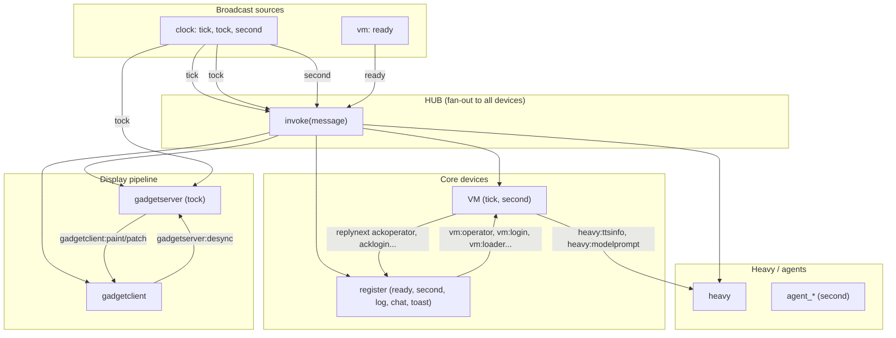

# Device Message Flow Diagram

The **hub** is a pub/sub fan-out: every `emit` is delivered to every connected device. Each device filters by **topics** (broadcast) or **directed target** (e.g. `vm:operator`).

## Mermaid diagram



```
                    ┌─────────────────────────────────────────────────────────────┐
                    │                          HUB                                 │
                    │  invoke(message) → every device.handle(message)              │
                    └─────────────────────────────────────────────────────────────┘
                                              │
           ┌──────────────────────────────────┼──────────────────────────────────┐
           │                                  │                                  │
           ▼                                  ▼                                  ▼
    ┌──────────────┐                  ┌──────────────┐                  ┌──────────────┐
    │    CLOCK     │                  │     VM       │                  │   REGISTER   │
    │  (no topics) │                  │ tick, second │                  │ ready,second │
    │              │                  │              │                  │ log,chat,    │
    │ emit: tick   │─────────────────►│              │                  │ toast        │
    │ emit: tock   │  (broadcast)     │              │                  │              │
    │ emit: second │─────────────────►│              │◄─────────────────│              │
    └──────────────┘                  │              │  vm:operator     │ vmoperator() │
           │                          │              │  vm:login, etc   │ vmcli()      │
           │ tock                      │ replynext    │                  │ vmlogin()   │
           ▼                          │ ackoperator  │─────────────────►│ etc         │
    ┌──────────────┐                  │ acklogin     │  register:       │              │
    │ GADGETSERVER │                  │ ackzsswords  │  loginready       │              │
    │    tock      │                  │ acklook      │  input,savemem    │              │
    │              │                  │              │  terminal:*,     │              │
    │ on tock:     │                  │              │  editor:*, etc    │              │
    │ build gadget │                  └──────┬───────┘                  └──────┬───────┘
    │ state       │                           │                                │
    │ diff→patch  │                           │ vm:loader                      │ loadmem
    │ or paint    │                           │ vm:cli,vm:input                 │ gadgetserver-
    └──────┬──────┘                           │                                 │ desync
           │                                  │                                 │
           │ gadgetclient:paint               │                                 │
           │ gadgetclient:patch               │                                 ▼
           ▼                                  │                         ┌──────────────┐
    ┌──────────────┐                          │                         │   BRIDGE    │
    │ GADGETCLIENT │                          │                         │  (no topics) │
    │ (no topics)  │                          │                         │              │
    │              │                          │                         │ bridge:join  │
    │ paint→state  │                          │                         │ bridge:fetch │
    │ patch→state  │                          │                         │ etc          │
    │ reply desync │──────────────────────────┘                         └──────────────┘
    └──────────────┘
           ▲
           │ register:input (from userinput, loader, etc)
           │
    ┌──────┴──────┐
    │  USERINPUT  │
    │ (no topics) │  receives userinput:up, userinput:down (from UI)
    └─────────────┘
```

## Boot sequence

```
  simspace/stubspace
        │
        │ setTimeout(started, 100)
        ▼
  ┌─────────────┐
  │ vm.started()│  (or stub.started())
  │             │
  │ platform-   │
  │ ready(vm)   │
  └──────┬──────┘
         │ emit('', 'ready')  ← broadcast, no player
         ▼
  ┌──────────────────────────────────────────────────────────────────┐
  │ HUB.invoke(message{ target:'ready', sender:vm_id })               │
  │ → every device.handle(message)                                    │
  └──────────────────────────────────────────────────────────────────┘
         │
         ├──► REGISTER (topic 'ready')
         │         │
         │         │ storagewatch, history, apilog, vmoperator(register, player)
         │         │
         │         ▼
         │    vm.emit(player, 'vm:operator')  ← directed to VM
         │         │
         │         ▼
         │    VM (match iname=vm, target→'operator')
         │         │ memorywriteoperator(player)
         │         │ vm.replynext(message, 'ackoperator', true)
         │         │
         │         ▼
         │    register.emit(player, 'register:ackoperator')  ← reply to register
         │         │
         │         ▼
         │    REGISTER (match iname=register, target→'ackoperator')
         │         │ gadgetserverdesync(register, player)
         │         │ loadmem(urlcontent) or bridgejoin()
         │         │
         │         ▼
         │    vmloader(..., 'sim:load', '')
         │         │
         │         ▼
         │    VM handles loader → memory, boards, etc.
         │
         ├──► Every device: session capture (if !session && target='ready')
         │
         └──► (other devices ignore or handle lightly)
```

## Main message flows

| From      | To         | Target               | Purpose                         |
|-----------|------------|----------------------|---------------------------------|
| vm/stub   | all        | `ready`              | Boot signal, session capture    |
| clock     | vm         | `tick`               | Game loop tick                  |
| clock     | gadgetserver | `tock`             | Render/sync tick                |
| clock     | all        | `second`             | Keepalive, agent doot            |
| register  | vm         | `vm:operator`        | Set operator player             |
| register  | vm         | `vm:login`           | Player login                    |
| register  | vm         | `vm:loader`          | Load books/content              |
| register  | vm         | `vm:cli`             | CLI command                     |
| register  | vm         | `vm:input`           | Keyboard/gamepad input          |
| vm        | register   | `register:ackoperator`| Operator set ack                |
| vm        | register   | `register:loginready` | Login result / logout ack      |
| vm        | register   | `register:acklogin`  | Login success/failure           |
| vm        | heavy      | `heavy:ttsinfo`      | TTS info request               |
| vm        | heavy      | `heavy:ttsrequest`   | TTS audio request               |
| vm        | heavy      | `heavy:modelprompt`  | LLM agent prompt                |
| register  | gadgetserver | `gadgetserver:desync`| Request full paint (on ackoperator) |
| register  | gadgetclient | (via api)           | Paint/patch from gadgetserver  |
| gadgetserver | gadgetclient | `gadgetclient:paint` | Full state (desync)            |
| gadgetserver | gadgetclient | `gadgetclient:patch` | Incremental patch              |
| gadgetclient | gadgetserver | `gadgetserver:desync` | Reply on patch error           |
| agents    | vm         | `vm:doot`            | Agent keepalive                 |

## Device summary

| Device       | Topics               | Receives (directed)      | Role                          |
|--------------|----------------------|--------------------------|-------------------------------|
| clock        | (none)               | —                        | Emits tick, tock, second      |
| vm           | tick, second         | vm:*                     | Game logic, login, CLI, loader|
| register     | ready, second, log, chat, toast | register:* | UI state, storage, bootstrap |
| gadgetserver | tock                 | gadgetserver:*            | Gadget state → paint/patch    |
| gadgetclient | (none)               | gadgetclient:*            | Receives paint/patch from api |
| heavy        | (none)               | heavy:*                  | TTS, LLM (lazy-loaded)        |
| bridge       | (none)               | bridge:*                  | Multiplayer / BBS             |
| modem        | second               | modem:*                   | CRDT sync, presence           |
| synth        | (none)               | synth:*                   | Audio playback                |
| userinput    | (none)               | userinput:*               | Input up/down from UI         |
| forward      | all                  | —                        | Peer sync (worker↔main)       |
| agent_*      | second               | —                        | Per-agent device, doot to vm  |

## Routing rules (device.handle)

1. **Session capture**: First `ready` message sets device session (broadcast).
2. **Topic match**: `target` in topics (e.g. `second`) OR `path` when broadcast (e.g. `ready` → path).
3. **Directed match**: `iname === target` (e.g. `vm:operator` → vm receives with target=`operator`).
4. **reply(to, target)**: Emits `to.sender:target` so the original sender receives.
5. **replynext**: Same as reply but delayed 64ms (for ordering).
