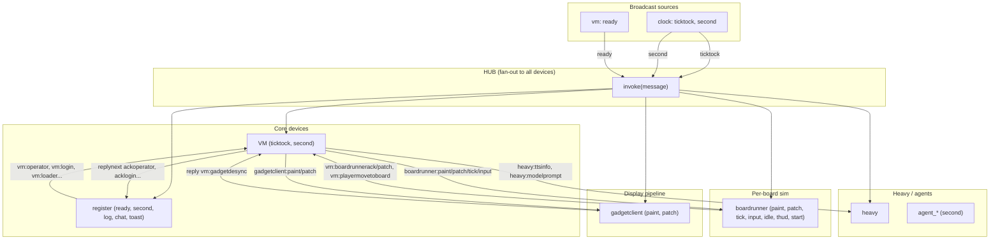

# Device Message Flow Diagram

The **hub** is a pub/sub fan-out: every `emit` is delivered to every connected device. Each device filters by **topics** (broadcast) or **directed target** (e.g. `vm:operator`).

**See also:** [devices-and-messaging.md](devices-and-messaging.md) — inventory of every device, four-realm topology (main + sim + heavy + boardrunner), and cross-realm forwarding.

## Mermaid diagram



```
                    ┌─────────────────────────────────────────────────────────────┐
                    │                          HUB                                 │
                    │  invoke(message) → every device.handle(message)              │
                    └─────────────────────────────────────────────────────────────┘
                                              │
           ┌──────────────────────────────────┼──────────────────────────────────┐
           │                                  │                                  │
           ▼                                  ▼                                  ▼
    ┌──────────────┐                  ┌──────────────┐                  ┌──────────────┐
    │    CLOCK     │                  │     VM       │                  │   REGISTER   │
    │  (no topics) │                  │ ticktock     │                  │ ready,second │
    │              │                  │ second       │                  │ log,chat,    │
    │emit:ticktock │─────────────────►│              │                  │ toast        │
    │ emit: second │─────────────────►│              │◄─────────────────│              │
    └──────────────┘                  │              │  vm:operator     │ vmoperator() │
           │                          │              │  vm:login, etc   │ vmcli()      │
           │ ticktock                 │ replynext    │                  │ vmlogin()    │
           │                          │ ackoperator  │─────────────────►│ etc          │
           │                          │ acklogin     │  register:       │              │
           │                          │ ackzsswords  │  loginready      │              │
           │ (vm.gadgetsynctick       │ acklook      │  input,savemem   │              │
           │  emits gadgetclient:*    │              │  terminal:*,     │              │
           │  inside the same tick)   │              │  editor:*, etc   │              │
           │                          └──────┬───────┘                  └──────┬───────┘
           │                                 │                                 │
           ▼                                 │                                 │
    ┌──────────────┐                          │ vm:loader                      │ loadmem
    │ GADGETCLIENT │                          │ vm:cli, vm:input               │ vm:gadgetdesync
    │ (no topics)  │                          │                                 │
    │              │◄─────────────────────────┤                                 │
    │ paint→state  │  gadgetclient:paint      │                                 ▼
    │ patch→state  │  gadgetclient:patch      │                         ┌──────────────┐
    │ reply desync │──────────────────────────┘                         │   BRIDGE     │
    └──────────────┘  vm:gadgetdesync                                   │  (no topics) │
           ▲                                                            │              │
           │ register:input (from userinput, loader, etc)                 │ bridge:join  │
           │                                                            │ bridge:fetch │
    ┌──────┴──────┐                                                     │ etc          │
    │  USERINPUT  │                                                     └──────────────┘
    │ (no topics) │  receives userinput:up, userinput:down (from UI)
    └─────────────┘
```

## Boot sequence

```
  simspace/stubspace
        │
        │ setTimeout(started, 100)
        ▼
  ┌─────────────┐
  │ vm.started()│  (or stub.started())
  │             │
  │ platform-   │
  │ ready(vm)   │
  └──────┬──────┘
         │ emit('', 'ready')  ← broadcast, no player
         ▼
  ┌──────────────────────────────────────────────────────────────────┐
  │ HUB.invoke(message{ target:'ready', sender:vm_id })               │
  │ → every device.handle(message)                                    │
  └──────────────────────────────────────────────────────────────────┘
         │
         ├──► REGISTER (topic 'ready')
         │         │
         │         │ storagewatch, history, apilog, vmoperator(register, player)
         │         │
         │         ▼
         │    vm.emit(player, 'vm:operator')  ← directed to VM
         │         │
         │         ▼
         │    VM (match iname=vm, target→'operator')
         │         │ memorywriteoperator(player)
         │         │ vm.replynext(message, 'ackoperator', true)
         │         │
         │         ▼
         │    register.emit(player, 'register:ackoperator')  ← reply to register
         │         │
         │         ▼
         │    REGISTER (match iname=register, target→'ackoperator')
         │         │ vmgadgetdesync(register, player)
         │         │ loadmem(urlcontent) or bridgejoin()
         │         │
         │         ▼
         │    vmloader(..., 'sim:load', '')
         │         │
         │         ▼
         │    VM handles loader → memory, boards, etc.
         │
         ├──► Every device: session capture (if !session && target='ready')
         │
         └──► (other devices ignore or handle lightly)
```

## Main message flows

| From      | To           | Target                      | Purpose                                    |
|-----------|--------------|-----------------------------|--------------------------------------------|
| vm/stub   | all          | `ready`                     | Boot signal, session capture               |
| clock     | vm           | `ticktock`                  | Game loop tick                             |
| clock     | all          | `second`                    | Keepalive, agent doot                      |
| register  | vm           | `vm:operator`               | Set operator player                        |
| register  | vm           | `vm:login`                  | Player login                               |
| register  | vm           | `vm:loader`                 | Load books/content                         |
| register  | vm           | `vm:cli`                    | CLI command                                |
| register  | vm           | `vm:input`                  | Keyboard/gamepad input                     |
| vm        | register     | `register:ackoperator`      | Operator set ack                           |
| vm        | register     | `register:loginready`       | Login result / logout ack                  |
| vm        | register     | `register:acklogin`         | Login success/failure                      |
| vm        | heavy        | `heavy:ttsinfo`             | TTS info request                           |
| vm        | heavy        | `heavy:ttsrequest`          | TTS audio request                          |
| vm        | heavy        | `heavy:modelprompt`         | Serialized classify then optional full agent LLM |
| vm        | gadgetclient | `gadgetclient:paint`        | Full gadget snapshot for one player        |
| vm        | gadgetclient | `gadgetclient:patch`        | Per-player jsonpipe patch                  |
| gadgetclient | vm        | `vm:gadgetdesync` (reply)   | Patch could not apply; ask for paint       |
| register  | vm           | `vm:gadgetdesync`           | Force a fresh paint (e.g. after acklogin)  |
| vm        | boardrunner  | `boardrunner:paint`         | Memory or per-boundary jsonpipe full sync  |
| vm        | boardrunner  | `boardrunner:patch`         | Memory or per-boundary jsonpipe patch      |
| vm        | boardrunner  | `boardrunner:tick`          | Run one board tick (board + ts + boundaries) |
| userinput | boardrunner  | `boardrunner:input`         | Keyboard/gamepad input for the runner      |
| sidebar / scroll | vm + boardrunner | `vm:CHIP:LABEL`        | Hyperlink / hotkey / runit / scroll panel item; the same `vm:*` message is delivered to both the sim VM (for `refscroll` / `batch` / `makeit` / `bookmarkscroll` / etc. handlers) and the boardrunner (which strips the `vm:` prefix and hands it to `memorymessagechip` so the originating chip receives the label) |
| boardrunner | vm         | `vm:boardrunnerack`         | Tick acknowledged; refresh runner budget   |
| boardrunner | vm         | `vm:boardrunnerpatch`       | Boundary diff back to authoritative memory |
| boardrunner | vm         | `vm:playermovetoboard`      | Boardrunner asks for player teleport       |
| agents    | vm           | `vm:doot`                   | Agent keepalive                            |

## Device summary

| Device       | Topics                          | Receives (directed)             | Role                                  |
|--------------|---------------------------------|---------------------------------|---------------------------------------|
| clock        | (none)                          | —                               | Emits ticktock, second                |
| vm           | ticktock, second                | vm:*                            | Game logic, login, CLI, loader; per-tick gadget projection and boardrunner orchestration |
| register     | ready, second, log, chat, toast | register:*                       | UI state, storage, bootstrap          |
| gadgetclient | (none)                          | gadgetclient:*                   | Receives paint/patch from sim VM      |
| boardrunner  | vm                              | boardrunner:*, vm:*              | Per-board chip sim on a dedicated worker; subscribes to `vm` topic so `vm:CHIP:LABEL` messages from sidebar / scrolls also reach `memorymessagechip` here |
| heavy        | (none)                          | heavy:*                          | TTS, LLM (lazy-loaded)                |
| bridge       | (none)                          | bridge:*                         | Multiplayer / BBS                     |
| modem        | second                          | modem:*                          | CRDT sync, presence                   |
| synth        | (none)                          | synth:*                          | Audio playback                        |
| userinput    | (none)                          | userinput:*                      | Input up/down from UI                 |
| forward      | all                             | —                               | Cross-realm sync (worker↔main)        |
| agent_*      | second                          | —                               | Per-agent device, doot to vm          |

## Routing rules (device.handle)

1. **Session capture**: First `ready` message sets device session (broadcast).
2. **Topic match**: `target` in topics (e.g. `second`) OR `path` when broadcast (e.g. `ready` → path).
3. **Directed match**: `iname === target` (e.g. `vm:operator` → vm receives with target=`operator`).
4. **reply(to, target)**: Emits `to.sender:target` so the original sender receives.
5. **replynext**: Same as reply but delayed 64ms (for ordering).
