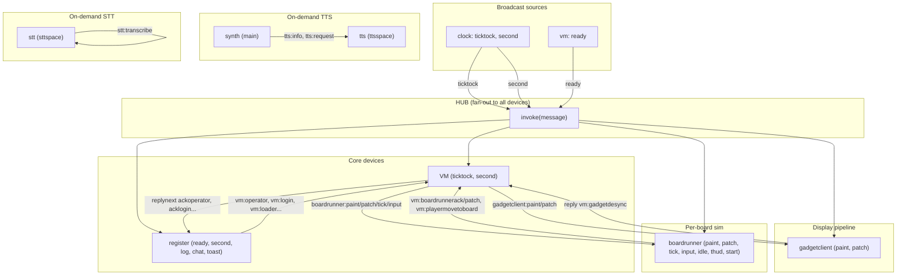

# Device Message Flow Diagram

The **hub** is a pub/sub fan-out: every `emit` is delivered to every connected device. Each device filters by **topics** (broadcast) or **directed target** (e.g. `vm:operator`).

**See also:** [devices-and-messaging.md](devices-and-messaging.md) — inventory of every device, realm topology (main + sim + boardrunner + on-demand tts/stt), and cross-realm forwarding.

## Mermaid diagram

## Main message flows

| From      | To           | Target                      | Purpose                                    |
|-----------|--------------|-----------------------------|--------------------------------------------|
| vm/stub   | all          | `ready`                     | Boot signal, session capture               |
| clock     | vm           | `ticktock`                  | Game loop tick                             |
| clock     | all          | `second`                    | Keepalive                                  |
| register  | vm           | `vm:operator`               | Set operator player                        |
| register  | vm           | `vm:login`                  | Player login                               |
| register  | vm           | `vm:loader`                 | Load books/content                         |
| register  | vm           | `vm:cli`                    | CLI command                                |
| register  | vm           | `vm:input`                  | Keyboard/gamepad input                     |
| vm        | register     | `register:ackoperator`      | Operator set ack                           |
| vm        | register     | `register:loginready`       | Login result / logout ack                  |
| vm        | register     | `register:acklogin`         | Login success/failure                      |
| synth     | tts          | `tts:info`                  | TTS info request (lazy ttsspace)           |
| synth     | tts          | `tts:request`               | TTS audio request (lazy ttsspace)          |
| terminal  | stt          | `stt:*`                     | Speech recognition (lazy sttspace)         |
| vm        | gadgetclient | `gadgetclient:paint`        | Full gadget snapshot for one player        |
| vm        | gadgetclient | `gadgetclient:patch`        | Per-player jsonpipe patch                  |
| gadgetclient | vm        | `vm:gadgetdesync` (reply)   | Patch could not apply; ask for paint       |
| register  | vm           | `vm:gadgetdesync`           | Force a fresh paint (e.g. after acklogin)  |
| vm        | boardrunner  | `boardrunner:paint`         | Memory or per-boundary jsonpipe full sync  |
| vm        | boardrunner  | `boardrunner:patch`         | Memory or per-boundary jsonpipe patch      |
| vm        | boardrunner  | `boardrunner:tick`          | Run one board tick (board + ts + boundaries) |
| userinput | boardrunner  | `boardrunner:input`         | Keyboard/gamepad input for the runner      |
| boardrunner | vm         | `vm:boardrunneraccess`   | Runner asks sim to include a board codepage in tick boundary list until hydrated |
| boardrunner | vm         | `vm:boardrunnerack`         | Tick acknowledged; refresh runner budget   |
| boardrunner | vm         | `vm:boardrunnerpaint`       | Full boundary doc from runner → sim (pipe shadow reset) |
| boardrunner | vm         | `vm:boardrunnerpatch`       | Boundary diff back to authoritative memory |
| boardrunner | vm         | `vm:playermovetoboard`      | Boardrunner asks for player teleport       |

## Device summary

| Device       | Topics                          | Receives (directed)             | Role                                  |
|--------------|---------------------------------|---------------------------------|---------------------------------------|
| clock        | (none)                          | —                               | Emits ticktock, second                |
| vm           | ticktock, second                | vm:*                            | Game logic, login, CLI, loader; per-tick gadget projection and boardrunner orchestration |
| register     | ready, second, log, chat, toast | register:*                       | UI state, storage, bootstrap          |
| gadgetclient | (none)                          | gadgetclient:*                   | Receives paint/patch from sim VM      |
| boardrunner  | vm                              | boardrunner:*, vm:*              | Per-board chip sim on a dedicated worker |
| bridge       | (none)                          | bridge:*                         | Multiplayer / ZNS                     |
| modem        | second                          | modem:*                          | CRDT sync, presence                   |
| synth        | (none)                          | synth:*                          | Audio playback                        |
| tts          | (none)                          | tts:*                            | TTS inference (lazy ttsspace)         |
| stt          | (none)                          | stt:*                            | STT inference (lazy sttspace)         |
| userinput    | (none)                          | userinput:*                      | Input up/down from UI                 |
| forward      | all                             | —                               | Cross-realm sync (worker↔main)        |

## Routing rules (device.handle)

1. **Session capture**: First `ready` message sets device session (broadcast).
2. **Topic match**: `target` in topics (e.g. `second`) OR `path` when broadcast (e.g. `ready` → path).
3. **Directed match**: `iname === target` (e.g. `vm:operator` → vm receives with target=`operator`).
4. **reply(to, target)**: Emits `to.sender:target` so the original sender receives.
5. **replynext**: Same as reply but delayed 64ms (for ordering).
