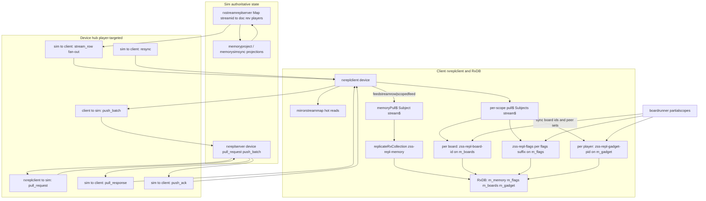

# RxDB syncs and stream replication

This codebase uses **not** a single global RxDB replication to a remote CouchDB, but a **custom replication plugin** path: the client runs **`replicateRxCollection`** against **local in-memory RxDB** ([`zss_streamrepl_client_v2`](../../device/netsim.ts)), while the “remote” is the **sim** exposed through the **device bus** ([`zss/device/api.ts`](../../device/api.ts)). Authoritative per-stream state on the sim lives in [`rxstreamreplserver`](../../device/rxstreamreplserver.ts) (`Map<streamid, { document, rev, players }>`), updated via projection from MEMORY and fanned out with **`rxreplclient:stream_row`**.

**See also:** [message-flow.md](./message-flow.md), [host-vs-join-architecture.md](./host-vs-join-architecture.md), and [workers-and-devices.md](./workers-and-devices.md) (rxrepl / streamrepl entries).

### `boardrunner:ownedboard` payload

When a player is elected boardrunner, [`boardrunnerowned`](../../device/api.ts) emits **`boardrunner:ownedboard`** with **`BOARDRUNNER_OWNEDBOARD`**: `{ board, streams }`. The `streams` list is [`memorysyncreplstreamidsforboardrunner(board)`](../../device/vm/memorysimsync.ts) and matches the sim admit roster built by [`memorysyncadmitboardrunner`](../../device/vm/memorysimsync.ts) (`board:`, per-player `flags:`, chip `flags:<chipid>_chip`, `flags:<boardId>_tracking`, per-player `gadget:`). The **`memory` stream is not included** (it is admitted on login via [`memorysyncensureloginreplstreams`](../../device/vm/memorysimsync.ts), not on board assignment). Consumers that need MEMORY before acting should wait on `memory` separately.

The boardrunner worker still accepts a legacy **string** `message.data` or the object shape (see [`boardrunner.ts`](../../device/boardrunner.ts) `ownedboard`).

---

## 1. Domain stream IDs (all share the same repl machinery)

| Pattern | Role |
|---------|------|
| `memory` | Shared MEMORY book; single global replication. [`MEMORY_STREAM_ID`](../../memory/memorydirty.ts) |
| `board:<boardId>` | Per-board projected document. |
| `flags:…` | See **three flag stream categories** below (same `flags:` prefix for all; not `flag:`). |
| `gadget:<playerId>` | Per-player gadget UI state. |

### Three `flags:` stream categories (wire ids)

The transport uses a single namespace `flags:<suffix>`. The suffix distinguishes three *semantic* families (see [`memoryproject` wire contract](../../device/vm/memoryproject.ts) and [`boardflags`](../../memory/boardflags.ts)):

1. **Player main bag** — `flags:<playerId>` — the normal per-player `mainbook.flags[pid]`-style document via [`flagsstream`](../../memory/memorydirty.ts) / [`projectplayerflags`](../../device/vm/memoryproject.ts).
2. **Chip memory bag** — `flags:<chipid>_chip` — one stream per `mainbook.flags[createchipid(elementId)]` (the map key and the part between `flags:` and `_chip` is the chipid); detected by [`ischipflagsstream`](../../memory/memorydirty.ts) (suffix ends with `_chip`).
3. **Board tracking bag** — `flags:<boardId>_tracking` — from [`memorytrackingflagsbagid(boardaddress)`](../../memory/boardflags.ts) → `` `${boardaddress}_tracking` ``.

**RxDB / scoping note:** the client `m_flags` mirror row primary key is the string after `flags:` (treated as `player` in [`FlagsMirrorRow`](../../device/rxrepl/collectionschemas.ts)), so chip and tracking streams are **not** the same replication instance as `flags:<ownPid>`—each suffix gets its own row and may need a **separate** scoped `zss-repl-flags-*` instance when replicated. The boardrunner [`partialscopes` flags superset](../../device/rxrepl/partialscopes.ts) exists so `streamreplscopedsyncflagsplayers` does not cancel **lazily started** `*_chip` / `*_tracking` replications that are not in the “gadget peer” set.

---

## 2. RxDB on the client: four collections, many replication instances

- **Database / collections** — [`netsim.ts`](../../device/netsim.ts): `m_memory`, `m_flags`, `m_boards`, `m_gadget` (schemas in [`collectionschemas.ts`](../../device/rxrepl/collectionschemas.ts)).
- **Hot read path** — synchronous [`mirrorstreammap`](../../device/netsim.ts) is updated from local writes, hydration, inbound rows when repl is off, and **Rx `received$`** when repl is on; also emits `streamsyncchanged` for UI (`${streamid}:changed` pattern).

| Replication | `replicationIdentifier` | RxCollection | Scope driver |
|-------------|-------------------------|--------------|--------------|
| Memory | `zss-repl-memory` | `m_memory` | Single; init in [`initStreamReplRxReplications`](../../device/rxrepl/streamreplreplicationinit.ts) |
| Boards | `zss-repl-board-${boardId}` | **shared** `m_boards` | [`streamreplscopedsyncboards`](../../device/rxrepl/streamreplscopedreplication.ts) + lazy [`streamreplscopedfeedstreamrow`](../../device/rxrepl/streamreplscopedreplication.ts) |
| Flags | `zss-repl-flags-${suffix}` | **shared** `m_flags` | [`streamreplscopedsyncflagsplayers`](../../device/rxrepl/streamreplscopedreplication.ts) (suffixes = player ids + chip/tracking bags as needed) + lazy [`streamreplscopedfeedstreamrow`](../../device/rxrepl/streamreplscopedreplication.ts) |
| Gadget | `zss-repl-gadget-${player}` | **shared** `m_gadget` | [`streamreplscopedsyncgadgetplayers`](../../device/rxrepl/streamreplscopedreplication.ts) + lazy feed |

**Scoped sync** is triggered from the boardrunner via [`partialscopes.ts`](../../device/rxrepl/partialscopes.ts) (deduped calls): owned board ids and gadget/flags peer sets ([`boardrunner.ts`](../../device/boardrunner.ts)). After memory repl starts, [`streamreplscopedinitaftermemory`](../../device/rxrepl/streamreplscopedreplication.ts) seeds flags/gadget for the **own player** only; boards start empty until partial scopes run.

**Important:** Multiple `replicateRxCollection` instances target the **same** collection for different `replicationIdentifier`s; checkpoints are per-instance but rows partition by family primary key (memory id, `boardId`, `player`).

---

## 3. “Streams” in the replication sense (RxJS + RxDB)

- **Live pull stream (`pull.stream$`)** — Each repl has a **`Subject`** that emits `RESYNC` or `{ documents, checkpoint }`. Injected rows come from:
  - **Memory** — [`memoryPull$`](../../device/rxrepl/streamreplreplicationinit.ts) via [`streamreplreplicationfeedstreamrow`](../../device/rxrepl/streamreplreplicationinit.ts) when the sim pushes `stream_row` for `memory`.
  - **Scoped** — per board/flags/gadget [`pull$`](../../device/rxrepl/streamreplscopedreplication.ts) via [`streamreplscopedfeedstreamrow`](../../device/rxrepl/streamreplscopedreplication.ts) (may **lazy-start** a scoped repl).
- **Batch pull (`pull.handler`)** — Awaits one wire round-trip: [`streamreplpullawaitregister`](../../device/rxrepl/pullawait.ts) + [`rxreplpullrequest`](../../device/api.ts) → sim [`rxreplserver:pull_request`](../../device/rxreplserver.ts) reads [`rxstreamreplserverreadstream`](../../device/rxstreamreplserver.ts) → [`rxreplpullresponse` / `rxreplclient:pull_response`](../../device/api.ts) → [`streamreplreplicationfeedpullresponse`](../../device/rxrepl/streamreplreplicationinit.ts) resolves the waiter (handler return applies docs; avoids double-apply with `stream$`).
- **Push (`push.handler`)** — Serializes with [`streamreplpushawaitserializedop`](../../device/rxrepl/streamreplpushawait.ts), sends [`rxreplpushbatch`](../../device/api.ts) → [`rxreplserver:push_batch`](../../device/rxreplserver.ts) → `memorysyncreverseproject` + [`rxstreamreplpublishfrommemory`](../../device/rxstreamreplserver.ts) → server fan-out; [`push_ack`](../../device/api.ts) unblocks.
- **Downstream apply** — Each repl subscribes to **`received$`** and calls [`streamreplmirroronreplicationdown`](../../device/netsim.ts) for `memory` / `flags` / `boards` / `gadget` to sync the sync map and emit change events (with rev deduping and [`streamreplnotifymirrorstreamrowrepl`](../../device/netsim.ts) for the “same rev as checkpoint” case).

---

## 4. Sim push path: `stream_row` (out of band from RxDB pull return)

- [`rxstreamreplserver`](../../device/rxstreamreplserver.ts) bumps rev and uses [`rxreplclientstreamrow`](../../device/api.ts) to every **admitted** player.
- Client [`rxreplclient`](../../device/rxreplclient.ts) handles `stream_row` in [`applystreamrow`](../../device/rxreplclient.ts): if repl active, feeds `streamreplreplicationfeedstreamrow` + mirror **without** duplicating notification paths incorrectly (see comment chain with `streamreplmirrorsetnonotify` / `streamreplnotifymirrorstreamrowrepl` in [`netsim.ts`](../../device/netsim.ts)).

---

## 5. Other “stream” helper (unused in main path)

- [`replication.ts`](../../device/rxrepl/replication.ts) — `rxreplresponsestopullstream`: maps `Observable<RXREPL_PULL_RESPONSE>` → RxDB pull stream shape (“Strategy B”). **Only referenced from tests**; production uses **Subject**-based `stream$` + **pull.handler** instead.

---

## 6. Comprehensive mermaid diagram

**Legend:** Arrows are logical data/control flow, not every function call. `pull_handler` and `stream_row` are **two** ways the client gets newer revs: batch snapshot after `pull_request`, and live `stream_row` into `stream$` for RxDB.
