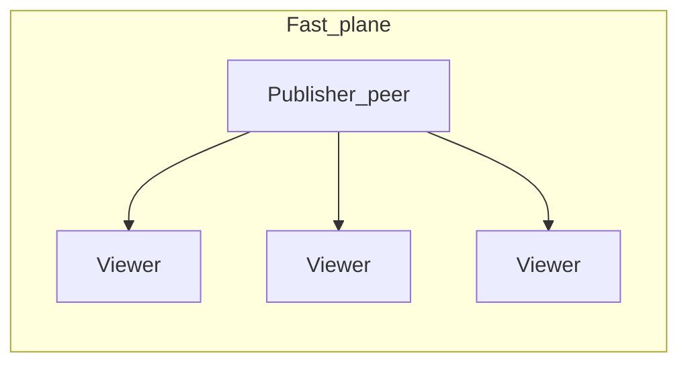
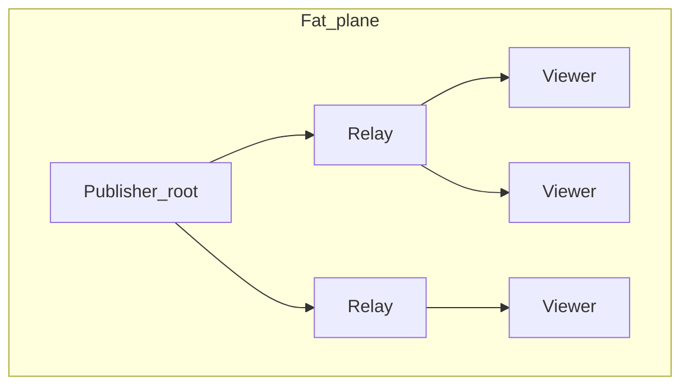

# Media transport layer (PeerJS)

**Purpose:** Design specification for a **peer-to-peer media transport** path in ZSS: encoded **canvas video** and **synth Web Audio** flow from a **single publisher player** to many **viewers**, using PeerJS `DataConnection`s with a **dual-plane** split (low-latency control vs throughput-oriented media fan-out). This document does **not** mandate a codec or a single playback API; it defines architecture, framing, topology, and integration touchpoints so implementation can follow in phases.

**Related today**

| Topic | Location |
|-------|----------|
| PeerJS terminal (hub-and-spoke, `createforward`) | [netterminal.md](netterminal.md), [`zss/feature/netterminal.ts`](../netterminal.ts) |
| Which messages cross PeerJS vs worker bridge | [`zss/device/docs/devices-and-messaging.md`](../../device/docs/devices-and-messaging.md) |
| Web broadcast capture sources (canvas + synth) and IVS ingest | [web-broadcast-livekit.md](../../../docs/web-broadcast-livekit.md), [`zss/device/bridge.ts`](../../device/bridge.ts) (`bridge:streamstart` / `bridge:streamstop`) |
| Broadcast audio tap | [`synthbroadcastdestination()`](../../device/synth.ts) in [`zss/device/synth.ts`](../../device/synth.ts); synth routing in [`zss/feature/synth/audiochain.ts`](../synth/audiochain.ts) |
| Feature exports index | [`zss/feature/EXPORTED_FUNCTIONS.md`](../EXPORTED_FUNCTIONS.md) |

---

## Glossary

| Term | Meaning |
|------|---------|
| **Publisher** | The player (and browser peer) that **originates** encoded media for a session. |
| **Viewer** | Any peer that **consumes** that media for playback (may also relay on the fat plane). |
| **Fast plane** | Small, latency-sensitive traffic: inputs, VM/game state, sync ticks, session control. **Star** from publisher (or same pattern as netterminal host↔guest). |
| **Fat plane** | Large opaque **media segment** bytes; **bounded-degree tree** or pull/cache-assisted delivery. |
| **Relay** | A peer that receives media on one `DataConnection` from its **parent** and forwards to **children** (max arity `D`). |
| **Segment** | A transport unit: init blob, media chunk, or sub-fragment with a stable id for ordering and repair. |
| **Manifest** | Description of tracks, codecs, timescale, and segment index; versioned by `manifest_rev`. |

---

## 1. Purpose and scope

### Goals

- Send **video + audio** from one **publisher player** to many **viewers** over a **dedicated media transport** (PeerJS binary paths), without overloading the publisher’s **uplink** when `N` grows.
- Keep **inputs and state sync** on a path with **minimal hops** so tree depth does not add jitter to control traffic.

### Capture intent (align with web broadcast)

ZSS intends to use the **same conceptual capture sources** as today’s in-app **`#broadcast`** path (see [web-broadcast-livekit.md](../../../docs/web-broadcast-livekit.md)):

1. **Video:** the page’s main **`canvas`** element — today attached in [`zss/device/bridge.ts`](../../device/bridge.ts) via `document.querySelector('canvas')` and `addImageSource` on the IVS broadcast client.
2. **Audio:** the **Web Audio** path exposed as [`synthbroadcastdestination()`](../../device/synth.ts) (`MediaStreamAudioDestinationNode` / `MediaStream`), today passed to `addAudioInputDevice` on the same client.

The **media transport layer** consumes **encoded or packetized** output derived from those sources (encoder choice is a design parameter), **segments** it for P2P, **fans out** on the fat plane, and **viewers** demux/decode for playback (e.g. **MSE**, **WebCodecs**, or **`AudioContext`** — tradeoffs in §3.3).

### Contrast with Amazon IVS today

Web broadcast currently sends that capture to **Amazon IVS** ingest via `amazon-ivs-web-broadcast` (`startBroadcast(streamKey, 'https://g.webrtc.live-video.net:4443')` in `bridge.ts`). The media transport layer is a **peer-to-peer viewer path**: optional **alongside** public broadcast (same capture, dual sink) or **instead of** ingest for certain sessions. It is **not** a repoint of the IVS URL.

### In scope

- Dual-plane architecture, topology algorithm, segment/manifest model, wire framing sketch, churn and repair, backpressure, browser limits.
- Publisher **hook points** (bridge / synth) and viewer **playback pipeline** at design level.
- Phased implementation checklist.

### Out of scope (for this doc)

- Watch-party UI layout and branding.
- Changing `#broadcast` CLI or operator flows unless a future ADR ties them together.
- Deep LiveKit / IVS migration content (link [web-broadcast-livekit.md](../../../docs/web-broadcast-livekit.md) only for “how capture works today”).

---

## 2. Current baseline

### Net terminal (PeerJS)

[`zss/feature/netterminal.ts`](../netterminal.ts) implements **hub-and-spoke**: the **host** peer accepts incoming `DataConnection`s from **guests**; each guest opens one connection to the host. Messages are bridged through [`createforward`](../../device/forward.ts) with predicates described in [`devices-and-messaging.md`](../../device/docs/devices-and-messaging.md) (Peer lane vs worker bridge).

### Risk of one pipe for everything

Using the **same** `DataConnection` (or one FIFO queue) for **multi-megabyte media** and **high-rate small control** invites:

- **Head-of-line blocking** — a large chunk delays state deltas.
- **Buffer bloat** — `bufferedAmount` grows on slow viewers and backs up to the publisher.

The media transport layer therefore **isolates fat-plane media** from the **fast plane** (separate connections and/or strict multiplex with **priority**).

---

## 3. Dual-plane architecture

### 3.1 Traffic classes

| Plane | Traffic | Topology | Rationale |
|-------|---------|----------|-----------|
| **Fast** | Inputs, VM/game state, sync ticks, chat-scale control, **small** manifest/topology updates not blocked by media | **Star from publisher** (or reuse netterminal host↔guest pattern for those message types only) | ~**one RTT** to each viewer; tree **depth** would multiply delay and jitter for control. |
| **Fat** | Encoded **canvas + synth** media bytes, large repair blobs | **Bounded-degree tree** (or **pull + relay cache**) | Dominated by **bytes ÷ bandwidth**; extra hops are usually acceptable vs **publisher O(N)** uplink. |

### 3.2 Diagrams

### 3.3 PeerJS mechanics

- **Preferred:** separate `DataConnection`s — e.g. one **control** link publisher↔each viewer (fast), and **tree edges** only for **media** (child always `connect(parent)` toward root for the fat subtree).
- **Alternative:** one DC per peer pair with **length-prefixed multiplex** and a **send queue** that always drains **small control frames** before **media fragments** (more complex, same connection budget).

**Rule:** relays on the fat plane **must not** carry fast-plane application traffic if that would add hops beyond the star policy.

### 3.4 Viewer playback (design options)

| Approach | Pros | Cons |
|----------|------|------|
| **MSE** + fMP4 or CMAF chunks | Mature pattern for H.264/AAC in browsers | Latency of segment boundaries; mux overhead |
| **WebCodecs** + `AudioContext` or `MediaStreamTrackGenerator` | Lower latency potential | More custom glue; codec support varies |
| **WebRTC** peer connections viewer-side | Built-in jitter buffers | Different stack than PeerJS data; may duplicate signaling |

The transport layer stays **codec-agnostic bytes + manifest**; the doc recommends picking one playback stack per product decision and reflecting it in `manifest` codec fields.

---

## 4. Publisher capture and integration

### 4.1 Same sources as IVS broadcast

Today’s sequence in `bridge.ts` for `streamstart`:

1. Resolve **`canvas`** → `addImageSource(video, 'video', …)`.
2. Resolve **`synthbroadcastdestination()`** → `addAudioInputDevice(audio.stream, 'audio')`.
3. **`startBroadcast`** to IVS.

For P2P media transport, the design should **tap the same nodes**:

- **Video:** either **encoded twice** (IVS encoder + P2P encoder), **one encoder** with a **tee** into IVS and into the P2P packetizer (ideal but needs API support), or **only P2P** when IVS is off.
- **Audio:** same `MediaStream` / graph tap as today; avoid divergent synth paths.

### 4.2 Integration options (document tradeoffs)

| Option | Description | Tradeoff |
|--------|-------------|----------|
| **Reuse** `streamstart` / `streamstop` | Extend bridge handler to also start/stop P2P media session | Single UX; risk of coupling IVS errors to P2P |
| **Parallel API** | New bridge messages (e.g. `p2pmedia:start`) | Clear separation; two code paths to maintain |
| **Fork inside encoder** | Shared capture, dual sink inside one module | Fewest duplicate reads; highest implementation effort |

**Net / forward:** fat-plane bytes can live in a **new module** (parallel Peer instances or extra `DataConnection`s) without changing [`shouldforward*`](../../device/forward.ts) predicates on day one; alternatively a narrow extension to netterminal with **typed binary lanes** — product choice.

---

## 5. Segment and manifest model (capture → transport)

Treat **live capture** as a **time-ordered media timeline** (same framing as “recorded” VOD): **manifest + per-track init + media segments + optional sub-fragments**.

### 5.1 Manifest (`manifest_rev`)

- **Tracks:** id, kind (`video` | `audio`), codec string, timescale.
- **Segment index:** ordered `segment_id`, approximate PTS range, byte length (or offset into an aggregate blob for VOD-style storage).
- **`manifest_rev`:** incremented when codec, layout, or seek invalidates “what comes next”; relays **drop** queued media for older revs.

### 5.2 Init vs media

- **Init** per track: fMP4 **ftyp/moov** equivalent or codec config blob; viewers **must** apply before decoding **media** segments for that track.
- **Media segments:** opaque bytes keyed by `(track_id, segment_id)`; **monotonic** `segment_id` along default play order simplifies relay “forward once per child.”

### 5.3 Sub-fragments

Large segments are split into **`fragment_id`** chunks so:

- Relays can **pause** sends per child using `bufferedAmount` without holding whole multi‑MB segments in RAM.
- Receivers **reassemble** before decode or MSE `appendBuffer`.

---

## 6. Topology and delivery modes

### 6.1 Roles

- **Publisher root:** origin of media; may also be the signaling anchor for topology.
- **Relay:** `childcount ≤ D`; forwards opaque bytes to children.
- **Leaf-only viewer:** opts out of relay eligibility (saves uplink / connections).

### 6.2 Dynamic parent selection

When a new viewer joins the **fat** overlay:

1. Collect candidates with `childcount < D`.
2. Pick parent minimizing a score such as  
   `childcount + α·depth + β·rtt_estimate`  
   (stable tie-break by peer id).
3. Child calls **`connect(parent)`**; parent accepts and registers the DC as a fat-plane child.

**Static batch:** if all peers are known, a greedy min-heap on `(childcount, depth)` builds a **bounded-degree tree** in one pass.

### 6.3 Delivery modes

| Mode | Behavior | Best when |
|------|----------|-----------|
| **Push** | Publisher emits next segment; tree relays duplicate to children. | Everyone follows the **same live edge**. |
| **Pull** | Viewer requests `segment_id`; parent serves from **cache** or fetches upstream once. | **Seek**, staggered playback, uneven joins. |
| **Hybrid** | Push for live edge; pull for backlog after seek; relays cache **K** segments. | Social viewing + scrubbing. |

---

## 7. Wire protocol (design-level)

### 7.1 Framing

- **Length-prefixed** frames on each `DataConnection`.
- **Types:** at minimum `control` (manifest, topology, gap-nack) vs `media` (init, media fragment).

### 7.2 Suggested header fields (binary or CBOR)

Minimum conceptual fields (exact packing TBD at implementation):

- `session_id` — logical media session.
- `manifest_rev` — staleness guard.
- `track_id`, `segment_id`, `fragment_id` — ordering and reassembly.
- `flags` — e.g. init vs media, last fragment of segment.
- `payload_len` + **payload** (opaque).

### 7.3 Relay forwarding

- On **media** frame: **duplicate to every child** DC on the fat plane; **never** echo to parent.
- **Per-child queue:** if one child is slow, **stall only that branch** (reliable semantics); siblings continue (bounded queue per child to cap RAM).

---

## 8. Correctness under churn

- **Session generation / `manifest_rev`:** after **re-parent**, children discard partial reassembly for superseded revs.
- **Parent loss:** children run parent selection again; send **gap** control toward root or cache-holder for missing `segment_id` ranges.
- **Optional gossip** at very large `N`:** rumor / Plumtree-style **repair only** while the tree carries primary delivery.

---

## 9. Operational and browser constraints

- **Connection budget:** each browser tab has practical limits on concurrent PeerJS / WebRTC resources; tree arity `D` and “relay vs leaf” must respect caps.
- **`bufferedAmount`:** throttle upstream per `DataConnection`; expose metrics for tuning.
- **Memory:** cap per-relay **pending bytes per child**; spill or slow-read policy for worst-case viewers.
- **CPU:** encoding at publisher + optional decode at every viewer; relays should **not re-encode** (opaque forward only).

---

## 10. Phased implementation checklist

| Phase | Deliverables |
|-------|----------------|
| **A** | Publisher **capture attach** (canvas + `synthbroadcastdestination`), **fast plane** hub (star), session + **manifest** exchange; no tree or minimal stub. |
| **B** | **Fat tree** + opaque relay; **viewer playback** minimal path (one codec/container choice). |
| **C** | Relay **segment cache**, **pull repair**, telemetry; optional **dual sink** with IVS from same capture. |

---

## 11. Reference algorithms (condensed)

**Problem:** nodes `P`, publisher peer `r`, max fan-out `D`; publisher produces encoded media from **canvas + synth**; deliver segment bytes to all viewers; relays **opaque forward** only.

**Tree build (dynamic):** minimize `childcount + α·depth + β·rtt`; attach with `connect(parent)` from child.

**Ordering:** per-track `segment_id` (and `fragment_id`); cross-track A/V sync via PTS in the player; bump `manifest_rev` on topology/seek invalidation.

**Latency:** depth `L` on a link multiplies queuing/RTT for messages on that link — keep **inputs/state** off the fat tree (**fast plane star**).
