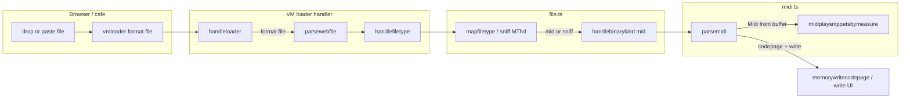
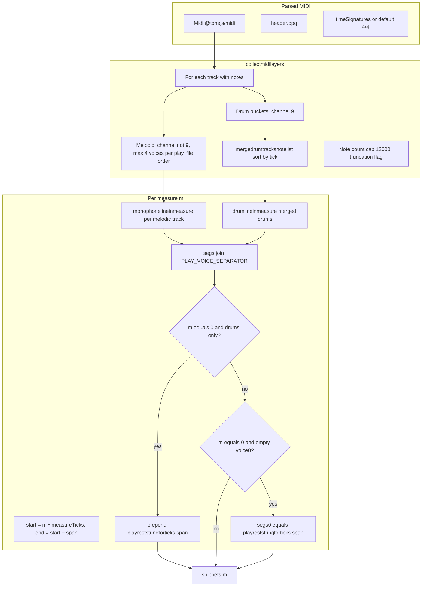
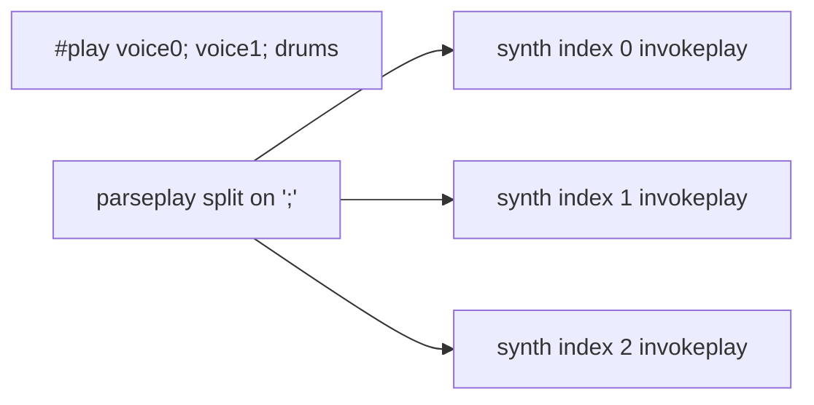

# MIDI import: conversion and `#play` output

How **Standard MIDI Files** (`.mid`) reach the VM, how [`midiplay.ts`](../midiplay.ts) turns `@tonejs/midi` data into per-measure strings, and how [`parsemidi`](../midi.ts) writes a **codepage** aligned with [`.zzm` import](../zzm.ts). Runtime parsing of each line is [`parseplay`](../../synth/playnotation.ts) in [`playnotation.ts`](../../synth/playnotation.ts).

## 1. End-to-end file path (UI → import)



- **Entry:** [`loader.ts`](../../../device/vm/handlers/loader.ts) `case 'file'` → [`parsewebfile`](../file.ts) ([`vmloader`](../../../device/api.ts)).
- **Typing:** [`mapfiletype`](../file.ts) / [`sniffbinaryimport`](../file.ts) (`MThd` → `mid`) / extension `.mid`.
- **Import:** [`parsemidi`](../midi.ts) reads `File` with `arrayBuffer()`, `new Midi(buffer)`, then [`midiplaysnippetsbymeasure`](../midiplay.ts).

## 2. Conversion inside `midiplay` (SMF → one string per bar)



- **Track cap:** only the **first four** MIDI tracks with notes (file order) are imported (`MAX_MIDI_TRACKS` in [`midiplay.ts`](../midiplay.ts)).
- **Voice cap:** at most **four** `;`-separated segments per `#play` (`MAX_VOICES_PER_PLAY`): up to four melodic lines if none of those tracks are drums, else three melodic plus one merged drum voice among the selected tracks (see [`collectmidilayers`](../midiplay.ts)).
- **Measure length:** [`miditickspersmeasure`](../midiplay.ts) from time signature (default `4 * ppq`).
- **Per voice in bar:** [`monophonelineinmeasure`](../midiplay.ts) / [`drumlineinmeasure`](../midiplay.ts) — notes filtered to `[start, end)`, gaps filled with [`appendplayrests`](../midiplay.ts) (internal).
- **Token shape (ZZT-style):** **Melodic:** for each note, `+`/`-` to target octave (from baseline 3), then duration op (`ytsiqhw`), then letter + optional `#`/`!` (see [`playnotation.ts`](../../synth/playnotation.ts)). **Drums:** duration then drum token (digits `0`–`9` or `p` for GM note 39 hand clap; see map in [`midiplay.ts`](../midiplay.ts)). **Rests:** duration then `x` (duration carries until the next op). [`playreststringforticks`](../midiplay.ts) builds a rest-only first voice when needed.
- **Drum-only:** on **measure 0 only**, prepend full-bar rest (e.g. `wx; ` before drums) so the first voice is silent and drums land on the next parseplay segment; later measures omit this pad (see [`midiplaysnippetsbymeasure`](../midiplay.ts) tail).

## 3. Target codepage layout (`parsemidi` output)

Structure matches [`.zzm` import](../zzm.ts): one `:song_0` block with **multiple** `#play` lines (one per measure).

```text
@play_<id>
@cycle 1
@char 14
#end

:touch
"MIDI: <title>"
!song_0;play
#end

:song_0
#play <measure0 all voices joined by ; >
#play <measure1 ...>
...
#end
```

Example (two melodic tracks, no drums), from [`midi.ts`](../midi.ts):

```text
#play +qcdef; wx
#play +qgaa#+c; +qefga
```

## 4. One `#play` line → runtime (`parseplay`)



- **Implementation:** [`parseplay`](../../synth/playnotation.ts) in [`playnotation.ts`](../../synth/playnotation.ts).
- **Queue:** [`memoryqueuesynthplay`](../../../memory/synthstate.ts) uses the max pattern length across voices.
