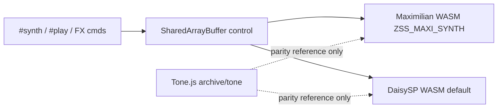
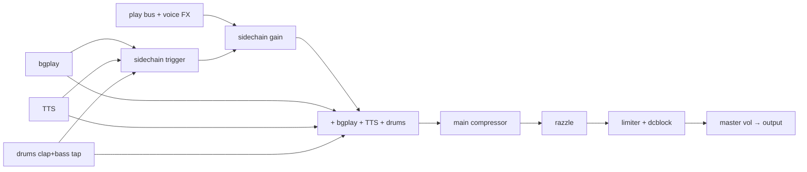
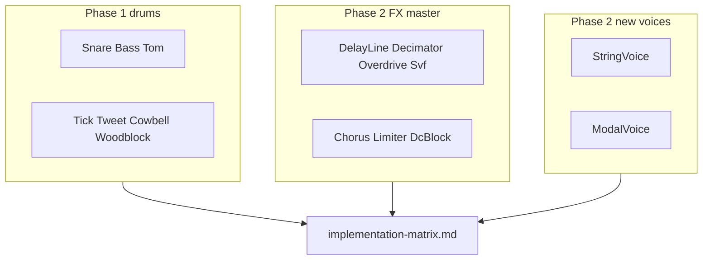

# Synth implementation matrix

Cross-reference for how ZSS implements voices, FX, drums, and master-chain processing across **DaisySP WASM** (default), **Maximilian WASM** (`ZSS_MAXI_SYNTH=true`), and archived **Tone.js**.

Deep param/default catalogs: [voice-types-reference.md](voice-types-reference.md), [fx-types-reference.md](fx-types-reference.md), [audiochain.md](audiochain.md), [drums.md](drums.md), [CUTOVER.md](../backend/daisy/CUTOVER.md).

## Backend legend

- **DaisySP** (default): monolithic C++ in [`zss_daisy_synth.cpp`](../backend/daisy/native/zss_daisy_synth.cpp), [`daisyengine.ts`](../backend/daisy/daisyengine.ts)
- **Maximilian** (`ZSS_MAXI_SYNTH=true`): generated play code in `backend/wasm/*playcode.ts`, injected via [`maximilian.ts`](../backend/wasm/maximilian.ts)
- **Tone** (archived): [`archive/tone/`](../archive/tone/) — parity ground truth for Maximilian; Daisy voice/FX still Tone-gated, drums use Daisy-native fixtures

**DaisySP runtime usage:** `Oscillator`, `Adsr`, `Decimator`, `Overdrive`, `Svf`, `Phasor`, `DelayLine`, `Chorus`, `WhiteNoise`, `Limiter`, `DcBlock`, `OnePole`, `Autowah`, `StringVoice` (`#synth string` bowed + `#synth pluck`), `ModalVoice` (bells), `Drip`, and (Daisy drums) `AnalogBassDrum`, `SyntheticBassDrum`. **DaisySP-LGPL:** `ReverbSc` for `#reverb`; `Compressor` for main bus (sidechain duck uses custom envelope; TTS in dry/sidechain path). Custom C++ remains for sidechain duck, noise voices, doot/algo, drum EQ biquads.

---

## Table 1 — Voice types (`SOURCE_TYPE`)

Enum: [`shared/sourcetype.ts`](../shared/sourcetype.ts). Dispatch: [`voiceplaycode.ts`](../backend/wasm/voiceplaycode.ts) / `VoiceType` in cpp.

| ZSS name | Enum | Maximilian | DaisySP WASM | Tone (archived) | Closest [DaisySP feature](https://github.com/electro-smith/DaisySP#-features) | Key files |
|----------|------|------------|--------------|-----------------|-------------------------------------------------------------------------------|-----------|
| `sine`/`square`/…/`fat*` | `SYNTH` | `maxiOsc` + hand-rolled ADSR; AM/FM/PWM/fat | `Oscillator` + `Adsr` | `Tone.Synth` + `OmniOscillator` | Subtractive / FM (`Oscillator`, `Adsr`) | `wasmoscplaycode.ts`, `wasmosctype.ts`, cpp `synthsource()` |
| `retro` | `RETRO_NOISE` | LFSR table resample + ADSR | Custom LFSR tables + ADSR | `Sampler` + shelf filters | Noise (custom, not `Whitenoise`) | `noiseplaycode.ts`, `noisewave.ts` |
| `buzz` | `BUZZ_NOISE` | same (different LFSR tap) | same | same | Noise | `noisemeta.ts` |
| `clang` | `CLANG_NOISE` | same | same | same | Noise | same |
| `metallic` | `METALLIC_NOISE` | same + amplitude norm | same | same | Noise | same |
| `hollow` | `HOLLOW_NOISE` | FFT hollow table | same | Error (WASM-only) | Noise (custom spectral) | `noisewave.ts` |
| `noise` | `WHITE_NOISE` | PRNG white table | same | Error (WASM-only) | Whitenoise (custom PRNG) | `noisewave.ts` |
| `bells` | `BELLS` | FM stack + sparkle osc | `ModalVoice` + sparkle FM | `FMSynth` + `MetalSynth` | Physical modeling + FM sparkle | cpp `processvoice()` |
| `doot` | `DOOT` | sine + pitch-decay loop | `Oscillator` + `Adsr` | `MembraneSynth` | Drum / physical (Membrane-like) | `voiceplaycode.ts` `dootvoice()` |
| `algo0`–`algo7` | `ALGO_SYNTH` | 4× osc + 5× ADSR, 8 routings | 4× `Oscillator` + 5× `Adsr` | custom `AlgoSynth` | FM (4-op routing) | `wasmalgoplaycode.ts`, [algosynth.md](algosynth.md) |
| `string` | `STRING_VOICE` (algo 0) | — (Daisy-only) | `StringVoice` + `SetSustain(gate)` | — | Physical modeling (bowed) | cpp `processvoice()` |
| `pluck`/`karplus` | `STRING_VOICE` (algo 1) | — (Daisy-only) | `StringVoice` strike | — | Physical modeling | cpp `processvoice()` |
| `drip` | `DRIP_VOICE` | — (Daisy-only) | `Drip` | — | Physical modeling | cpp `processvoice()` |

**SYNTH sub-modes** ([`wasmosctype.ts`](../backend/wasm/wasmosctype.ts)): basic waves, pulse/PWM, AM, FM, fat.

---

## Table 2 — Voice FX (7 types)

Serial wet chain (Maxi + Daisy): **fc → echo → reverb → autofilter → distortion → autowah**. Vibrato is pitch-mod, not in wet chain. See [fx-types-reference.md](fx-types-reference.md).

| ZSS FX | Aliases | Maximilian | DaisySP WASM | Tone | DaisySP module | Swap status | Key files |
|--------|---------|------------|--------------|------|----------------|-------------|-----------|
| `fc` | `fcrush` | Sample-and-hold `fxfcrush()` | `Decimator` | `FrequencyCrusher` worklet | `Decimator` | **Swapped** | `wasmfxplaycode.ts`, cpp |
| `echo` | — | `maxiDelayline` | `DelayLine` | `FeedbackDelay` | `DelayLine` | **Swapped** | `wasmfxplaycode.ts` |
| `reverb` | — | 4-comb + predelay | `ReverbSc` (LGPL FDN) | `Reverb` (convolution) | `ReverbSc` (LGPL) | **Done** (Daisy only) | `wasmfxplaycode.ts`, `reverbsc.cpp` |
| `autofilter` | — | LFO + biquad | `Svf` + `Phasor` | `AutoFilter` | `Svf`, `Phasor` | **Swapped** | `wasmautofilterplaycode.ts` |
| `vibrato` | — | Pitch cents `playvibratocents()` | Same + `fxvibratolfo` | Wet `Vibrato` in chain | `Oscillator` (LFO) | Keep custom | `wasmvibratoplaycode.ts` |
| `distortion` | `distort` | `tonedistort()` | `Overdrive` | `Distortion` | `Overdrive` | **Swapped** | `wasmfxplaycode.ts` |
| `autowah` | — | Envelope follower + peaking | `Autowah` (heuristic SAB map) | `AutoWah` | `Autowah` | **Done** (Daisy) | `wasmautowahplaycode.ts`, cpp |

**Bus layout:** 4 groups via [`voicefxgroup.ts`](../voicefxgroup.ts). SAB: [`wasmfxstate.ts`](../backend/wasm/wasmfxstate.ts).

---

## Table 3 — Master chain (not voice FX)

| Processor | Role | Maximilian | DaisySP WASM | Tone | DaisySP module | Swap status | Key files |
|-----------|------|------------|--------------|------|----------------|-------------|-----------|
| Sidechain duck | Duck `#play` when bg/TTS/drums hit | Power-domain detector; clap+bass tap | Custom envelope + TTS key | `SidechainCompressor` worklet | Custom | Keep custom | `wasmsidechainplaycode.ts` |
| Main compressor | Bus dynamics | -28 dB / 4:1 / 3 ms / 150 ms | `Compressor` (-24 dB / 3:1) | `Tone.Compressor` | Custom | **Done** (Daisy) | `wasmmasterplaycode.ts` |
| Razzle | Master character | `maxiDelayline` + `maxiOsc` | Manual vibrato delay + `Chorus` + hiss | `Vibrato` + `Chorus` + noise | `Chorus` (partial) | **Partial swap** | `wasmrazzleplaycode.ts` |
| Output safety | Peak control | — | `Limiter` | — | `Limiter` | **Swapped** | cpp `applymasterlimit()` |
| DC block | Master out | — | `DcBlock` | — | `DcBlock` | **Swapped** | cpp `zss_process()` |
| Master trim | Level staging | -2 dB trim + 22 dB makeup | Same | Tone graph gains | — | — | [`wasmlevels.ts`](../backend/wasm/wasmlevels.ts) |

**Sidechain params (code):** threshold -42 dB, ratio **5:1**, attack 5 ms, release 60 ms, mix 0.75, makeup +24 dB; bg/TTS send -12 dB, drum send -28 dB.

---

## Table 4 — Drums (10 IDs)

**Daisy backend:** [DaisySP Drums](https://github.com/electro-smith/DaisySP/tree/master/Source/Drums/) where classes exist; unmatched IDs stay custom. **Maximilian** keeps Tone-parity kit in [`drumplaycode.ts`](../backend/wasm/drumplaycode.ts).

| ID | Drum | Maximilian | DaisySP WASM | Tone | DaisySP class | Swap status | Key files |
|----|------|------------|--------------|------|---------------|-------------|-----------|
| 0 | Tick | Noise + hipass | Custom noise + EQ | `NoiseSynth` + filter | — | **Keep custom** | `drumplaycode.ts`, cpp `drumtick()` |
| 1 | Tweet | longer noise hat | Custom noise + EQ | same | — | **Keep custom** | cpp `drumtweet()` |
| 2 | Cowbell | dual square + bandpass | Custom | `PolySynth` | — | Keep custom | `drumcowbell()` |
| 3 | Clap | noise + EQ chain | `WhiteNoise` + EQ | `NoiseSynth` + EQ | `WhiteNoise` (source) | **Partial swap** | `drumclap()`; sidechain tap |
| 4 | Hi snare | osc + noise + distort | Custom (WASM parity) | same | Custom | **Done** (Daisy) | same |
| 5 | Hi woodblock | clack + donk | Custom | bandpass stack | — | Keep custom | `drumwoodblock(true)` |
| 6 | Low snare | lower freq snare | Custom (WASM parity) | same | Custom | **Done** (Daisy) | same |
| 7 | Low tom | pitch glide tom | `SyntheticBassDrum` tom substitute | saw/tri/noise glide | `SyntheticBassDrum` | Migrated | same |
| 8 | Low woodblock | lower woodblock | Custom | same | — | Keep custom | `drumwoodblock(false)` |
| 9 | Bass | membrane-style kick | `AnalogBassDrum` | `MembraneSynth` | `AnalogBassDrum` | Migrated | same; sidechain tap |

**Parity:** Maximilian drums vs Tone. Daisy drums vs Daisy-native fixtures (not Tone).

---

## Table 5 — DaisySP modules: linked vs used

| DaisySP category | Used in ZSS runtime | Notes |
|------------------|---------------------|-------|
| `Oscillator` | Yes | Voices, FX LFOs, razzle vibrato/hiss, custom drums |
| `Adsr` | Yes | Gated voices/algo |
| `Decimator`, `Overdrive`, `Svf`, `Phasor` | Yes | Voice FX (Tier 1–2 swaps) |
| `DelayLine` | Yes | Echo FX |
| `Chorus` | Yes | Razzle chorus half |
| `WhiteNoise` | Yes | Drum noise source (tick/tweet/clap paths via `drumnoise()`) |
| `Limiter`, `DcBlock` | Yes | Master output chain |
| `StringVoice` (`string` bow + `pluck`) | Yes | `#synth string` uses `SetSustain(gate)`; `#synth pluck` strike mode |
| `AnalogBassDrum`, `SyntheticBassDrum` | Yes | Daisy backend drums (bass + tom) |
| `ReverbSc` (LGPL) | Yes | Daisy backend `#reverb` only |
| `Compressor` (LGPL) | Yes | Daisy main bus only |
| `HiHat` | No | Reverted — tick/tweet kept custom |
| `SyntheticSnareDrum` | No | Fallback if AnalogSnare presets insufficient |
| `Fm2`, etc. | No | Future candidates (`KarplusString` / `Drip` wired — see Table 1) |

---

## Table 6 — DaisySP swap opportunities (Daisy backend)

**Feasibility:** Easy = refactor · Medium = param mapping · Hard = breaks Tone gate · N/A = no module

### Voice FX

| ZSS custom | DaisySP candidate | Feasibility | Swap status | Notes |
|------------|-------------------|-------------|-------------|-------|
| `fxfcrush()` | `Decimator` | Medium | **Done** | Rate reduction only; no bitcrush |
| `fxecho()` | `DelayLine` | Easy | **Done** | Ring buffer removed |
| `fxreverb()` | `ReverbSc` | Medium | **Done** (Daisy) | Maxi keeps 4-comb; Daisy uses LGPL FDN |
| `fxautofilterbus()` | `Svf` + `Phasor` | Medium | **Done** | Bandpass sweep |
| `tonedistort()` | `Overdrive` | Hard | **Done** | Different curve (accepted) |
| `fxautowahbus()` | `Autowah` | Hard | **Done** (Daisy) | Heuristic map: octaves→SetWah, gain→SetLevel, sensitivity→input boost |
| Vibrato pitch cents | `PitchShifter` | Hard | Keep custom | Source pitch mod, not wet delay |

### Master chain

| ZSS custom | DaisySP candidate | Feasibility | Swap status |
|------------|-------------------|-------------|-------------|
| Sidechain + compressor | LGPL `Compressor` | Medium | Partial | Main bus only; sidechain custom |
| Razzle chorus | `Chorus` | Medium | **Done** (vibrato/hiss manual) |
| Output safety | `Limiter` | Easy | **Done** |
| DC offset | `DcBlock` | Easy | **Done** |

### Drums

| ZSS drum | DaisySP class | Swap status |
|----------|---------------|-------------|
| 0–1 Tick/Tweet | — | **Keep custom** (HiHat reverted) |
| 4, 6 Snares | `AnalogSnareDrum` | Migrated |
| 9 Bass | `AnalogBassDrum` | Migrated |
| 7 Tom | `SyntheticBassDrum` | Migrated |
| 3 Clap noise source | `WhiteNoise` | **Done** (EQ chain kept) |
| 2, 5, 8 | — | Keep custom |

### Build gaps (future)

| Module | Source | Enables |
|--------|--------|---------|
| LGPL `ReverbSc` | DaisySP-LGPL | Daisy `#reverb` (linked) |
| LGPL `Compressor` | DaisySP-LGPL | Daisy main bus dynamics (linked) |

---

## Primary source files

| Topic | Path |
|-------|------|
| Voice types | [`shared/sourcetype.ts`](../shared/sourcetype.ts), [`voiceplaycode.ts`](../backend/wasm/voiceplaycode.ts) |
| WASM FX | [`wasmfxplaycode.ts`](../backend/wasm/wasmfxplaycode.ts), [`wasmfxstate.ts`](../backend/wasm/wasmfxstate.ts) |
| WASM master | [`wasmmasterplaycode.ts`](../backend/wasm/wasmmasterplaycode.ts), [`wasmsidechainplaycode.ts`](../backend/wasm/wasmsidechainplaycode.ts) |
| WASM drums | [`drumplaycode.ts`](../backend/wasm/drumplaycode.ts) |
| Daisy DSP | [`zss_daisy_synth.cpp`](../backend/daisy/native/zss_daisy_synth.cpp) |
| Daisy build | [`build-daisy.sh`](../backend/daisy/native/build-daisy.sh) |
| Backend factory | [`synthbackendfactory.ts`](../backend/synthbackendfactory.ts) |
| Firmware | [`firmware/audio.ts`](../../firmware/audio.ts) |

---

## Summary A — DaisySP migrations

### Phase 1 — drums (prior)

| Category | ZSS feature | DaisySP module | Status |
|----------|-------------|----------------|--------|
| Drums | Tick (0), Tweet (1) | — | **Keep custom** (HiHat reverted) |
| Drums | Hi snare (4), Low snare (6) | `AnalogSnareDrum` | Migrated |
| Drums | Bass (9) | `AnalogBassDrum` | Migrated |
| Drums | Low tom (7) | `SyntheticBassDrum` | Migrated (tom substitute) |
| Drums | Cowbell, woodblocks (2,5,8) | — | Keep custom |
| Voices | Core 10 `SOURCE_TYPE` families | `Oscillator`, `Adsr` | Already in use |

### Phase 2 — FX + master (implemented)

| Category | ZSS feature | DaisySP module | Status |
|----------|-------------|----------------|--------|
| FX | Echo | `DelayLine` | **Done** |
| FX | FC crush | `Decimator` | **Done** |
| FX | Autofilter | `Svf` + `Phasor` | **Done** |
| FX | Distortion | `Overdrive` | **Done** |
| FX | Autowah | `Autowah` | **Done** (Daisy) |
| Master | Razzle chorus | `Chorus` | **Done** (partial) |
| Master | Output safety | `Limiter` | **Done** |
| Master | DC block | `DcBlock` | **Done** |
| Drums | Clap/tick/tweet noise | `WhiteNoise` | **Done** (EQ kept) |

**Not migrating:** Maximilian reverb (4-comb), Maximilian master/sidechain (custom), noise voices, doot, algo synth.

---

## Summary B — New voice types (Physical Modeling)

| Proposed `#synth` name | DaisySP class | Status | Build deps |
|------------------------|---------------|--------|--------------|
| `string` | `StringVoice` + `SetSustain` | **Done** (Daisy-only, algo 0 bowed) | `stringvoice.cpp`, `resonator.cpp`, `KarplusString.cpp` (internal) |
| `pluck`, `karplus` | `StringVoice` | **Done** (Daisy-only, algo 1) | same |
| `bells` | `ModalVoice` + sparkle FM | **Done** (Daisy `BELLS` slot) | `modalvoice.cpp`, `resonator.cpp` |
| `drip` | `Drip` | **Done** (Daisy-only) | `drip.cpp` |

Recommendation: core simplify-first swaps are complete; optional follow-ups include `Fm2`, bitcrush on `Decimator`, and LGPL `Compressor`.
