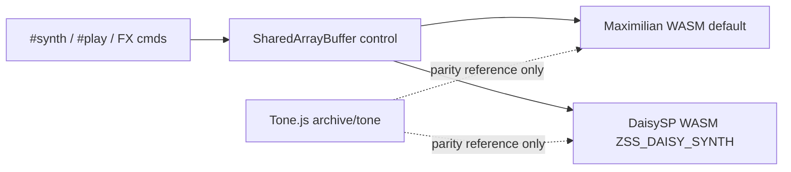
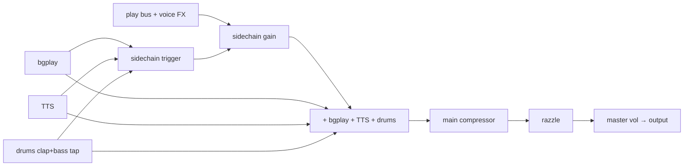
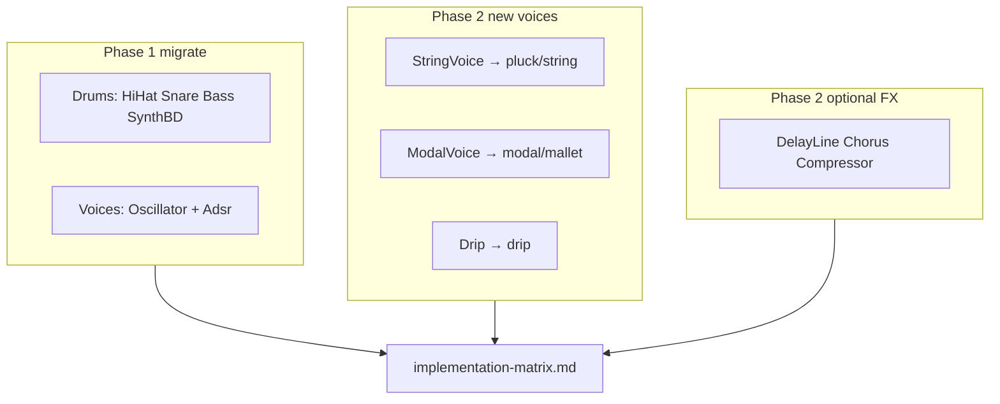

# Synth implementation matrix

Cross-reference for how ZSS implements voices, FX, drums, and master-chain processing across **Maximilian WASM** (default), **DaisySP WASM** (`ZSS_DAISY_SYNTH=true`), and archived **Tone.js**.

Deep param/default catalogs: [voice-types-reference.md](voice-types-reference.md), [fx-types-reference.md](fx-types-reference.md), [audiochain.md](audiochain.md), [drums.md](drums.md), [CUTOVER.md](../backend/daisy/CUTOVER.md).

## Backend legend

- **Maximilian** (default): generated play code in `backend/wasm/*playcode.ts`, injected via [`maximilian.ts`](../backend/wasm/maximilian.ts)
- **DaisySP** (opt-in): monolithic [`zss_daisy_synth.cpp`](../backend/daisy/native/zss_daisy_synth.cpp), loaded by [`daisyengine.ts`](../backend/daisy/daisyengine.ts)
- **Tone** (archived): [`archive/tone/`](../archive/tone/) — parity ground truth for Maximilian; Daisy voice/FX still Tone-gated, drums use Daisy-native fixtures

**DaisySP runtime usage:** `Oscillator`, `Adsr`, and (Daisy drums) `HiHat`, `AnalogSnareDrum`, `AnalogBassDrum`, `SyntheticBassDrum`. Other modules are linked in [`build-daisy.sh`](../backend/daisy/native/build-daisy.sh) but voice/FX/master DSP remains custom C++ for Tone/Maximilian parity.

---

## Table 1 — Voice types (`SOURCE_TYPE`)

Enum: [`shared/sourcetype.ts`](../shared/sourcetype.ts). Dispatch: [`voiceplaycode.ts`](../backend/wasm/voiceplaycode.ts) / `VoiceType` in cpp.

| ZSS name | Enum | Maximilian | DaisySP WASM | Tone (archived) | Closest [DaisySP feature](https://github.com/electro-smith/DaisySP#-features) | Key files |
|----------|------|------------|--------------|-----------------|-------------------------------------------------------------------------------|-----------|
| `sine`/`square`/…/`fat*` | `SYNTH` | `maxiOsc` + hand-rolled ADSR; AM/FM/PWM/fat | `Oscillator` + `Adsr` | `Tone.Synth` + `OmniOscillator` | Subtractive / FM (`Oscillator`, `Adsr`) | `wasmoscplaycode.ts`, `wasmosctype.ts`, cpp `synthsource()` |
| `retro` | `RETRO_NOISE` | LFSR table resample + ADSR | Custom LFSR tables + ADSR | `Sampler` + shelf filters | Noise (custom, not `Whitenoise`) | `noiseplaycode.ts`, `noisewave.ts` |
| `buzz` | `BUZZ_NOISE` | same (different LFSR tap) | same | same | Noise | `noisemeta.ts` |
| `clang` | `CLANG_NOISE` | same | same | same | Noise | same |
| `metallic` | `METALLIC_NOISE` | same + amplitude norm | same | same | Noise | same |
| `hollow` | `HOLLOW_NOISE` | FFT hollow table | same | Error (WASM-only) | Noise (custom spectral) | `noisewave.ts` |
| `noise` | `WHITE_NOISE` | PRNG white table | same | Error (WASM-only) | Whitenoise (custom PRNG) | `noisewave.ts` |
| `bells` | `BELLS` | FM stack + sparkle osc | 4× `Oscillator` + 2× `Adsr` | `FMSynth` + `MetalSynth` | FM (manual, not `Fm2`) | `voiceplaycode.ts` `bellsvoice()` |
| `doot` | `DOOT` | sine + pitch-decay loop | `Oscillator` + `Adsr` | `MembraneSynth` | Drum / physical (Membrane-like) | `voiceplaycode.ts` `dootvoice()` |
| `algo0`–`algo7` | `ALGO_SYNTH` | 4× osc + 5× ADSR, 8 routings | 4× `Oscillator` + 5× `Adsr` | custom `AlgoSynth` | FM (4-op routing) | `wasmalgoplaycode.ts`, [algosynth.md](algosynth.md) |

**SYNTH sub-modes** ([`wasmosctype.ts`](../backend/wasm/wasmosctype.ts)): basic waves, pulse/PWM, AM, FM, fat.

---

## Table 2 — Voice FX (7 types)

Serial wet chain (Maxi + Daisy): **fc → echo → reverb → autofilter → distortion → autowah**. Vibrato is pitch-mod, not in wet chain. See [fx-types-reference.md](fx-types-reference.md).

| ZSS FX | Aliases | Maximilian | DaisySP WASM | Tone | DaisySP analogue | Key files |
|--------|---------|------------|--------------|------|------------------|-----------|
| `fc` | `fcrush` | Sample-and-hold `fxfcrush()` | Custom `fxfcrush()` | `FrequencyCrusher` worklet | Decimate (custom, not `Decimator`) | `wasmfxplaycode.ts`, cpp |
| `echo` | — | `maxiDelayline` | Ring buffer delay | `FeedbackDelay` | No dedicated delay class | `wasmfxplaycode.ts` |
| `reverb` | — | 4-comb + predelay | Same topology | `Reverb` (convolution) | Custom comb | `wasmfxplaycode.ts` |
| `autofilter` | — | LFO + biquad | LFO (`Oscillator`) + biquad | `AutoFilter` | Filters (custom biquad) | `wasmautofilterplaycode.ts` |
| `vibrato` | — | Pitch cents `playvibratocents()` | Same + `fxvibratolfo` | Wet `Vibrato` in chain | LFO via `Oscillator` | `wasmvibratoplaycode.ts` |
| `distortion` | `distort` | `tonedistort()` | Same formula | `Distortion` | Overdrive (custom waveshaper) | `wasmfxplaycode.ts` |
| `autowah` | — | Envelope follower + peaking | Custom `fxautowahbus()` | `AutoWah` | AutoWah (linked, unused) | `wasmautowahplaycode.ts` |

**Bus layout:** 4 groups via [`voicefxgroup.ts`](../voicefxgroup.ts). SAB: [`wasmfxstate.ts`](../backend/wasm/wasmfxstate.ts).

---

## Table 3 — Master chain (not voice FX)

| Processor | Role | Maximilian | DaisySP WASM | Tone | DaisySP analogue | Key files |
|-----------|------|------------|--------------|------|------------------|-----------|
| Sidechain duck | Duck `#play` when bg/TTS/drums hit | Power-domain detector; clap+bass tap | Same; TTS not in trigger | `SidechainCompressor` worklet | Dynamics (custom) | `wasmsidechainplaycode.ts` |
| Main compressor | Bus dynamics | -28 dB / 4:1 / 3 ms / 150 ms | Same | `Tone.Compressor` | Custom (no limiter) | `wasmmasterplaycode.ts` |
| Razzle | Master character | `maxiDelayline` + `maxiOsc` | Delay + `Oscillator` LFOs | `Vibrato` + `Chorus` + noise | Chorus (linked, unused) | `wasmrazzleplaycode.ts` |
| Master trim | Level staging | -2 dB trim + 22 dB makeup | Same | Tone graph gains | — | [`wasmlevels.ts`](../backend/wasm/wasmlevels.ts) |

**Sidechain params (code):** threshold -42 dB, ratio **5:1**, attack 5 ms, release 60 ms, mix 0.75, makeup +24 dB; bg/TTS send -12 dB, drum send -28 dB.

---

## Table 4 — Drums (10 IDs)

**Daisy backend:** [DaisySP Drums](https://github.com/electro-smith/DaisySP/tree/master/Source/Drums/) where classes exist; unmatched IDs stay custom. **Maximilian** keeps Tone-parity kit in [`drumplaycode.ts`](../backend/wasm/drumplaycode.ts).

| ID | Drum | Maximilian | DaisySP WASM | Tone | DaisySP class | Key files |
|----|------|------------|--------------|------|---------------|-----------|
| 0 | Tick | Noise + hipass | `HiHat` closed preset | `NoiseSynth` + filter | `HiHat` | `drumplaycode.ts`, cpp `drumsout()` |
| 1 | Tweet | longer noise hat | `HiHat` open preset | same | `HiHat` | same |
| 2 | Cowbell | dual square + bandpass | Custom | `PolySynth` | — | `drumcowbell()` |
| 3 | Clap | noise + EQ chain | Custom | `NoiseSynth` + EQ | — | `drumclap()`; sidechain tap |
| 4 | Hi snare | osc + noise + distort | `AnalogSnareDrum` | same | `AnalogSnareDrum` | same |
| 5 | Hi woodblock | clack + donk | Custom | bandpass stack | — | `drumwoodblock(true)` |
| 6 | Low snare | lower freq snare | `AnalogSnareDrum` darker preset | same | `AnalogSnareDrum` | same |
| 7 | Low tom | pitch glide tom | `SyntheticBassDrum` tom substitute | saw/tri/noise glide | `SyntheticBassDrum` | same |
| 8 | Low woodblock | lower woodblock | Custom | same | — | `drumwoodblock(false)` |
| 9 | Bass | membrane-style kick | `AnalogBassDrum` | `MembraneSynth` | `AnalogBassDrum` | same; sidechain tap |

**Parity:** Maximilian drums vs Tone. Daisy drums vs Daisy-native fixtures (not Tone).

---

## Table 5 — DaisySP modules: linked vs used

| DaisySP category | Used in ZSS runtime | Notes |
|------------------|---------------------|-------|
| `Oscillator` | Yes | Voices, FX LFOs, razzle, custom drums |
| `Adsr` | Yes | Gated voices/algo |
| `HiHat`, `AnalogSnareDrum`, `AnalogBassDrum`, `SyntheticBassDrum` | Yes | Daisy backend drums |
| `SyntheticSnareDrum` | No | Fallback if AnalogSnare presets insufficient |
| `Decimator`, `Overdrive`, `AutoWah`, `Chorus`, etc. | No | Custom FX |
| `CrossFade`, `Limiter`, LGPL `Compressor` | No | Custom dynamics |
| `KarplusString`, `ModalVoice`, `Fm2`, etc. | No | Phase 2 voice candidates |
| `Whitenoise`, `ClockedNoise` | No | Custom LFSR/PRNG for noise voices |

---

## Table 6 — DaisySP swap opportunities (Daisy backend)

**Feasibility:** Easy = refactor · Medium = param mapping · Hard = breaks Tone gate · N/A = no module

### Voice FX (not migrating in Phase 1)

| ZSS custom | DaisySP candidate | Feasibility | Notes |
|------------|-------------------|-------------|-------|
| `fxfcrush()` | `SampleRateReducer` | Medium | `Decimator` adds bitcrush ZSS lacks |
| `fxecho()` | `DelayLine` | Easy | Refactor only |
| `fxreverb()` | — | N/A | No reverb in DaisySP MIT |
| `fxautofilterbus()` | `Svf` + `Phasor` | Medium | 8 biquad types vs SVF modes |
| `tonedistort()` | `Overdrive` | Hard | Different curve |
| `fxautowahbus()` | `Autowah` | Hard | Different param model |
| Vibrato pitch cents | `PitchShifter` | Hard | Source pitch mod, not wet delay |

### Master chain (Phase 2)

| ZSS custom | DaisySP candidate | Feasibility |
|------------|-------------------|-------------|
| Sidechain + compressor | LGPL `Compressor` | Medium |
| Razzle chorus | `Chorus` | Medium |
| Output safety | `Limiter` | Easy |

### Drums — migrated (Phase 1)

| ZSS drum | DaisySP class | Status |
|----------|---------------|--------|
| 0–1 Tick/Tweet | `HiHat` | Migrated |
| 4, 6 Snares | `AnalogSnareDrum` | Migrated |
| 9 Bass | `AnalogBassDrum` | Migrated |
| 7 Tom | `SyntheticBassDrum` | Migrated |
| 2, 3, 5, 8 | — | Custom |

### Build gaps (future swaps)

| Module | Source | Enables |
|--------|--------|---------|
| `SampleRateReducer` | `Effects/sampleratereducer.cpp` | Better `fc` |
| `WhiteNoise` | `Noise/whitenoise.cpp` | Custom drum noise |
| `Limiter` | `Dynamics/limiter.cpp` | Brickwall |
| `Compressor` | DaisySP-LGPL | Sidechain + main |

---

## Primary source files

| Topic | Path |
|-------|------|
| Voice types | [`shared/sourcetype.ts`](../shared/sourcetype.ts), [`voiceplaycode.ts`](../backend/wasm/voiceplaycode.ts) |
| WASM FX | [`wasmfxplaycode.ts`](../backend/wasm/wasmfxplaycode.ts), [`wasmfxstate.ts`](../backend/wasm/wasmfxstate.ts) |
| WASM master | [`wasmmasterplaycode.ts`](../backend/wasm/wasmmasterplaycode.ts), [`wasmsidechainplaycode.ts`](../backend/wasm/wasmsidechainplaycode.ts) |
| WASM drums | [`drumplaycode.ts`](../backend/wasm/drumplaycode.ts) |
| Daisy DSP | [`zss_daisy_synth.cpp`](../backend/daisy/native/zss_daisy_synth.cpp) |
| Daisy build | [`build-daisy.sh`](../backend/daisy/native/build-daisy.sh) |
| Backend factory | [`synthbackendfactory.ts`](../backend/synthbackendfactory.ts) |
| Firmware | [`firmware/audio.ts`](../../firmware/audio.ts) |

---

## Summary A — Planned DaisySP migrations

### Phase 1 (implemented)

| Category | ZSS feature | DaisySP module | Status |
|----------|-------------|----------------|--------|
| Drums | Tick (0), Tweet (1) | `HiHat` | Migrated |
| Drums | Hi snare (4), Low snare (6) | `AnalogSnareDrum` | Migrated |
| Drums | Bass (9) | `AnalogBassDrum` | Migrated |
| Drums | Low tom (7) | `SyntheticBassDrum` | Migrated (tom substitute) |
| Drums | Cowbell, clap, woodblocks (2,3,5,8) | — | Keep custom |
| Voices | All 10 `SOURCE_TYPE` families | `Oscillator`, `Adsr` | Already in use |

### Phase 2 (documented, not yet implemented)

| Category | ZSS feature | DaisySP module | Notes |
|----------|-------------|----------------|-------|
| FX | Echo buffers | `DelayLine` | Refactor only |
| FX | Razzle chorus | `Chorus` | Partial swap |
| Master | Sidechain + compressor | `Compressor` (LGPL) | Needs `USE_DAISYSP_LGPL` |
| Master | Output safety | `Limiter` | Add to build |
| Drums | Custom drum noise | `WhiteNoise` | Custom slots only |
| Utility | Master out | `DcBlock` | Optional |

**Not migrating:** reverb, `#fcrush`, autowah, distortion, noise voices, bells, doot, algo synth.

---

## Summary B — Proposed new voice types (Physical Modeling)

Phase 2 — new `#synth` families beyond current 10 `SOURCE_TYPE` values. Daisy-only at first.

| Proposed `#synth` name | DaisySP class | Sound character | Build deps to add |
|------------------------|---------------|-----------------|-------------------|
| `string`, `pluck`, `karplus` | [`StringVoice`](../backend/daisy/native/DaisySP/Source/PhysicalModeling/stringvoice.h) | Karplus-Strong plucked/bowed | `stringvoice.cpp`, `dust.cpp`, `onepole.cpp` |
| `modal`, `mallet` | [`ModalVoice`](../backend/daisy/native/DaisySP/Source/PhysicalModeling/modalvoice.h) | Mallet on resonant body | `modalvoice.cpp`, `resonator.cpp`, `dust.cpp` |
| `drip` | [`Drip`](../backend/daisy/native/DaisySP/Source/PhysicalModeling/drip.h) | Water-drop SFX | `drip.cpp` |

Lower-level: [`String`](../backend/daisy/native/DaisySP/Source/PhysicalModeling/KarplusString.h) (already linked), [`Resonator`](../backend/daisy/native/DaisySP/Source/PhysicalModeling/resonator.h).

**Suggested params:** StringVoice/ModalVoice — `structure`, `brightness`, `damping`, `accent`, plus `env`/`vol`. Drip — trigger on gate edge.

Recommendation: **StringVoice** + **ModalVoice** highest value for follow-up; **Drip** is niche SFX.
