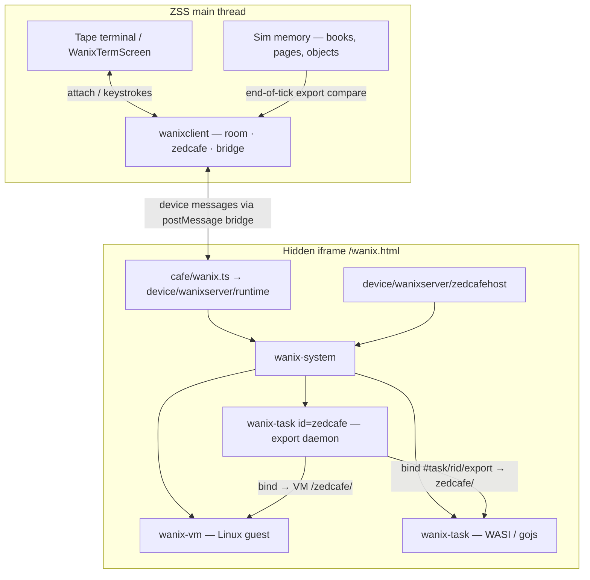
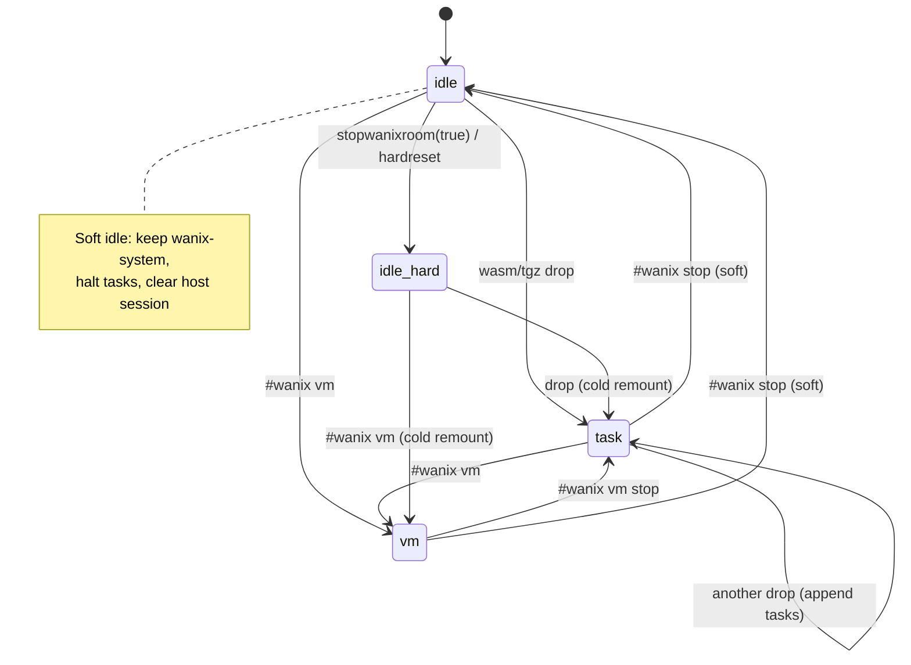
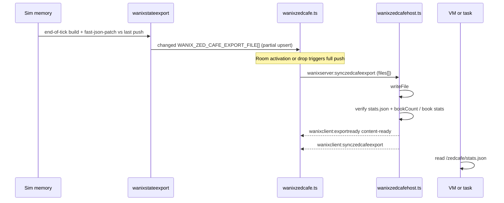
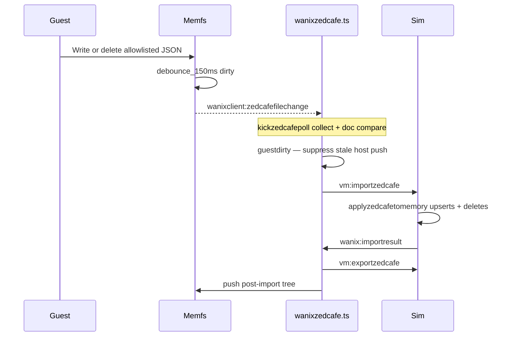
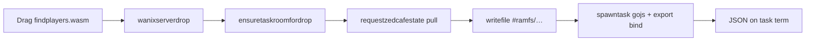
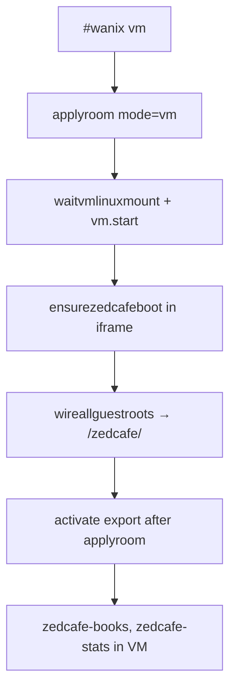
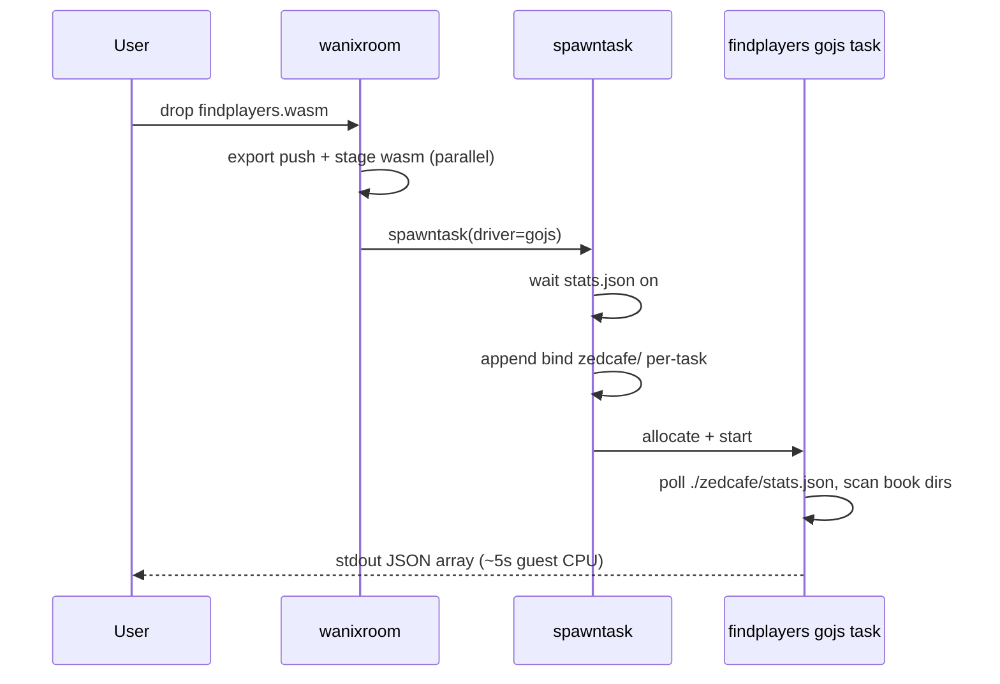
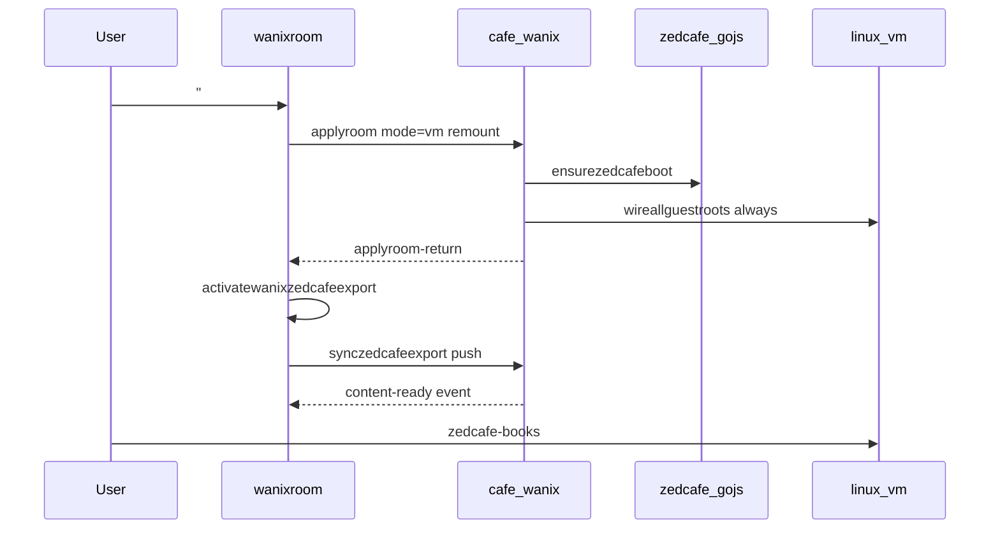
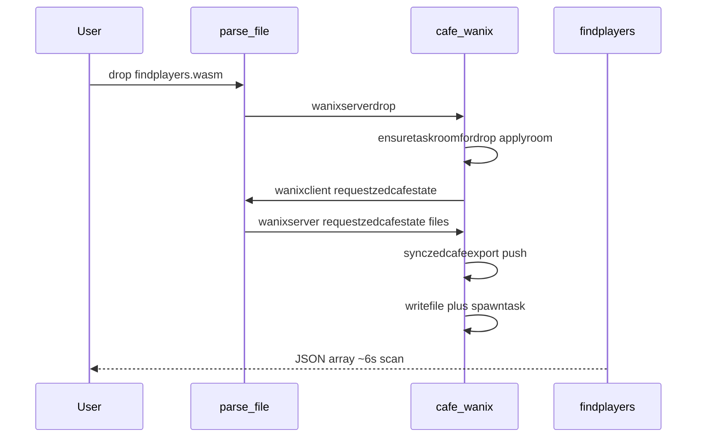

# Wanix in ZSS — full guide

Runs [wanix](https://github.com/tractordev/wanix) (browser OS: Linux v86 VM + WASI/gojs
tasks) inside ZSS. Guest terminals render as colored tiles on the tape terminal screen.
Live game books export from sim memory into a guest-visible **`/zedcafe/`** tree so tools
like `findplayers.wasm` and `greenring.wasm` can read (and write allowlisted) world state.

**Fixture testing:** [`ops/fixtures/wanix/README.md`](../../../ops/fixtures/wanix/README.md)

---

## Table of contents

1. [Big picture](#big-picture)
2. [Parent vs iframe](#parent-vs-iframe)
3. [Room modes & lifecycle](#room-modes--lifecycle)
4. [How you start wanix](#how-you-start-wanix)
5. [Zedcafe export (the core loop)](#zedcafe-export-the-core-loop)
6. [Wasm drop path (task room)](#wasm-drop-path-task-room)
7. [VM path](#vm-path)
8. [findplayers flow](#findplayers-flow)
9. [Terminal attach & input](#terminal-attach--input)
10. [Performance: soft idle & warm reuse](#performance-soft-idle--warm-reuse)
11. [Message protocol](#message-protocol)
12. [Module map](#module-map)
13. [Gotchas & invariants](#gotchas--invariants)
14. [Debugging & validation](#debugging--validation)
15. [What works today (and why)](#what-works-today-and-why)

---

## Big picture



**Why this split:** Wanix owns its own WASM runtime, p9 filesystem, and worker threads.
ZSS owns game memory, UI, and CLI. The iframe is a sandbox; the parent is the control
plane. Shared code lives in `feature/wanix`; only `postMessage` / device bus crosses the
boundary — no shared DOM.

---

## Parent vs iframe

| Side | Entry | Owns |
|------|--------|------|
| **Parent** | `screens/wanix/host` mounts ghost iframe; `wanixclient/wanixbridge` message bridge | Room config, drop routing, export file tree from memory, attach state, term grid snapshots |
| **Iframe** | `cafe/wanix.ts` → `device/wanixserver/runtime` on `/wanix.html` | `<wanix-system>`, VM/task elements, term byte pumps, zedcafe gojs boot, `#ramfs` writes |

```text
┌─────────────────────────────────────────────────────────────────┐
│  ZSS terminal screen (parent)                                   │
│    wanixclient/wanixtermbuffer  ← cells snapshots               │
│    wanixclient/wanixdisplay     ← session/attach                │
└────────────────────────────▲────────────────────────────────────┘
                             │ postMessage / device bus
┌────────────────────────────┴────────────────────────────────────┐
│  cafe/wanix.ts → device/wanixserver/runtime (iframe)            │
│    applyroom, spawntask, writefile, pushzedcafe…                │
│    <wanix-system>                                               │
│      ├─ wanix-bind  (linux, v86, export mounts)                 │
│      ├─ wanix-vm    (optional Linux)                            │
│      ├─ wanix-task  zedcafe  (gojs export daemon)               │
│      └─ wanix-task  user tasks (hello.wasm, findplayers.wasm)   │
└─────────────────────────────────────────────────────────────────┘
```

**Grid engine:** [`wanixtermgridstate.ts`](wanixtermgridstate.ts) is shared — iframe
parses ANSI into cells; parent renders snapshots from
[`wanixtermbuffer.ts`](../../device/wanixclient/wanixtermbuffer.ts).

---

## Room modes & lifecycle

Three modes in [`wanixroomtypes.ts`](wanixroomtypes.ts):

| Mode | Meaning | Guest workloads |
|------|---------|-----------------|
| `idle` | Wanix inactive; no VM/tasks (or soft-idle: warm system kept) | — |
| `task` | Task room only | WASI/gojs tasks + zedcafe daemon |
| `vm` | Linux VM (+ optional tasks) | v86 Linux + zedcafe bind at `/zedcafe/` |

### Bind-on-drop (`input/`)

While **attached** to a Wanix term session, file drops bind under **`input/<name>`**
(task: `./input/…`, VM guest: `/input/…`) instead of spawning tasks or hitting
book/image parsers. User-written processors (WASI tasks or VM guest scripts) read
`input/` and write zedcafe export paths under `zedcafe/…` so the host import cycle
can sync boards and terrain. See `ops/fixtures/wanix/README.md` for
`listinput.wasm`, `input2terrain.wasm`, `png2terrain.sh`, and the three 8×8
`stamp-{red,green,blue}.png` inputs (distinct byte sizes for read validation).



**`mountkey`** — monotonic counter on [`WanixRoomConfig`](wanixroomtypes.ts). Unchanged
`mountkey` + ready system → **warm apply** (no iframe rebuild). Bumped on hard reset →
**cold remount** (`host.replaceChildren()`).

---

## How you start wanix

| Action | Path |
|--------|------|
| `#wanix vm` | CLI → `startwanixvm` → `wanixroom.startwanixvmroom` → iframe `applyroom` mode `vm` |
| Drag `.wasm` / `.tgz` | `parse/file` → `wanixserverdrop` → iframe `drop()` |
| `#wanix stop` | `stopwanixroom()` — soft idle by default |
| `#wanix attach [session]` | Focus a task/VM term tile |
| `#wanix` menu | CLI → `wanixservermenu` → iframe builds tape → `wanixclient:menu` print-only |

**Lazy stand-up:** Books load into sim at login only. Zedcafe export daemon and host push
run when the **first** VM or task room activates — not at login.

---

## Zedcafe export (the core loop)

Zedcafe mirrors live sim books into a guest-visible tree at `./zedcafe/` (tasks) or
`/zedcafe/` (VM). Guests may **read and write** allowlisted JSON paths; the export FS
emits a coalesced dirty signal on mutating ops, the parent imports into the **sim
worker**, then re-exports so the tree matches sim again.

### Mount layout (iframe)

```text
wanix-system
  wanix-task[id=zedcafe, type=gojs]     ← export daemon (gojs wasm)
    #task/{rid}/export/                 ← host pushes JSON tree here
      stats.json
      {kebab-book-name}-{bookId}/{kebab-page-name}-{pageId}/board/terrain.json
      {bookDir}/{pageDir}/board/objects/{id}.json
      …
    bind: export → zedcafe/             ← guest path ./zedcafe/ (tasks)

  wanix-vm (when running)
    bind: #task/{rid}/export → /zedcafe/   ← Linux guest sees /zedcafe/
```

Path layout uses `{kebab-name}-{id}` directories (no `books/` or `pages/` segments).
Allowlist: [`zedcafetreeschema.ts`](zedcafetreeschema.ts) /
[`allowed-path-patterns.json`](../../../ops/fixtures/wanix/zedcafe/allowed-path-patterns.json).

Constants: [`wanixzedcafeconstants.ts`](wanixzedcafeconstants.ts).

### Export pipeline



### Guest write → sim import



- Dirty path: Go `schemaGuardFS` → gojs `postMessage({zedcafeexportdirty})` → Wanix
  `worker.go` → `__wanixOnZedcafeExportDirty` → `wanixclient:zedcafefilechange` →
  `kickzedcafepoll('file-change')`. Host pushes set `hostpushinflight` so sync batches
  do not kick import mid-write.
- Session-close still kicks import (greenring exit-after-write). **No continuous
  interval poll.**
- Import runs in the **sim worker** (`handleimportzedcafe`), not main-thread memory.
- **Deletes mirror the guest tree:** books/pages absent from the guest export are cleared
  in sim; missing `board/objects/*.json` disappear when the board page is upserted.
  A valid empty tree (`bookCount: 0`) clears all sim books.
- While `guestdirty`, host pushes of pre-import snapshots are skipped.
- Apply failures log and leave import-ready active so the next dirty/session-close kick
  can retry. Hard iframe message failures still stop the import runner.

**Readiness contract (two gates):**

1. **Mount ready** — gojs daemon running; `#task/{rid}/export` exists (`waitzedcafemount`).
2. **Content ready** — `stats.json` present with `exportedAt` + `bookCount` after host push.

**Why `stats.json`:** Single cheap probe for “export tree is populated.” findplayers,
greenring, and VM `zedcafe-ready` all poll it.

**Event-driven wait (perf fix):** After push, iframe posts
[`wanixclient:exportready`](api.ts (wanix helpers)) `{ event: 'content-ready', taskrid }`.
Parent [`handlers/exportready.ts`](../../device/wanixclient/handlers/exportready.ts) continues the zedcafe pipeline on `wanixclient:exportready`.

---

## Wasm drop path (task room)



**Steps (iframe [`runtime.ts`](../../device/wanixserver/runtime.ts) `drop`):**

1. **`ensuretaskroomfordrop`** — if idle, cold `applyroom` → task mode (+ zedcafe boot cmd). Ready check runs **after** remount (cold idle has no system yet).
2. **Export pull** — `wanixclient:requestzedcafestate` → parent answers → `continuerequestzedcafestate` push/wire (awaited before spawn).
3. **Stage + spawn** — write drop bytes to `#ramfs/`, then `spawntask` (gojs waits on `stats.json`).

**Driver selection ([`wanixwasmdriver.ts`](wanixwasmdriver.ts)):**

| Wasm import module | Driver | Runtime |
|--------------------|--------|---------|
| `gojs` | `gojs` | Go js/wasm worker |
| `wasi_snapshot_preview1` | `wasi` | WASI worker |

For drops, driver is taken from **drop bytes** (not re-read from `#ramfs`) — large gojs
binaries must use driver from drop bytes via [`wanixspawndriver.ts`](wanixspawndriver.ts).
Re-read from `#ramfs` throws on failure; unknown wasm throws (no wasi default).

---

## VM path



**Why VM feels faster than cold drop from idle (before perf work):** VM path booted zedcafe
inside iframe `applyroom` immediately; task-only path deferred boot to extra parent RPC
chain. Now task `applyroom` also calls `ensurezedcafeboot` when `zedcafe` spec is present.

**Overlay:** `#wanix vm` mounts stock `wanix-linux.tgz` plus local
`zedcafe-linux-overlay.tgz` (jq, curl, `zedcafe-*` shell helpers). Live content still
comes from host export bind — not baked into the overlay.

---

## findplayers flow

Gojs one-shot scanner — prints one JSON line of export paths containing player elements.



**Why per-task bind:** Child tasks do not inherit system-level binds; findplayers gets its
own `wanix-bind` from `#task/{rid}/export` → `zedcafe/`.

**Spawn gate:** Iframe blocks until export content ready — guest never starts with an empty
tree (fail loud in terminal, not silent empty scan).

**Drop order (task-only):** Drop `findplayers.wasm` from idle — export is built in the **sim
worker** (where cafe books live), pushed to the zedcafe daemon, then findplayers binds
`./zedcafe/`. **VM is optional** (Linux `/zedcafe/` consumer only).

---

## Terminal attach & input

Iframe posts `wanixclient:session`:

| Event | Parent behavior |
|-------|-----------------|
| `open` | Register session; if nothing attached → reveal tape → auto-attach |
| `active` | Update focus hint; no steal if user already attached |
| `close` | Prune buffer/menu unless it was the attached session |

Manual: `#wanix attach` / `#wanix detach` / menu. See
[`wanixdisplay.ts`](../../device/wanixclient/wanixdisplay.ts).

**Keyboard (attached):** `Ctrl+\` prefix — `n`/`p` switch session, `d` detach, `Esc` cancel.
`Ctrl+Esc` closes the tape terminal (session stays attached). Scrollback: PageUp/PageDown.

---

## Performance: VM boot vs task drop

### Observed timings

| Path | Wall clock | Finish line |
|------|------------|-------------|
| **VM boot** (`#wanix vm` → `zedcafe-books`) | ~seconds | Export live at `/zedcafe/`, books listed |
| **Cold task drop** (findplayers from idle) | ~30s (before perf trim) | Export sync + findplayers JSON |
| **Warm task drop** (findplayers while wanix active) | ~seconds + ~6s scan | `sync-stale needed=false` |

Cold task stalls often hit `WANIX_ZEDCAFE_EXPORT_READY_TIMEOUT_MS` (30_000) when
`content-ready` is delayed after halt/reboot or duplicate export work.

### VM boot path (fast)



VM path: zedcafe boot + guest bind in iframe `applyroom`, then parent re-activates export so content lands after VM root exists.

**Perf marks:** `applyroom-return` → `export-push-end` → `synczedcafeexport-end`

### Task drop path (heavier)



Task path: iframe owns cold remount + server-initiated export pull, then wasm staging and
spawn. Parent does not restore `handlewanixdrop`.

**Perf marks:** `applyroom-remount` → `drop-export-pull-end` → `drop-spawntask-end` (soft second drop skips remount)

### Non-regression gates (mandatory before perf merges)

Defined in [`wanixbootregression.ts`](wanixbootregression.ts). Any perf change must pass:

| Path | Success signal |
|------|----------------|
| VM boot | `finalize-vmboot branch=pushwire`, `export-push-end`, `zedcafe-books` lists books |
| Cold task | `daemon start memcount=1`, findplayers JSON `["{book}/…` |
| Warm task | `sync-stale needed=false`, fast findplayers JSON |

**Jest:** `ops/tests/unit/feature/wanix/wanixbootregression.test.ts` +
`wanixactivateexport.test.ts` + full wanix suite.

**Manual:** idle → `#wanix vm` → `zedcafe-books`; idle → drop findplayers → JSON line;
VM active → drop findplayers → fast JSON.

### Perf trims (task-only; VM finalize frozen)

| Trim | Owner | Effect |
|------|-------|--------|
| Skip redundant host push when already synced | [`wanixactivateexport.ts`](../../device/wanixclient/wanixactivateexport.ts) | Sim-fetched books already pushed by daemon |
| Push onto applyroom mount | [`wanixzedcafe.ts`](wanixzedcafe.ts) `bootzedcafeexportinner` | Avoid `sync-zedcafe-halt` when mount already up |
| Phase timing | [`wanixperf.ts`](wanixperf.ts) | `sinceanchor` + `elapsedms` on every mark |

---

## Performance: soft idle & warm reuse

### Problem (cold drop from idle)

```text
idle → drop  ≈  remount wanix.wasm  +  full export push (~114 files)
              +  large #ramfs write  +  poll slack  +  findplayers scan
```

Warm path (`#wanix vm` first, or second drop after soft idle) skipped remount and most export.

### Solution

| Technique | What it does |
|-----------|----------------|
| **Soft idle** | `#wanix stop` keeps `<wanix-system>`; halts tasks/zedcafe; same `mountkey` |
| **Warm applyroom** | idle→task/vm reuses system; `ensurezedcafeboot` in iframe |
| **Export event** | `wanixclient:exportready` after host push; parent continues pipeline |
| **Post-applyroom activate** | `activatewanixzedcafeexport` only after `applyroom` result on cold remount |
| **No mountkey bump** | First task drop from soft idle does not force remount |

```text
                    COLD                         WARM (soft idle → drop)
                    ────                         ───────────────────────
applyroom           replaceChildren              warmactivateroom (reuse)
wanix.wasm reload   yes                          no
zedcafe boot        full                         reuse daemon if live
export push         full (~114 files)            sync-if-stale only
```

**Hard reset:** `stopwanixroom(true)` or `hardreset: true` — use after wasm build change or
corruption.

**Perf marks:** [`wanixperf.ts`](wanixperf.ts) logs `[wanix-perf] label {json}` in dev console
— `drop-start`, `applyroom-warm-reuse`, `export-push-end`, `wasm-write-end`, `spawntask-return`.

---

## Message protocol

All Wanix device messages are emitted only via [`zss/device/api.ts`](../../device/api.ts) helpers. Parent ↔ iframe is emit → handler → emit (no Promise RPC / once-device replies).

| Message | Direction | Purpose |
|---------|-----------|---------|
| `wanixclient:ready` | iframe → parent | System ready |
| `wanixclient:idle` | iframe → parent | Soft/hard idle |
| `wanixserver:<method>` | parent → iframe | Commands (`applyroom`, `spawntask`, `synczedcafeexport`, `drop`, …) |
| `wanixclient:<method>` | iframe → parent | Completions / pushes for the same action segment |
| `wanixclient:cells` | iframe → parent | Term grid snapshot |
| `wanixclient:session` | iframe → parent | Session open/active/close |
| `wanixclient:exportready` | iframe → parent | `{ event: 'content-ready', taskrid, … }` |
| `wanixclient:exportstate` / `importresult` | sim → parent | Zedcafe export/import loop |

Helpers: `wanixserver*` / `wanixclient*` in [`api.ts`](../../device/api.ts).

---

## Module map (three homes)

### Parent — [`zss/device/wanixclient/`](../../device/wanixclient/)

| Module | Role |
|--------|------|
| [`handlers/`](../../device/wanixclient/handlers/) (`registry.ts`, `cells`, `ready`, `exportready`, …) | `wanixclient:*` device handlers |
| [`wanixdisplay.ts`](../../device/wanixclient/wanixdisplay.ts) | Attach / active session / tape reveal |
| [`wanixtermbuffer.ts`](../../device/wanixclient/wanixtermbuffer.ts) (+ clipboard/scroll/text/handlers) | Parent term UI |
| [`host.tsx`](../../screens/wanix/host.tsx) / [`wanixbridge.ts`](../../device/wanixclient/wanixbridge.ts) | Ghost iframe + parent message bridge |
| [`wanixroom.ts`](../../device/wanixclient/wanixroom.ts) | Room config, drop emit wrappers, VM/task API |
| [`wanixzedcafe.ts`](../../device/wanixclient/wanixzedcafe.ts) | Parent zedcafe daemon / push / import kicks |
| [`handlers/exportready.ts`](../../device/wanixclient/handlers/exportready.ts) | Parent export-ready continuation |
| [`handlers/menu.ts`](../../device/wanixclient/handlers/menu.ts) | Print-only `#wanix` menu tape (`wanixclient:menu`) |
| [`wanixbindpaths.ts`](../../device/wanixclient/wanixbindpaths.ts) | Parent bind-drop path helpers (`parse/file`) |

### Iframe — [`zss/device/wanixserver/`](../../device/wanixserver/)

| Module | Role |
|--------|------|
| [`cafe/wanix.ts`](../../../cafe/wanix.ts) | Thin boot: `runtime` + wanix device |
| [`wanixmenu.ts`](../../device/wanixserver/wanixmenu.ts) / [`handlers/menu.ts`](../../device/wanixserver/handlers/menu.ts) | Operational `#wanix` menu tape from iframe state |
| [`runtime.ts`](../../device/wanixserver/runtime.ts) | System DOM, applyroom, terms, FS handlers |
| [`zedcafehost.ts`](../../device/wanixserver/zedcafehost.ts) | Iframe zedcafe boot / push / binds |
| [`wanixtgzextract.ts`](../../device/wanixserver/wanixtgzextract.ts) / [`wanixbundle.ts`](../../device/wanixserver/wanixbundle.ts) / [`wanixcmd.ts`](../../device/wanixserver/wanixcmd.ts) | Iframe drop staging (tgz extract, bundle flatten, task ids) |
| [`spawndriver.ts`](../../device/wanixserver/spawndriver.ts) / [`termbridgesmoke.ts`](../../device/wanixserver/termbridgesmoke.ts) | Spawn driver + term smoke |
| [`exportevents.ts`](../../device/wanixserver/exportevents.ts) | Iframe `wanixclient:exportready` emit |
| [`state.ts`](../../device/wanixserver/state.ts) + `handlers/*` | Iframe mutable state + device adapters |
| [`zss/device/wanixserver.ts`](../../device/wanixserver.ts) | `wanixserver` device factory |

### Shared — this folder (`zss/feature/wanix/`)

| Module | Role |
|--------|------|
| [`wanixroomtypes.ts`](wanixroomtypes.ts) | Room / drop / menu types |
| [`wanixmenu.ts`](wanixmenu.ts) | Pure `#wanix` menu tape builder (server assembles state) |
| [`wanixzedcafeconstants.ts`](wanixzedcafeconstants.ts) / [`wanixzedcafetypes.ts`](wanixzedcafetypes.ts) / [`wanixzedcafewasmversion.ts`](wanixzedcafewasmversion.ts) | Zedcafe shared constants/types |
| [`wanixelements.d.ts`](wanixelements.d.ts) | Custom-element typings |
| [`wanixtermgridstate.ts`](wanixtermgridstate.ts) | ANSI → cell grid (iframe writes; parent renders) |
| [`wanixwasmdriver.ts`](wanixwasmdriver.ts) | Driver detect from wasm bytes |
| [`zedcafetreeschema.ts`](zedcafetreeschema.ts) / [`wanixstateexport.ts`](wanixstateexport.ts) / [`wanixstateimport.ts`](wanixstateimport.ts) | Export tree build/parse/validate |
| [`wanixperf.ts`](wanixperf.ts) / [`wanixbootregression.ts`](wanixbootregression.ts) | Perf marks / regression gate defs |
| [`zss/device/api.ts`](../../device/api.ts) | `wanixserver*` / `wanixclient*` emit helpers |
| [`zss/device/vm/handlers/importzedcafe.ts`](../../device/vm/handlers/importzedcafe.ts) | Sim-worker import handler |

---

## Gotchas & invariants

### Full-Go wanix.wasm (not npm TinyGo build)

npm `wanix@0.4.0-alpha8` TinyGo build corrupts under heavy terminal I/O
([tractordev/wanix#171](https://github.com/tractordev/wanix/issues/171)). ZSS ships full-Go
build at [`cafe/public/wanix/wanix.wasm`](../../../cafe/public/wanix/wanix.wasm).
Rebuild after `submodules/wanix/web/worker/worker.go` changes (forwards
`zedcafeexportdirty` to `__wanixOnZedcafeExportDirty`):

```bash
cd submodules/wanix
GOOS=js GOARCH=wasm go build -o dist/wanix.full.go.wasm ./wasm
cp dist/wanix.full.go.wasm ../../cafe/public/wanix/wanix.wasm
```

### Upstream Wanix: replace the worker.go dirty forward

Today gojs tasks may `postMessage` arbitrary payloads, but
[`submodules/wanix/web/worker/worker.go`](../../../submodules/wanix/web/worker/worker.go)
only handles `{ export: MessagePort }` and **drops everything else**. ZSS therefore
patches that listener to forward `{ zedcafeexportdirty: true }` to a host global
`__wanixOnZedcafeExportDirty(taskId)` (see iframe
[`zedcafehost.ts`](../../device/wanixserver/zedcafehost.ts)).

That is a ZSS fork of Wanix, not an API. Prefer one of these upstream affordances
(best → acceptable):

1. **Generic gojs → host message bridge**  
   Host registers a callback (element attribute, `wanix-system` method, or
   `globalThis` hook with a stable name) for non-`export` worker messages.
   Payload + `taskId` are delivered as-is. ZSS would register once and map
   `zedcafeexportdirty` without touching `worker.go`.

2. **Allowlisted custom message kinds**  
   Documented keys besides `export` (e.g. `notify` / `app`) forwarded the same
   way. Still a denylist of silence for unknown keys is fine.

3. **ExportFS mutation notify**  
   First-class “export tree changed” signal from `gojs.Export` / p9 export mounts
   (coalesced). Guests would not need `postMessage` for writeback; hosts would
   not need a zedcafe-specific dirty key.

Until something like (1)–(3) lands upstream, keep the submodule patch + rebuild
`cafe/public/wanix/wanix.wasm`, and bump the `submodules/wanix` gitlink after
committing inside the submodule.

### Do not call `vm.allocate()` twice

`<wanix-vm>` auto-allocates on system `ready`. Second call throws. Use
`connectvmtermsession()` + `start()` only.

### Never bind `#ramfs` at `.`

Staging stays internal; user/guest surface is `./zedcafe/` or `/zedcafe/` via export binds.

### gojs vs wasi

Wrong driver → `LinkError` on gojs imports in wasi worker. Driver comes from wasm bytes
at drop/bundle staging; failures throw instead of defaulting to wasi.

### Export push must complete in iframe

`pushzedcafeexportlive` must import [`postwanixexportmessage`](../../device/wanixserver/exportevents.ts) and
[`wanixperfmark`](wanixperf.ts) — missing imports silently broke `/zedcafe` mounts.

### Tick export vs drop path

While import is active (`startzedcafepoll`), each sim tick rebuilds the export doc and
`fast-json-patch` `compare`s it to the last successful host push. Changed paths
are upserted and removed paths are deleted via Wanix `root.remove`. Drop/VM
activation still does a full tree push (and reconciles guest orphans).

---

## Debugging & validation

**Console tags:**

| Tag | Meaning |
|-----|---------|
| `[zedcafe-export]` | Parent export decisions (push, sync-stale, finalize) |
| `[wanix-perf]` | Phase timing for perf work |
| `[wanix] readwasmdriver failed` | Ramfs re-read failed; check path/size |

**Headed validator:**

```bash
ZEDCAFE_VALIDATE_FIXTURE=1 yarn task run cafe:playwright:headed \
  --url https://localhost:7777/ tasks/lib/wanix/validate-zedcafe-vm-export.ts
```

Report: `/tmp/wanix-zedcafe-export-report.json` — timeline + export trace.

**Unit tests:**
`yarn jest ops/tests/unit/device/wanixclient ops/tests/unit/device/wanixserver ops/tests/unit/feature/wanix --config ops/jest.config.ts --no-coverage`

For drops, driver is taken from **drop bytes** (not re-read from `#ramfs`) — large gojs
binaries must not fall back to wasi. Bundle drops pass per-file drivers from tgz bytes.
Unknown wasm (no gojs/wasi import) throws.

---

## Failure semantics

Paths that **throw or fail loud** (no silent alternate behavior):

| Failure | Owner | Behavior |
|---------|--------|----------|
| Unknown wasm driver | [`wanixwasmdriver.ts`](wanixwasmdriver.ts) | Throws — no default to wasi |
| Missing `#ramfs` bytes at spawn | [`wanixspawndriver.ts`](wanixspawndriver.ts) | Throws |
| Zedcafe daemon not ready | [`wanixzedcafe.ts`](wanixzedcafe.ts) `ensurewanixzedcafedaemon` | Throws — drop/activate aborts |
| Export build from memory | [`readhostexportfilesfrommemory`](wanixzedcafe.ts) | `buildzedcafeexportfiles()` errors propagate |
| Menu iframe timeout | [`wanixroom.ts`](../../device/wanixclient/wanixroom.ts) | `stalled: true`, `vm: null` — no invented VM |
| Import poll error | `tickzedcafepoll` | `apilog` + `stopzedcafepoll()` |

**Intentional reuse (not fallbacks):** soft idle warm apply, daemon reuse via
`ensurezedcafeboot`, `wanixclient:exportready` event (Bucket 2).

**VM export fetch:** `activatewanixzedcafeexport` after `applyroom` result pulls sim books
when main-thread memory is empty — errors propagate. Cold remount clears `lasthostpushdoc`
so a prior push cannot `sync-stale` skip against an empty remounted guest tree. The parent
commits room config from the iframe result (`mode` / `mountkey`) so a stomped pending
apply cannot leave `mode: idle` and skip the push (`pending-export mark`).

---

## What works today (and why)

| Capability | Why it works |
|------------|--------------|
| **`#wanix vm` + `/zedcafe/`** | VM room → zedcafe gojs boot → `wireallguestroots` binds `#task/rid/export` into Linux at `/zedcafe/` → parent activates export push |
| **Wasm task drops** | iframe `drop` remounts task room if idle, pulls export via `requestzedcafestate`, stages `#ramfs/{file}`, spawns with driver from wasm bytes |
| **findplayers JSON output** | gojs task + per-task export bind + spawn gate on `stats.json`; scanner walks `./zedcafe/{book}/…` |
| **greenring board paint** | Same bind; writes allowlisted `board/terrain.json`; dirty emit / session-close → `vm:importzedcafe` → sim apply + re-export |
| **Guest FS → sim writeback** | Coalesced `zedcafeexportdirty` → `wanixclient:zedcafefilechange` → import kick; guest-dirty suppresses stale host push; deletes mirror guest tree |
| **Live export updates** | End-of-tick `compare` of path-keyed export doc; partial upsert of changed files while poll active |
| **Auto-attach new sessions** | `wanixclient:session open` → reveal tape → attach when user had nothing focused |
| **Task idle auto-halt** | Dropped wasm tasks halt after 5 minutes with no term input/output (VM + zedcafe daemon exempt) |
| **Soft idle → faster second drop** | Warm `<wanix-system>` + unchanged `mountkey` skips wanix.wasm reload; daemon reuse + sync-if-stale |
| **Export wait without poll slack** | `content-ready` event wakes parent waiters immediately after iframe push completes |

### Success signals you can eyeball

**VM terminal:**

```text
~ # zedcafe-books
  name: coolregionsbow
  pageCount: 51
~ # zedcafe-players
  id	book	page	x	y	kind	path
  pid_…	coolregionsbow-sid_…	…	12	8	player	…/board/objects/pid_….json
~ # zedcafe-code send
  book	page	type	name	id	line	text
  …	…	object	…	…	3	#send touch
~ # zedcafe-find --kind gem
  layer	book	page	id	x	y	kind	char	name	path
  object	…	…	…	10	5	gem	…	…	…/board/objects/….json
~ # ls -la /zedcafe
  coolregionsbow-sid_…
  stats.json
```

**findplayers task term:** one line JSON array starting with `["{book}/{page}/…/objects/pid_…json",…]`

**greenring task term:** `{"painted":N}` after writing terrain rings; board tiles update when the task term session closes (EOF after gojs exit) — that kicks one import-poll cycle. Dropdone does **not** kick (spawn returns before paint) and does **not** host-push activate-export (which would wipe guest paints).

**Dev console:** after greenring exits, expect `[zedcafe-export] poll-kick reason=file-change` and/or `reason=session-close`, `poll-guest-diff=true`, then `zedcafe import: synced …`. Not an immediate post-drop `activate-export-start` wipe. Also no `LinkError` or `postwanixexportmessage is not defined`.

---

## Remote imports + zedsync

Browser Wanix cannot export its namespace outward. Import a remote 9P mount instead, then sync it with `zedcafe/`:

1. Serve a folder over WebSocket 9P — `yarn task run ops:fixtures:wanix:p9server:dev -- <folder>` (defaults to **wss://** using cafe mkcert certs; [wanix serve](https://github.com/tractordev/wanix/blob/main/cmd/wanix/serve.go) / [import docs](https://github.com/tractordev/wanix#export-and-import-namespaces))
2. `#wanix remote connect wss://localhost:<port>/ remote` — use the printed URL; `wss://` is required from `cafe:dev` https
3. `#wanix zedsync remote` — guest task; argv path must not contain spaces

Empty remote is seeded from `zedcafe/` (no wipe). After `.zedsync-ready`, steady-state sync mirrors creates/updates; deleting a file on the remote restores it from `zedcafe/`. Soft idle stops zedsync (`zedsync: stopped`). See [`ops/fixtures/wanix/README.md`](../../../ops/fixtures/wanix/README.md).

---

## Rebuild references

| Asset | Task |
|-------|------|
| wanix.wasm (full-Go) | Manual — see gotcha section; match `wanix.min.js` commit |
| zedcafe.wasm / findplayers + greenring + **zedsync** | `ops:fixtures:wanix:zedcafe:build` / `ops:fixtures:wanix:findplayers:build` (zedsync copies to `cafe/public/wanix/`) |
| Linux overlay | `yarn task run ops:fixtures:wanix:linux:overlay:build` |
| Hello fixtures | `yarn task run ops:fixtures:wanix:build` |

Dev server: `yarn task run cafe:dev` — no separate build step; committed assets under
`cafe/public/wanix/` and `ops/public/wanix/`.
