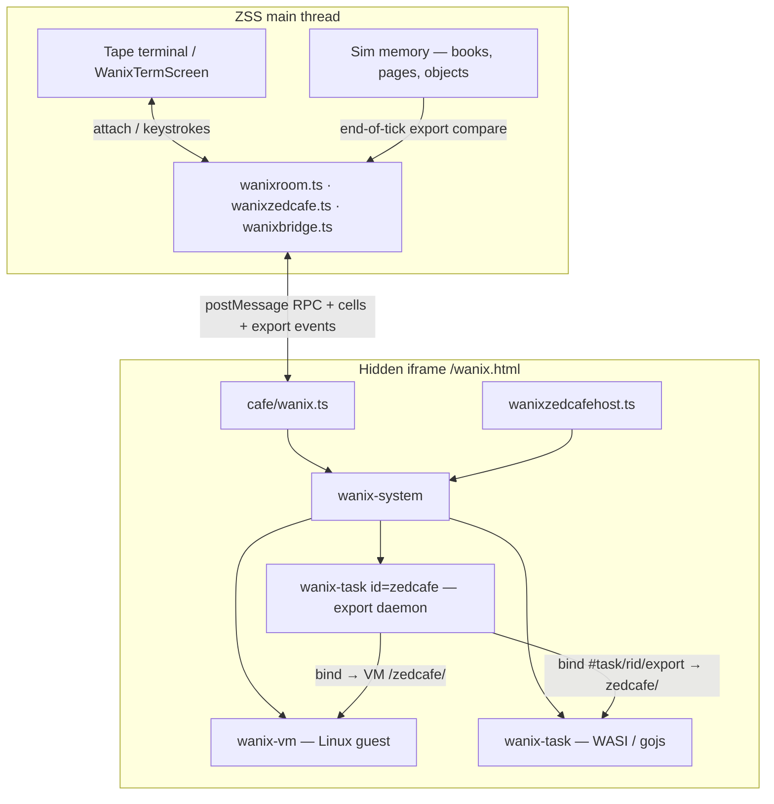
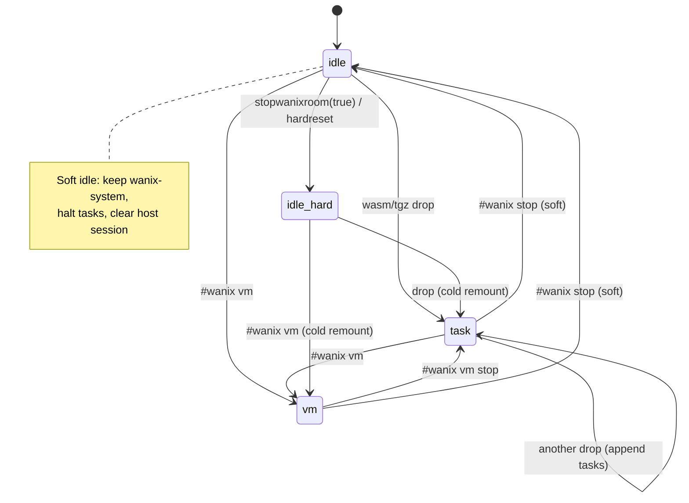
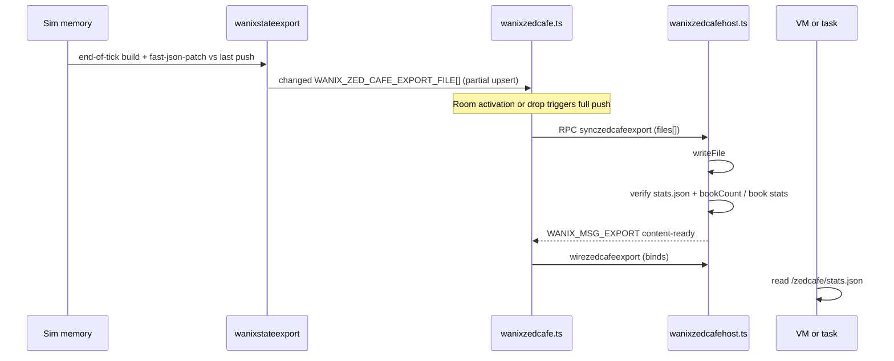
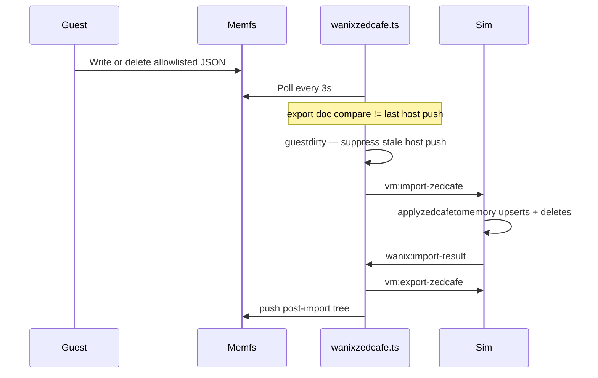
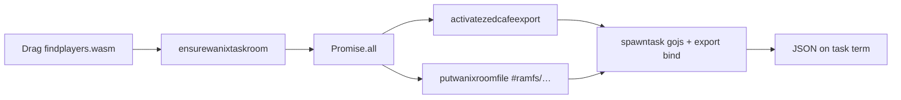
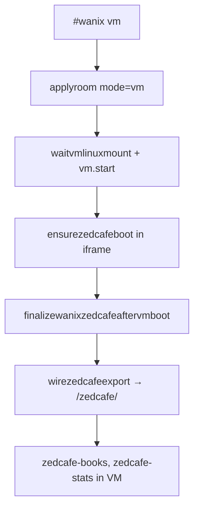
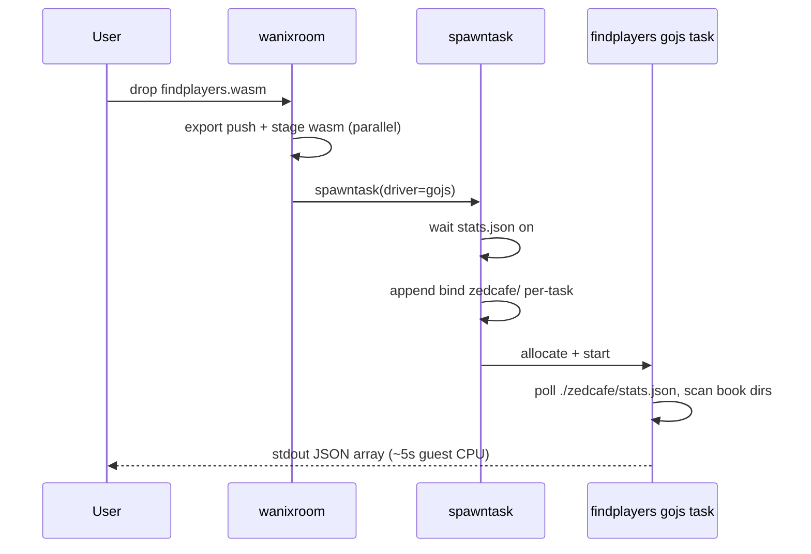
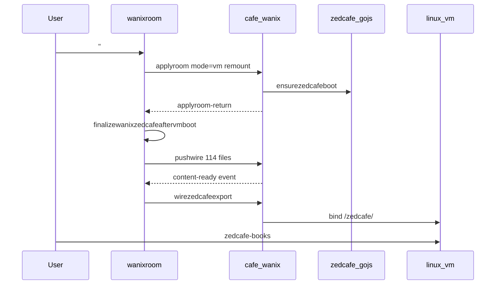
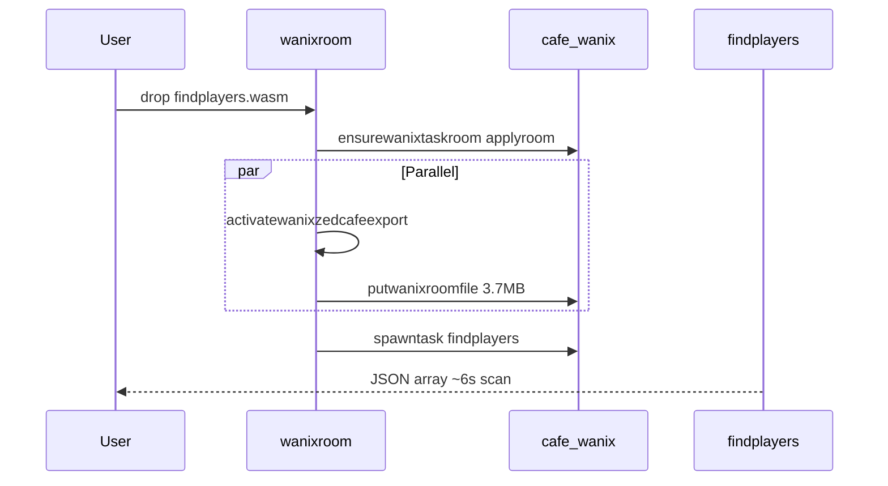

# Wanix in ZSS — full guide

Runs [wanix](https://github.com/tractordev/wanix) (browser OS: Linux v86 VM + WASI/gojs
tasks) inside ZSS. Guest terminals render as colored tiles on the tape terminal screen.
Live game books export from sim memory into a guest-visible **`/zedcafe/`** tree so tools
like `findplayers.wasm` and `greenring.wasm` can read (and write allowlisted) world state.

**Fixture testing:** [`ops/fixtures/wanix/README.md`](../../../ops/fixtures/wanix/README.md)

---

## Table of contents

1. [Big picture](#big-picture)
2. [Parent vs iframe](#parent-vs-iframe)
3. [Room modes & lifecycle](#room-modes--lifecycle)
4. [How you start wanix](#how-you-start-wanix)
5. [Zedcafe export (the core loop)](#zedcafe-export-the-core-loop)
6. [Wasm drop path (task room)](#wasm-drop-path-task-room)
7. [VM path](#vm-path)
8. [findplayers flow](#findplayers-flow)
9. [Terminal attach & input](#terminal-attach--input)
10. [Performance: soft idle & warm reuse](#performance-soft-idle--warm-reuse)
11. [Message protocol](#message-protocol)
12. [Module map](#module-map)
13. [Gotchas & invariants](#gotchas--invariants)
14. [Debugging & validation](#debugging--validation)
15. [What works today (and why)](#what-works-today-and-why)

---

## Big picture



**Why this split:** Wanix owns its own WASM runtime, p9 filesystem, and worker threads.
ZSS owns game memory, UI, and CLI. The iframe is a sandbox; the parent is the control
plane. Only `postMessage` crosses the boundary — no shared DOM.

---

## Parent vs iframe

| Side | Entry | Owns |
|------|--------|------|
| **Parent** | `wanixhost.tsx` mounts ghost iframe; `wanixbridge.ts` RPC client | Room config, drop routing, export file tree from memory, attach state, term grid snapshots |
| **Iframe** | `cafe/wanix.ts` on `/wanix.html` | `<wanix-system>`, VM/task elements, term byte pumps, zedcafe gojs boot, `#ramfs` writes |

```text
┌─────────────────────────────────────────────────────────────────┐
│  ZSS terminal screen (parent)                                   │
│    wanixtermbuffer  ←  WANIX_MSG_CELLS snapshots                │
│    wanixattachstate ←  WANIX_MSG_SESSION open/active/close      │
└────────────────────────────▲────────────────────────────────────┘
                             │ postMessage (same origin)
┌────────────────────────────┴────────────────────────────────────┐
│  cafe/wanix.ts (iframe)                                         │
│    handlerrpc: applyroom, spawntask, writefile, pushzedcafe…    │
│    <wanix-system>                                               │
│      ├─ wanix-bind  (linux, v86, export mounts)                 │
│      ├─ wanix-vm    (optional Linux)                            │
│      ├─ wanix-task  zedcafe  (gojs export daemon)               │
│      └─ wanix-task  user tasks (hello.wasm, findplayers.wasm)   │
└─────────────────────────────────────────────────────────────────┘
```

**Grid engine:** [`wanixtermgridstate.ts`](wanixtermgridstate.ts) is shared — iframe
parses ANSI into cells; parent renders snapshots from [`wanixtermbuffer.ts`](wanixtermbuffer.ts).

---

## Room modes & lifecycle

Three modes in [`wanixroomtypes.ts`](wanixroomtypes.ts):

| Mode | Meaning | Guest workloads |
|------|---------|-----------------|
| `idle` | Wanix inactive; no VM/tasks (or soft-idle: warm system kept) | — |
| `task` | Task room only | WASI/gojs tasks + zedcafe daemon |
| `vm` | Linux VM (+ optional tasks) | v86 Linux + zedcafe bind at `/zedcafe/` |

### Bind-on-drop (`input/`)

While **attached** to a Wanix term session, file drops bind under **`input/<name>`**
(task: `./input/…`, VM guest: `/input/…`) instead of spawning tasks or hitting
book/image parsers. User-written processors (WASI tasks or VM guest scripts) read
`input/` and write zedcafe export paths under `zedcafe/…` so the host import poll
can sync boards and terrain. See `ops/fixtures/wanix/README.md` for
`input2terrain.wasm` and `png2terrain.sh` examples.



**`mountkey`** — monotonic counter on [`WanixRoomConfig`](wanixroomtypes.ts). Unchanged
`mountkey` + ready system → **warm apply** (no iframe rebuild). Bumped on hard reset →
**cold remount** (`host.replaceChildren()`).

---

## How you start wanix

| Action | Path |
|--------|------|
| `#wanix vm` | CLI → `startwanixvm` → `wanixroom.startwanixvmroom` → iframe `applyroom` mode `vm` |
| Drag `.wasm` / `.tgz` | `emitwanixdropfile` → device `wanixdrop` → `handlewanixdrop` |
| `#wanix stop` | `stopwanixroom()` — soft idle by default |
| `#wanix attach [session]` | Focus a task/VM term tile |
| `#wanix` menu | [`wanixmenu.ts`](wanixmenu.ts) — sessions, attach, VM controls |

**Lazy stand-up:** Books load into sim at login only. Zedcafe export daemon and host push
run when the **first** VM or task room activates — not at login.

---

## Zedcafe export (the core loop)

Zedcafe mirrors live sim books into a guest-visible tree at `./zedcafe/` (tasks) or
`/zedcafe/` (VM). Guests may **read and write** allowlisted JSON paths; the host polls
for guest changes and imports them into the **sim worker**, then re-exports so the tree
matches sim again.

### Mount layout (iframe)

```text
wanix-system
  wanix-task[id=zedcafe, type=gojs]     ← export daemon (gojs wasm)
    #task/{rid}/export/                 ← host pushes JSON tree here
      stats.json
      {kebab-book-name}-{bookId}/{kebab-page-name}-{pageId}/board/terrain.json
      {bookDir}/{pageDir}/board/objects/{id}.json
      …
    bind: export → zedcafe/             ← guest path ./zedcafe/ (tasks)

  wanix-vm (when running)
    bind: #task/{rid}/export → /zedcafe/   ← Linux guest sees /zedcafe/
```

Path layout uses `{kebab-name}-{id}` directories (no `books/` or `pages/` segments).
Allowlist: [`zedcafetreeschema.ts`](zedcafetreeschema.ts) /
[`allowed-path-patterns.json`](../../../ops/fixtures/wanix/zedcafe/allowed-path-patterns.json).

Constants: [`wanixzedcafeconstants.ts`](wanixzedcafeconstants.ts).

### Export pipeline



### Guest write → sim import



- Import runs in the **sim worker** (`handleimportzedcafe`), not main-thread memory.
- **Deletes mirror the guest tree:** books/pages absent from the guest export are cleared
  in sim; missing `board/objects/*.json` disappear when the board page is upserted.
  A valid empty tree (`bookCount: 0`) clears all sim books.
- While `guestdirty`, host pushes of pre-import snapshots are skipped.
- Apply failures log and **leave the poll running** (retry next tick). Hard iframe RPC
  failures still stop the poll.

**Readiness contract (two gates):**

1. **Mount ready** — gojs daemon running; `#task/{rid}/export` exists (`waitzedcafemount`).
2. **Content ready** — `stats.json` present with `exportedAt` + `bookCount` after host push.

**Why `stats.json`:** Single cheap probe for “export tree is populated.” findplayers,
greenring, and VM `zedcafe-ready` all poll it.

**Event-driven wait (perf fix):** After push, iframe posts
[`WANIX_MSG_EXPORT`](wanixrpcmessages.ts) `{ event: 'content-ready', taskrid }`.
Parent [`waitwanixexportwait.ts`](wanixexportwait.ts) resolves waiters; RPC poll is fallback
only (250 ms budget, 30 s ceiling).

---

## Wasm drop path (task room)



**Steps (parent [`wanixroom.ts`](wanixroom.ts)):**

1. **`ensurewanixtaskroom`** — if idle, `applyroom` → task mode (+ zedcafe spec from boot state).
2. **Parallel staging** — export activation overlaps wasm write to `#ramfs/` (saves wall time).
3. **`spawntaskinroom`** — iframe creates `<wanix-task>`, connects term, `start()`.

**Driver selection ([`wanixwasmdriver.ts`](wanixwasmdriver.ts)):**

| Wasm import module | Driver | Runtime |
|--------------------|--------|---------|
| `gojs` | `gojs` | Go js/wasm worker |
| `wasi_snapshot_preview1` | `wasi` | WASI worker |

For drops, driver is taken from **drop bytes** (not re-read from `#ramfs`) — large gojs
binaries must use driver from drop bytes via [`wanixspawndriver.ts`](wanixspawndriver.ts).
Re-read from `#ramfs` throws on failure; unknown wasm throws (no wasi default).

---

## VM path



**Why VM feels faster than cold drop from idle (before perf work):** VM path booted zedcafe
inside iframe `applyroom` immediately; task-only path deferred boot to extra parent RPC
chain. Now task `applyroom` also calls `ensurezedcafeboot` when `zedcafe` spec is present.

**Overlay:** `#wanix vm` mounts stock `wanix-linux.tgz` plus local
`zedcafe-linux-overlay.tgz` (jq, curl, `zedcafe-*` shell helpers). Live content still
comes from host export bind — not baked into the overlay.

---

## findplayers flow

Gojs one-shot scanner — prints one JSON line of export paths containing player elements.



**Why per-task bind:** Child tasks do not inherit system-level binds; findplayers gets its
own `wanix-bind` from `#task/{rid}/export` → `zedcafe/`.

**Spawn gate:** Iframe blocks until export content ready — guest never starts with an empty
tree (fail loud in terminal, not silent empty scan).

**Drop order (task-only):** Drop `findplayers.wasm` from idle — export is built in the **sim
worker** (where cafe books live), pushed to the zedcafe daemon, then findplayers binds
`./zedcafe/`. **VM is optional** (Linux `/zedcafe/` consumer only).

---

## Terminal attach & input

Iframe posts `WANIX_MSG_SESSION`:

| Event | Parent behavior |
|-------|-----------------|
| `open` | Register session; if nothing attached → reveal tape → auto-attach |
| `active` | Update focus hint; no steal if user already attached |
| `close` | Prune buffer/menu unless it was the attached session |

Manual: `#wanix attach` / `#wanix detach` / menu. See
[`wanixattachstate.ts`](wanixattachstate.ts), [`wanixtapevisibility.ts`](wanixtapevisibility.ts).

**Keyboard (attached):** `Ctrl+\` prefix — `n`/`p` switch session, `d` detach, `Esc` cancel.
`Ctrl+Esc` closes the tape terminal (session stays attached). Scrollback: PageUp/PageDown.

---

## Performance: VM boot vs task drop

### Observed timings

| Path | Wall clock | Finish line |
|------|------------|-------------|
| **VM boot** (`#wanix vm` → `zedcafe-books`) | ~seconds | Export live at `/zedcafe/`, books listed |
| **Cold task drop** (findplayers from idle) | ~30s (before perf trim) | Export sync + findplayers JSON |
| **Warm task drop** (findplayers while wanix active) | ~seconds + ~6s scan | `sync-stale needed=false` |

Cold task stalls often hit `WANIX_ZEDCAFE_EXPORT_READY_TIMEOUT_MS` (30_000) when
`content-ready` is delayed after halt/reboot or duplicate export work.

### VM boot path (fast)



VM path: one zedcafe boot, one push, `content-ready` event, no findplayers wasm.

**Perf marks:** `vm-boot-finalize-start` → `export-push-end` → `vm-boot-finalize-end`

### Task drop path (heavier)



Task path adds: sim export fetch, daemon RPCs (avoid `sync-zedcafe-halt` when applyroom
mount is live), wasm staging, second gojs task, findplayers CPU.

**Perf marks:** `drop-start` → `sim-export-fetch-end` → `daemon-export-end` →
`activate-export-end` → `wasm-write-end` → `spawntask-return`

### Non-regression gates (mandatory before perf merges)

Defined in [`wanixbootregression.ts`](wanixbootregression.ts). Any perf change must pass:

| Path | Success signal |
|------|----------------|
| VM boot | `finalize-vmboot branch=pushwire`, `export-push-end`, `zedcafe-books` lists books |
| Cold task | `daemon start memcount=1`, findplayers JSON `["{book}/…` |
| Warm task | `sync-stale needed=false`, fast findplayers JSON |

**Jest:** `ops/tests/unit/feature/wanix/wanixbootregression.test.ts` +
`wanixactivateexport.test.ts` + full wanix suite.

**Manual:** idle → `#wanix vm` → `zedcafe-books`; idle → drop findplayers → JSON line;
VM active → drop findplayers → fast JSON.

### Perf trims (task-only; VM finalize frozen)

| Trim | Owner | Effect |
|------|-------|--------|
| Skip redundant `runzedcafeexport` | [`wanixactivateexport.ts`](wanixactivateexport.ts) | Sim-fetched books already pushed by daemon |
| Push onto applyroom mount | [`wanixzedcafe.ts`](wanixzedcafe.ts) `bootzedcafeexportinner` | Avoid `sync-zedcafe-halt` when mount already up |
| Phase timing | [`wanixperf.ts`](wanixperf.ts) | `sinceanchor` + `elapsedms` on every mark |

---

## Performance: soft idle & warm reuse

### Problem (cold drop from idle)

```text
idle → drop  ≈  remount wanix.wasm  +  full export push (~114 files)
              +  large #ramfs write  +  poll slack  +  findplayers scan
```

Warm path (`#wanix vm` first, or second drop after soft idle) skipped remount and most export.

### Solution

| Technique | What it does |
|-----------|----------------|
| **Soft idle** | `#wanix stop` keeps `<wanix-system>`; halts tasks/zedcafe; same `mountkey` |
| **Warm applyroom** | idle→task/vm reuses system; `ensurezedcafeboot` in iframe |
| **Export event** | `content-ready` postMessage; parent waits on event not 250 ms polls |
| **Parallel staging** | `activatezedcafeexport` ∥ `putwanixroomfile` on wasm drop |
| **No mountkey bump** | First task drop from soft idle does not force remount |

```text
                    COLD                         WARM (soft idle → drop)
                    ────                         ───────────────────────
applyroom           replaceChildren              warmactivateroom (reuse)
wanix.wasm reload   yes                          no
zedcafe boot        full                         reuse daemon if live
export push         full (~114 files)            sync-if-stale only
```

**Hard reset:** `stopwanixroom(true)` or `hardreset: true` — use after wasm build change or
corruption.

**Perf marks:** [`wanixperf.ts`](wanixperf.ts) logs `[wanix-perf] label {json}` in dev console
— `drop-start`, `applyroom-warm-reuse`, `export-push-end`, `wasm-write-end`, `spawntask-return`.

---

## Message protocol

| Constant | Direction | Purpose |
|----------|-----------|---------|
| `WANIX_MSG_READY` | iframe → parent | System ready |
| `WANIX_MSG_IDLE` | iframe → parent | Soft/hard idle |
| `WANIX_MSG_RPC` / `_RES` | both | Request/response (`applyroom`, `spawntask`, …) |
| `WANIX_MSG_CELLS` | iframe → parent | Term grid snapshot |
| `WANIX_MSG_SESSION` | iframe → parent | Session open/active/close |
| `WANIX_MSG_EXPORT` | iframe → parent | `{ event: 'content-ready', taskrid, … }` |

Defined in [`wanixrpcmessages.ts`](wanixrpcmessages.ts).

---

## Module map

| Module | Role |
|--------|------|
| [`cafe/wanix.ts`](../../../cafe/wanix.ts) | Iframe orchestrator: `applyroom`, RPC handler, term loops |
| [`wanixzedcafehost.ts`](wanixzedcafehost.ts) | Iframe zedcafe: gojs boot, push export, binds, halt |
| [`wanixzedcafe.ts`](wanixzedcafe.ts) | Parent zedcafe: daemon lifecycle, push/wire, import poll → `vm:import-zedcafe` |
| [`wanixstateexport.ts`](wanixstateexport.ts) | Build export file tree from sim memory |
| [`wanixstateimport.ts`](wanixstateimport.ts) | Parse guest tree + `applyzedcafetomemory` (upserts + deletes) |
| [`zss/device/vm/handlers/importzedcafe.ts`](../../device/vm/handlers/importzedcafe.ts) | Sim-worker import handler |
| [`wanixroom.ts`](wanixroom.ts) | Room config, drop handler, VM/task API |
| [`wanixbridge.ts`](wanixbridge.ts) | Parent RPC + message dispatch |
| [`wanixhost.tsx`](wanixhost.tsx) | Ghost iframe mount |
| [`wanixdropparse.ts`](wanixdropparse.ts) | Drag-drop → `wanixdrop` device message |
| [`wanixspawndriver.ts`](wanixspawndriver.ts) | Wasm driver resolution from bytes / hint |
| [`wanixbundle.ts`](wanixbundle.ts) / [`wanixtgzextract.ts`](wanixtgzextract.ts) | `.tgz` bundle drops |
| [`wanixexportevents.ts`](wanixexportevents.ts) / [`wanixexportwait.ts`](wanixexportwait.ts) | Export-ready event + parent waiters |
| [`wanixattachstate.ts`](wanixattachstate.ts) | Attached session + auto-attach |
| [`wanixtapevisibility.ts`](wanixtapevisibility.ts) | Reveal tape before auto-attach |
| [`wanixtermbuffer.ts`](wanixtermbuffer.ts) / [`wanixtermgridstate.ts`](wanixtermgridstate.ts) | Term rendering |
| [`wanixmenu.ts`](wanixmenu.ts) | `#wanix` menu tape |
| [`wanixcmd.ts`](wanixcmd.ts) | Device-facing `#wanix` helpers |
| [`zss/device/wanix.ts`](../../device/wanix.ts) | Device handler: drop, export state, CLI bridge |
| [`zedcafetreeschema.ts`](zedcafetreeschema.ts) | Export path validation |
| [`wanixactivateexport.ts`](wanixactivateexport.ts) | Task export activation (sim fetch + daemon; skips redundant shadow export) |
| [`wanixbootregression.ts`](wanixbootregression.ts) | Mandatory VM/task boot regression gate definitions |
| [`wanixperf.ts`](wanixperf.ts) | Dev/validator timeline marks (`sinceanchor`, `elapsedms`) |

---

## Gotchas & invariants

### Full-Go wanix.wasm (not npm TinyGo build)

npm `wanix@0.4.0-alpha8` TinyGo build corrupts under heavy terminal I/O
([tractordev/wanix#171](https://github.com/tractordev/wanix/issues/171)). ZSS ships full-Go
build at [`cafe/public/wanix/wanix.wasm`](../../../cafe/public/wanix/wanix.wasm).

### Do not call `vm.allocate()` twice

`<wanix-vm>` auto-allocates on system `ready`. Second call throws. Use
`connectvmtermsession()` + `start()` only.

### Never bind `#ramfs` at `.`

Staging stays internal; user/guest surface is `./zedcafe/` or `/zedcafe/` via export binds.

### gojs vs wasi

Wrong driver → `LinkError` on gojs imports in wasi worker. Driver comes from wasm bytes
at drop/bundle staging; failures throw instead of defaulting to wasi.

### Export push must complete in iframe

`pushzedcafeexportlive` must import [`postwanixexportmessage`](wanixexportevents.ts) and
[`wanixperfmark`](wanixperf.ts) — missing imports silently broke `/zedcafe` mounts.

### Tick export vs drop path

While the import poll is active, each sim tick rebuilds the export doc and
`fast-json-patch` `compare`s it to the last successful host push. Changed paths
are upserted and removed paths are deleted via Wanix `root.remove`. Drop/VM
activation still does a full tree push (and reconciles guest orphans).

---

## Debugging & validation

**Console tags:**

| Tag | Meaning |
|-----|---------|
| `[zedcafe-export]` | Parent export decisions (push, sync-stale, finalize) |
| `[wanix-perf]` | Phase timing for perf work |
| `[wanix] readwasmdriver failed` | Ramfs re-read failed; check path/size |

**Headed validator:**

```bash
ZEDCAFE_VALIDATE_FIXTURE=1 yarn task run cafe:playwright:headed \
  --url https://localhost:7777/ tasks/lib/wanix/validate-zedcafe-vm-export.ts
```

Report: `/tmp/wanix-zedcafe-export-report.json` — timeline + export trace.

**Unit tests:** `yarn jest ops/tests/unit/feature/wanix/ --config ops/jest.config.ts --no-coverage`

For drops, driver is taken from **drop bytes** (not re-read from `#ramfs`) — large gojs
binaries must not fall back to wasi. Bundle drops pass per-file drivers from tgz bytes.
Unknown wasm (no gojs/wasi import) throws.

---

## Failure semantics

Paths that **throw or fail loud** (no silent alternate behavior):

| Failure | Owner | Behavior |
|---------|--------|----------|
| Unknown wasm driver | [`wanixwasmdriver.ts`](wanixwasmdriver.ts) | Throws — no default to wasi |
| Missing `#ramfs` bytes at spawn | [`wanixspawndriver.ts`](wanixspawndriver.ts) | Throws |
| Zedcafe daemon not ready | [`wanixzedcafe.ts`](wanixzedcafe.ts) `ensurewanixzedcafedaemon` | Throws — drop/activate aborts |
| Export build from memory | [`readhostexportfilesfrommemory`](wanixzedcafe.ts) | `buildzedcafeexportfiles()` errors propagate |
| Menu iframe RPC timeout | [`wanixroom.ts`](wanixroom.ts) | `stalled: true`, `vm: null` — no invented VM |
| Import poll error | `tickzedcafepoll` | `apilog` + `stopzedcafepoll()` |

**Intentional reuse (not fallbacks):** `synczedcafeexportifstale`, soft idle warm apply,
`tryreuselivezedcafeexport`, `content-ready` event with bounded RPC poll backup (Bucket 2).

**VM export fetch:** only in `finalizewanixzedcafeaftervmboot` when memory `bookCount === 0`
and VM is running — explicit branch, errors propagate.

---

## What works today (and why)

| Capability | Why it works |
|------------|--------------|
| **`#wanix vm` + `/zedcafe/`** | VM room → zedcafe gojs boot → host pushes memory export → `wirezedcafeexport` binds `#task/rid/export` into Linux at `/zedcafe/` |
| **Wasm task drops** | `handlewanixdrop` stands task room, stages `#ramfs/{file}`, spawns with driver from wasm bytes |
| **findplayers JSON output** | gojs task + per-task export bind + spawn gate on `stats.json`; scanner walks `./zedcafe/{book}/…` |
| **greenring board paint** | Same bind; writes allowlisted `board/terrain.json`; import poll → `vm:import-zedcafe` → sim apply + re-export |
| **Guest FS → sim writeback** | 3s export-doc compare poll; guest-dirty suppresses stale host push; deletes mirror guest tree |
| **Live export updates** | End-of-tick `compare` of path-keyed export doc; partial upsert of changed files while poll active |
| **Auto-attach new sessions** | `WANIX_MSG_SESSION open` → reveal tape → attach when user had nothing focused |
| **Task idle auto-halt** | Dropped wasm tasks halt after 5 minutes with no term input/output (VM + zedcafe daemon exempt) |
| **Soft idle → faster second drop** | Warm `<wanix-system>` + unchanged `mountkey` skips wanix.wasm reload; daemon reuse + sync-if-stale |
| **Export wait without poll slack** | `content-ready` event wakes parent waiters immediately after iframe push completes |

### Success signals you can eyeball

**VM terminal:**

```text
~ # zedcafe-books
  name: coolregionsbow
  pageCount: 51
~ # zedcafe-players
  id	book	page	x	y	kind	path
  pid_…	coolregionsbow-sid_…	…	12	8	player	…/board/objects/pid_….json
~ # zedcafe-code send
  book	page	type	name	id	line	text
  …	…	object	…	…	3	#send touch
~ # zedcafe-find --kind gem
  layer	book	page	id	x	y	kind	char	name	path
  object	…	…	…	10	5	gem	…	…	…/board/objects/….json
~ # ls -la /zedcafe
  coolregionsbow-sid_…
  stats.json
```

**findplayers task term:** one line JSON array starting with `["{book}/{page}/…/objects/pid_…json",…]`

**greenring task term:** `{"painted":N}` after writing terrain rings; board tiles update after import poll.

**Dev console:** `[wanix-perf] export-push-end` then `[wanix-perf] spawntask-return` with no
`LinkError` or `postwanixexportmessage is not defined`.

---

## Rebuild references

| Asset | Task |
|-------|------|
| wanix.wasm (full-Go) | Manual — see gotcha section; match `wanix.min.js` commit |
| zedcafe.wasm / findplayers + greenring | `yarn task run ops:fixtures:wanix:zedcafe:build` / `ops:fixtures:wanix:findplayers:build` |
| Linux overlay | `yarn task run ops:fixtures:wanix:linux:overlay:build` |
| Hello fixtures | `yarn task run ops:fixtures:wanix:build` |

Dev server: `yarn task run cafe:dev` — no separate build step; committed assets under
`cafe/public/wanix/` and `ops/public/wanix/`.
