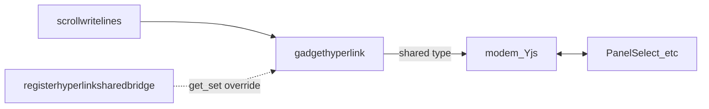

# How get/set wires into scroll `!` hyperlinks vs terminal rows

Deep dive companion to the summary in [gadget-scrolls.md](./gadget-scrolls.md) (“Terminal tape vs scroll”). Links below are relative to this file.

## Gadget scroll panel (structured rows)

1. **Row shape** — [`gadgethyperlink`](../data/api.ts) pushes a `PANEL_ITEM` that is an array: `[chip, label, ...words]` (after optional `istargetless` padding for target-less commands like `copyit` / `openit` / `viewit` / `runit`).

2. **Shared link types** — For the fixed set of **type** tokens in `HYPERLINK_WITH_SHARED` (`select`, `sl`, `range`, `rn`, `number`, `nm`, `text`, `tx`, `charedit`, `coloredit`, `bgedit`, `zssedit`), `gadgethyperlink` treats the row as bound to collaborative modem state:

   - **`type`** is the word at index **3** in that packed array (`hyperlink[3]`, i.e. first word after `chip`, `label`, and **target**).
   - **`target`** is the string at index **2** (`hyperlink[2]`, the first argument word in the command, or `istargetless` for padded target-less verbs).
   - The modem key is [`paneladdress(chip, target)`](../data/types.ts), backed by Yjs in [`modem.ts`](../../device/modem.ts).

3. **Get / set** — Callers may pass `get` / `set` into `gadgethyperlink`, or rely on [`registerhyperlinksharedbridge(chip, type, get, set)`](../data/api.ts) so markdown / [`scrollwritelines`](../data/scrollwritelines.ts) builders need no per-row closures. At runtime, [`resolvehyperlinksharedbridge`](../data/api.ts) supplies `getforchip` / `setforchip` (bridge overrides the per-call defaults).

4. **Live updates** — For shared types, [`applyhyperlinksharedmodemsync`](../data/api.ts) registers `modemobservevaluestring` / `modemobservevaluenumber` on that address, applies `set` when the doc changes (with `READ_CONTEXT` restored from a snapshot), and seeds defaults via `modemwriteinitstring` / `modemwriteinitnumber` when needed.

5. **Rendering** — [`PanelComponent`](../../screens/panel/component.tsx) → [`PanelItem`](../../screens/panel/panelitem.tsx) → widgets such as [`PanelSelect`](../../screens/panel/select.tsx), which read/write the same modem addresses.

---

## Terminal tape (string rows)

1. **Row shape** — Lines in `terminal.logs` are plain strings. If a line `startsWith('!')`, [`TerminalItem`](../../screens/terminal/item.tsx) parses it: `text.slice(1).split('!')` yields a **`prefix`** (first segment) and the rest joined as the **hyperlink** body; [`tokenize`](../../words/textformat.ts) then splits **label** (`HyperLinkText`) from **words** (command tokens).

2. **Two `!` roles** — The **first** `!` marks a tape hyperlink line. A **second** `!` (if present) separates **`prefix`** from the command. Many shared widgets expect `prefix` to be a modem address, often matching `paneladdress(chip, target)` — see [`parseterminalmodemprefix`](../data/api.ts) (`chip:target` with only the first `:`; `target` must not contain `:`).

3. **Parallel widgets** — Same verbs as the panel (`TerminalSelect`, `TerminalRange`, `TerminalText`, edits, …). For example [`TerminalSelect`](../../screens/terminal/select.tsx) calls [`usehyperlinksharedsync(prefix, 'select')`](../data/usehyperlinksharedsync.ts) and uses `useWaitForValueNumber` / `modemwritevaluenumber` with **`address = prefix`**.

4. **Bridge lookup on tape** — Terminal rows never call `gadgethyperlink`, but shared types still use **`resolvehyperlinksharedbridge`**: [`registerterminalhyperlinksharedbridge(chip, type, get, set)`](../data/api.ts) registers tape defaults; **scroll bridges win** when both define the same `(chip, type)`. [`usehyperlinksharedsync`](../data/usehyperlinksharedsync.ts) parses `prefix` → `(chip, target)`, resolves the bridge, and runs the same [`applyhyperlinksharedmodemsync`](../data/api.ts) path as the scroll.

5. **Generic links** — [`TerminalHyperlink`](../../screens/terminal/hyperlink.tsx) does not use the shared-bridge table for activation; it uses `TapeTerminalContext.sendmessage` (see [`TapeTerminalContext`](../../screens/tape/common.ts)) like VM/message dispatch.

6. **Format caveat** — [`writehyperlink`](../../feature/writeui.ts) emits `!payload;label` (single leading `!`, no `prefix!` split). [`terminalwritelines`](../../feature/terminalwritelines.ts) uses the same shape. The tape parser still runs: with no second `!`, the whole remainder after the first `!` is treated as **`prefix`** and the tokenized tail as the command — so conventions should match what `TerminalItem` expects for each widget (see component `switch` on the first command word).

---

## Short answers

| Question | Answer |
| -------- | ------ |
| How is get/set wired for scroll `!` links? | `gadgethyperlink` + optional `registerhyperlinksharedbridge`, `applyhyperlinksharedmodemsync` / `modemobserve` / `modemwrite` on `paneladdress(chip, target)` for `HYPERLINK_WITH_SHARED` types. |
| Something similar for terminal? | **Yes, for shared types:** same modem + `applyhyperlinksharedmodemsync`, with `usehyperlinksharedsync` and `resolvehyperlinksharedbridge` (scroll + `registerterminalhyperlinksharedbridge`). **Generic** tape links use `sendmessage`, not the bridge table. **Binding** is carried in the string (`prefix` / `chip:target`) plus bridge registration. |

---

## Tests

Bridge merge behavior (scroll vs terminal) is covered in [`zss/gadget/data/__tests__/api.test.ts`](../data/__tests__/api.test.ts).
