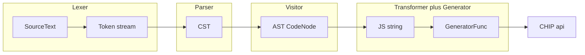
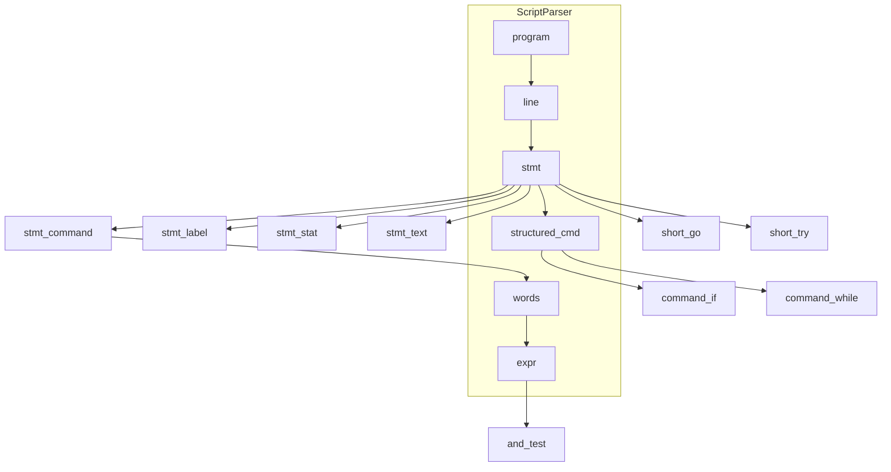
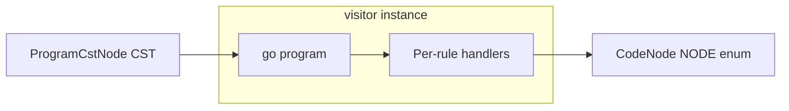
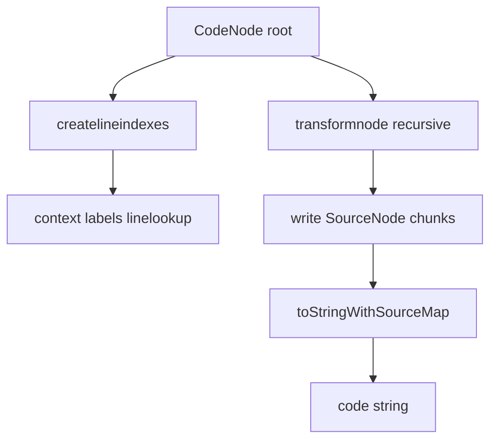
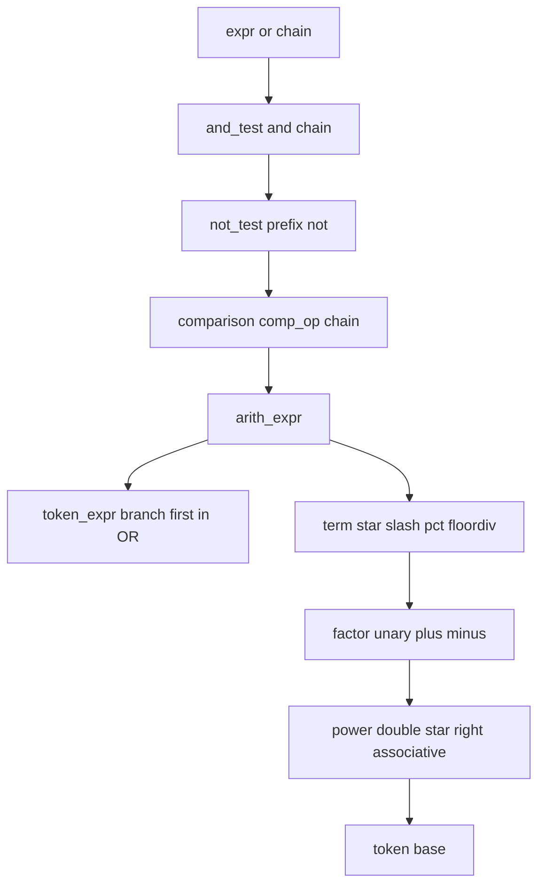
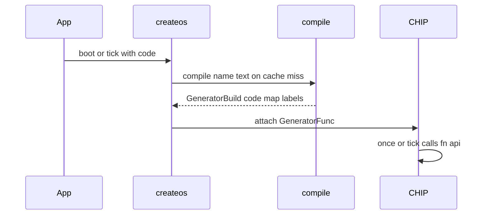
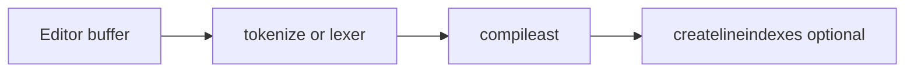

# Lang architecture

This page ties together the ZSS **lexer**, **parser** (CST), **visitor** (AST), **transformer** (JavaScript + source maps), and **generator** (executable function), plus how **OS** / **CHIP** run the result. For module-level detail, see the [module index](README.md#module-index).

## End-to-end pipeline

Source text becomes executable script code that receives the CHIP instance as `api`.

1. **`tokenize`** ([lexer.ts](../lexer.ts)) — Chevrotain tokens + lexer errors.
2. **`parser.program()`** ([parser.ts](../parser.ts)) — Concrete syntax tree (`CstNode`). Parser errors map to [`LANG_ERROR`](../lexer.ts)-shaped messages in [ast.ts](../ast.ts).
3. **`visitor.go(cst)`** ([visitor.ts](../visitor.ts)) — Abstract tree of [`CodeNode`](../visitor.ts) with [`NODE`](../visitor.ts) discriminants.
4. **`addRange(ast)`** ([ast.ts](../ast.ts)) — Fills `range` on nodes for editor / completion (full AST walk; runs on every [`compileast`](../ast.ts), including editor tooling).
5. **`transformast(ast)`** ([transformer.ts](../transformer.ts)) — JS source + `source-map` output; mutates shared [`context`](../transformer.ts) (labels, line indexes). The shared `context` is fine for today’s single-threaded compile path; parallel compilation would need isolation or a per-run context.
6. **`new Function('api', code)`** ([generator.ts](../generator.ts)) — Produces `GeneratorFunc`: `(api: CHIP) => 0 | 1`.

[`compile`](../generator.ts) runs the full pipeline (steps 1–6): it calls [`compileast`](../ast.ts) for steps 1–4, then runs **`transformast`** and **`new Function`** (steps 5–6). [`compileast`](../ast.ts) alone stops after the AST (no JS). For debugging, `compile` wraps the `compileast` call in `console.time` / `console.timeEnd` using the `name` argument ([generator.ts](../generator.ts)).

## Data shapes

| Stage | Type | Role |
| ----- | ---- | ---- |
| Lexer | `IToken[]`, `LANG_ERROR[]` | Stream + lexical errors |
| Parser | `CstNode` (Chevrotain) | Grammar-shaped tree; rule names match parser methods |
| Types | [`visitortypes.ts`](../visitortypes.ts) | `*CstNode` / `*CstChildren` for CST |
| Visitor | `CodeNode`, `NODE` | Stable AST for codegen and tooling |
| Transformer | `SourceNode`, `CodeWithSourceMap` | Emitted JS mapped to [`GENERATED_FILENAME`](../transformer.ts) (`zss.js`) |
| Generator | `GeneratorBuild` | Optional `errors`, `tokens`, `cst`, `ast`, `labels`, `map`, `code`, `source` |

The **parser does not produce the AST**. The **visitor** is the CST → AST bridge.

## Parser structure

Chevrotain [`ScriptParser`](../parser.ts) extends `CstParser`. Top-level structure and where `#` command words attach:

`words` is `AT_LEAST_ONE expr`: a `#` command body is a list of expressions. `structured_cmd` covers `#if`, `#while`, `#repeat`, `#foreach`, etc. See [parser.md](parser.md) for full rules.

## Visitor structure

CST nodes are visited by rule; output is a `CodeNode` tree.

See [visitor.md](visitor.md) for `NODE` variants and [visitortypes.md](visitortypes.md) for CST shapes.

## Transformer structure

[`transformast`](../transformer.ts) runs [`createlineindexes`](../transformer.ts) first (label maps and line context), then recursive [`transformnode`](../transformer.ts) on `ast.type`. Emission uses [`write`](../transformer.ts) to attach locations to `SourceNode` chunks, then `toStringWithSourceMap`. Generated code calls **CHIP** helpers as `api.*` (for example `api.isEq`, `api.opPlus`).

The diagram separates indexing from emission for readability; **execution order is sequential**: [`createlineindexes`](../transformer.ts) finishes (and mutates [`context`](../transformer.ts)) before recursive [`transformnode`](../transformer.ts) runs on the AST.

See [transformer.md](transformer.md).

## Operator precedence

Derived from rule nesting in [parser.ts](../parser.ts) (`expr` through `power`). **Top = loosest binding; bottom = tightest.** `arith_expr` is an **`OR`**: the **`token_expr`** branch is tried **before** the `term` / `+` `-` chain, so DSL-shaped input can win over arithmetic when both could match.

### Precedence table (tightest first)

| Level | Grammar | Operators / notes |
| ----- | ------- | ----------------- |
| Primary | `power` | `**` — RHS is `factor`, so `a**b**c` groups as `a**(b**c)` |
| Unary | `factor` | Prefix `+` / `-` |
| Multiplicative | `term` | `*`, `/`, `%`, `//` — left-associative chains |
| Additive | `arith_expr` | `+`, `-` on `term` chain — **or** whole-clause `token_expr` (first `OR` branch) |
| Comparison | `comparison` | `==`, `!=`, `<`, `>`, `<=`, `>=` — grammar allows repeated `comp_op` + `arith_expr` |
| Logical NOT | `not_test` | Prefix `not` |
| Logical AND | `and_test` | `and` |
| Logical OR | `expr` | `or` |

### `expr` vs `expr_value`

[`expr_value`](../parser.ts) parallels `expr` but uses `and_test_value` / `not_test_value`, and `not_test_value` goes to **`arith_expr` only** (no `comparison`). So relational operators are not part of that subtree. The visitor implements [`expr_value`](../visitor.ts) for `NODE.OR` / `NODE.AND` / `NODE.NOT` on value-shaped CST. **Note:** in the current grammar file, no other rule `SUBRULE`s `expr_value`; it exists for symmetry and generated CST types. If you add call sites later, comparisons still stay excluded by grammar.

### Chained comparisons

The parser’s `comparison` rule repeats `comp_op` + `arith_expr`. The visitor’s [`comparison`](../visitor.ts) lowers chains to **Python-style** semantics: `a < b < c` becomes `and(compare(a,b), compare(b,c))` (each compare uses its own operator). Single-operator comparisons still emit one `NODE.COMPARE`. Behavior is covered by [`comparisonchain.test.ts`](../__tests__/comparisonchain.test.ts).

## Error propagation

| Failure | Where | What happens |
| ------- | ----- | ------------ |
| Lexical | `tokenize` | [ast.ts](../ast.ts) returns `errors` from lexer; no parse |
| Grammar | `parser.program()` | `parser.errors` mapped to offset/line/column; no AST |
| Visitor | `visitor.go` | Missing AST yields `"no ast output"` in [ast.ts](../ast.ts) |
| Transform | `transformast` / empty code | [generator.ts](../generator.ts) still returns a no-op `GeneratorFunc` in some paths |
| `new Function` | Runtime compile | Caught; error string in `errors`; no-op function |

After a successful `compileast`, [`compile`](../generator.ts) spreads `astResult` into the return value; if **`transformast`** or **`new Function`** then fails, `tokens` / `cst` / `ast` may still be present alongside `errors` (see early returns in [generator.ts](../generator.ts)).

With **`recoveryEnabled: true`** on the parser, treat **`parser.errors.length === 0`** as the gate for a trustworthy CST ([parser.ts](../parser.ts) constructor)—recovery can produce partial trees.

## Runtime integration

The OS compiles once per unique source string and runs the result on a CHIP.

- [os.ts](../../os.ts) — `build(name, code)` caches `GeneratorBuild` by `code`, calls `compile`.
- [chip.ts](../../chip.ts) — Executes the generator with CHIP as `api`; uses `GENERATED_FILENAME` for stack mapping.

## Editor tooling

[editor component.tsx](../../screens/editor/component.tsx) uses `compileast`, lexer, [`createlineindexes`](../transformer.ts), and `CodeNode` / `NODE` for parsing and structure without always running full `compile` / `new Function` on every edit.

## Parsing footguns

- **`new Function` / CSP** — The generator uses dynamic `Function` construction ([generator.ts](../generator.ts)); treat untrusted source like any eval-capable path (CSP, validation, supply chain).
- **`maxLookahead: 2`** — LL(2)-style limits in [parser.ts](../parser.ts); some inputs may fail or parse differently than with unbounded lookahead.
- **Recovery** — Partial CST possible after errors; always check parser errors before using the tree.
- **Statement `/`** — Token `divide` (`/`) at **statement** level is [`short_go`](../parser.ts); inside `term_item` it is division. Context disambiguates.
- **`token_expr` vs arithmetic** — First branch of `arith_expr` favors built-in token DSL over `+`/`-` term chains when both apply.
- **Newlines and `#do` / `#done`** — Block forms ([`command_if_block`](../parser.ts), etc.) expect specific newline/`#` structure; easy to get opaque parse errors.

## Cross-links

| Topic | Doc |
| ----- | --- |
| Tokens | [lexer.md](lexer.md) |
| CST grammar | [parser.md](parser.md) |
| AST / `NODE` | [visitor.md](visitor.md) |
| CST TypeScript types | [visitortypes.md](visitortypes.md) |
| `compileast` | [ast.md](ast.md) |
| JS emission | [transformer.md](transformer.md) |
| `compile` / `GeneratorBuild` | [generator.md](generator.md) |
| Export catalog | [../EXPORTED_FUNCTIONS.md](../EXPORTED_FUNCTIONS.md) |

## See also

- Grep tests: `compile(` / `compileast` under `zss/` for behavioral specs.
- [README.md](README.md) — short pipeline summary and dependencies.
