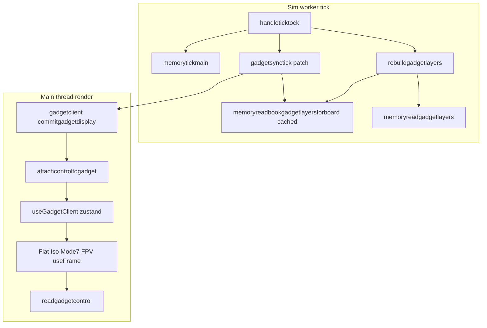

# Render and gadget perf optimizations (Aug 2026)

This document captures **why** the Aug 2026 perf pass exists, **what** changed, **how** each path is supposed to behave, and **how to debug** regressions. It complements the tooling overview in [`zss/perf/README.md`](../README.md).

## Goals and non-goals

### Goals

1. **Remove per-frame layer scans on the main thread** — `layersreadcontrol` was ~55% of zss CPU samples in Trace-091549 because every R3F `useFrame` walked all gadget layers to find CONTROL + tile dimensions.
2. **Dedupe sim-side book flag boundary lookups** — `memoryreadbookgadgetlayersforboard` was ~16% of samples; the same `(book, board)` store was resolved multiple times per tick (`rebuildgadgetlayers` + `gadgetsynctick`).
3. **Wire partial tile GPU uploads** — `PERF_TILE_SUBIMAGE` existed but render never passed dirty cell indices from sim draw-dirty metadata.
4. **Cheap script reader wins** — early exits in `readexpr` / `readargs` for the script-heavy profile (Trace-082835).
5. **Dev-only slow-tick visibility** — log when `wake()` or full `handleticktock` exceeds 16ms with tick-stage stats.

### Non-goals (explicitly out of scope)

| Area | Reason |
|------|--------|
| `chip.get` / `firmwareget` / `element.aftertick` health | Correctness-sensitive; observed ~16% in 091549 but left unchanged |
| `memoryfs` tick poll dirty flag | Removed from plan; attach path unchanged |
| New CI tasks / workflows | Extend existing Jest + `#perf` only |

## Two cafe CPU profiles

Cafe is not one bottleneck — traces fall into two distinct shapes:

| Profile | Typical trace | Top zss symbols | When |
|---------|---------------|-----------------|------|
| **Render / gadget** | Trace-091549 (~46s steady play) | `layersreadcontrol`, `memoryreadbookgadgetlayersforboard`, `firmwareget` | R3F `useFrame` + layer projection every frame |
| **Sim / script** | Trace-082835, Trace-100110 | `readexpr`, `message`, `memoryreadelementstat`, generated `run()` | Busy boards, `:drawdisplay`, CLI / `#send` |

Optimizations in this pass target **both**, but verification must use the **same scenario** as the trace you care about. Comparing a script-heavy capture to a render-heavy baseline will look like a regression even when render fixes worked.



## Trace evidence

### Trace-091549 (pre-optimization, render-heavy)

| Symbol | CPU profile share (approx.) |
|--------|----------------------------|
| `layersreadcontrol` | **~52%** of zss samples |
| `memoryreadbookgadgetlayersforboard` | **~16%** |
| `firmwareget` | **~16%** (out of scope) |

Recording: ~46s, ~46% debugger overhead (CPU sampling on).

### Trace-100110 (post-optimization)

Different scenario (~27s, script/sim-heavy), but **target symbols collapsed**:

| Symbol | Pre (091549) | Post (100110) |
|--------|--------------|---------------|
| `layersreadcontrol` | 339,433 samples | **2** |
| `readgadgetcontrol` | 0 | 1 |
| `memoryreadbookgadgetlayersforboard` | 106,495 | **10** |

Post trace top zss CPU was `memoryreadelementstat` (~77%) — expected on a script-heavy board, not a failure of the render cache.

**Success gate for render work:** re-record Trace-091549 scenario (same book, graphics mode, steady + mid-pan) and confirm `layersreadcontrol` / `memoryreadbookgadgetlayersforboard` stay near zero in CPU profile while `#perf` `fps` and `tick … lyr` are stable or better.

---

## Optimization 1A — Control layer cache (main thread)

### Problem

[`layersreadcontrol`](../../gadget/data/types.ts) scans **every** layer each call to merge TILES/DITHER dimensions and CONTROL focus/graphics/viewscale. [`flat.tsx`](../../gadget/graphics/flat.tsx), [`iso.tsx`](../../gadget/graphics/iso.tsx), [`mode7.tsx`](../../gadget/graphics/mode7.tsx), and [`fpv.tsx`](../../gadget/graphics/fpv.tsx) called it inside **`useFrame`** (60+ Hz).

### Intent

Compute control **once per gadget patch** on the main thread, not once per frame. Render hot paths read `gadget.control` via [`readgadgetcontrol`](../../gadget/data/types.ts).

### Implementation

| Piece | Module | Role |
|-------|--------|------|
| `GADGET_CONTROL` type | [`types.ts`](../../gadget/data/types.ts) | Cached `{ width, height, focusx, focusy, viewscale, graphics, facing }` |
| `attachcontroltogadget()` | [`types.ts`](../../gadget/data/types.ts) | `layersreadcontrol(layers)` → `gadget.control` |
| Patch commit | [`gadgetclient.ts`](../../device/gadgetclient.ts) | `commitgadgetdisplay` / `maybedefergadgetdisplay` call `attachcontroltogadget` before zustand write |
| Hot read | [`readgadgetcontrol()`](../../gadget/data/types.ts) | Returns `gadget.control` if present; **fallback** to `layersreadcontrol` for legacy/full-sync payloads without cache |
| `useFrame` consumers | `flat` / `iso` / `mode7` / `fpv` | `readgadgetcontrol(gadget)` instead of `layersreadcontrol(gadget.layers)` |

### Wire format

`control` is **not** in [`exportgadgetstate`](../../gadget/data/compress.ts) keys — it is **main-thread derived only**, recomputed on every patch apply. Sim worker does not send it over jsonpipe.

### Invalidation

Automatic: any patch that updates `gadget.layers` goes through `attachcontroltogadget` again. No separate invalidation flag.

### Failure modes and debugging

| Symptom | Likely cause | What to check |
|---------|--------------|---------------|
| Camera/focus wrong for one frame then fixes | Race before first patch with cache | Expected during boot; should not persist |
| Camera stuck until layer change | `control` stale but `layers` updated without `attachcontroltogadget` | Grep for `useGadgetClient.setState` / patch paths that bypass [`gadgetclient.ts`](../../device/gadgetclient.ts) |
| CPU profile shows `layersreadcontrol` hot again | `readgadgetcontrol` fallback always taken (`control` missing) | Breakpoint in `readgadgetcontrol`; inspect patch payload |
| Iso DOF / focus wrong | Duplicate `gadget` binding in `useFrame` (compile error) or mixed stash vs control reads | [`iso.tsx`](../../gadget/graphics/iso.tsx) must use **one** `gadget` per `useFrame` |

### Tests

- [`ops/tests/unit/gadget/data/types.test.ts`](../../../ops/tests/unit/gadget/data/types.test.ts) — `readgadgetcontrol`, `attachcontroltogadget`

---

## Optimization 1B — Layer store read cache (sim worker)

### Problem

[`memoryreadbookgadgetlayersforboard`](../../memory/gadgetlayersflags.ts) calls [`memoryreadbookflags`](../../memory/bookoperations.ts) → boundary heap lookup. Called from [`rebuildgadgetlayers`](../../device/vm/handlers/ticktock.ts) **and** [`gadgetsynctick`](../../device/vm/gadgetsynctick.ts) for every player/board per tick.

### Intent

Cache the **live store object reference** per `(book, boardId)` for the lifetime of the current `BOOK` reference. The store is mutated in place by rebuild; cache holds the same object.

### Implementation

```text
memoryreadbookgadgetlayersforboard(book, board)
  if book !== cachebook → clear map, cachebook = book
  if map.has(board) → return cached store
  else → memoryreadbookflags(book, createlayersid(board)), cache, return
```

[`memoryresetbookgadgetlayersreadcache()`](../../memory/gadgetlayersflags.ts) clears when book **reference** changes (call from import/attach if a stale store is ever observed).

### Failure modes and debugging

| Symptom | Likely cause | What to check |
|---------|--------------|---------------|
| Gadget layers empty after book import | Cached store from previous book if `BOOK` reference reused incorrectly | Call `memoryresetbookgadgetlayersreadcache()` on nuclear import; verify `book !== cachebook` |
| Layers not updating but store reads cheap | Store ref cached correctly; rebuild not writing modes | `rebuildgadgetlayers` / `memoryreadgadgetlayers` User Timing (`zss:vm:gadgetlayerscache`) |
| `memoryreadbookgadgetlayersforboard` hot in profile | Cache bypassed every tick | Breakpoint on map miss; count players × boards per tick |

### Related: incremental layer rebuild

[`PERF_INCREMENTAL_LAYERS`](../../config.ts) (default **`true`**) skips full [`memoryconverttogadgetlayers`](../../memory/rendering.ts) rebuild when `drawallowids` is empty and `drawneedfull` is false. Documented in [`rendering.ts`](../../memory/rendering.ts) cache comment block. Disable with `ZSS_PERF_INCREMENTAL_LAYERS=false` to A/B.

---

## Optimization 1C — Tile subimage / dirty cells

### Problem

[`updateTilemapDataTexture`](../../gadget/display/tiles.ts) supports partial CPU fill + `texSubImage2D` hint when `PERF_TILE_SUBIMAGE && dirtycells`, but [`Tiles`](../../gadget/graphics/tiles.tsx) never passed dirty indices.

### Intent

When incremental draw-dirty runs on sim, propagate **expanded cell indices** to tile layers and through to GPU upload on main thread.

### Data path

```text
memoryupdatedrawdirty (boarddrawdirty.ts)
  → boardruntime.drawdirtycells = [...expanded]

memoryconverttogadgetlayers / incremental cache hit (rendering.ts)
  → memoryattachdrawdirtycellstotiles(board, tilesLayer)
  → tiles.dirtycells = drawdirtycells (or delete if drawneedfull)

gadgetsynctick → jsonpipe patch → main thread LAYER_TILES

FlatLayer / IsoLayer / Mode7Layer / FpvLayer
  → <Tiles dirtycells={layer.dirtycells} />

updateTilemapDataTexture(..., dirtycells)
```

### Flags

| Env | Default | Effect |
|-----|---------|--------|
| `ZSS_PERF_TILE_SUBIMAGE` | `false` | Must be **`true`** at build/dev time for partial uploads |

Set in shell before `yarn task run cafe:dev`, e.g. in [`cafe/.env.local`](../../../cafe/.env.local) via vite `zssprocessenvkeys`.

### Failure modes and debugging

| Symptom | Likely cause | What to check |
|---------|--------------|---------------|
| No change with flag on | Flag not inlined at build | Rebuild dev server; verify `PERF_TILE_SUBIMAGE` in bundle |
| Visual stale cells | `dirtycells` not set; full upload skipped incorrectly | Log `layer.dirtycells?.length` in Tiles effect |
| Full-board flash on small edits | `drawneedfull` set; dirtycells cleared | [`memoryinvalidatedraw`](../../memory/boarddrawdirty.ts) callers |
| `tile up` bytes still full-grid | Partial path not taken | `#perf` `tile up` rate; breakpoint in `updateTilemapDataTexture` subimage branch |

---

## Optimization 2B — Script reader fast paths

### Problem

Trace-082835 showed `readexpr` / `readargs` dominating sim time on script-heavy boards.

### Intent

Avoid unnecessary work on common shapes — **no change to semantics**.

| Change | File | Behavior |
|--------|------|----------|
| Number/array early return | [`expr.ts`](../../words/expr.ts) | Before category/collision/color map walks |
| Skip `READ_CONTEXT.words` swap | [`reader.ts`](../../words/reader.ts) | When `readargs(words, …)` is already reading from the same array reference |

### Failure modes

| Symptom | Likely cause |
|---------|--------------|
| Wrong arg parse only for nested/recursive reads | Early return too aggressive — add Jest case in lang regression |
| Subtle re-entrancy bug | `READ_CONTEXT.words` swap skipped while nested `readargs` expects isolation — rare; bisect with swap forced |

### Tests

- [`codegenbench.test.ts`](../../../ops/tests/unit/feature/lang/backend/typescript/codegenbench.test.ts) — compile/runtime/readexpr microbench baselines
- `yarn task run ops:fixtures:lang:regression:test`

---

## Optimization 2C — Slow tick / wake logging (dev only)

### Intent

Surface 74–92ms `wake` spikes seen in early traces without shipping prod overhead.

| Location | Trigger | Output |
|----------|---------|--------|
| [`clock.ts`](../../device/clock.ts) | `wake()` wall time > 16ms | `[zss perf] slow wake …` + `readtickstats().stages` |
| [`ticktock.ts`](../../device/vm/handlers/ticktock.ts) | full handler > 16ms | `[zss perf] slow ticktock …` + stages |

Gated by [`isperfdevbuild()`](../../perf/ticktimingstats.ts) (`import.meta.env.DEV`). Worker stages merge to main via [`perfreport.ts`](../../perf/perfreport.ts) every 500ms — logs may lag spike by one flush interval.

---

## Verification checklist

### Automated (run after touching these paths)

```bash
# Typecheck — catches duplicate const in TSX (Jest does not compile graphics bundle)
yarn tsc --noEmit -p tsconfig.json

yarn task run ops:lint
yarn task run ops:test
yarn task run ops:fixtures:lang:regression:test

yarn jest ops/tests/unit/gadget/data/types.test.ts --config ops/jest.config.ts --no-coverage
yarn jest ops/tests/unit/feature/lang/backend/typescript/codegenbench.test.ts --config ops/jest.config.ts --no-coverage
```

### Manual (render profile)

1. `#perf` overlay on; note `fps`, `tick … lyr`, `gapply copy/apply`, `tile up`.
2. Chrome Performance, **no CPU sampling**, same board/mode as baseline.
3. CPU profile: confirm `layersreadcontrol` / `memoryreadbookgadgetlayersforboard` near zero; `readgadgetcontrol` may appear, should stay cold.

### Chrome trace symbol checklist

| Symbol | Expect after 1A/1B |
|--------|-------------------|
| `layersreadcontrol` | Near zero in render scenario |
| `readgadgetcontrol` | Rare |
| `memoryreadbookgadgetlayersforboard` | Near zero sample count |
| `memoryreadbookflags` | May still appear elsewhere; should not dominate tick |

---

## File index (quick navigation)

| File | Optimization |
|------|----------------|
| [`zss/gadget/data/types.ts`](../../gadget/data/types.ts) | `GADGET_CONTROL`, `attachcontroltogadget`, `readgadgetcontrol` |
| [`zss/device/gadgetclient.ts`](../../device/gadgetclient.ts) | Control cache at patch commit |
| [`zss/gadget/graphics/flat.tsx`](../../gadget/graphics/flat.tsx) | `readgadgetcontrol` in `useFrame` |
| [`zss/gadget/graphics/iso.tsx`](../../gadget/graphics/iso.tsx) | same |
| [`zss/gadget/graphics/mode7.tsx`](../../gadget/graphics/mode7.tsx) | same |
| [`zss/gadget/graphics/fpv.tsx`](../../gadget/graphics/fpv.tsx) | same |
| [`zss/gadget/graphics/tiles.tsx`](../../gadget/graphics/tiles.tsx) | `dirtycells` prop |
| [`zss/gadget/graphics/*layer.tsx`](../../gadget/graphics/flatlayer.tsx) | Pass `layer.dirtycells` |
| [`zss/memory/gadgetlayersflags.ts`](../../memory/gadgetlayersflags.ts) | Layer store cache |
| [`zss/memory/rendering.ts`](../../memory/rendering.ts) | `memoryattachdrawdirtycellstotiles`, incremental layer cache |
| [`zss/memory/boarddrawdirty.ts`](../../memory/boarddrawdirty.ts) | `drawdirtycells` |
| [`zss/memory/types.ts`](../../memory/types.ts) | `BOARD_RUNTIME.drawdirtycells` |
| [`zss/words/expr.ts`](../../words/expr.ts) | Reader fast path |
| [`zss/words/reader.ts`](../../words/reader.ts) | `readargs` swap skip |
| [`zss/device/clock.ts`](../../device/clock.ts) | Slow wake log |
| [`zss/device/vm/handlers/ticktock.ts`](../../device/vm/handlers/ticktock.ts) | Slow ticktock log |
| [`zss/perf/ticktimingstats.ts`](../../perf/ticktimingstats.ts) | `isperfdevbuild` |

---

## Future work (not implemented)

- **Render baseline table** — fill rows in [`README.md`](../README.md) for flat/iso/mode7/fpv steady + mid-pan.
- **091549 apples-to-apples post trace** — same scenario as pre trace for fps/overlay comparison.
- **`chip.get` / `firmwareget`** — still hot on player-heavy boards; explicitly deferred.
- **Deeper incremental tile rebuild** — only dirty cells in layer buffers, not just GPU upload.
